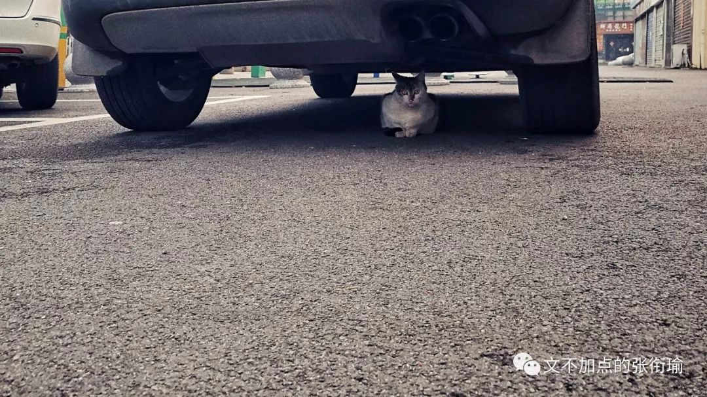
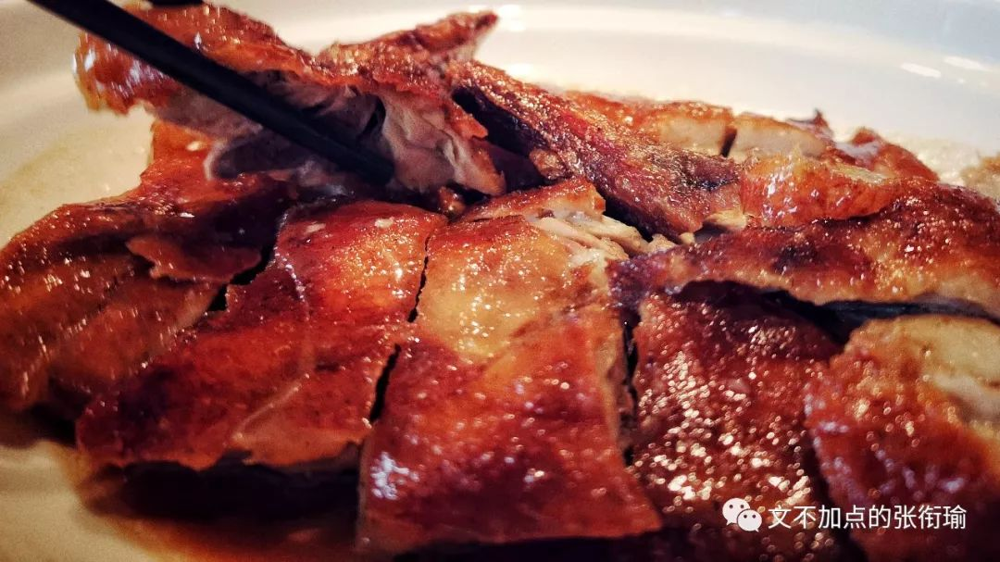
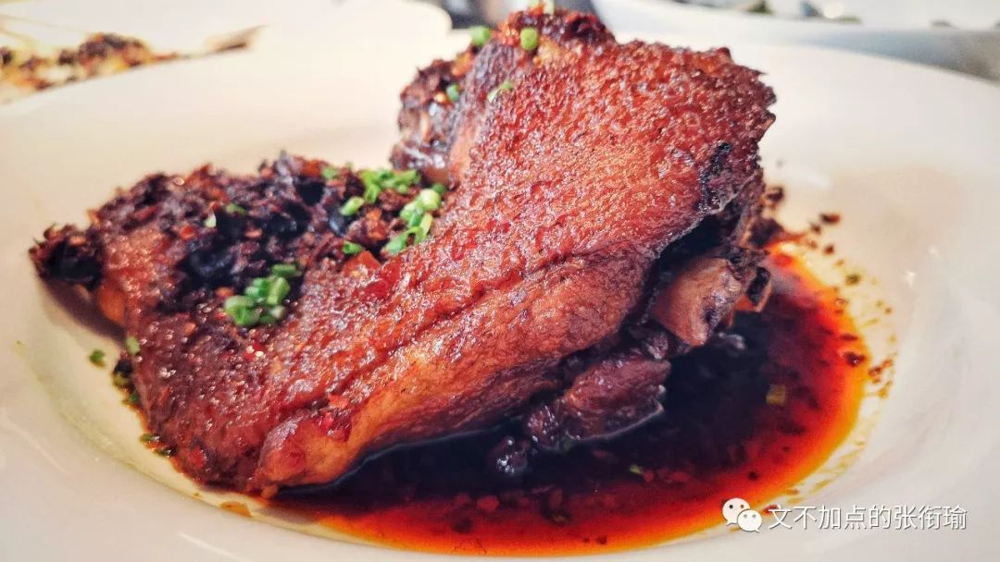
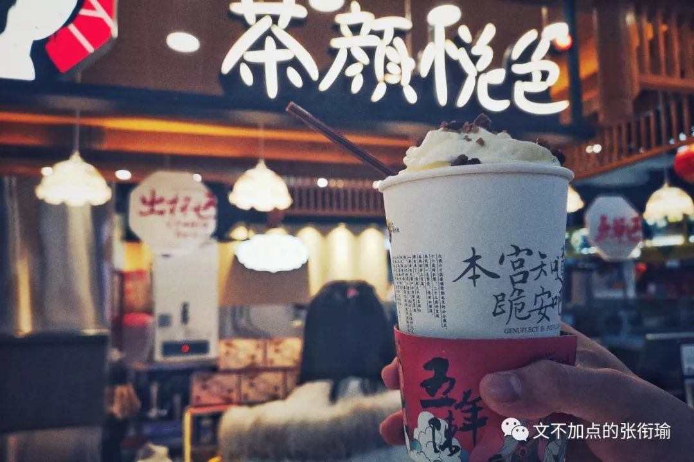

> 本文是第 77 篇推送 共计 2792 个字

本文是第 77 篇推送

共计 2792 个字

题目是 [在合肥交流](http://mp.weixin.qq.com/s?__biz=MzUzNjE3NzA3Mg==&mid=2247484932&idx=1&sn=09110fb7dd381bcd695d65caffa61db2&chksm=fafb76dbcd8cffcdea9d594d4093cb292ad2244c3a0d6a2e64a08a34505881dc261d28b33497&scene=21#wechat_redirect) 的时候读了一本书 《谁动了我的奶酪》 当时想到的 读这本书也没有什么由头 不过是我在见习的时候 电脑上开着程序在一直跑 然后找一点事情来 kill time

每个人都有很多打发无聊的事情可以做
比如拽头发 用橡皮擦反复擦桌子上的同一块地方 剪指甲 刷空间票圈微博 Instagram Tumblr Fb Soda 图虫之类的 当我全部做完这些还有碎片时间剩余出来但又没有带 GRE 词汇书的时候 于是打开了这本书 就是段首提到的这本 《谁动了我的奶酪》 并想到了这个题目

> 为什么还要继续做现在在做的事

为什么还要继续做现在在做的事

我翻了翻日记 因为记得之前也有问过别人这个问题 然后看到了以下的答案

> “因为，我不喜欢太需要和人打交道的工作”

“因为，我不喜欢太需要和人打交道的工作”

我问的这一位 是一位科研执业者 说科研执业可能也还早了一点
毕竟人家也就是博二在读

> “从自己的性格上来说 我就不适合那种需要总是和人打交道的工作 像金融分析 投资理财这种 我想我自己可能很难胜任 搞科学研发就挺好呀 看着数据林林总总 给人很安心的感觉”

“从自己的性格上来说 我就不适合那种需要总是和人打交道的工作 像金融分析 投资理财这种 我想我自己可能很难胜任 搞科学研发就挺好呀 看着数据林林总总 给人很安心的感觉”

所以 这应该是一种兴趣导向对吧 我觉得是挺实在的 在生存压力不是那么大的时候 谁会强迫自己去做和自己性格不相符合的事情呢 我不清楚我问的这位从户口籍贯上而言是不是算作为安徽人或者细化到合肥人 但从这些言语上来看 和我在上一篇中写到和 [合肥](http://mp.weixin.qq.com/s?__biz=MzUzNjE3NzA3Mg==&mid=2247484932&idx=1&sn=09110fb7dd381bcd695d65caffa61db2&chksm=fafb76dbcd8cffcdea9d594d4093cb292ad2244c3a0d6a2e64a08a34505881dc261d28b33497&scene=21#wechat_redirect) 所给到的人文感受是非常契合的

> “哪个来 [北京](http://mp.weixin.qq.com/s?__biz=MzUzNjE3NzA3Mg==&mid=2247484463&idx=1&sn=26f02e578de44fd5803481060792fb22&chksm=fafb74f0cd8cfde6d340e13e53082d0877decd84d2213d2a6e5cd4b2b9394788a91d3fb70106&scene=21#wechat_redirect) 的人心里还不是装着个梦呢”

“哪个来 [北京](http://mp.weixin.qq.com/s?__biz=MzUzNjE3NzA3Mg==&mid=2247484463&idx=1&sn=26f02e578de44fd5803481060792fb22&chksm=fafb74f0cd8cfde6d340e13e53082d0877decd84d2213d2a6e5cd4b2b9394788a91d3fb70106&scene=21#wechat_redirect) 的人心里还不是装着个梦呢”

我问的这一位 同样是一位科研执业者 想来想 ta 现在应该已经快要博士毕业了

> “你想 在北京这个城市里压着这么多人 就像你现在一样
住着比在自己家或者读书的城市差了那么多的房子 吃着比其他地方贵而又不好吃的东西 之所以能留的下来
又不回去 不仅仅是没混好不想回去 或者觉得和以前的圈子越来越远了 最重要的是 谁还不是心里装着个梦呢”

“你想 在北京这个城市里压着这么多人 就像你现在一样
住着比在自己家或者读书的城市差了那么多的房子 吃着比其他地方贵而又不好吃的东西 之所以能留的下来
又不回去 不仅仅是没混好不想回去 或者觉得和以前的圈子越来越远了 最重要的是 谁还不是心里装着个梦呢”

我最终也没有知道 什么梦在师兄的心里才算个梦 也许这个梦是很现实的可以用物质资产来衡算的 也许 这个梦是一种心理感受比如在某种程度上和一些人拉开差距
然后靠拢进入了另一部分人的圈子里

不过如果是梦的话 人家没有说出来 我也就没有再问下去 民俗当中有一种说法是 梦的话 讲出来就是讲破了
而讲破了的梦 往往就不灵了 追着光梦游 应该也是挺不错的选择了

> “除了读书，我还可以做什么呢”

“除了读书，我还可以做什么呢”

这位朋友倒是反向地给了我一个答案 从很早以前开始地发现自己
可以通过读书念书考高分拿学历来证明自己 那就一直在这个道路上走得越来越远

> “从小学开始 我就是同学眼中的学霸 如果只在学习
学各种科目然后通过考试 那我能拿到的成绩绝对可以很轻松地吊打绝大部分人 但是除了读书
我好像别的也不会什么 于是我就一直读书 一直读下去 做我最擅长的考高分拿学历拿奖学金”

“从小学开始 我就是同学眼中的学霸 如果只在学习
学各种科目然后通过考试 那我能拿到的成绩绝对可以很轻松地吊打绝大部分人 但是除了读书
我好像别的也不会什么 于是我就一直读书 一直读下去 做我最擅长的考高分拿学历拿奖学金”

不谙世事的人 也许会对这一段文字给出 “高分低能” 的评价 但准确地来说 所谓的智商只是在一个方面体现得淋漓尽致 而在另一些所谓的社会主流认证上尚未被得到有效的实践和论证 浅显地说 这只是一部分人在知道了某一个结论之后 就拿着这个结论到处去套 诶你也是这样的 噢他也是这样的

想起有医学生朋友修诊断学的时候和我说 老师上诊断学的时候有告诉大家 下面讲的这些病症不要自我代入 而我那位朋友不信邪 发现自我诊断之后罹患多种病症怕是要医好久才回得来

> “我如果不继续做下去的话， 老师又要把这身本事重新教给一个人”

“我如果不继续做下去的话，

老师又要把这身本事重新教给一个人”

朋友的导师刚刚回国不久 ta 算是这位导师真正意义上从研究生开始带起的 第一个弟子 ta 现在是已经知道了在这个方向上要继续走下去的话需要一些什么条件
前面有哪些人在前沿的路上开拓着往前走 这些 ta 都知道

> “但我现在就是一个全栈 这个方向上只有我一个人 我知道要做这个实验所要用到的全部实验仪器和操作规范 包括如何预约和使用公共研究平台在内我全部都很清楚 如果我不转博的话 我不继续做下去的话 老师又要把现在已经交给我的了这身本事重新教给另一个人好让 ta 接着往下做下去 这样的话 这个方向我一走就又增加了老师一倍的工作量 同时从培养一个人到用起来又要停滞好久”

“但我现在就是一个全栈 这个方向上只有我一个人

我知道要做这个实验所要用到的全部实验仪器和操作规范 包括如何预约和使用公共研究平台在内我全部都很清楚 如果我不转博的话 我不继续做下去的话 老师又要把现在已经交给我的了这身本事重新教给另一个人好让 ta 接着往下做下去 这样的话 这个方向我一走就又增加了老师一倍的工作量 同时从培养一个人到用起来又要停滞好久”

一般来说 当学到越来越多的时候 进行的方向只可能越来越小 越来越精尖 科研本也是在一定的小圈子里越走越窄 越走越没有人知道 能听懂话的同行 也只有那么多 当然朋友最后的补充 想一想也是很普遍的做 [科研](http://mp.weixin.qq.com/s?__biz=MzUzNjE3NzA3Mg==&mid=2247484290&idx=1&sn=198347db11a3a0879553b589d69c0e6e&chksm=fafb735dcd8cfa4bd55ef8feefa4bc7bd68e615db3f97c5dddcc545ffa9319e0baf0247436d9&scene=21#wechat_redirect) 人的一点苦涩

> “还有一个原因是 也不知道出去之后 可以做什么”

“还有一个原因是 也不知道出去之后 可以做什么”

> “虽然每天说着很累很累 但实际上觉得还不够 还想再累一点”

“虽然每天说着很累很累

但实际上觉得还不够 还想再累一点”

做着现在正在做的事 做到有一点点接近强迫和疯魔的时候就会变成这个样子 就像街边送外卖的小哥 当然也是在滴自己的汗 吃自己的饭 但其实本来少接几单也 OK 可不管车的电够不够
自己也还是想能不能继续 继续接几单再送一会儿 跑完这几单
再继续休息

> “每天泡在网吧里的人是这个样子 这一把不管是吃到了鸡还是成了个盒 下一把都还是要继续 只不过吃到了鸡是说自己手气好应该乘胜追击 成盒的话就翻一把 讲道理 一直待在麻将桌上下不来的人 像我这样一直待在实验室里的人 或者奋战在手术台一线的人 我不敢说有多大比例的人是这样子的 承认与否 都是说着自己很累很累了 但实际上觉得还不够累 还想再累一点”

“每天泡在网吧里的人是这个样子 这一把不管是吃到了鸡还是成了个盒 下一把都还是要继续 只不过吃到了鸡是说自己手气好应该乘胜追击 成盒的话就翻一把 讲道理 一直待在麻将桌上下不来的人 像我这样一直待在实验室里的人 或者奋战在手术台一线的人 我不敢说有多大比例的人是这样子的 承认与否 都是说着自己很累很累了 但实际上觉得还不够累 还想再累一点”

不知道到底会是一种什么样的心理作祟 很迷幻 也不是很强烈 谁知道呢

我但凡到了春天或者秋天 没有需要开空调的晚上 特定的时候都会出现一次心跳漏了一拍的样子 我也不大好解释是为什么 可以有风 但风是从窗棂旁边偷偷摸摸晃荡进来的 也不一定要来找我

总会有一个感觉来自很久远以前的画面 长条形白色瓷砖贴在墙面上 冷光灯的灯罩搭载着胡乱牵拉的电线 画面可以是略有些喧闹嘈杂的 也可以是安静平和的 这并不是重点 我也不知道重点是什么但并不是白色长条瓷砖
也不是冷光灯和灯罩 也不是错乱的电线 更不是可有可无的声音或者知了

只是在某个时候会悄然出现这样的画面 却也并不会吓到人 只会觉得心脏好像有点点轻微的讶异 错愕 然后“咦”地一声 之后 突然就平白无故地漏了一拍 也没有多的 就很轻很轻地来了 又很轻很轻地走了 像是斑鸠鹧鸪小雀之类从窗外飞到桌子上来又扑腾了去 吉光片羽 却是什么也没见得留下来（摊手

为什么还要继续做现在在做的事情呢 大概答案也不会有什么相同的 subconscious 部分 如果可以变成 conscious 的话那也就不要再在前面加一个 sub- 了

考试周的时候 浏览各位朋友的狗德行 也是总能听到一些思维错乱了之后说出来的话 最近好像这样话又出现了 比如

> 同时 多谈几个对象 有什么了不起 我又不是 打字不快 聊不过来 肝 ta 一个通宵又怎么样 人生本就是一碗有去无回的 凉皮 一个人是对 婚姻制度 有多大的仇恨 才每天跑到别人家催婚 干嘛花哪个买皮带的冤枉钱 现在谁不是用 肚皮勒紧裤子 呢 臭豆腐一定很 讨厌那个叫大香肠 的 既没有文化典故也没有卖相特色 毕竟我在吃葡萄的时候 也觉得里面的籽很吵 挤了 洗衣液 去刷碗这种事 我已经做了不止一次两次 我看上的相机唯一的缺点就是贵 不过这也不是 ta 的缺点 贫穷才是我的缺点 woc 我的程序刚刚崩了 ——它在给你说 新年快乐 呢 你怎么还没结婚呢？ ——因为我对象还没离婚呀 √

同时 多谈几个对象 有什么了不起

我又不是 打字不快 聊不过来

肝 ta 一个通宵又怎么样

人生本就是一碗有去无回的 凉皮

一个人是对 婚姻制度 有多大的仇恨

才每天跑到别人家催婚

干嘛花哪个买皮带的冤枉钱

现在谁不是用 肚皮勒紧裤子 呢

臭豆腐一定很 讨厌那个叫大香肠 的

既没有文化典故也没有卖相特色

毕竟我在吃葡萄的时候

也觉得里面的籽很吵

挤了 洗衣液 去刷碗这种事

我已经做了不止一次两次

我看上的相机唯一的缺点就是贵

不过这也不是 ta 的缺点

贫穷才是我的缺点

woc 我的程序刚刚崩了

——它在给你说 新年快乐 呢

你怎么还没结婚呢？

——因为我对象还没离婚呀 √

熬夜和暴饮暴食 就像老烟民手里夹着的烟 不管手指放到水里是不是能泛出黄黄的烟丝
牙龈上有没有沉积污垢 肺里边的焦油有没有代谢干净 总之不管有多少人劝 老烟民还是那个样子
并且日常有着 戒断反应 熬夜和暴饮暴食也是这个样子

正月里的水仙总有一天要开花

如果不开 也没有什么关系

不开就不开

也不会去逼你

毕竟我这么懒

一想到我还要和每件事情都和解

就累
