> 本文共计 3934 个字 这篇的笔力稍微集中一点 起因是今天被问 怎么做到报题那么多的？

本文共计 3934 个字

这篇的笔力稍微集中一点

起因是今天被问

怎么做到报题那么多的？

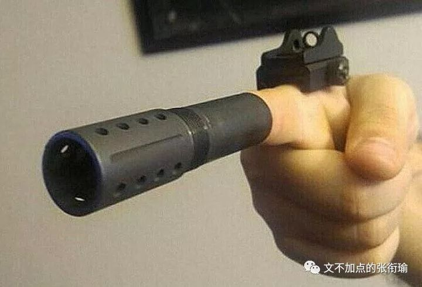

当时被问到这个问题的时候 其实我在神游（捂脸

我在想超长自拍杆的事 如果能有一个 1.7m 长或者 3m 长的自拍杆 那就可以 不像无人机那样 无法在我这样的森林大学里面用
而且 在楼顶 的时候可以不用接触危险边缘 直接把自拍杆伸出去然后开后置摄像头就好了

所以在姬哲湍开会被问到这个问题的时候 其实我正在想别的事情 于是正常地回答了一下 噢那就脑洞很大呀 去到哪看到了什么就是什么喏 ~ 所以其实还是脑洞很大 这本来没有什么问题
也是被问到一个问题的时候不假掩饰的正常回答

可回头想一想 这样子的回答其实对听者是不友好的
脑洞大是一个很宽泛的概念 就像人工智能底下神经网络也算 计算机视觉甚至无人驾驶也可以挂钩进来 如果只了解神经网络的话 对全貌的理解应该是有偏差的 这样一来 脑洞大还是不能好好描述这个事情 也就有了这一篇文

> 啊我刚刚被问到的时候没有想起来，稍微理了一下我报题时候的内心活动吧 : 首先， 我是一个内心戏很多的人 。多到自己坐在地铁上的时候，会尝试观察路人，然后想想怎么描写他们，推测他们的身份并脑内一个剧场。比如谁和谁会相遇，他们背后的生活可不可能交织。 所以这个特质就表现在我喜欢写东西而且经常碎碎念，为了不太打扰别人我就自己有一本日记本没事写一写，然后也有一个公众号你也关注了。学化学的时候也是，自然科学尤其是理学 ( 区别于工科 ) ，也是可以放飞想象的。 也就因为这样，我会经常 diss 生活中形形色色的事，说一些奇奇怪怪的话。转译成新闻语言，就成了报题。 不过有时候我也科研缠身或者太懒了就不出门，这时候就上 tumblr 之类的地方看沙雕图 ( 英文 tag memes) ，看看别人怎么在日常生活中搞出很多怪诞而清奇的事情的。 看起来可能是报题很多，或者沙雕图很多，或者热爱生活，本质还是戏很多内心戏很足吧。

啊我刚刚被问到的时候没有想起来，稍微理了一下我报题时候的内心活动吧 :

首先， 我是一个内心戏很多的人 。多到自己坐在地铁上的时候，会尝试观察路人，然后想想怎么描写他们，推测他们的身份并脑内一个剧场。比如谁和谁会相遇，他们背后的生活可不可能交织。

所以这个特质就表现在我喜欢写东西而且经常碎碎念，为了不太打扰别人我就自己有一本日记本没事写一写，然后也有一个公众号你也关注了。学化学的时候也是，自然科学尤其是理学 ( 区别于工科 ) ，也是可以放飞想象的。

也就因为这样，我会经常 diss 生活中形形色色的事，说一些奇奇怪怪的话。转译成新闻语言，就成了报题。

不过有时候我也科研缠身或者太懒了就不出门，这时候就上 tumblr 之类的地方看沙雕图 ( 英文 tag memes) ，看看别人怎么在日常生活中搞出很多怪诞而清奇的事情的。

看起来可能是报题很多，或者沙雕图很多，或者热爱生活，本质还是戏很多内心戏很足吧。

这是当时我回提问我的学妹消息时候 发的一段话 觉得应该是讲得很明确的了  就像这块烤羊排 上来是看到的对听者不友好的一大块烤羊排  但老板给了我一把刀来解构ta 于是变得很友好 很carnivorous很开心

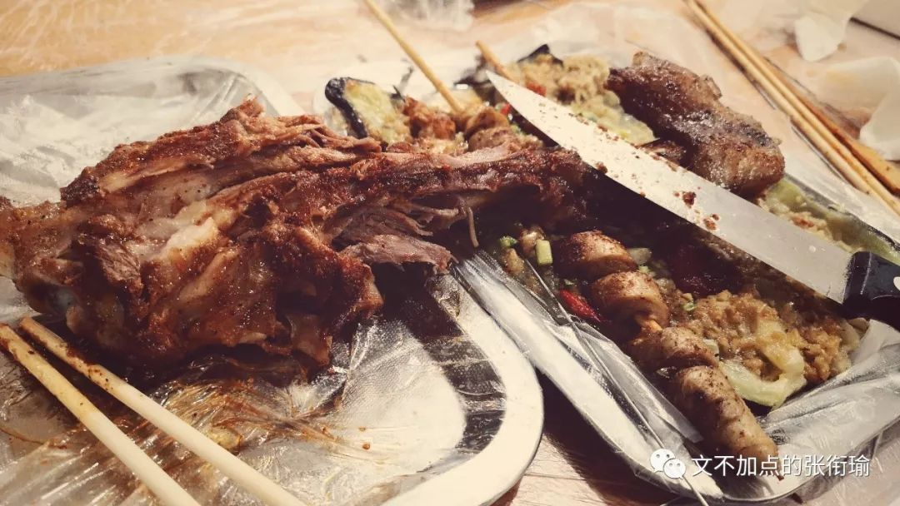

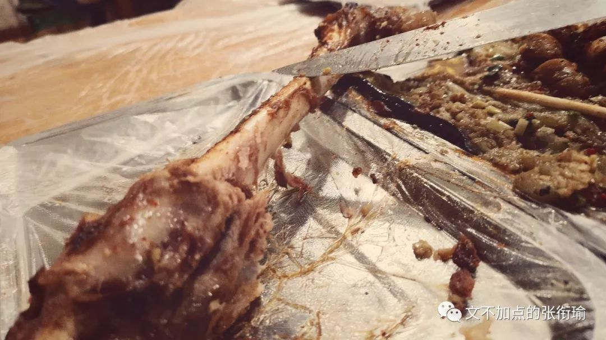

以前和家里人做过一件事情 就是在出去浪的时候 在街上随机选取一个或者几个人 有时候是在吃饭时候旁边桌上的 有时候是在公园散步前面离自己十几个身位以外的路人 我们会 尝试去分析这个人是做什么工作的 有怎么样的生活习惯 如果是坐同一桌的人 他们之间的关系是怎么样的 是近亲聚餐 还是萍水相逢 如果是前者那么有没有摩擦不合 如果是后者能不能擦出火花

那之后 如果我在地铁上没有带 GRE 或者必须要给哪个朋友回消息的话 我会假装玩手机然后观察路人 之前写的一篇 [看完话剧回来憋着叫喊](http://mp.weixin.qq.com/s?__biz=MzUzNjE3NzA3Mg==&mid=2247484243&idx=1&sn=e5262d8bf6c3b014bd66d79e1b4b4230&chksm=fafb738ccd8cfa9aa26e3fbd0ff8bc24febd5aeefc8eacdcaa3a5b6ac7aa38b53505486f8578&scene=21#wechat_redirect) 就有很多我吼了在里面我说我其实认识这个人也认识那个人
虽然不知道名字但是他们有什么习惯是什么样的生活方式我能推断出个七七八八并且判断一下是不是性格不合 这是我内心戏多时候最直接的表现

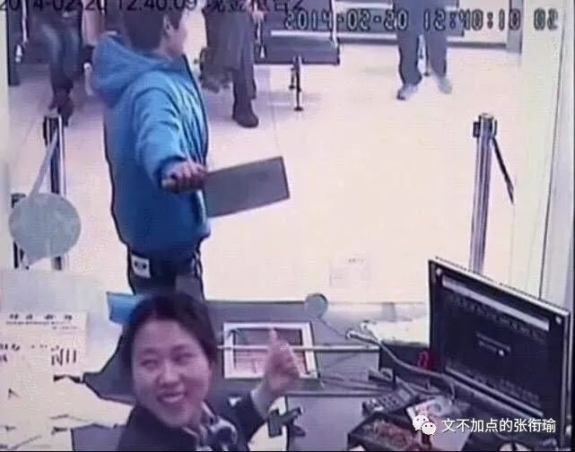

挂到外面来 我在不同的学科 不管是最早的 物理热学 还是后来做 中文训诂 还是之后做 新闻采写 耐水粘结剂 膜材料 化学信息学
人工智能 风管摄影 量子计算化学 自动化控制 所有的这些都不过是放飞了自己想象力时候
转译到了一个特定的语言体系当中 然后表达出来了一个看似在对应领域内比较有意思的事情

说真的我在哪一个领域里面有特别独到的见解 也许有 但是我自己并不在意也不知道 我只是内心戏多的时候到了这个地方 也许哪天会郑重其事地和别人说啊我在这个方向里哪些哪些是我原创性的工作然后有怎样的重要性
实际上我觉得一直盯着肥宅快乐水的泡泡一个一个往上冒都比这个有意思

之前很欣赏 legal high 里面古美门的骂人方式 于是后来我惊叹光谷施工队想象力的时候
我的想象力也被激发了 就也是这么说下去的

> 我想买张机票 送光谷广场施工的人 看看去乌干达的森林里 和大猩猩玩相扑 被大耳光子抽两下 能不能让这些人 脑子清醒点 设计光谷广场工程的人 应该拿着个金属低音原号 在雷雨天去楼顶吹曲子 看一看被雷劈一劈 能不能让脑袋稍微清醒一点

我想买张机票

送光谷广场施工的人

看看去乌干达的森林里

和大猩猩玩相扑

被大耳光子抽两下

能不能让这些人

脑子清醒点

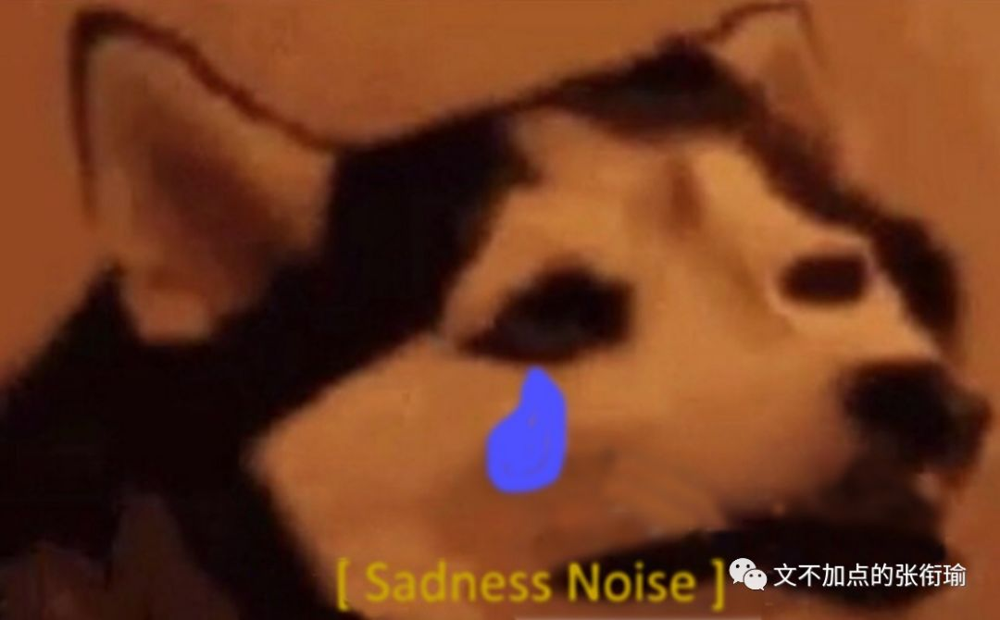

设计光谷广场工程的人

应该拿着个金属低音原号

在雷雨天去楼顶吹曲子

看一看被雷劈一劈

能不能让脑袋稍微清醒一点

其实想一想噢 如果 时光穿梭了去汉口的火车站 然后贴在蒸汽机车的出气口 让列车长把汽笛拉到最大 或许也可以达到相同的效果 不过我还没有真正遇到下一个要用到这个语境的人或者事 等到有需要的时候 我会表态的（滑稽

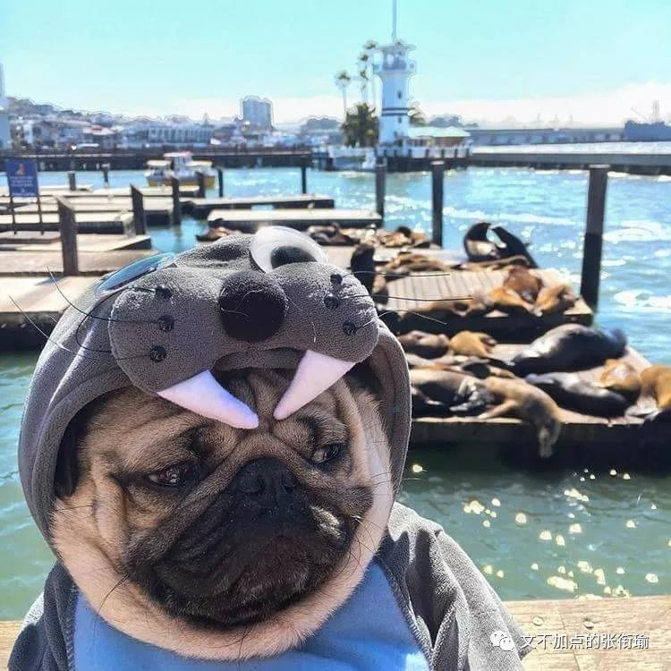

这些本质上而言 都是自己内心戏多 或者想象力惊人丰富的一个表现 沙雕图给人带来最大的快乐就是 明明只是一些生活中随处可见的东西 就是能够利用这些达到极其夸张怪诞令人摸不着头脑但又很诙谐搞笑的效果

当一个人掌握了在某一个学科方向上的具体圈内语言的时候 那这个圈子不管是学术圈 不管在哪一个院系
只要还保证有内心的戏份 看起来似乎是毫不相干的话题 其实是同一个内心的不同体现

只不过是理科思维的话 会用理科的对比试验与控制变量的方法来证明自己的效果 唯物主义历史会绕到这一块的经济基础是什么样子的
而新闻的方式则在白描之处体现自己的笔力功力 仅仅只是手法的区别 但无关乎与手的高低

当我写到这里的时候 回头就想起一些被我日常 diss 然后写在日记本上面的一些事情 在我对一件事情的本质有了知悉之后 形式主义的东西也就变得极其令人反感 像是看到了鲁磨路臭水沟翻出来的水 溅到了自己白白嫩嫩的椰树牌椰汁中一样

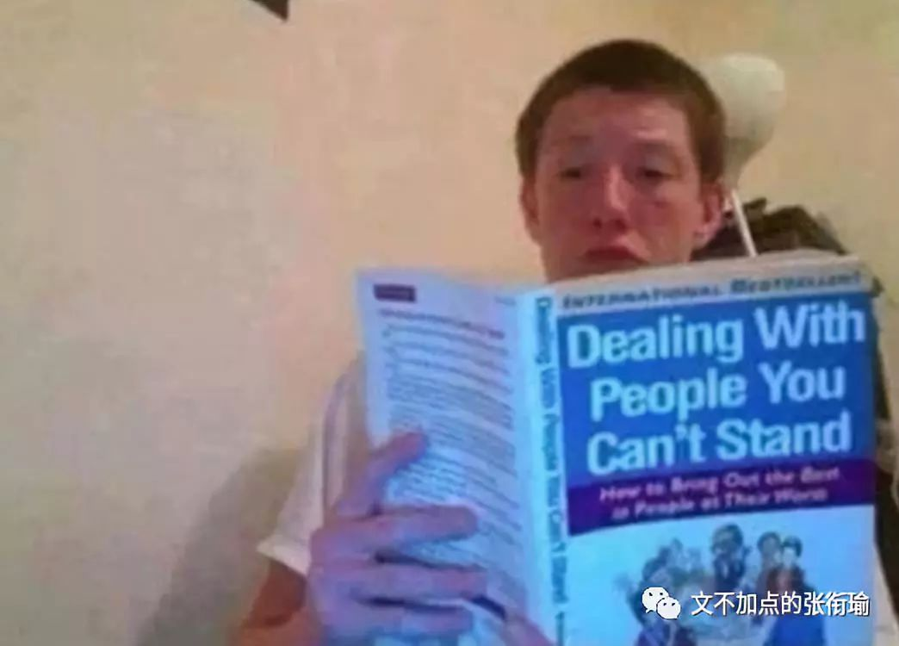

去年年末在武汉南边一个学校里参加一次实验竞赛 就是耽误了我在下雪的两天出去拍图 又被 [100 图年终总结](http://mp.weixin.qq.com/s?__biz=MzUzNjE3NzA3Mg==&mid=2247484796&idx=1&sn=b4968ff62baabb5e9368642b0f14d421&chksm=fafb75a3cd8cfcb5d52fcc342aba6f347e5741e7b72cef234ec910f05d42200d873bf36248cd&scene=21#wechat_redirect) 耽误了 diss 的那一次 在那一次的实验竞赛中 我依旧记得化学实验操作之一是 分液漏斗的 检漏 就是看这个瓶子会不会漏 当时就笑到我了

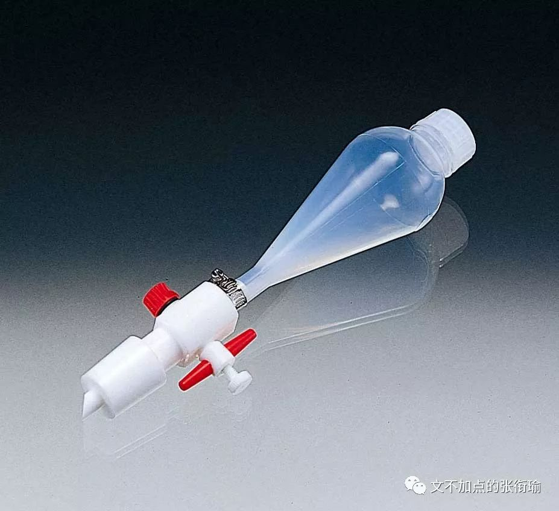

标准的流程是首先用 水 检漏一次 然后再用 有机溶剂 检漏一次 如果和之后反应的溶剂不一样则应洗净 检漏完毕 具体怎么转分液漏斗我就不说了 重点在有机溶剂检漏 我们当时想用的检漏试剂是乙醇 之后要做的反应体系溶剂也是乙醇 为过量 乙醇水溶液又称酒精 之所以要这么做是因为化学玻璃仪器的化学本质多为一些硅酸盐混合物 主成分为硅酸钠 硅酸盐 表面与水的相互作用其实是挺大的（虽然还是可以流动 但如果用有机溶剂比如乙醇 DMF DMSO 之类的
就会发现也许用水检漏的时候感觉明明不漏 可同样无色透明的有机溶剂一上去因为表面不亲和于是哗啦啦地流

可是有人不懂这些

当这些人是裁判的时候 事情就变得有些微妙了起来

同学听到的最神奇的一句话是 你为什么要用乙醇检漏 你这样是浪费实验试剂 你不要把在你们学校学过的一些错误操作带到这里来 我想 对于这样的人 我能站在那里把实验做完 只是出于我对于自己 major 的基本尊重 即完成一项实验 这也是对我参赛的基本尊重 但 我懂礼节 和我是否憎恶这样的人 并不矛盾 我只是觉得 我是明确而确信的知道这之中的化学本质 也对自己的学校自己的学院有着源自于知识传授和创造的自豪和信任
所以我对此可以毫不犹豫地嗤之以鼻 并且当做笑话讲给别人听 但是如果不是我 而是别人
那会怎么样

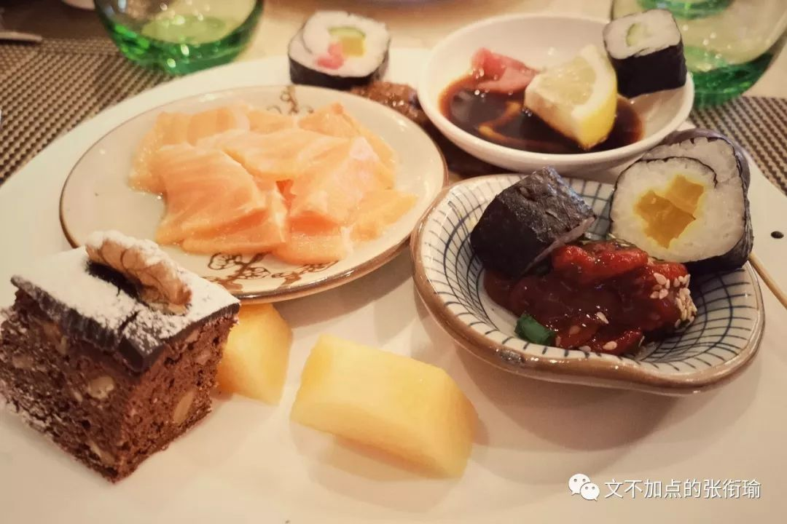

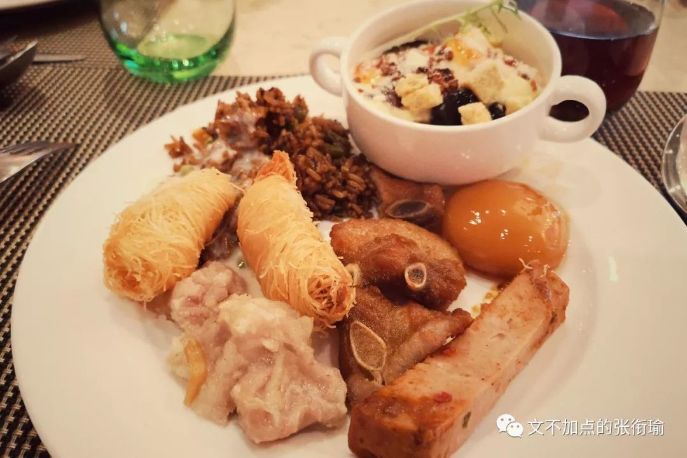

内心戏在我所发展出的一个另一个表现 是 共情与换位 并不会泛滥 但是却很有助于条析面对这些事情的思路 那么是处在什么样的生活环境里 面对怎样的学生 有怎样的师生关系 有怎么样的学术氛围 然后基于怎样的童年与受教育经历
让一个人能说出这样的话呢 又会在日常生活中和怎样的人成为朋友 这些人形成的圈子会形成怎样的言语力量
诸如此类的

在我听到有些学校甚至再大学还强制学生参加早晚自习 或者一些学院还往家里寄送成绩单以为自己是法院要寄送传票担当着无上的社会责任 要区别的是正常的内心戏与畸形的被害妄想和自我崇高刻奇 形式主义往往是在畸形的条件下产生的 而正常的内心戏不是

刻奇 kistch

出自米兰昆德拉《生命中不能承受之轻》

> 当看见草坪上奔跑的孩子，由 Kitsch 引起了两行 “ 前后紧密相连 ” 的热泪：第一行是说：看见了孩子在草地上奔跑，多好啊；第二行是说，和所有的人类在一起，被草地上奔跑的孩子们所感动，多好啊。 一、自我感动及感伤。 二、难以拒绝的自我感动和感伤。 三、与别人一道分享的自我感动与感伤。 四、因为意识到与别人一道，感伤变得越发加倍。 五、滔滔不绝的汹涌感伤最终上升到了崇高的地步，体验感伤也就是体验崇高。 六、这种崇高是虚假的，附加含义大过实际含义。 七、当赋予感伤崇高的意义之后，容不得别人不被感动与感伤。谁要是不加入这个感伤的洪流，就是居心叵测。 八、这是最主要的，刻奇是一种自我愚弄。

当看见草坪上奔跑的孩子，由 Kitsch 引起了两行 “ 前后紧密相连 ” 的热泪：第一行是说：看见了孩子在草地上奔跑，多好啊；第二行是说，和所有的人类在一起，被草地上奔跑的孩子们所感动，多好啊。

一、自我感动及感伤。

二、难以拒绝的自我感动和感伤。

三、与别人一道分享的自我感动与感伤。

四、因为意识到与别人一道，感伤变得越发加倍。

五、滔滔不绝的汹涌感伤最终上升到了崇高的地步，体验感伤也就是体验崇高。

六、这种崇高是虚假的，附加含义大过实际含义。

七、当赋予感伤崇高的意义之后，容不得别人不被感动与感伤。谁要是不加入这个感伤的洪流，就是居心叵测。

八、这是最主要的，刻奇是一种自我愚弄。

我之前曾经在日记本里写

> 悲伤的来源有很多种 人们的各种悲伤不相通但是可以正确对待 可 快乐是不可以掺假的 真正的开怀大笑和病态的快乐之间 在敏感的人看来有着太过于明显的差异 快乐只要往里面掺杂了一点点假 那都很容易被分辨开来

悲伤的来源有很多种 人们的各种悲伤不相通但是可以正确对待 可 快乐是不可以掺假的 真正的开怀大笑和病态的快乐之间 在敏感的人看来有着太过于明显的差异 快乐只要往里面掺杂了一点点假 那都很容易被分辨开来

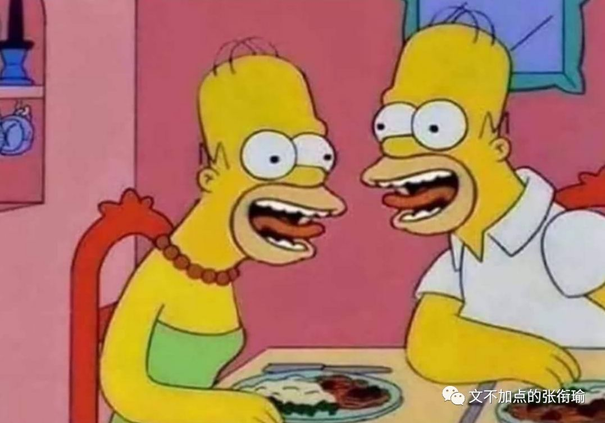

佯装抑郁也是一样 如果一个人真的是到了 在该吃饭的时候 开始想自己还要到食堂去排着拥挤的队伍 装模作样地拿着盘子然后和打饭的师傅说自己要点什么菜
然后拿着筷子放到碗里 再在诺大的食堂里选择一个要去的位置甚至站在别人的身边等位子空出来 再和其他的一个人型生物共桌 做着夹取食物然后重复拒绝下咽的过程 就感觉像是耶稣受难一样 这样的抑郁和还可以在空间发一些丧图尬嗨是不一样的 我的朋友知道我压力大 也都是凭我还在发沙雕图而确认我还处在存活和正常的状态 qwq

内心戏确实可以给自己带来很多的想象力雄奇开心的去处 但同样的 --就像我可以说出一口流利正宗的教学长沙话和塑料普通话 可但凡听到有不是湘方言区域的同学在学着我的样子然后诘屈聱牙地尝试发出长沙话字典里或者湖南卫视这种塑料普通话传播地带来的类似音调
也是真的尬得人浑身发毛-- 所以在面对不是真正内心戏不是真正沙雕但又在模拟沙雕的时候
就只好勉为其难地笑一笑 特别过分地就像上面说 kitsch 那样点出来 如此而已

T or F 都是没有关系的

难和怕 在 semi-

所以我对很多事情也不在意 知是知道 但是也就 let it be 一般也就 burlesque 这样子过去了每一个时候
然后自己和自己的内心戏在一旁哈哈大笑 碰到了在特定方面专业的小圈子里需要这些特质发挥作用
或者内心戏兴起的时候正好调频到了这个专业领域的话 那么就自然而然地成了在这个方向里的某些成果

总而言之就是永远的内心戏加一些小的专业素养

初中最后还能记得老师说的一些话

有一句叫 灵感是对于辛勤苦学者的最高奖赏

现在想来 某一个领域的特定语言体系或者思维习惯就应该像是这一支手杖 握着的 是内心戏的手 手拿着手杖才好走路 手可以换不同的手杖 用得多的自然也就越来越契合 不同的手杖加在一起当然走得更稳 把手杖磨得好好的圆实了也可以走得很稳 这应该就是如果只从单方面来看待张衔瑜
所不能得到的全部貌相

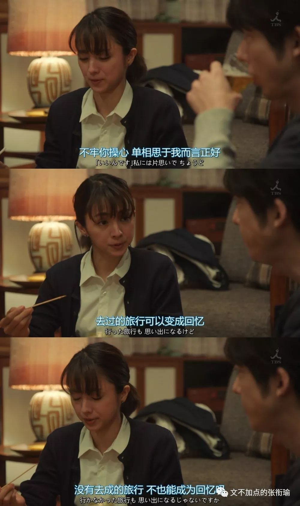
