> 本文共计 1721 字 29 图出没 是张衔瑜的第 80 篇

本文共计 1721 字

29 图出没

是张衔瑜的第 80 篇

一个人出门的时候 没戴耳机 就像没穿衣服一样

年轻人不听音乐 脑子是要坏掉的

> 如果说 你是海上的烟火 我是浪花的泡沫 某一刻 你的光照亮了我

如果说

你是海上的烟火

我是浪花的泡沫

某一刻

你的光照亮了我

想改变自己作息 追着光出门 到处走 从这里走到那里
和小伙伴说说最近发生的事情 将要发生的事情 很远很远以后不知道会不会发生的事情

今天做图集出来 cuz 有很多想说的已经写在日记本上了 再手打一遍到电脑上
我等于把我自己熬出的鸡汤再喂给自己喝一遍

厨师吃不多并不是因为在做饭的时候偷吃了 （其实是的） 而是因为在烹饪的时候已经闻够了油烟 这道菜的每一个风味都已经在脑海中有过了定量 feign full

我自己出门了 在一个非正常的机位拍光谷教堂

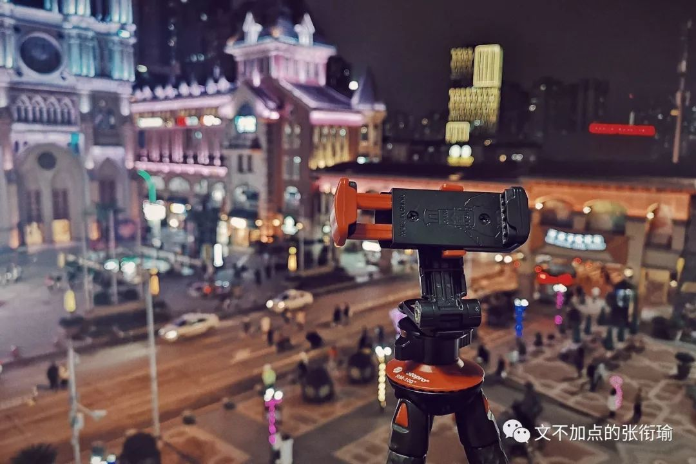

当然也在怂恿身边玩摄影的朋友们出门 作息不规律的时候 没有电又不能背单词不能编程还不和人聊天的话 就开始合计着武汉到底该去哪里拍城市风光

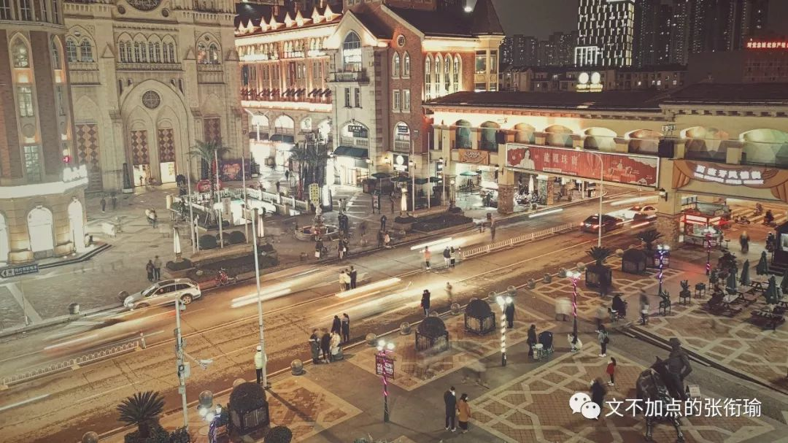

不在武汉的朋友问我是再哪里拍的这些照片 我直接定位了微信地址过去 朋友问我怎么光谷风情街的地名这么可爱 又是 多莫大教堂 又是 弗拉门戈广场 的 我当然可以猜得到对面的语气 就像 堺雅人在说南蒙布朗和绢美村 一样

to be frank 这座城市很多时候都在自己把自己一手辛辛苦苦打造起来的文创和沉淀给击碎
并且 觉得这仿佛是一种习以为常的特质 就像渣男或者渣女不能好好谈恋爱一样 老咕咕会身不由己地想鸽掉自己要去参加的每一个聚会 我来了 我在路上了 马上到 不堵车 我已经进电梯了

在江汉关拉出的车轨 我想直接保进 2019 年的年末图集里边 ohh 变成酸柠檬的时候 是看站在街边依偎着不动的情侣
和流光出的车轨合辑在同一张图里边

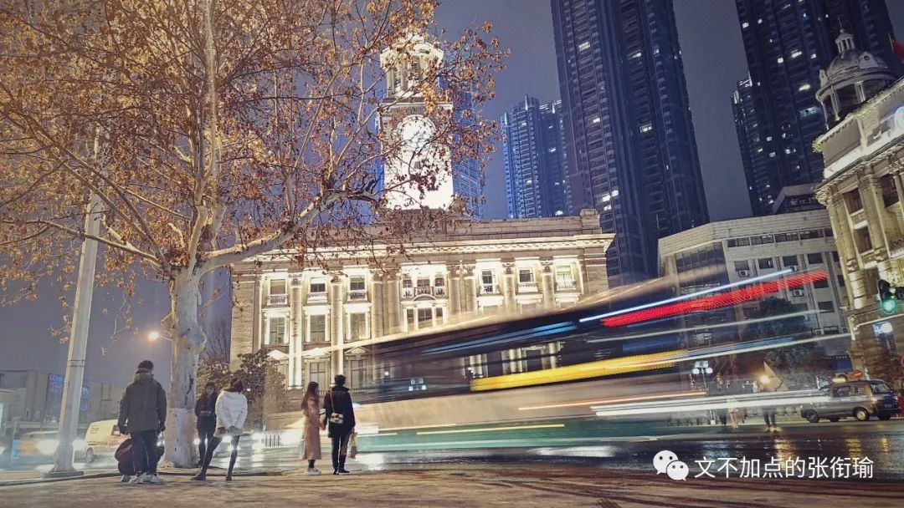

不过可以自我安慰的是 他们也只在我的图里才会好看 毕竟正常人的眼睛在路边看车过去 是不会出现这么长的残影的吧 时光列车或者幽灵列车也许可以 可我到底是在做一点纪实 而不是在汉口写悬疑推理小说

回了武昌 在武昌站外往里看 令人回想到去年暑假在荷花园拍长沙火车站和城际铁路站
只不过是日并非 blue hour 绿皮火车摇晃进出
同学说武汉铁路局的报站声音没有郑州铁路局的好听 这在我们站的地方是那样的清晰可闻

> “开往岳阳长沙衡阳深圳方向的列车”

“开往岳阳长沙衡阳深圳方向的列车”

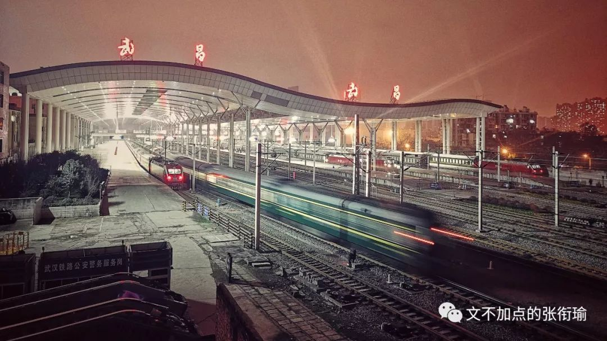

真是令人想逃学呀

就算是开车开长途 也是很好的 因为夜晚开车是最宜思考的时候 Douglas Stamper 每次都会开着《双城记》的朗诵稿和自己一起

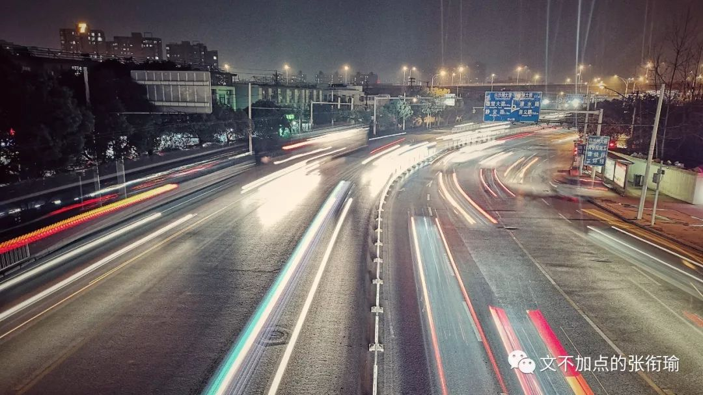

我曾经想找一些 podcast 在走路的时候听一听 但是 晴天的周末在去学校补课的路上遇见了喜欢的人晴天的周末在去补课 这样的歌更适合漫无目的 wondering 因为我的同学们和我都还只有 12 岁

判定图我有没有修过 在没有任何摄影和修图功底的情况下 可以单凭相片我有没有裁剪过来看 比如这种 4:3 的构图一看就是 raw material

当然我也没有打算来修 习惯上在同一个角度同一个色光下的时候 修其中的一张图 这样就可以用这一套流程 last edited 适配所有同时期的照片

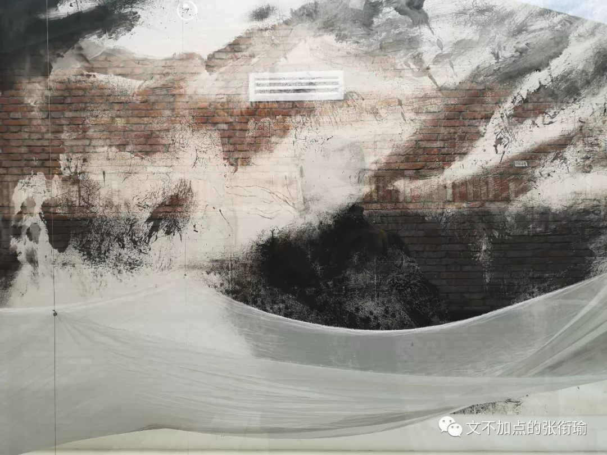

所以在 东湖杉美术馆 不一样的这几张
就只是这几张 我才不会说有我自己的剪影照出没呢

可能我在很久以后 看自己的这些照片 就会像我现在看别人 拍照凸造型的时候用手托着花 或者兰花指拈着花枝闭眼轻嗅一样 化学生的标准姿势应当是用扇闻法

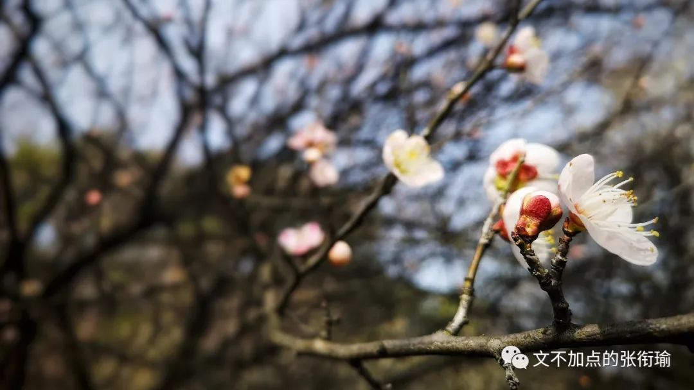

Blue sky 滤镜呼出了之后 希望有制作花鼓戏京剧之类的戏曲迷公司来找一下我
然后配上几列娟秀的毛笔字 用最正的圆形框一下这张图 便是人间好时节

谁还没有一双穿得稀烂 走小路走得一脚泥 然后还不怎么舍得扔 觉得差不多已经合脚的沙雕匡威经典款帆布鞋呢 帆布是真的从水手下海的船帆上撕下来包成的吗 想不到这还是来自大海的礼物呢

我 徒在票圈质疑我发的这张图是不是网图 btw 我的配字是 好想被挂在快艇后面飞上天啊 为了自证清白 我把修之前的原图和当时快艇过来一路上的几张照片都挂一下 这样总算是自己照的然后选的才可以吧

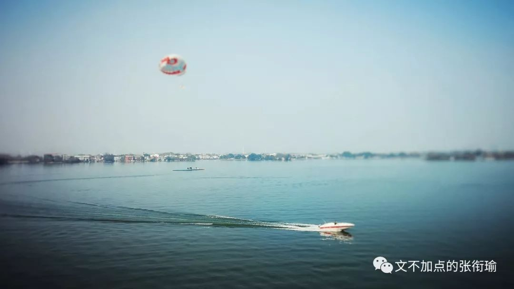

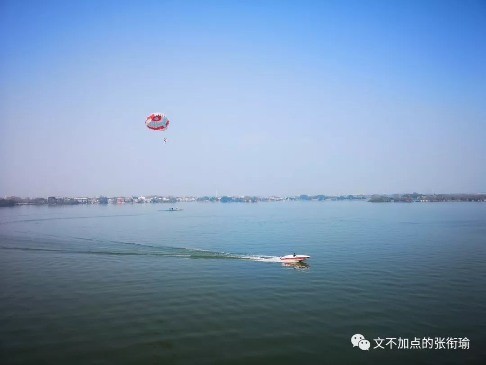

中北路八点四十三分 我在发这条票圈的时候人已经走了

柔焦真是一个神奇的拍摄方法 可以把所有不好拍的城市夜景都变得缥缈和梦幻 得不到的永远在骚动||唯愿在剩余光线面前 突然就好像 Eason 出现

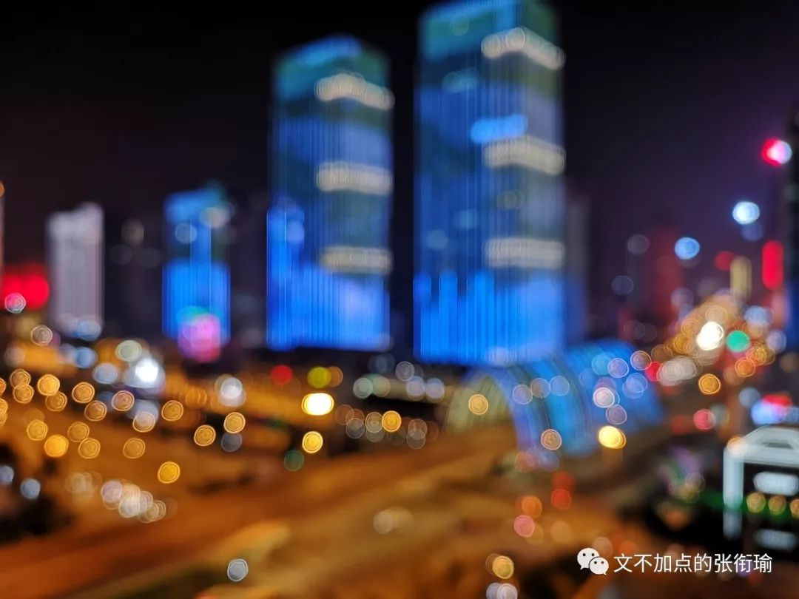

一张前景

教你如何用单反拍出流光？？

（事实上还是用手机对拍手机流光

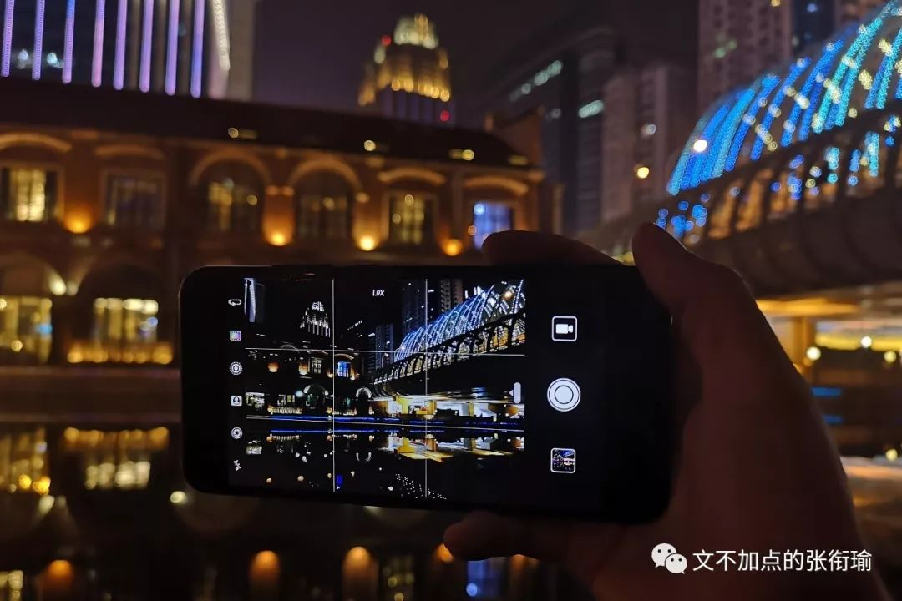

a little bonus 永远不要在和人出去玩的时候透露现在所在的方位
因为说不定下一秒就会发现自己小半个票圈都在这里 并且嘲笑你就在对岸走得好慢

我在对岸修图怎么了嘛（方脏

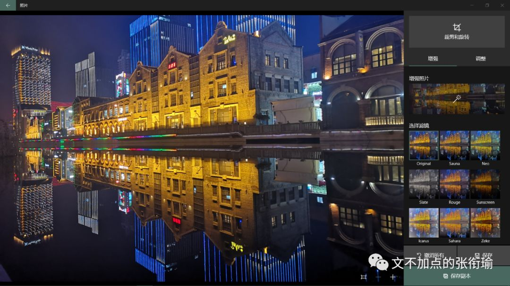

多的情绪和多出的剧情 不知道人会往哪儿走 不知道故事的下一页是什么 这可能就是 旅行的意义 吧 支离破碎地散落在记忆里 躺尸石家庄人 只是爱情可能不太高兴 毕竟说好了的 什么都像爱情

现在多出来了这么多的比喻和比拟 tag memes 反杀 parody 实在是令人觉得变成一朵云到处飘是再好不过的选择了

好好睡觉  好好吃饭

保持可爱
