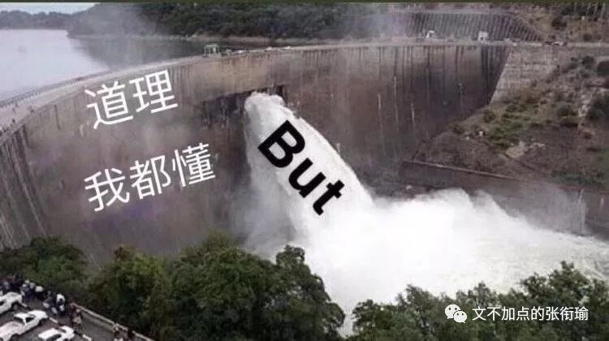
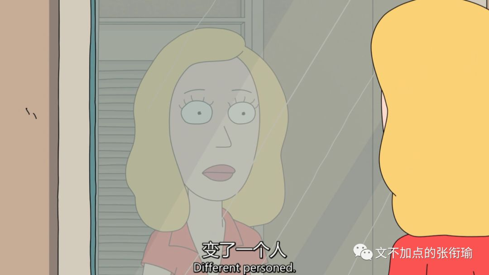
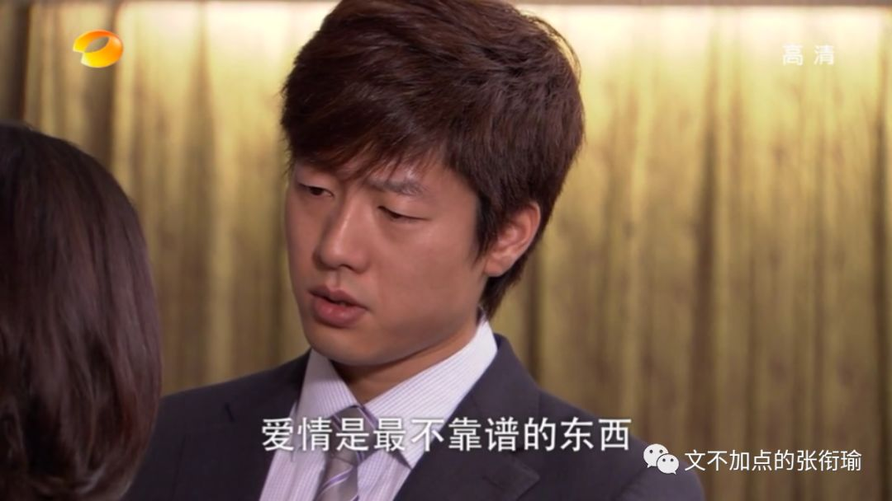
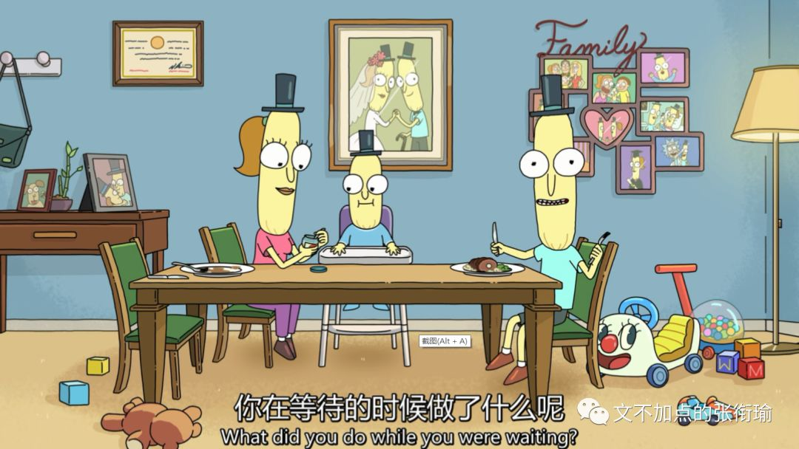
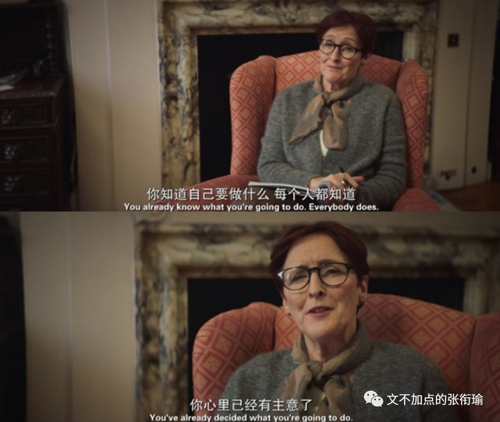
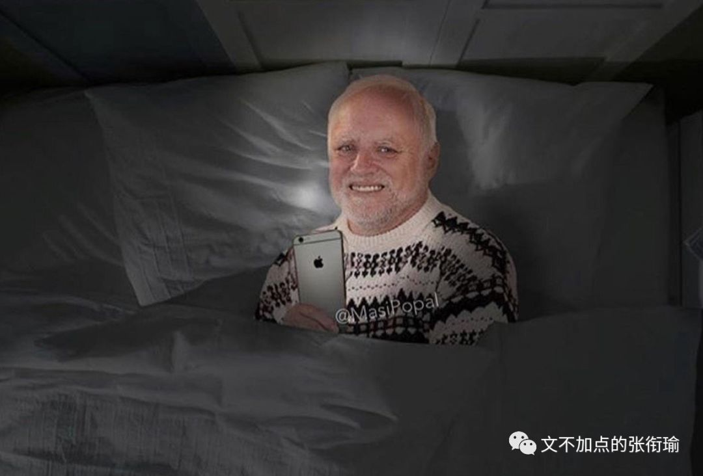
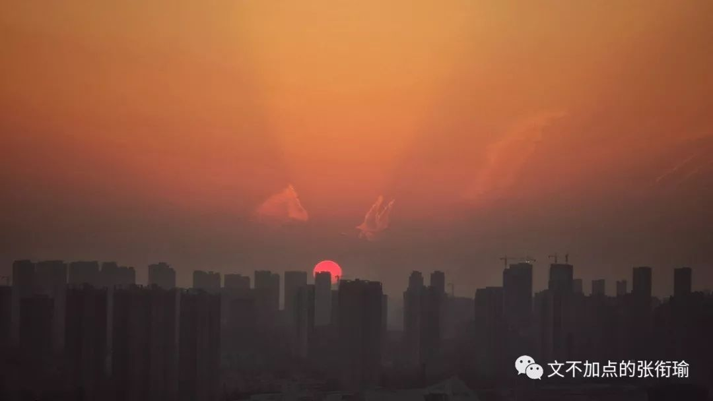
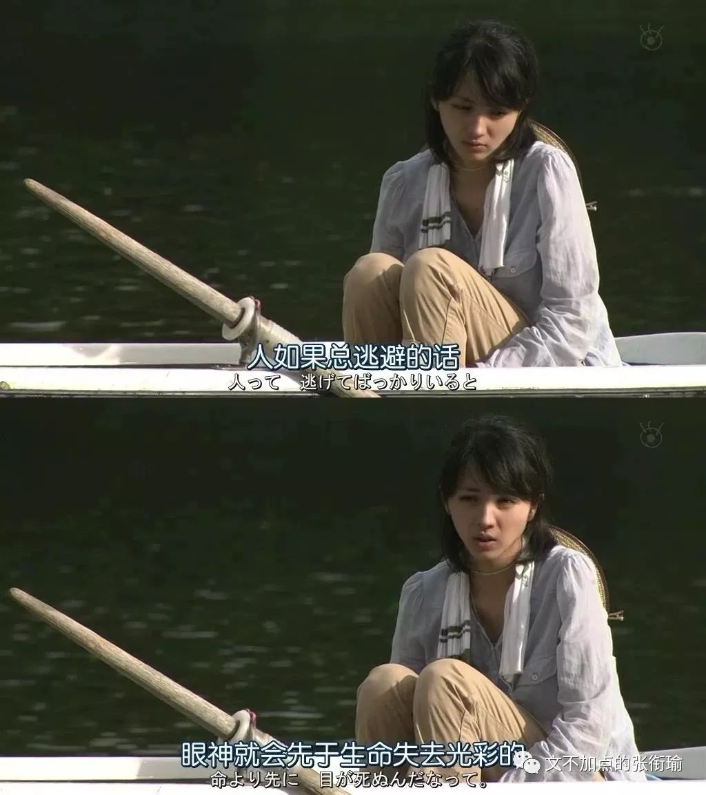

> 本文共计 4341 个字 读有标点的应该快一些

本文共计 4341 个字

读有标点的应该快一些

最近总会想很多事情，由于还算是在很认真地想说点什么，所以把标点加了进来。说来我已经没有借口不去和自己摊牌了，那么我是谁？我该往哪里去？

我也有很多次在想以后到底要去做什么？是不是还要读 PhD 或者去做些什么工作？间或也会像一位朋友一样，从现在开始算起，就把自己往后一年、五年、十年的日子都安排得明明白白。我也不是不会这样，但我其实还并没有完全明白自己要去做什么？以前的人说 五十方可知天命 ，但中国人的时间，我不想再等下去了。

尽管我不知道自己要去做什么，但稍微好一点的是，我知道我应该本着怎样的态度来审视自己的问题，大概也知道，自己在现在已经有过的哪些时候最令自己开心、哪些环境最令自己舒适。

首先要谈的是 幸存者偏差。

换而言之， 死人是不会说话的 。

一个简单的例子是， 辍学 的人里边，很有一部分成为了大企业家，比如我去采访过的一位校友、 PPTV 的创始人姚欣，比如美帝的几家大企业，在此不予赘述。幸存者偏差就在于，当人们希望在这些已经成功的人们之间来寻找他们的某些特质的时候，将会对原有的事情本质产生偏差认知。

辍学，只是从学校的学业当中走出来的这个过程，本身并无褒贬。 倘若我们在总结诸多成功人物事迹的时候，将辍学作为某一项来作文，实际上是容易对这些人物产生错误认知的。用另一种对比来说，相比于对经济的嗅觉、人格的魅力、做事的果断、时机的成熟，难道我们还会得出是辍学这件事是他们成功的关键因素吗？诚然，我不排除辍学这件事可能从一定程度上引发了某些人的斗志，或者让人感到某种力量——自由抑或屈辱，从而奋起直追。

但是，这就是偏差所在，我上述的斗志抑或力量，仍旧只是个人品格借辍学这个契机所表达出来的一个方面，如此而已。倘若 不顾本质地总结辍学这一件事 ，不顾还有因为吸毒导致的辍学、因为伤残导致的辍学、还有因为战乱而导致的辍学，仅仅将辍学作为幸存者的共性，这就是偏差。辍学了而没有成功的人，这些人不会说话。

所以在时刻保有对本质认知的警惕之后，一些看似有用但实际上无聊的事例就会自然而然地被我过滤掉。比如， 直博和工作后再读博的差异 。

最近总有人和我提到的隔壁家孩子谁硕士毕业后在中关村安家立业，现在既要带小孩又要读博士多惨呐，另一个人在复旦直博了数学就每天悠闲自在。这其实就是带偏差的估计项，在中关村是因为同龄人压力 peer pressure 读博、还是因为自己对博士学位有虚荣或人生执念去读博、还是因为工作性质需要一个博士学位，这之间千差万别。

再说到直博的那位，是因为导师跟得好所以轻松、还是自己有天分所以轻松、还是因为家里有矿 & 自己对自己没什么要求所以轻松，这之间也是很不一样的。如果不像这样对待直博和工作后再读博这两个选择，而只是把事例放在这，那就是很典型的六小龄童—— 只掌握了现象、却并不懂理论 ，当然也给不了任何建议或者参考予我。

这样一来，似乎能够让自己安心一点的办法，就只有自己去调查，用自己心水的办法去感受相关的氛围了呢。 所以我总是嘲笑自己，最大的本事就是舍近求远、避轻就重。 虽然不想在这些很重要的事情上含糊，但总对自己这样子未免狠了一点。我也有想和生活和解，就没事的时候在朋友圈用奇奇怪怪的沙雕图骚扰我的朋友们。

可往往是越惨的生活，越是用沙雕图解压，最近发现可能会更加给自己造成一种 “我还不够惨，我还可以再累一点” 的错觉，然后投入到更惨的生活当中去、选择一条更难的路——或者根本没有路，自己斧斤开山、筚路蓝缕。

我不敢轻易说自己要去做什么或者想去做什么，原因在于我已经太多次地更换了自己的方向。就像爱情一样见过很多人，在每一次都不含糊，却因此更不敢说出口 （洪世贤既视感） 。

想做的主持，在后来成了单簧管，一会儿又成了声乐 * 美声，转着转着到了物理 * 热学，突然一跳成了中文 * 训诂、中文 * 新闻，稍微收心了以为在化学 * 高分子、化学 * 表界面，但其实还是死性不改开始化学 * 计量学，自己开路化学 *AI 。如果按照我在这一方向内的脑洞的话，我一定会走上化学 * 控制的道路。从来不会觉得自己在某一个方向被限死，自然也没有什么好说自己到底要去做什么、或者想去做什么。

我现在所做的一切， 一半是基于我的好奇、一半是迫于生活的压力 。好奇只不过是我一贯以来对生活的态度，现在用我趁手的方式表达了出来。生活的压力则是面临申请和专业内的开拓与上升，如果要提到的也有对未来不确定的时候一些焦虑的应激动作，这都是实在存在的。

慌，是有多慌？

可能就是在看一些软文或者别人分享的小句子时，突然暴走。截了两段我的朋友们暴躁时候的话 （可以猜猜我说的这个朋友是不是就是我自己 2333

> 要说多少遍呀，爱与被爱时，优秀不重要。变优秀是线性的，向上的过程；但爱是靠撞大运才有的，遇到就抓住。 但是多少人因为生存压力过大 而早早地变成了只会把生活压力转变成成果 生活毫无动力也不知道撞大运或者自己根本感觉不到 我在说我自己的状态对什么都觉得情绪波动几乎为零 身上有口子就去消炎缝合 学不动了就再学一学 处不下去了就再处一处 我可以说越来越丧失了对生活的感知 即便生理还是在继续作用着 但主观感知已经越来越弱化只能追求最强烈的生理感官 其实有时候也没有 完成一下任务既定动作罢了

要说多少遍呀，爱与被爱时，优秀不重要。变优秀是线性的，向上的过程；但爱是靠撞大运才有的，遇到就抓住。

但是多少人因为生存压力过大 而早早地变成了只会把生活压力转变成成果 生活毫无动力也不知道撞大运或者自己根本感觉不到 我在说我自己的状态对什么都觉得情绪波动几乎为零 身上有口子就去消炎缝合 学不动了就再学一学 处不下去了就再处一处 我可以说越来越丧失了对生活的感知 即便生理还是在继续作用着 但主观感知已经越来越弱化只能追求最强烈的生理感官 其实有时候也没有 完成一下任务既定动作罢了

> 看完新世相那篇 我才 23 岁，我为什么慌成这样 ? 我20岁 等到 23 我可能在哪个大学准备 PhD 的 confirmation 可能在中科院的哪个所面临研究生延期毕业的痛苦 也可能刚刚申到哪个地方的博士正要去读 或者是真的转行码农去了 或者在家治疗抑郁症啃老 或者 我根本活不到 23 岁 谁不慌呢 我似乎经常成为别人眼里那种知道自己要去做什么 目标明确 手段强硬的人 老师这么看我 同学这么看我 家里人也这么看我 而我慌得一批

看完新世相那篇 我才 23 岁，我为什么慌成这样 ?

我20岁 等到 23 我可能在哪个大学准备 PhD 的 confirmation 可能在中科院的哪个所面临研究生延期毕业的痛苦 也可能刚刚申到哪个地方的博士正要去读 或者是真的转行码农去了 或者在家治疗抑郁症啃老 或者 我根本活不到 23 岁

谁不慌呢 我似乎经常成为别人眼里那种知道自己要去做什么 目标明确 手段强硬的人 老师这么看我 同学这么看我 家里人也这么看我 而我慌得一批

> 科研不是谁去了做个什么都有成绩的 但是谁没个成绩都是出不来的 我只是个正在投机取巧的人 大概有人凭经验给我指路说 诶你朝这儿去吧 那里还不错 但最有用的东西 我自己真正要完全对得起自己所受的教育和这之间的使命 大概是很有落差的 没有睡眠的时候 好听的声音是可乐倒进杯子里 气泡一个一个破碎的声音 梦想一个一个破碎的声音 我应该要镇定一点才是

科研不是谁去了做个什么都有成绩的 但是谁没个成绩都是出不来的 我只是个正在投机取巧的人 大概有人凭经验给我指路说 诶你朝这儿去吧 那里还不错 但最有用的东西 我自己真正要完全对得起自己所受的教育和这之间的使命 大概是很有落差的

没有睡眠的时候 好听的声音是可乐倒进杯子里 气泡一个一个破碎的声音 梦想一个一个破碎的声音 我应该要镇定一点才是

实际上，无论是哪一阶段的谁和谁，都会有各种各样的问题吧。只是在有些时候，和朋友说 真的好难过啊 ，其实心里早就有了答案不过想和对面一起好好说说话聊聊天。但这样的时候里，一般地回答都是 “我也是呀” ，然后开启互相倾倒苦水，相濡以沫也可以如果取成语本意的话。

之前背 GRE 的时候，有一个词组叫 agreeable melancholy, 意思是令人愉悦的忧伤，可能就是我现在看那些整天游手好闲的人决定今天是吃 渝井鲤 还是吃 海底捞 ，大概他们也很忧伤， 但就是令愉悦的我想打人 。新闻也可以写着说，路人在桥上死死地抱住了想要跳江自杀的人，意为： 谁也不许逃脱这悲催的生活 。

就像最近和朋友聊天，别个羡慕我现在在科研上有想法，我羡慕对面的学校是求是书院。如此的例子不胜枚举，大概总是对自己的生活还不太满意的人，都会对别人的生活报以很多的幻想。家家都有一般难念的经。扑面而来的生活覆巢之下，击打所有在孕育的、在破壳的、刚刚长处翅膀飞不出去的。

我明显地、深刻地知道，我的生活以及现在所做的科研方向，乃至现在所看到的科研体制当中存在着怎样的问题，并且用我的想象力已经把这些事情可能于我造成的影响在脑海的剧场当中排演了无数遍。细说下去的话，可能就成了我在用我这种方向内连审稿人都难找到的话语来描述一些更加对空的事情。

但， 认识到了方向、认识到了生活的真相之后是否还能热爱呢 ？我不想太敷衍地回答，所以我要想想在生活中哪些时候是真的有令人开心，真的有感到充盈满足的。

在所有的情境里，我稍微排位了一下到底哪些时候是最开心的时间。

> 排名最前的，是凌晨的候机厅。

广袤而明亮的停机坪旁边，我抵着锃亮的装潢，看着空客起降。在隔音玻璃内，轰鸣的声音依旧不减。手上也许是键盘，也许是书本。但这不重要，因为我在无人的地方等我的航班。

> 其次，应该是清晨的轻轨月台。

倒不是一定要登车才可以。如果是火车的话，画面可能会稍微显得有些重，像色彩配比当中某一块突然热了一样，所以只能是轻轨。这样的清晨轻轨月台才是一个溏心蛋，伴着外围煎出的一些酥脆蛋丝，并不全熟，所以好吃。

> 再者即是黄昏的楼顶。

容易去到的，最多感受到的，就是在 blue hour 看城市的天际线被渐渐染成金黄，涂晕出渐变的色彩。入夜的时分，所有的光芒都向观看者涌去。入夜之后，光芒返还到视野里的每一户人家当中。

暖黄的炊烟撩风予无形，我甚至能辨认出这是一条加了豆豉辣椒的红烧鱼，还有一分钟就可以揭开锅盖，把汤淋上洞庭银针米，饱满得刚刚好，吃完之后碗底还有一小层汤，也刚刚好。

> 最后，最后不代表这就是结束。

令人舒心的时间太多、太多了，但是这就是，中间的几个我每次只要到了都会开心的。最后这个是在 早餐店铺里 ，包点蒸屉的白汽在眼镜上凝结，我端着一个垫好的酱菜的碗，听老板吆喝之后，把扁粉下到碗里。记得酱料里面一定要有剁辣椒，这个没有就没有灵魂。

啰嗦想完了这些时候，发现前三个里边似乎都没有多少人类的影子。倒不是说在人群中，比如周旋各种力量之间、或者和好朋友一起去吃好吃的这些不令人开心。

较真应该较真在那些能实在排上位置的事情。拿中学的排位想法去要求硕博群体，这本身就是一种教育的不思进取和倒退， 因为马哲没有学好所以既没有发展的眼光又不能对事具体分析 。

那么，我想的在我喜欢的，就是上面说的这些。

自我反省一下的话，我尽管可以做开拓性的工作、尽管可以做繁琐细碎的工作，但这些也只是能力安放的一个位置。

如果在一场晚会上，我可以后勤、可以主持、可以把活动流程安排好，但我最大的能力，或许是 保证晚会组办方想请的每一位嘉宾都来到现场，让每一个环节都紧密相连、鲁棒而又不出差错 。

相比于先锋 pioneer 、教师 teacher, 我应该是一个 connector ，保证环节当中的每一环都正常运行， 我在灵活的关节上拧紧每一个螺丝，在交叉的地方校准每一个我齿轮螯合的对象 。其他的我也可以做，但这，是我能力最大的地方，我自己也很开心很喜欢的工作。

可这，毕竟没有哪个实在的岗位或者工作，是只针对这样的人设计的。 所以我没法很好的量化自己的工作，他们每一部分都是在实在地做了工作，但整合的这个人，倒没什么好自己证明自己的办法， 正如没有办法证明一件从未发生过的事情一样 。于是我现在继续在做最实在的事情上往前走着，像自己走的大类交叉学科似的继续前进，这既是我没办法解决的，也是我没办法证明的。

只不过自己知道，然后 信者恒信之，不信者无可奈何 。

生活总能给我很多出其不意的事情，我现在把事情想得满满地放在这里，过几天生活又会笑嘻嘻地给我整些个幺蛾子来和我寻开心。

也没有什么办法，就这样努力地透过面纱看生活，然后想想自己可以怎么和生活掐架。就算挂上马鞍去教训生活这匹烈马，它也会有无比的耐心和强大的后劲来想办法把我甩下去。

只好，且放白鹿青崖间， let it kick itself out, 慢慢继续角力好了喏。

