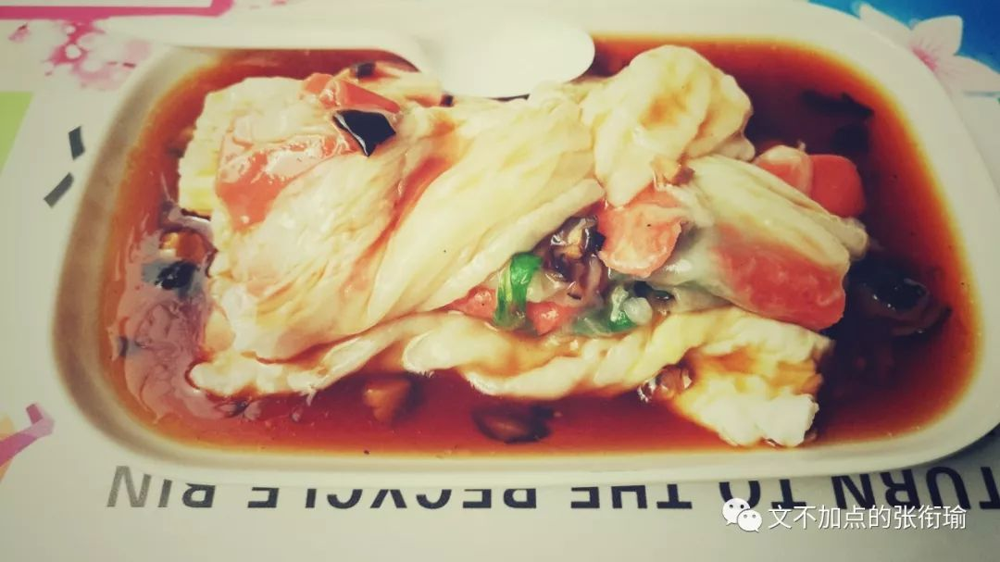
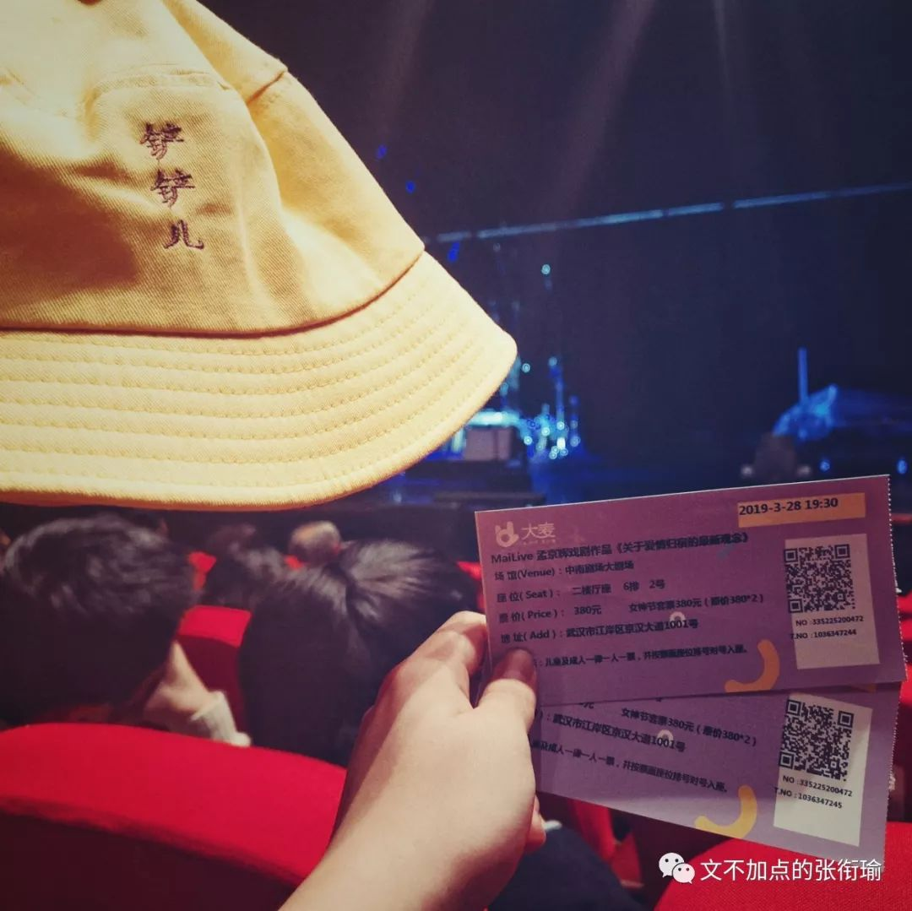
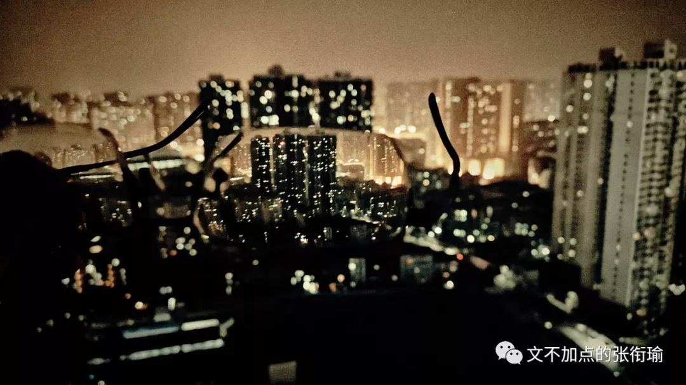
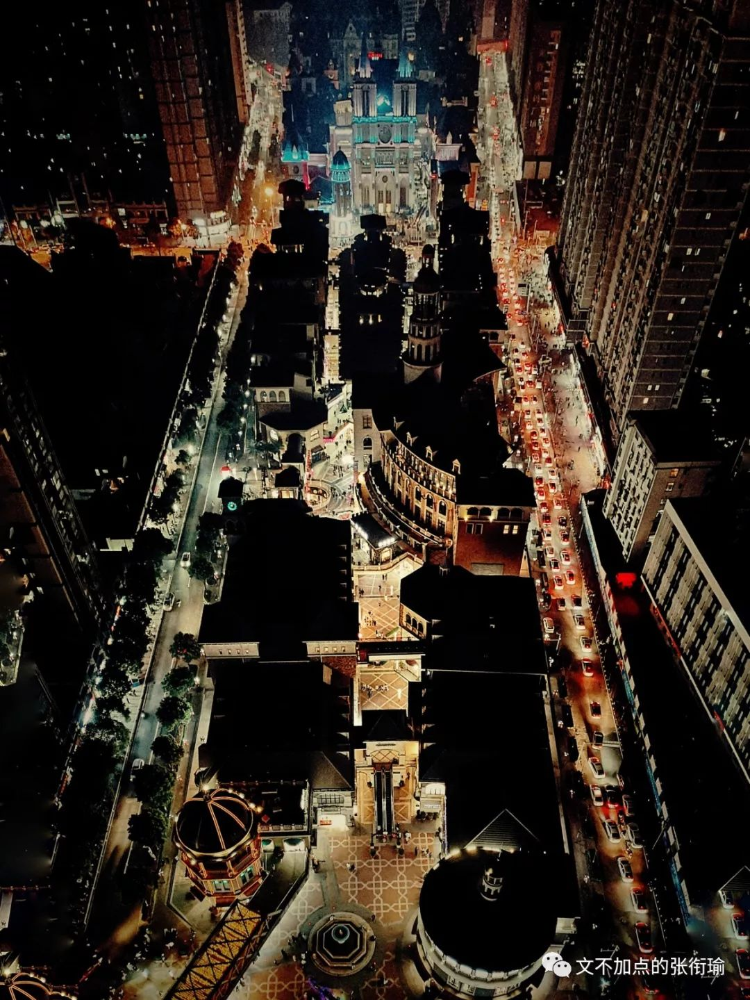
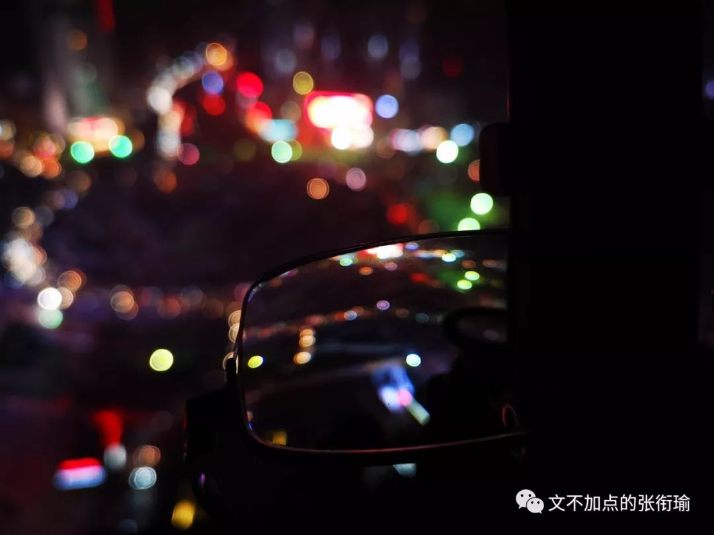

> 本文共计 1954 个字 是张衔瑜的第 84 篇推文

本文共计 1954 个字

是张衔瑜的第 84 篇推文

一切都好像没有改变

一切都好像存在很久了

痴情的 绝情的

直博的 工作的

一脚踢球开出界外的

斩伏把腰折断了的

一切都好像刚刚才发生

一切都好像发生过很久

走到小吃城去 给自己点了一碗 肠粉 即便是这样风和日丽的下午除了梧桐雨之外 没有令人能讨厌得起来的东西

我在三点多钟点了这碗 火腿鸡蛋肠粉 同样的那些把大米打成米浆 在铁质蒸屉上铺展得平平的一层 中间还要把火腿和鸡蛋调进去 并且在递给我的时候盘子底下还垫了一层加了 香菇 的酱碟  风和日丽 对于他们也不过是再普通不过了的一个下午

刚刚写好的程序 还开在寝室里  电脑熄灭了屏幕  CPU占据80%以上令我不好意思再给出任何指令  任务管理器在后台监视着我的行为 再点出任何一点 都会上 红了 告诉我说 不 你的操作令机器太难受了

清空了所有想法缓存的时候就可以走出门去 上周四 去了一场话剧 依旧是孟京辉的作品 关于爱情归宿的最新观念 应该说 就是紧跟着的 恋爱的犀牛 原班卡司cast  很先锋的话剧 话剧在 不安分的情绪递送

> 仰视窗口滤进的光明 你大口吞咽湿润的空气 我举步徘徊拍打不安的双翼 我的二十八岁展翅飞过

仰视窗口滤进的光明

你大口吞咽湿润的空气

我举步徘徊拍打不安的双翼

我的二十八岁展翅飞过

出门拍照的时候 虽然 没有很好的单反 虽然 也没有什么后期技术 只有不安分的躁动的想出门行走的意愿 以及一点点了无生气的创意

我这次尝试着 把眼镜放到镜头的前面 相机的镜头人们只记得这是徕卡 蔡司 或者别的镜头logo 但眼镜 近视眼镜 到底是一个凹透镜  把想要拍摄的部分放到前景的镜头上 灯火 是灯火的颜色

光谷也自带有血腥的颜色 不管是奇怪而无聊的雕塑 还是遥遥无期的工程 记得今晚是要停水的 勿失勿忘 每次停水就像是下课了还要拖堂的老师 上课总是按时来上课 下课铃却好像没有听到  也不知道到底是在满足自己的某些一定要讲完的执念 还是真的想对得起人然后也有人在听  总之 我不管是左眼720P 还是右眼1080P  光谷 在我的眼镜里确是血腥

试着手拉 曲线 总之就是snapseed里边的curve  如果说人类是一种渺小的生物 那并不是因为有多少的轻蔑或者孤独的傲娇 焦虑贩卖机也就像是KFC制作可乐的机器只拿着统一配送的糖浆 然后把二氧化碳气泡用气泵鼓入纯净水中  混合了糖浆出杯 就是看到的模样  轻蔑焦虑的推文 和其他的软文一样 不过是另一种焦虑制造

吃着熟悉的食物

菜单 菜单的库存很大

虽然 我只能选择其中一项

但我永远希望有新的单品进来

我的疲劳很大程度上来自于自己的惯性 说这是一种追求卓越的惯性似乎太做作了一些  但只要去看看体测田径场上 那些和同学说 我这次就随便跑跑 并且精确计算并证明了说自己这一次就真的只要有成绩就能毕业的人 一开始都想得好好的 但是努力起来一个个地都在拼命向前冲

追求成功显得有些不切实际 我更多是 追求一种和自己过不去的生活 却无时不刻不在生活的每一个细节和自己较真

要说 每一餐在饿了么上面点单的时候 究竟算来算去 能剩下多少钱呢  可能一年省下来的钱加起来 都没有出去看一次话剧的消费高  但不管如何 连经典款坦克大战的副本都可以拿到9102年的大学寝室来重新一个个地刷完 并不是享受或者开心于最后能带来什么结果 而是某种奇怪的性格或是惯性决定了 在做一件事情的时候必须要达到或者过了某些心里的坎坷 ——疯狂洗手洗到掉皮的强迫症患者

来源倒没有什么 约莫从很小的时候开始 就很习惯于在很前面很完全的地方  那种就像是 用考试的例子来说 很明白这 一百分 的卷子里 当自己是 八九十分 的时候应该怎么向前努力 倒不是一定说要冲到 九十五以上 而是如果自己 七十分往下 的话 就会显著地不知所措  因为已经习惯了在做任何事情的时候 心里的坎就至少要能达到多高的标准时才可以move动手 极少有例外的情况  而 四十分再往下 要补天了 那就真的是要让人神情崩溃了

人们都只是疲劳

就像随手拍的

地铁上这疲劳的一家三口

生活也是这样 这不属于像老友记里面Monica的那种控制欲 而是对生活的基本认知涉及原则了principle  不可以在完全陌生的情况下被颠覆了 同理 行为方式也不可以

所以这才会有在体测之前也真的有人按照标准在算 看这次自己只要多少分就够了毕业 而且这个成绩也和所有的排名申请奖项都没有关系 所有利害关系撇干净了看得清清楚楚 这个人也会在这一开始想得好好的 那我就随便跑跑走完也行但是最后在赛道上撒开命了往前冲

看似矛盾的佛系无所谓言辞和道系激进派做法 只是令外人看着觉得言行不一有点婊里婊气  但事实上 这只是一种普遍存在于我和我周围人的一种心理状态 (或者描述成心理诉求whatever you like

我对这个不置可否是因为 基于不同的环境和背景 这种心理所表现出的作用是不一样的  只能说这是长期以来 张衔瑜在和自然社会与生活的不断捶打与被捶打当中 最后物竞天择一般找到的最宜居的生存状态 对此我没有什么好说的

> 下雨了，路上的行人像找了一天食的鱼一样穿行在雾里。雨水和黑暗争着落在这城市的上头。在去地铁车站长长的一段路中，我不断咳嗽。清理喉咙的时候，就是我心烦意乱的时候。几步之外，飘摇的树底下，一只羽毛稀落的半死的鸟儿在望着水的脏报纸上恨恨地看着我，她的目光呼出的气息吓了我一跳。

下雨了，路上的行人像找了一天食的鱼一样穿行在雾里。雨水和黑暗争着落在这城市的上头。在去地铁车站长长的一段路中，我不断咳嗽。清理喉咙的时候，就是我心烦意乱的时候。几步之外，飘摇的树底下，一只羽毛稀落的半死的鸟儿在望着水的脏报纸上恨恨地看着我，她的目光呼出的气息吓了我一跳。

该走了

该去做等下要接着做的事了

倒下的路灯都亮了

为什么你还黯淡

