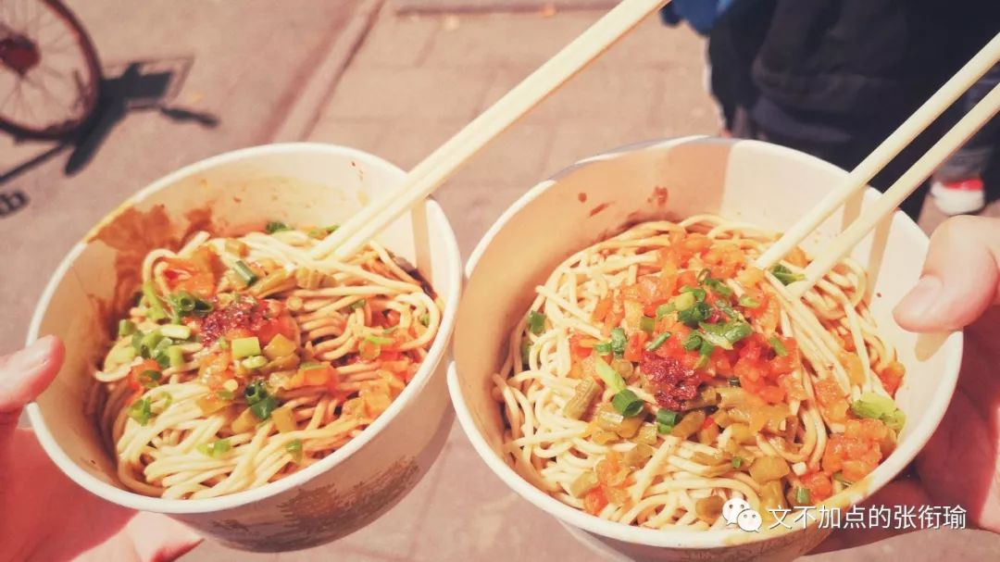
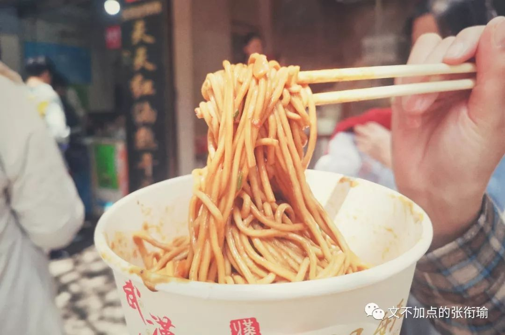
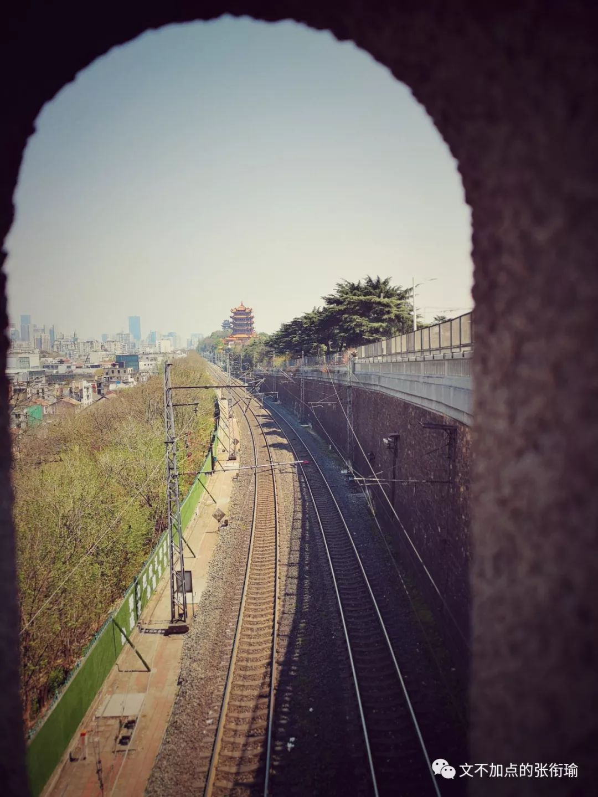
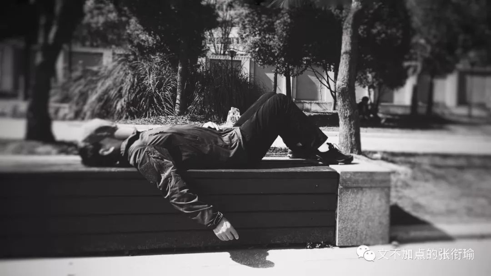
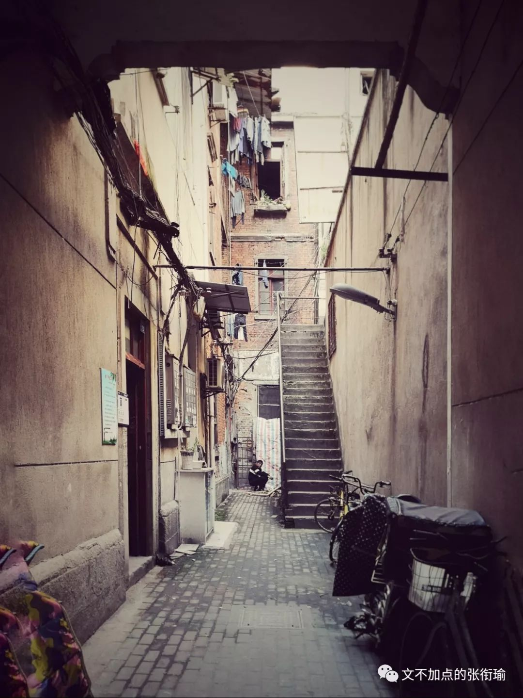
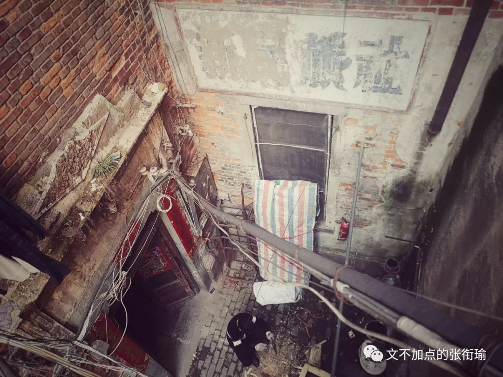
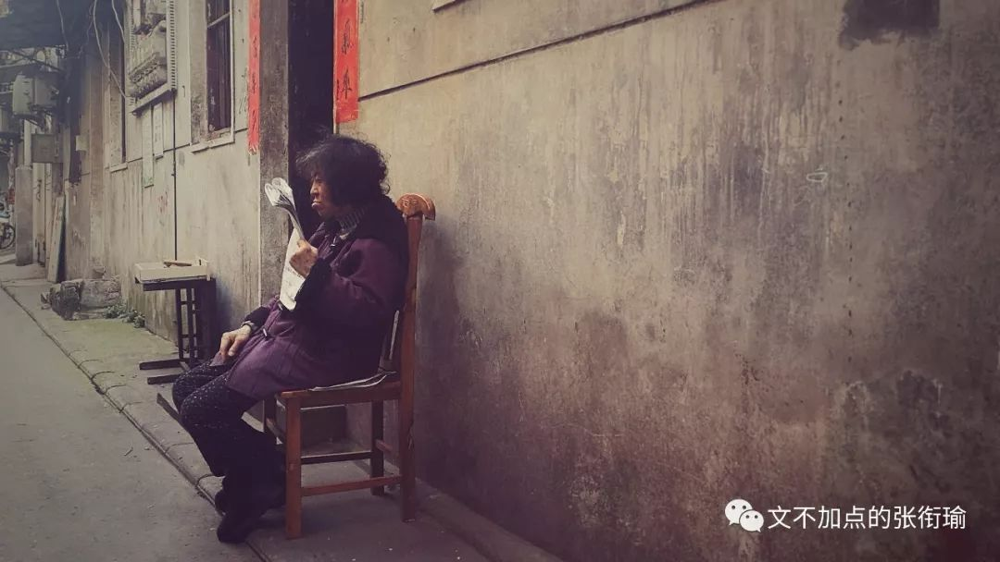
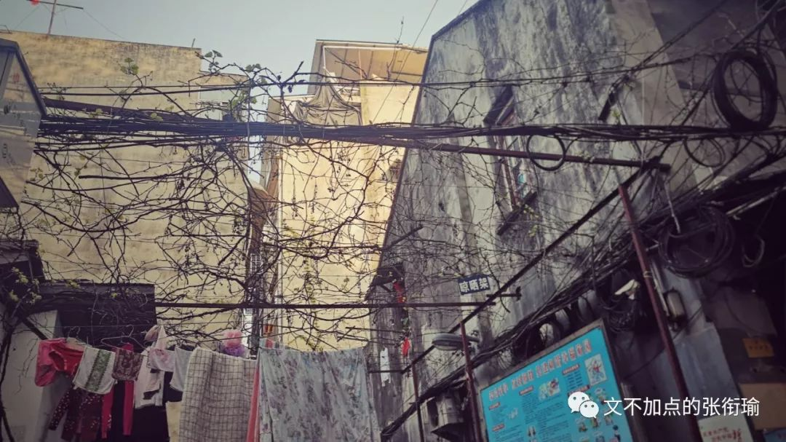
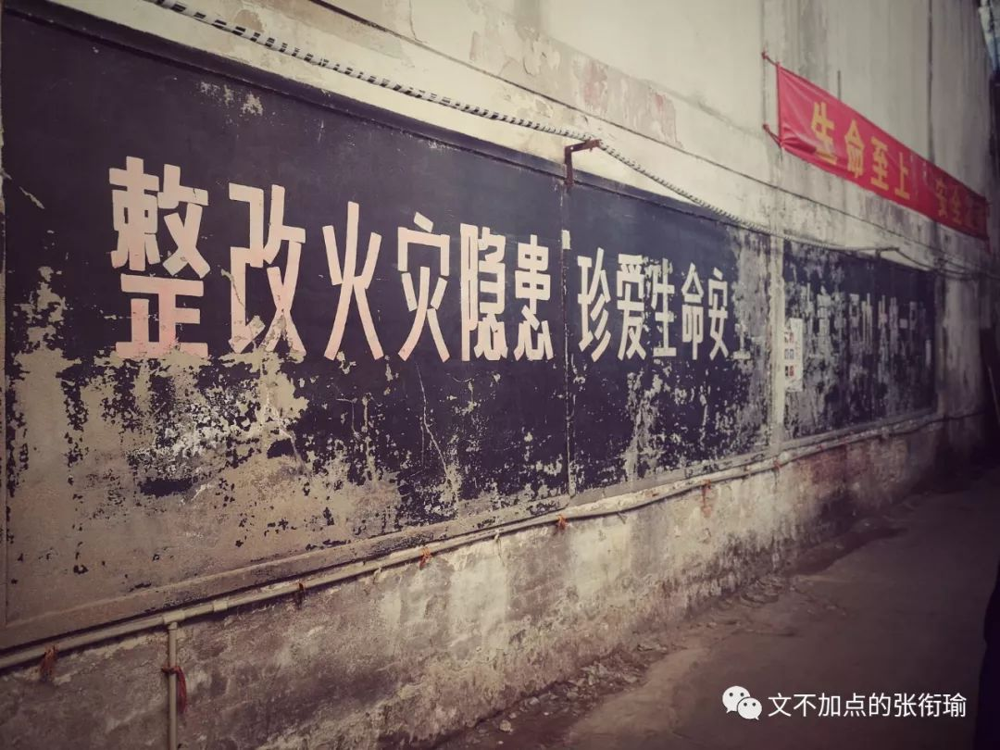
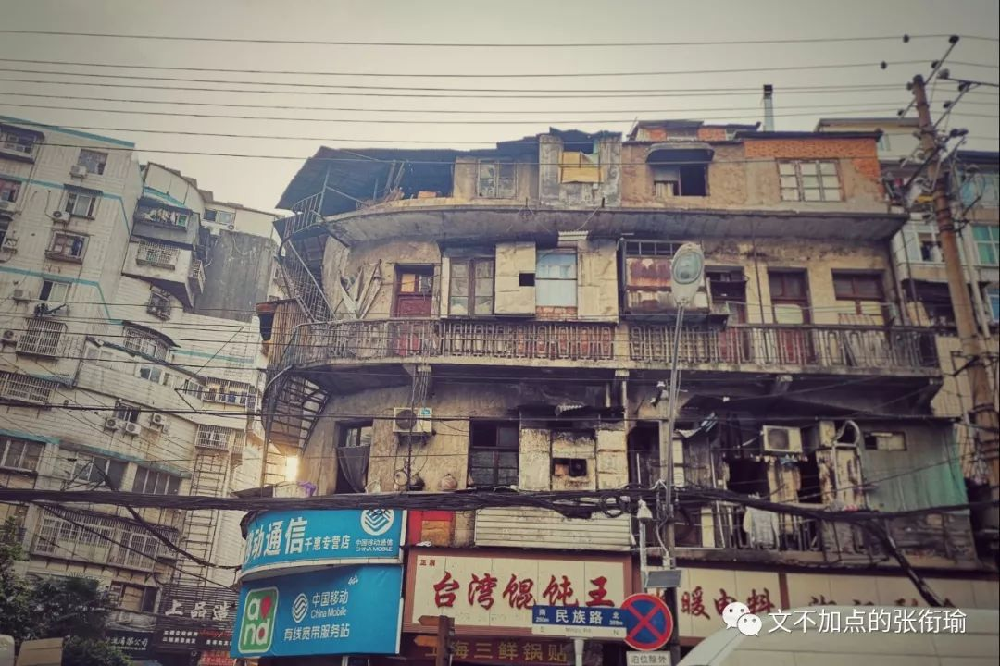

> 本文共计个 2668 字 是张衔瑜的第 85 篇推文

本文共计个 2668 字

是张衔瑜的第 85 篇推文

众生是未开悟的佛 佛是未开悟的众生  早不在意什么局促和束缚要走的时候 就应该要走出去  生活已经如此模样的 虽然总是应接不暇地恶作剧 但至少可以有一些时候可以 反手转过头撇下身去 出门

对汉口风味的理解 多在于万松园的几家  而武昌的风味以为还是要去 粮道街 上找  从湖北省美术学院往南 即是粮道街  不同于户部巷成了游客打卡的奇怪景观 粮道街却是实实在在可以听到对面走来的路上行人 一口汉腔的在絮叨着生活小事

走到的时候已近中午 之前在高德搜不到的这家 爆汁生煎 被眼尖的我在 武汉中学的街对面 发现  像行为艺术一般地 一口巨大的煎锅里 松散而平整地贴着一层煎包  店主人揭开锅盖 烧均匀之后 撒上芝麻粒 浇下提鲜的调味酱  抄起柄小铁铲 自贴锅的部位铲向中心 五个生煎一杯的量 刚刚好点醒一下被生活捶打得昏厥过去了的胃

以前听说 基科的后勤里面都是河南人？？在掌勺做热干面 这个消息我没有去查证过  但另外 说来也可以理解 我认识的武汉同学都觉得自家楼下的最好吃  种草了很久的一家是 天天红油赵师傅热干面 去的时候就发现这家本土网红店外 排队的人已经在人行道上站远了去 以至于完全遮住了隔壁 如意馄饨 的整个店门

家阳赵师傅 倒不是只在卖热干面 这家的单品里 令人即便暴躁如______也能耐着性子等下来的应该要数这家的 油饼包烧麦 从油锅里捞出一个 沥干  戳开一个小洞 把刚刚蒸好的烧麦添进去  折开吸油纸 递给食客

危险的脂肪固然危险

倒不如吃下去以免回心转意

况且吃下去了之后

每一个味蕾上都是感谢的声音呢

武昌这边小吃最大的一个感觉就是 比正餐还要扎实 基本上过完了之后 是不会有什么想法要去 比如刚刚吃完了之后还要再加个甜点之类的 因为真的很饱也很腻…… （一起出门的川湘势力都表示不能handle 希望类似店面的周边配餐 可出一点像酸梅汤之类 为外地游客解腻的产品TAT

不过我觉得 简直要令人惊呆的端着热干面就可以打着电话边走边吃的大叔应该不需要我说的这些blah blah还是就这样子然后让别人惊讶羡慕就好

也是在粮道街上 转进的一条小巷子  去年大概是十月份的时候我拍到的2018年年度最满意的一张照片  一个叫 得胜桥 的路上 蓦然回头 老巷子上遥遥地突兀出武汉最著名的外地景点—— 黄鹤楼

不管大家平常怎么黑这栋早已不是黄鹤楼的黄鹤楼 但夜幕之下 还真的挺好看的  之所以满意这张照片 仍旧是因为有同色系的人出现  啊总也想再夸一次呢

粮道街走到西 接上的一条叫 中华路 如果不上中华路码头去的话 往南则是 司门口 司门口旁 户部巷 算是一些老的报纸抄来抄去炒起来的奇怪旅游景点  几乎在全国每一个景点都能找到的蒙古烤羊肉和充斥着驴肉火烧感觉的小吃店 在这里达到了走一步路开一家的密度令人没有什么好感

倘若不进户部巷 而是再往南 就到了 长江大桥 1957年合龙通车的大桥 沧桑而宏伟  我尝试用黑白的角度来架构这张从司门口引桥边上来的地方  铁路是一边 公路是一边 黄鹤楼是一角 镜头在另一角

再往江边走 有一处哨兵岗亭  和平时期的岗哨 虽然武汉也许不像在四川凉山那样直面危险 但是居安思危和战备意识 看不到的防卫和永不消逝的电波在旁边的我依然能听到里边孔武有力的 “敬礼！报告！” 的值班换岗声音

摄影的话 这个角度倒是正好在铁路的上方  以花甲之年的长江大桥桥洞作为前景 铁轨的导引一直到黄鹤楼的面前

一辆普速列车经过

从铁路上架着的高压电线之间

最喜欢的这张

车尾渐行渐远

那种感觉

是一定要用黑白颜色来表达的吧

武汉从今年三月底开始

关闭了通航119年的汉口 王家巷 码头

四月是你的谎言

四月一号

也停下了晴川阁到黄鹤楼的轮渡

乘着残存的 发往 集家嘴 的轮渡  长江之上 五星红旗满襟不湿  背景多少有些虚化的 长江大桥 龟山电视塔和晴川阁 希望下一次拍 红海行动 的剧组考虑考虑这张的拍摄手法233

走到 汉口 不像在武昌感受的那样 一江之隔也有风貌的改变  不局限于一个镜头一个点地 整体的气质会改变

也许是我在 江滩 随手拍随手修的一张

在路边累倒躺在长椅上的午休的人

也许 是在 龙王庙 拍的

两张我觉得像樱花

但形色说也有可能是泡桐的照片

也许 是在电路走线当中

横架出来一根

给大董社区居民使用的晾晒架

不看导航也没有目的地地随意选一个门洞走进去 这个想法一出现在我的脑海里 就有了一种感觉 感觉就像 多年的三文鱼嗜生老饕 闻到了咸咸的海腥味

走进门楼去

拍一张窗口在黄昏交映下的红玫瑰

执业三十年的老裁缝

手上拿着一块

上好的素色布料

左右端详

这大概就是我

举起手机构图修图

新民会馆

的时候

也有在扫街的时候拍到的 老奶奶 可能是没有戴老花眼镜地眯着眼镜 搬着椅子坐在巷道边  可能感觉到我们在看她 于是抬起头来打量了一番  发现不是自己这个社区里的 又沉浸回了铅字的世界里

我就算没有看过多少汉口作家的作品 却也大抵可以想象 沉浸在这样的氛围当中 是会令人身上的某些特质 因此而悄然改变的 人们都有自己记忆赖以生长的地方 可能是自小就有的 可能是读书后有的 可能是工作了退休了有的 不一而足 但可以肯定的是 一个地域一种氛围的特质一但感染了人 总也就会形成一种感觉  像恋爱的犀牛里说的 今后看世界的眼睛 将因此而变得有些不一样

就像

就像久而久之

在晾晒架上攀援的

藤蔓植物

在老街上踢踏麻石路面 大概可以想到很久很久以前背的 偶然值林叟 谈笑无还期 明明只是相逢的陌生人 却可以在路上见面  不知其人身世若何 缘 不悭于一面 却也不知 来年何时

邂逅 新华织带厂

心里想的就是这些

我只在长沙海信广场文和友才看到过的90年代招牌  还有在汉口 [平和打包厂旧址](http://mp.weixin.qq.com/s?__biz=MzUzNjE3NzA3Mg==&mid=2247484879&idx=1&sn=08784a8876a520f43895a803e89169a5&chksm=fafb7510cd8cfc0682b031239e57331268bd044c39bbca9ce5bbb9c6bafb2e9a817101913cd9&scene=21#wechat_redirect) --多牛世界展览馆才看到过的类似字体墙面标语

走出之后

世界还是一样的世界

但是不一样了

民族路房屋的狭缝中

黄昏召我以时间

随意在 六渡桥 附近

找一幢有眼缘的高楼

一切的炽热在这一刻

显得安分而又暴烈

不安而又宁静

小学的下课铃拉起

汉口老城区的三四层居民楼楼顶

还有人用淘米水侍弄着花草

那水上可能还有粳米打稻时候

留下的谷壳

黄昏果然 是人一天中视力最差的时候

却可以发现 喧闹的远方和静谧的人类

无穷的事件都与自己相关

高中一篇 王安石的《游褒禅山记》 这样写道

> 于是余有叹焉。古人之观于天地、山川、草木、虫鱼、鸟兽，往往有得，以其求思之深而无不在也。夫夷以近，则游者众；险以远，则至者少。而世之奇伟、瑰怪，非常之观，常在于险远，而人之所罕至焉，故非有志者不能至也。有志矣，不随以止也，然力不足者，亦不能至也。有志与力，而又不随以怠，至于幽暗昏惑而无物以相之，亦不能至也。然力足以至焉，于人为可讥，而在己为有悔；尽吾志也而不能至者，可以无悔矣，其孰能讥之乎？此余之所得也。

于是余有叹焉。古人之观于天地、山川、草木、虫鱼、鸟兽，往往有得，以其求思之深而无不在也。夫夷以近，则游者众；险以远，则至者少。而世之奇伟、瑰怪，非常之观，常在于险远，而人之所罕至焉，故非有志者不能至也。有志矣，不随以止也，然力不足者，亦不能至也。有志与力，而又不随以怠，至于幽暗昏惑而无物以相之，亦不能至也。然力足以至焉，于人为可讥，而在己为有悔；尽吾志也而不能至者，可以无悔矣，其孰能讥之乎？此余之所得也。

我今天的Notepad中

其实还有一个题目和一段小札

题目是

我是一碗夹生饭

小札为

连人生都变成了一个笑话，

还谈什么愚人节、四月

或者是不是谎言

我修完了想修的图

写完了想写的这一篇

在全文开头放下了出门的

那些也重新回来

追着我继续打

我没有和之前的我有什么不同

张衔瑜还是张衔瑜

世界没有什么不一样

但是 这次的

还好

是真诚的

不敷衍的

还好

