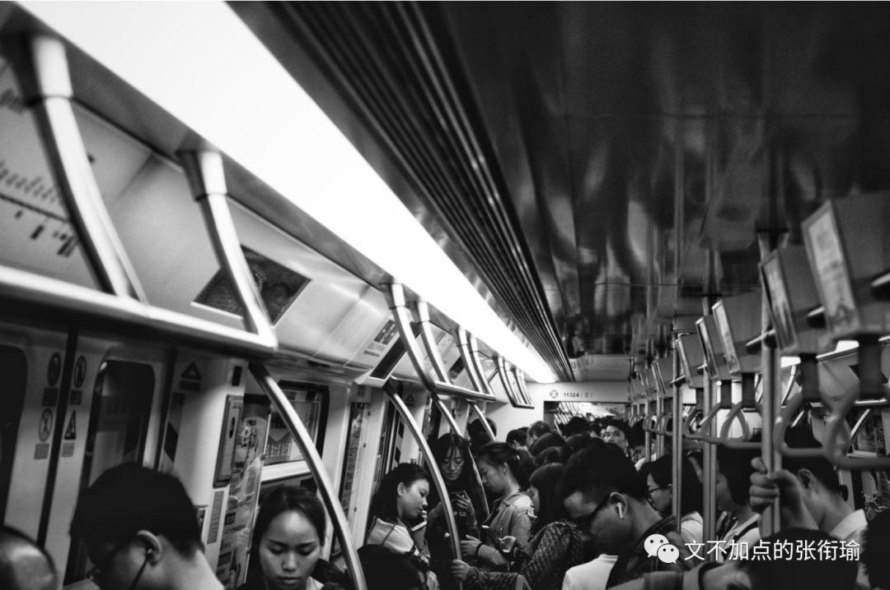

> 本文共计 4070 个字 插图 31 张 加点了在这一次

本文共计 4070 个字

插图 31 张

加点了在这一次

深圳市的街道旁

栽种着许多的 朱瑾

朱瑾别名大红花

小红花是幼儿园的荣耀

但朱瑾 不只是一道城市风景

也是深圳所值得的

这次到深圳，主要是在行业走访。

一家一家，新能源新材料行业。我几乎在所有学院老师让我们写的综述或者小论文里边，都会提到 《中国制造2025》 ，这个15年国务院刊发的文件。

但真正，现在行业如何?前沿是谁在做?我们国家、我去的企业，谁有谁的长处?谁是谁的合作伙伴?他们找人喜欢什么样的、招进来之后做些什么?我除了知道前沿论文会发在哪、稍微读了几篇以外，对以上的问题一无所知。

其实走完之后，我也不敢说我对以上问题的认知会有多么深刻。一方面是因为，我所看到的只是一小块；另一方面，别人告诉我的东西，我不假求证地再给别人复述一遍，则是另一种不负责任。再考虑到一些我去到的企业内部也许还有他们的商业机密之类的，于是大多数地，我将采取类似 记者手记 的方式来架构这一次的推送。

这一次到深圳一共去了四家企业，按顺序是 星源材质、贝特瑞、顺络德和格林德 。我不一定按照顺序来描述我所去过的企业，正如我也不一定在每个企业都给出了图。

在写这一篇的时候，我最先想到的还是当天晚上我在不是上述四家公司之外，我在回酒店的路上，经过的一个厂房时候所拍摄的。当时已经是 晚上十一点左右，一名身着工作服的工人，在灯下连贯而娴熟地操作着设备。

我知道ta在做什么吗？

我不知道。

Ta会是在被强制加班吗？

我不知道。

Ta的公司和家人知道ta这个点了还在岗位上吗？

我不知道。

Ta心里会不会想工作以外的事呢？

我不知道。

我只是在路边的人行道上，看到厂房内仿佛若有光，然后唤醒相机来扫下这张图。回来之后一修，客观理性地描述一下图中的内容，仅此而已。但在这一刻，我仿佛已经自己 profile侧写 出了我所拍的这个人，最近一段时间以来的生活轨迹和生存状态。

根据我的直觉来看，这应该是一个 熟练工，工位为仅次于车间主任的副主任或者主任助理 （如果车间主任和车间普通工人之间差六级的话，这个人应该是靠近主任的2.5级附近） 。熟练工主要是看手法，手法给人的感觉是这个人的工作很流畅、有条不紊。

而这样的工人肯在十一点左右的时候继续工作，这个点已经是绝大部分的工人都已经聚拢到夜宵店或者在人才公寓内自兀自地享受仅有的空余，这时候工作的人判断为不是主任总工，而是在小心钻研技术的二级工或者三级工。

可能是一个正在攻关项目然后不得不加班的二级工，为了保住自己的岗位；也可能是雄心勃勃的三级工，已经在厂内工作了一段时间，想藉此把自己的薪资再提高一点。我比较倾向于后者，但不能排除前者的可能性。于是总地来说持保留意见。 然后根据不同的工位，引申出来不同的近期生活状态， 在此也就不再话下。

我很清楚地知道我所看到的表象是怎样的，并且知道如何用准确而不失美感的语言来描述我所拍摄下的图片 （即使也没有这一张图） 。在此同时，做一下侧写，也不用很刻意地就是信手拈来关于这一名描述对象的若干情况，这是我这次在深圳走访时的绝大部分时间自己的一点内心戏。

走访了深圳之后，最大的一个改变是： 我又坚定了读PhD的想法 。

与之前不同的是，这一次的程度更不一样。动摇有两次，在两次之后，都是很长一段地迷茫期。 所谓迷茫，是因为在掂量自己的几个选择之中，去哪一个会给自己带来更好的结果。 但这次不一样，这次不再迷茫了，这次是总地觉得很无趣： 一种因为知道自己所有的选择都很无聊、都不会好到哪里去、带一点点绝望色彩的情感。 不管选什么都不会好，那就选一个看起来没那么讨厌的。而不是像之前迷茫的时候因为觉得好像每个都也还好，我要选一个更好的。并不是以前那样的选择题。

当然，小孩子才做选择题，大人总是被生活推着走。

从996、ICU挂到GitHub上开始，我就开始关注这个事情。不管是《劳动法》也好，还是以马云为代表的一批商业高管背书这一策略，又或有人开始重新研究剩余价值规律，类似的文章我也看下了很多。正如我一贯的处事态度来说： 我可以理解绝大部分在这个世界上发生的事，但要我自己来做，我一定会按照自己的方法走。 我比较喜欢沈帅波在 [虎嗅出的这一篇](https://mp.weixin.qq.com/s?__biz=MTQzMjE1NjQwMQ==&mid=2655556880&idx=1&sn=ab0d0cc745e08534088fab0168276867&chksm=66df3a8e51a8b39866873ea8d5ba515f587c6135e94ce38e8d3410ae5f9f3ae2f379446a89ef&scene=21&xtrack=1&ascene=14&devicetype=android-28&version=2700033c&nettype=WIFI&abtest_cookie=BQABAAgACgALABIAEwAGAJ2GHgAjlx4AXJkeANCZHgDRmR4A3JkeAAAA&lang=en&pass_ticket=yHyGh gsnnQul8R5WDw2GTdGKcEChpXSappJym/Sdo/h7D2bgoyS53ZEPv FEt34&wx_header=1#wechat_redirect) 。

996诚然代表了一种极致的价值观，但是，真的普世吗？我最赞同的一句话是： 这个时代是随时在线的，这个时代的价值来自于价值本身，而不是时长。 我最反感的是只奖励勤勉，而不知战略为何物。 稍微搭一手就是这次的视觉中国事件，奖励勤勉则只会要摄影师每天出门不论刮风下雨跋山涉水去拍出各种各样的照片， 而不会考虑为什么这次只说了版权问题却不说摄影师权益、不讨论人民网舆论到建立健全法制机制之间差了多远而又有多少人在此间从中作梗 。

转回996来，硬段规定时间的操作，就和大学生了还要别人去早读，拿着沉重的学分压得人喘不过气而不是去做一点想做的事没什么区别。读大学究竟在读什么？我每次在紫菘停水的时候都会diss这个地方，因为是真得多，推断出市政是真的懒。东区开始大肆修路的时候，也有人义愤填膺地制作《元首的愤怒》视频，配字有一句令人心寒： 我到湖北省来，来是来读大学的。 言下之意不是百万大学生留汉，然后去眼巴巴地望着水龙头接水。

我所谓的硬段时间，首先不在于这样的策略有多么压迫，有多么压榨剩余价值，而在于在社会工作的阶段里强制规定时间——这一手法本身就是决策人懒惰的表现。这一点在我们的文化氛围产出当中无处不在： 将对产品的范化策略迁移了去衡量人，将人的付出视同于用电时只支付电费却不考虑电器耗损。

拿着这样形而上奇怪而高的想法，再落到实地来想一想996是不是真的很长？作为一名有做过记者相关的人，我知道直接问别人压力大不大，得到的结果要么会代入我自己的偏见、要么会代入受访者的偏见。于是我改换了一个问题： 你们平常，什么时候去运动呢？ 用什么样的方式？会运动多久呢？

运动是一种健康的生活方式。但运动本身是因为都市人久坐不动，而需要其他的外界刺激来让自己的机体保持活力而建设了一个概念称之为运动，毕竟从来没有人会推销每天原始地精耕细作在秧田当中的人又再去做什么运动。所以，运动的强度很能侧写一个人的身体机能状态、运动的方式以及环境则是对其生活品质的衡量、而运动时间就矛盾直指我们的996机制。

从生活经验来说，在社会人群里： 如果没有安全的健步道或是健身房，那么跑步就是一个大家心照不宣的谎言。 Jogging的好处里，瘦身只是其中之一。不少人这么给我推荐过。但是，在马路牙子跑步，与在健步道、跑步机、又或学校的操场跑步，对膝关节的损耗是完全不一样的。无论再怎么尘土飞扬、再怎么车流涌动，你可以说散步，可以说不运动，但一定没有跑步。在我走访的时候，意料之外但是情理之中的：问到的研发和人资里边，除了直接告诉我太累了不运动的，都是尴尬地一笑、迟钝两到三秒回忆一下周边地形尔后敷衍我说跑步。

于是我又集中走了一下海岸城附近和宝安区我的住处附近，也拍下了几张图。其中，健身房在海岸城地产附近出现的频率远低于其他城市、深圳湾公园健步道在周五晚上八点时出门的人也显著少于其他城市的类似公园、至于宝安区我的住处附近——福安第三工业园区，就完全没有见到（不是见到没有）。

海岸城

深圳湾公园内，一面是海岸城，一面是福田，隔岸过去则到了香港。

宝安区 街景

我的住处附近

合肥给我的感觉是朴素，朴素辩证法、朴素价值的那种朴素。而深圳给我的感觉是有一个矛盾的但是又可以解释的地方。人们年轻、憧憬、焦虑，勤奋、刻苦、determining、迷惘像被驱散了，这个地方在广东、但又不止是广东。

领导人总结深圳是改革开放的窗口，这一点是不错的， 窗口里外都能看到，但只有窗棂是自己的。 自己就拿着窗棂看向里外，接下各种溢美之辞，但里外还是里外，窗棂还是窗棂。

讨论996，作为具体制度，如何能保证工人的最高功效之类的，我不是专家，但是一线的管理岗和被管理人都有更加直接具体的经验也写了出来，我就不掺和了。能看到996之后会得不偿失，带来更多的社会隐患和将来的福利保障压力，这一点是挺长远的。

这是我分别在晚上七点多和晚上十点拍的深圳地铁11号线。果然九十点的时候，人要比七点的时候多得多。第二张图为一米八+举手的清新空气视角。

白领们跨上高仿的皮包，怀里抱着clipboard夹字板挤上地铁。板子上划着密密麻麻的表格，孤零零的黑色签字笔耷拉在边缘，被挤得像是要掉在地上的样子。

如果要问的话，我似乎很少早睡，也只有偶尔可以晚起。 那些只知道劝别人早睡，劝别人提高白天的学习和工作效率的人，也就只能说些这样的话了。 因为认识不到症结和来源。是德不配位、才不配位？还是体制使然？还是阶段性的、暂时的？还是因为有强迫症状、潜在的心理疾病？我嘲笑并羡慕那些只是劝早睡和提高效率的人，因为实在是傻的可爱，当然也没我这么多戏还惹出一堆麻烦。

讨论996比和一些人讨论要好多了。一些人现在还总是在纠结于，我怎么才能进入这家企业，但总是在忽略自己在企业内可以做什么、能为企业带来什么、我怎么共生合作在这家公司内部。这和我之前 [diss只关心留学的语言考试](http://mp.weixin.qq.com/s?__biz=MzUzNjE3NzA3Mg==&mid=2247485181&idx=1&sn=f5fb9b198cd0fcc6d040ca6b88aaa62c&chksm=fafb7622cd8cff3421d4ff353894bbfc5a49ebf246d11c52c051682d66c30103c4032af3a520&scene=21#wechat_redirect) 一模一样，只是在一个小段内积极就以为大方向可以不考虑。与同象棋内只算两步的丢车保卒没什么两样。

我在深圳的几天，正好遇上这次上了热搜的深圳暴雨。

暴雨下的Tencent腾讯，格外醒目。鳞次栉比的高楼还在奋斗着为了生活的勤勉，在我离开的时候，栽种在道路旁的深圳没有什么变化。也许列车和光阴驶离良久，我不知道什么时候的名字叫什么地方。

逃避虽然可耻但却有用。 没什么用。

时间一到就会被扔回新鲜空气里，手机重新有了信号之后又不得不面对许许多多的事情，最后吞进一罐苏打水，定期的逃离限额在打出的嗝里破碎。

这是我的一位朋友说的。

讲好了，这不是在无中生友。

以往实习或者交流，都是去的研究所或者大学。中国四大高等化学研究所、南洋理工大学、香港科技大学，去的ALT但那时候还看不太懂。 真正自己穿上无尘操作服、进风淋间吹干净一身、踩过静电除尘胶纸进了车间，看到机械与自动化作业出一张一张一卷一卷的膜材料，听完解说，脱下防护服出门。 当时就想到一句歌词 "傍晚六点下班，换掉药厂的衣裳。 "

不过这几天都在听落日飞车，就是本篇开头的配乐。

因为万青的石家庄是个太真实的实在了。

这次到深圳没拍什么吃的实在是抱歉。

虽然做了攻略但是没来得及去。

毕竟几天自己出的前加起来还不到四十。

-END-

-留下尬走的足迹-

- [大连](http://mp.weixin.qq.com/s?__biz=MzUzNjE3NzA3Mg==&mid=2247483833&idx=1&sn=962495d09a27d3d3a8993524d4134ce4&chksm=fafb7166cd8cf8708def007b372b850e9a4a856d6264c3525b6c01cb618edd29994651fd6fd1&scene=21#wechat_redirect) - [香港](http://mp.weixin.qq.com/s?__biz=MzUzNjE3NzA3Mg==&mid=2247483911&idx=1&sn=d03f50934536437929624ba6a7720095&chksm=fafb72d8cd8cfbce8f0ab19ffc52e5af4d9615ee616a247245c72c783d82c48142e2d74257dc&scene=21#wechat_redirect) - [苏州](http://mp.weixin.qq.com/s?__biz=MzUzNjE3NzA3Mg==&mid=2247483790&idx=1&sn=bab161c9ec342966da763c03c95d8f53&chksm=fafb7151cd8cf8476e48f3cb754c6aa22ef3a0520fca256988e2e461ef108d502422829da9f2&scene=21#wechat_redirect) - [杭州](http://mp.weixin.qq.com/s?__biz=MzUzNjE3NzA3Mg==&mid=2247483765&idx=1&sn=d4a84f483424470357f69e566f2ef118&chksm=fafb71aacd8cf8bc54453a58adec40a9a7ae6d6c4489c8fe0dfb0ecfd08b28a7ea1f15e45fdb&scene=21#wechat_redirect) -

- [上海](http://mp.weixin.qq.com/s?__biz=MzUzNjE3NzA3Mg==&mid=2247483809&idx=1&sn=74225fdbbdf6b66b605c282ea31038f7&chksm=fafb717ecd8cf8685b6a3e2a792253fa9c0ee22fa4f054eab8f38daf2cb220122741dfb506fa&scene=21#wechat_redirect) - [再到上海](http://mp.weixin.qq.com/s?__biz=MzUzNjE3NzA3Mg==&mid=2247484421&idx=1&sn=fb650c977a7a366534415a20195d0cf5&chksm=fafb74dacd8cfdccc27df74c87eac7822646405762a36e1d80fc293543dfe32a71a248c6733d&scene=21#wechat_redirect) - [北京](http://mp.weixin.qq.com/s?__biz=MzUzNjE3NzA3Mg==&mid=2247484509&idx=1&sn=8636d9c5e3faa952e64923f8e75c1c40&chksm=fafb7482cd8cfd94e4fb1eb8fc1b66a4c82c6768ada2110e800808eabc7a505e7a54a1c3b9bf&scene=21#wechat_redirect) -

- [新加坡](http://mp.weixin.qq.com/s?__biz=MzUzNjE3NzA3Mg==&mid=2247484561&idx=1&sn=38abfcb9f79650f4eb255a1324251bea&chksm=fafb744ecd8cfd58e26edcd4ad384a5a2d7292f27ad2c8a0b6cecb81bcb19703a487f36235ff&scene=21#wechat_redirect) - [长春](http://mp.weixin.qq.com/s?__biz=MzUzNjE3NzA3Mg==&mid=2247484906&idx=1&sn=18caeb80b686315ad9b7eb5379013e6e&chksm=fafb7535cd8cfc2310bc2efd53e55c9fee406398f8ba990b173f1c933421b92fa0f6af890892&scene=21#wechat_redirect) - [合肥](http://mp.weixin.qq.com/s?__biz=MzUzNjE3NzA3Mg==&mid=2247484932&idx=1&sn=09110fb7dd381bcd695d65caffa61db2&chksm=fafb76dbcd8cffcdea9d594d4093cb292ad2244c3a0d6a2e64a08a34505881dc261d28b33497&scene=21#wechat_redirect) -
