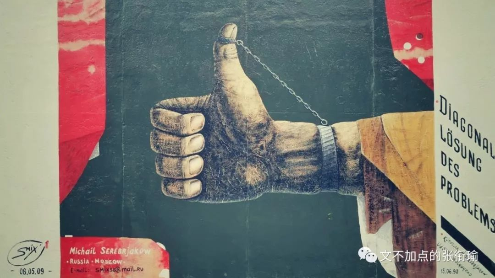
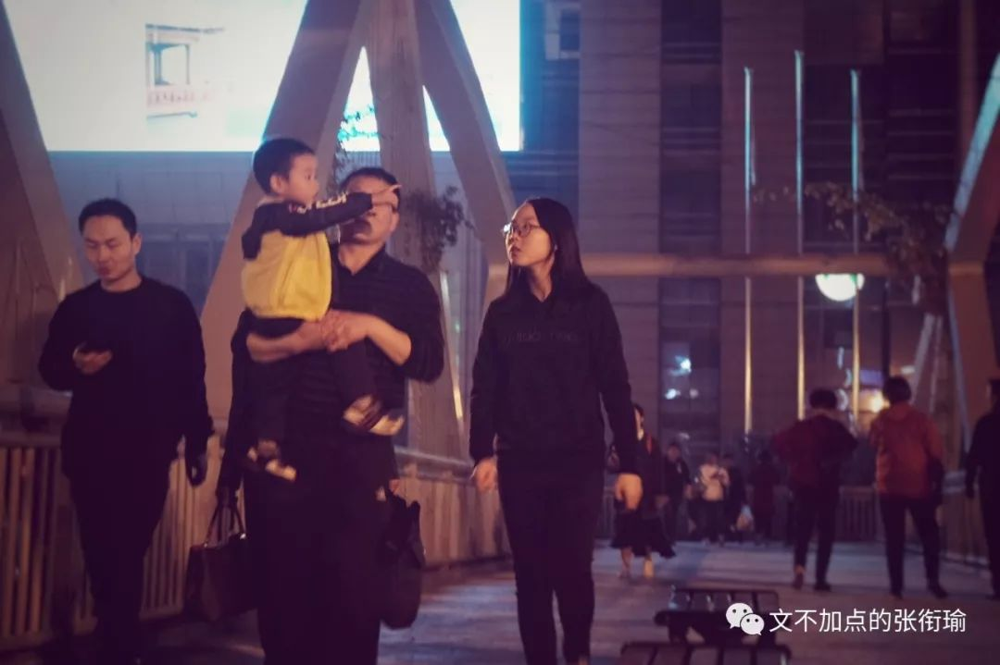
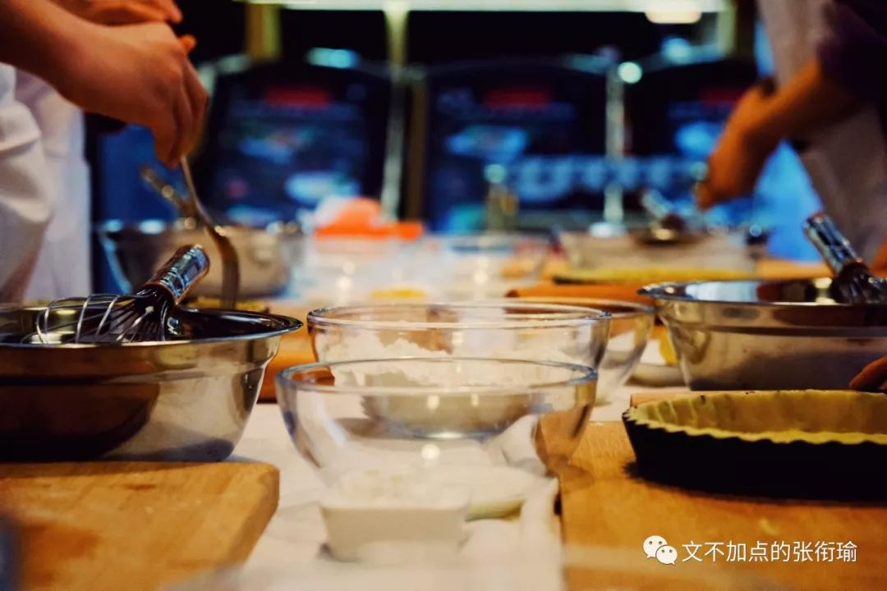
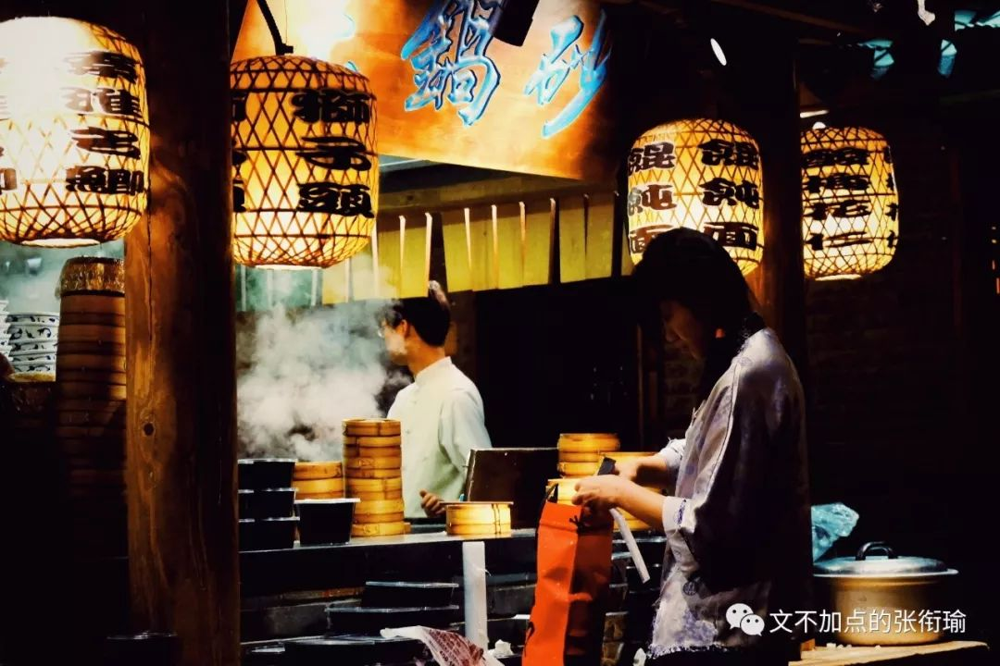
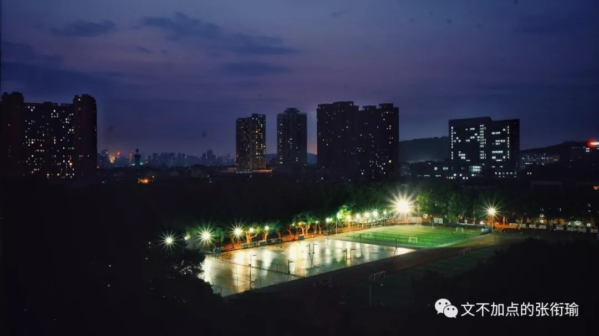
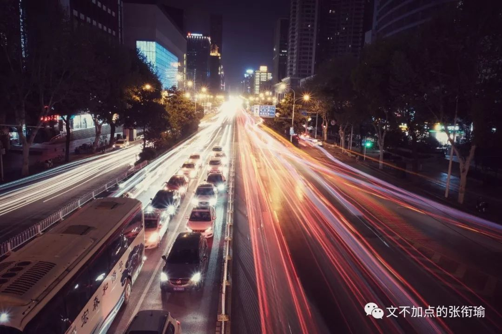

> 张衔瑜的第 86 篇 共计2065个字 一点随缘尬想

张衔瑜的第 86 篇

共计2065个字

一点随缘尬想

如果不是上一篇游记 如果不是最近在写论文 如果不是今晚正好例会取消了  很多天之前 就应该把这一篇记录下来 但这并不是一个多么高明的开场白

不知道写什么的时候 就去翻一翻备忘录 这一段也不知道是从哪个公众号或者什么地方抄过来的了 打上引用

> 民国时期，清华校长梅贻琦曾说： “大学者，非大楼之谓也，大师之谓也。 ”但这背后，是清华作为留美预备高校，已借雄厚资金而成为诸多人才晋身之阶，表明自己“目标在更高处”的一则宣言罢了。 没有大楼，又何来大师？ 更何况此时，履历有“清华”二字，早就成为衡量才学、能力的一个重要标准。 这种名校与普通高校的区分，一直持续到今天，也说明了它存在的必然性： 既符合人才需求方节省筛选成本的需要，也是每个人通过努力可以获得的资本和骄傲。

民国时期，清华校长梅贻琦曾说： “大学者，非大楼之谓也，大师之谓也。 ”但这背后，是清华作为留美预备高校，已借雄厚资金而成为诸多人才晋身之阶，表明自己“目标在更高处”的一则宣言罢了。

没有大楼，又何来大师？ 更何况此时，履历有“清华”二字，早就成为衡量才学、能力的一个重要标准。

这种名校与普通高校的区分，一直持续到今天，也说明了它存在的必然性： 既符合人才需求方节省筛选成本的需要，也是每个人通过努力可以获得的资本和骄傲。

> 但身处其中的人，也有可能深陷一种被笼罩的光晕里，对现实的感知变得迟钝。甚至把名校光环与自我认知纠缠在一起，变成最后绊倒自己的锁链。 在食物链顶端待久了，人的视野和选择也会窄化于所谓顶端。 更广阔的世间与生命意义，反而变成遥远而被掏空的概念。

但身处其中的人，也有可能深陷一种被笼罩的光晕里，对现实的感知变得迟钝。甚至把名校光环与自我认知纠缠在一起，变成最后绊倒自己的锁链。

在食物链顶端待久了，人的视野和选择也会窄化于所谓顶端。 更广阔的世间与生命意义，反而变成遥远而被掏空的概念。

虽然细节上我并不苟同所有的说法 比如留美预备高校 以及无处不在的梅贻琦 但这一段好就好在 方向是对的  也就是说 这一段提到的关于久处前沿不安和人力筛选时和平台之间的魔幻关系 我是有类似感受的

上次写深圳随笔 有两个是我关于企业调研时没有说的 一个是对于学历学位的偏执 一个是企业用工时对于性别的歧视 对学历学位的偏执 意思也就是说 把一个人的学位 当成了能力的upper boundary上界  用工时对性别的歧视约莫是从钱钟书在《围城》里就写过的女博士

我现在想来 学历学位并不算什么  尽管大可以和我来撕说一张985出去的本科文凭将值得一些什么 但事实上 正如每一个人的大学都不一样 所谓学历学位 只不过是对这个大学在整个教育中最basic and fundamental基础部分  就像现在的课程一样 只是水了所有的课 然后想拿一个能过的成绩和还可以的分数 是不值得所谓的社会期许也不值得个人期望的

从另一个角度来看 翘课到底是谁的问题  大的道理谁都会说就像有人被暴力侵害了 然鹅也只是去敷衍着讲一些该怎么保护自己的那种百度知道都可以搜出来一大团的tips 这就是选择性地不动脑子 一些人 宁愿自己再花钱去上那些新东方 新航道 星光二外 在上课时间跑去看话剧看电影甚至是就在校园里游来荡去 却不愿意在教室里听课 倒不是说不学习或者不感受 老师也不是不努力不敬业 这里面是存在有问题的

那么 像跳高一样 一张学历学位就是那一支横杆 有些人明明跳起来超过那个杆子很远很远 而这时候 旁人还只是看着杆子有没有掉  既不看这个人到底有跳多高 也不看这一次起跳和下落有没有受伤 更不在意这一次到底是侥幸还是本就如此 那么我以为 这便是当前在企业当中对于学历学位的偏见 由此相适应地 造成了普罗大众对于学历学位的偏执

那么 这样一来 我们所想知道的是 这个人能不能跳过某个高度 （暗指在用工单位完成某一工序） 现在却将他以前某一次跳高的横杠的高度来反推这个人跳高的能力  很显然 是没有完全对这个人予以尊重和全序列考量的 魔幻现实的是 企业如此 但不只有企业如此

上周点评顺丰的一篇文章中这样说道： 尽管兑现了承诺，但姿势不甚美妙。好比跳高运动员成功越过一个高度，脚后跟却在横杆上蹭了一下，给人的感觉是竭尽全力不过如此。

人们自然而然地 会在考虑问题的时候 更趋向于搜寻自己认知地图中以往做过的范例  正如在检索文献的时候 会增强 虹吸效应 地趋向于那些素有定评的文章

我不是说这些有什么不好 从效率和注意力经济性上而言 这些的确是最省时省事的 但坏就坏在 这是一种源自于程序的暴戾 从情感倾向上而言 和在马路上开车 只要是对方强行变道而自己无责的情况下 就一脚油门下去霸气撞翻 这二者是情感趋同的

当我在向深圳若干企业的人资代表了解最新的招工政策时 他们和我说的时候 我的感受正同如上这些  无论是深圳对于硕博群体的引入 还是企业本身的配套完善 都是如此  不过 硕士博士 有什么了不起吗  我以为 学位并没什么了不起的 就和驾照 行医执照 个体户经营执照一样  只是个证明 真正了不起的是人而不是学位 但现状 不是我想的这样

对于另一点 在关于性别歧视之上  显然这一点放到最大限度地 我也只能从道理上去同理心换位感受 却并不能说很好地找到点并且说出一些有insightful而又有建设性的话来 情感同理而言 同其他所有的傲慢与偏见 只不过这一个 方式 或者说体现的载体不一样 本质不变  本质仍旧是人类的parochial偏狭与促狭

将跳高的横杆太当一回事了 无论是跳高人还是裁判 从人本的角度来看 是都失去了对这一项运动本身的尊重和热爱  变成了一种工具 变成了一件杀人了利器 而不是救赎的拐杖

昨天我去参加了隔壁大学的一个本科生交流会 实际上 也无出此中的窠臼

我不知道我能产生上述的这些想法 到底是我所有的经历过程中的哪一点或者某几段时间所产生的 但至少是 对平凡生活的若干不死激情 重新出来作妖  也许我以后的上司老板同事同行 徒子徒孙也都是这样子 只有我一个人显得有些异样 不知道是好还是坏

毕竟在暴戾的标准化里 外化的情况之一便是在前人的方向之后亦步亦趋 导师甩给自己一个课题 其实验方法与实验流程在老师的脑海里已经基本构建完全  这时候 执行人发挥自己的一点聪明才智 在细节上更落实 在小步骤上稍微优化一下  把这些也叫做创新的话 一些企业里挂满了墙壁的专利功勋页面 也就不难理解究竟是怎么生产的了

现在回去看一下文章封面的那张图 也就是本文的第一张图 也许会感觉有些不一样吧

长曝光的图来自于前一段时间的走拍刷街

夏天是真的来了 热是真的很热

渐渐地又要到了没有大事不出门的时候

文末致谢设备支持杨哲

