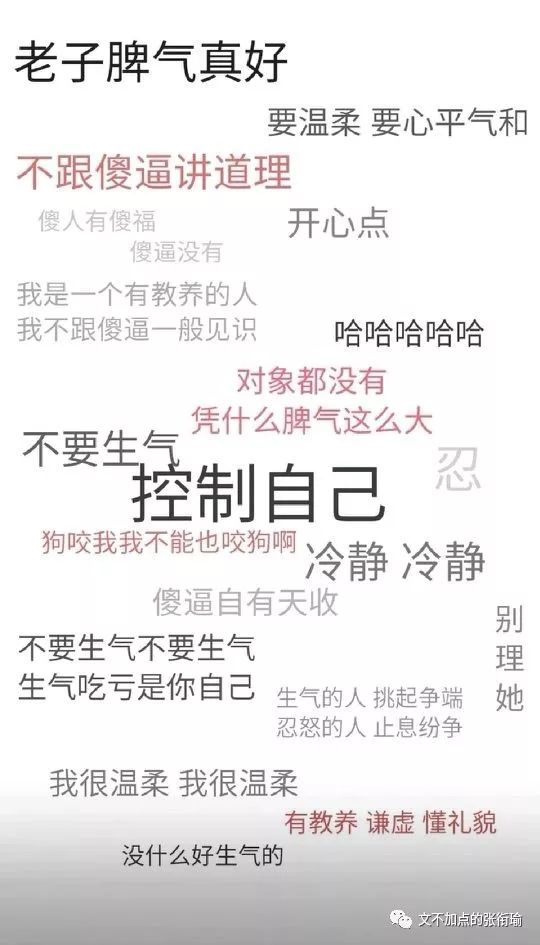
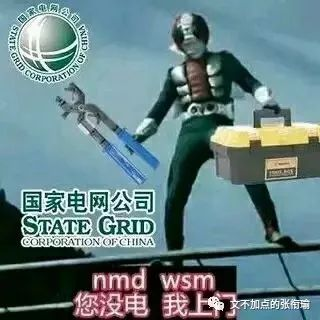
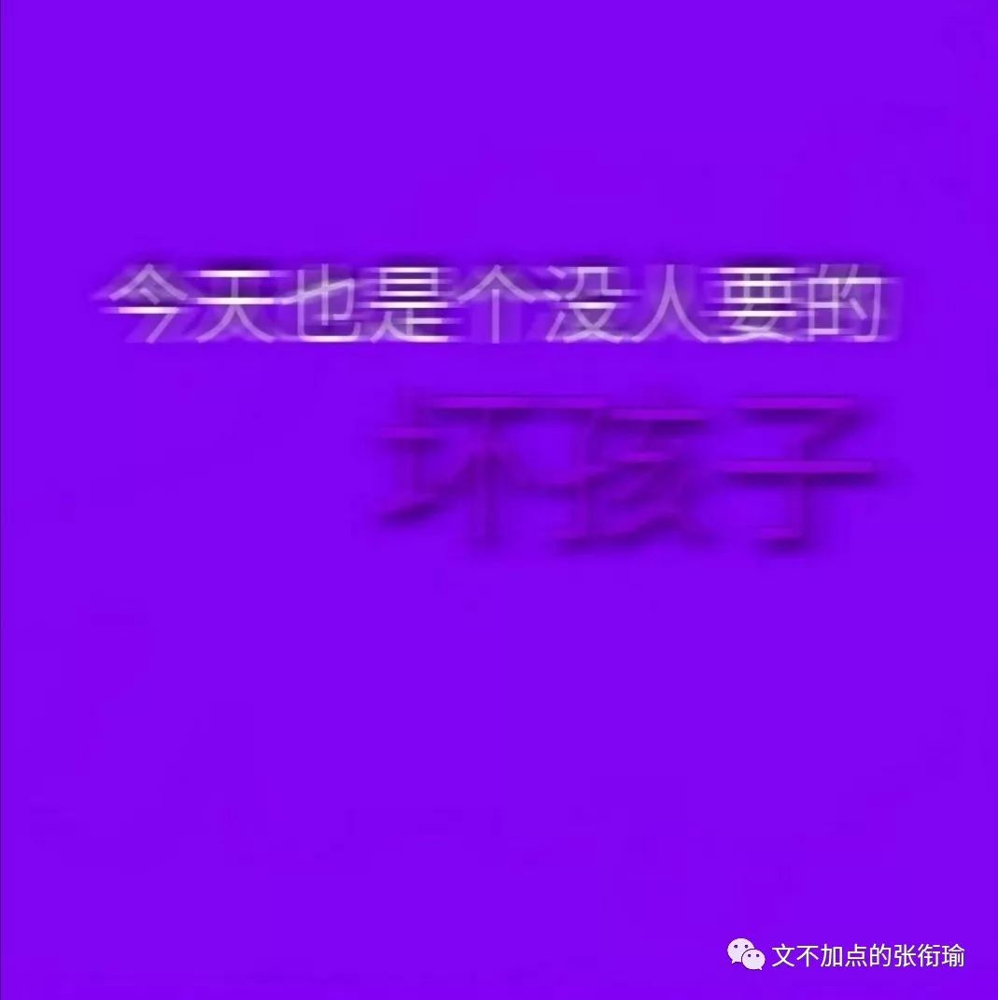
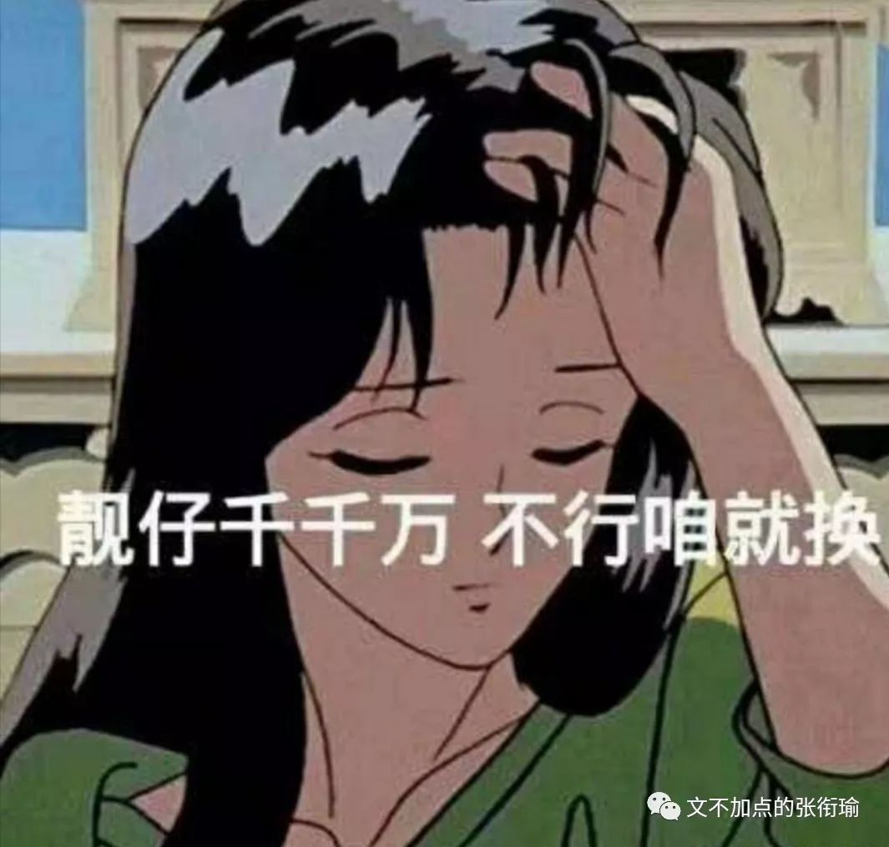
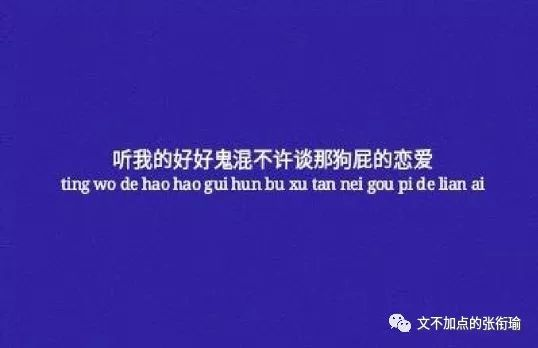
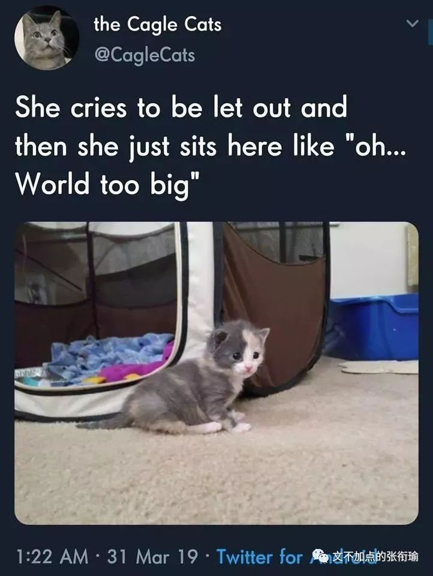
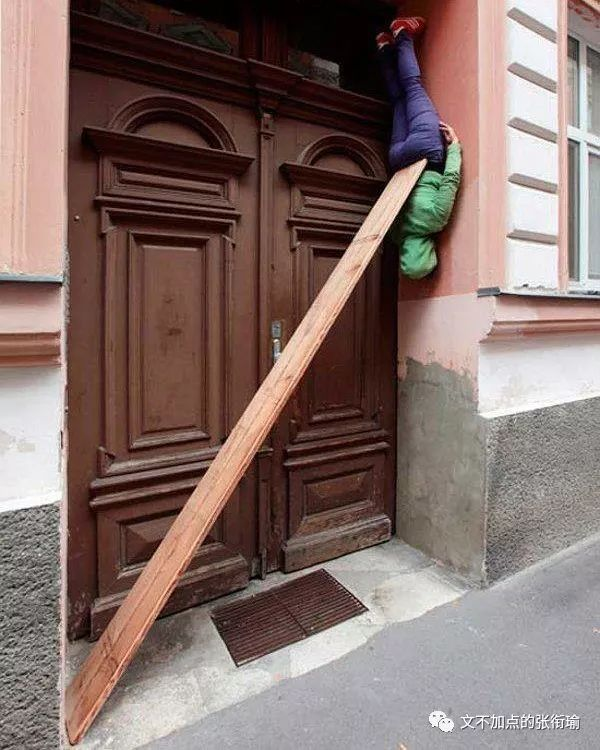
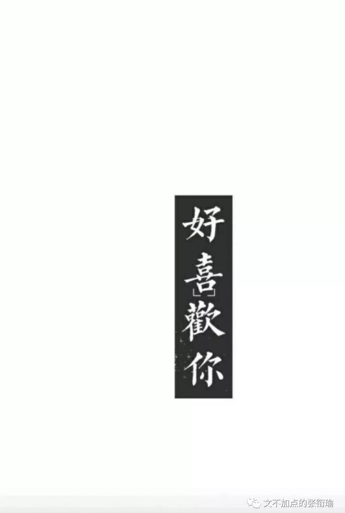
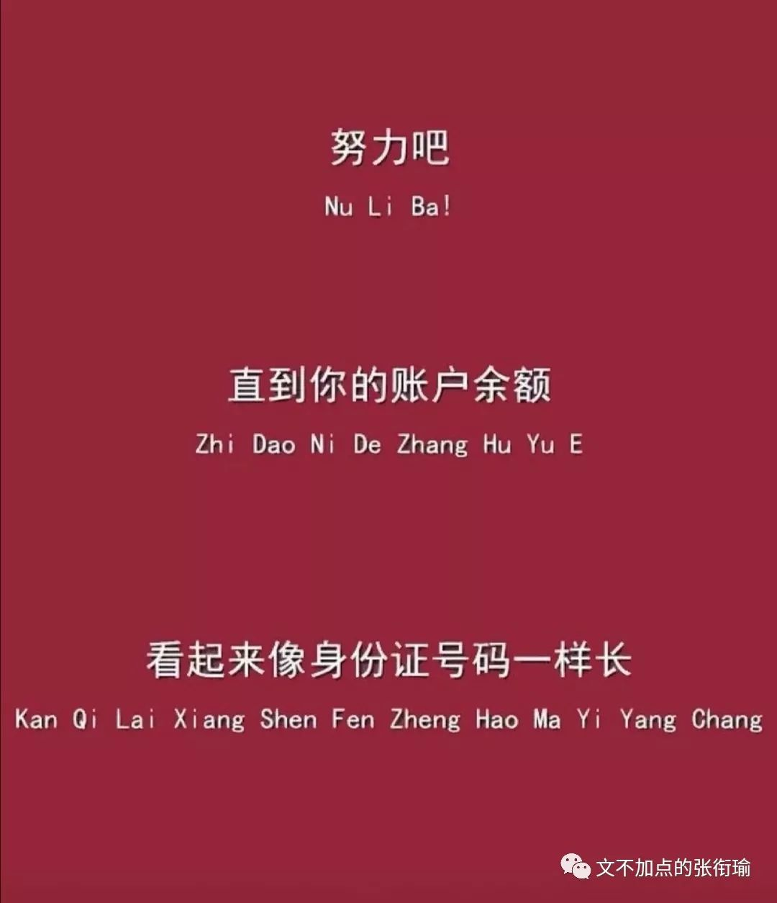

> 张衔瑜的第 87 篇推文 共计 2464 个字 因为不出门所以只有沙雕图

张衔瑜的第 87 篇推文

共计 2464 个字

因为不出门所以只有沙雕图

别人996 而我007

首先我没怎么熬夜

这三件事我一件也没有真的做到了

再拿这个一个劲地说不停真的很烦

没有逻辑的时候什么都可以归给熬夜

你瘦了 熬夜熬的过劳瘦

你胖了 熬夜熬的过劳肥

你最近抑郁 熬夜熬的内分泌紊乱

你最近开心 熬夜熬的精神错乱

来品品 这是人说的话吗？？？

这就像一些无聊的网络喷子家长 把孩子所有的罪责都归结给网络游戏 其实并不需要什么网游 更并不需要实实在在地了解和考察网游背后的运营规则以及生发机制 这些人只需要一个靶子 一个土偶木梗 以此来掩盖社会的失职 学校的缺位 和原生的怠惰

加缪在《局外人》里面写道： “我听着，我听见人们以为我聪明。但我不明白，怎么平常人身上的一些优点，到了罪犯身上，就变成了无可推卸额罪名。”

本质上来说 这和荣禄怒斥康有为不能变法 十二怒汉里边说贫民窟里多心理扭曲之辈 我们的祖辈说父辈越来越不懂土地和家禽家畜以及那个年代封杀靡靡之音邓丽君  这些事情本质上没什么不同 同样是狼人在午夜出没之后将啃食过的尸体草草掩埋  然后白天醒转继续我行我素

报复性熬夜 指的是白天过得不好或者过得不满足 便想在夜晚找到补偿 和报复性熬夜相当的 是报复性暴食  大概就是指的 在一些时候（不一定是没有吃好） 就报复性地感觉自己可以一口吃下一整个世界 就像上古朱厌一般什么都可以吃下去

天天好吃不胖 天天熬夜身体棒 大概就是这种报复心理的一个说辞  没吃的好 可能是原因之一毕竟睡觉不能挡的话就只能压榨吃

但事实上 可能连就平常普通的average饭量在这个时候也会吃不完  也就是说 报复性暴食还有报复性熬夜 在这样的时候 不过是一种心理 而 并非 真实增强了其存在或是付诸行动的可能 即报复性的行为 不一定是真的 不一定代表可能性没有明显不一样取本意

当然 行动与否又是另一个矛盾的开始 不在话下

认知科学中有一个观点 意思是 生活给予我们的反馈常常违背常理 也就类似于在《圣经·马太福音》第二十五章 “凡有的，还要加给他叫他多余。 没有的，连他所有的也要夺过来。 ” 马太效应是其中之一 但我想说的是 一种回归平均值的conservation保守

随机波动 正如电信自动化中所讲的噪声

表扬和惩罚是什么关系呢 当寻常的人们在保持着寻常的能力水平时 比如去跑步 因为突然跑得好而远超平常水平 这时候得到褒奖 但也许只是那一次跑得比较快 尔后又变差 这和得到褒奖与否并没有什么关联  同时 或许某一个非同寻常的糟糕从而招致了训练教练的怒吼 因此接下来的进步也和惩罚与否没有什么关联

将不可避免的随机波动和因果关系联系起来 这恰恰是日常生活中经常容易出问题的一点

当别人取悦我们的时候 我们也会对对方好  当别人对我们不好的时候 我们也会本能地产生厌恶情绪  可如果从统计学角度来看 我们恰是因为对人的友好而受到惩罚 因为举止无礼而得到嘉奖 这是一个多少有些吊诡的事情

同样地道理也可以用体育当中扣球扣杀来说  不可避免地 一批人就是会有蜜汁自信 说今天打球的手感可能是一段时间以来最好的一次 或者今天根本一个球也扣不下去我真是菜死了 但从统计来看 这一系列的不管手感好坏与否 conservative保守地都还是在围绕平均值在随机波动  与观测者所在的角度 或者当事人所在的角度 并不以这些因素而转移多少 但 人类认知的本质就是一个无解的命题 跨过高山 路过湖泊 下一次只不过是一个新的包装本质趋同

从认知上来说 这就是一点 对随机事件做出的因果解释必然是错的

傲慢与偏见地产生 其实是无处不在的  比如埃航出事之后 一些人由是认为by air飞机出行不再安全却不知道自己所在地区是否乘汽车出行安全系数有多高

另外就是之前我在票圈cue过的 第一次在武汉开共享汽车去硚口 在利济北路那边有人变道占用刮到我车上来了  之后交警明确地开了事故责任鉴定书 是对方的全责 结果直到前几天还有人跟我说要我少开车出门一点也很关心的样子

顺便说一句 这可以是一个典型的GREargument

每天最大的乐趣就是把话剧档期都看一遍，从今天到三个月后、从武汉到伦敦，一条条看。虽然一张票也买不起、买得起也没时间去看，但就只是看看档期也感觉好像看完了、画饼充饥好了的样子。接着继续社畜。

这是昨晚写在notepad备忘里的  好多话剧展览音乐会都想去看 以及一些听说了好久的在美院旁边涂鸦街景  老街巷里面猝不及防一大堆历史扑面而来 挫骨扬灰的烟囱改变了我和落日之间空气的疏密程度从而显得层层叠叠断断续续地斜织着

没有强烈地期待，自然也没有过分的失落。

小时候哭闹喜乐都不打折，十九岁了却已经很难起波澜。或者说，难过很容易，会痛哭，会流泪，心里会有抽痛。但快乐呢，无数个瞬间，我告诉你好开心啊，内心却一丝波澜不起，好像这件事本来就该是这样的，也就没有了一定要开心的意义。我平静地看着灯火阑珊，看着山河滚滚，可直到看见路人撑起了伞，伞向西南倾斜，我才知道…起风了 。

久而久之去看备忘录里面的词句 都忘了到底是我自己写的还是从哪里摘下来的  要不就是摘了又写了 写了又摘了  或者仿写几个句子句型 套进我自己的想法

你知道深夜哭醒是什么感受吗

其实刚刚醒来的时候并没有哭 只是觉得心里所有地方都是伤痛 每一点都揪心  然后不知道怎么的 眨了眨眼睛 就像平常睡醒一样  感觉到睫毛触到了一些有些热的东西当我觉得奇怪的时候 才发现两行清泪顺着眼角留下来  我是仰卧着睡觉的 泪水划过的痕迹在脸上每一个细节都清晰流到耳朵上方平常戴眼镜的那里

侧过头来怎么也睡不着 我以为我不会再哭了 插上耳机的前三个音节过去  泪滴越过鼻梁沾到枕上 我想用手捂住自己的脸 可捂住了有些歇斯底里的面部 但枕头沾湿的一块 却不会骗人  所有的回忆向我涌来 但只能看到所有的画面 却连一帧什么也抓不住

或许就只能是这样子了

这已经不是爱不爱的问题，而是一种较量，不是我和她的较量，而是我和所有一切的较量。我曾经一事无成这并不重要，但是这一次我认了输，我低头耷脑地顺从了， 我就将永远对生活妥协下去，做个你们眼中的正常人，从生活中攫取一点简单易得的东西，在阴影下苟且作乐， 这些对我毫无意义，我宁愿什么也不要。

报复性熬夜 报复性暴食 报复性随笔  btw随笔是因为实在被最近的论文给cue惨了

报复行为可能只停留在想的阶段 比如熬夜还没开始 就已经睡着了  饭还没开始吃 就已经饱了  电话还没拨 已经口渴  这是比纯粹报复行为的话 更难过的时候  因为还没开始报复 就已经报复不动了

累了 困了 饱了 渴了 伤了 太难了

总而言之 抱负不能通过报复 而应该通过 暴富

