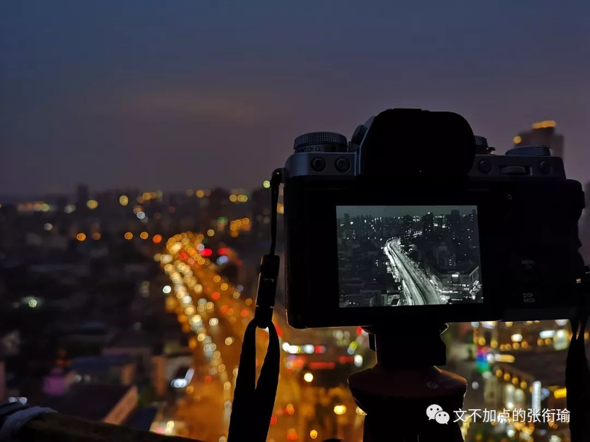

> 张衔瑜的第 88 篇文 共计 2668 个字

张衔瑜的第 88 篇文

共计 2668 个字

刚刚把手上要写的论文写完 虽然说还要反复来去几个回合 但至少说 我已经完成了 接下来至少不是自己顶着所有的压力

在这种死法太久了之后 也可以换一种死法了 比如压力可以有老师和一起写文的人顶一部分然后我也把积压了这么久的作业写一写 甚至还可以去找一下这一家武汉最好吃 糖醋排骨

一般来说 工作和生活是要成配比的 就比如一段时间之内 9 个当量的工作要配 1 个当量的工作 那么 18 个当量的工作也至少要配 3 个当量的工作  不要惊讶于这种 茶叶蛋两块钱一个，五块钱两个 的这种奇怪操作  毕竟 成比例的关系太过于general 还有各种指数关系 对数关系 以及泰勒展开之后所逼近的各种迷幻函数  但总而言之 这两者是要成配比的

于是最近我也没有怎么出门 昨天出门了一下 但那也就只是去了一个离学校两站地铁以外的地方 拔草了一个自己好久没有去但一直想去的点

最近出去玩想法也没有那么强烈了 是因为 写论文比写代码还伤人 现在已经是一个脾气巨好的人 不算发生什么惊险意外错愕 就算不能理解 也可以接受了

我所指的出去玩 比如 和人一起约一场话剧 那么就会一直有个情绪在那里酝酿  从买到票 或者说下单话剧的那个时候开始起 可能是因为一起看的人 也可能是这场话剧本身 或者二者都有 但从那时候开始起 这场话剧所带来的就开始了

尔后 前一天晚上借此搭一下衣服 当天早上洗脸了之后顺便刮一下胡子 平常来不及稍微调整一下自己Outlook的时候就纯靠这些来driven驱动一下 然后约好一起出门或者就自己出门

看过一路上地铁里的其他人 侧写一下故事  换乘 到地铁站 过了闸机

如果是中南剧院 可能去吃一下那个f和h不分的福建人开的沙县小吃 也可能到对面去吃给武汉基建部门提供了建材所以才能开得这么红火的钢管厂小郡肝  下次我也许会在三阳路下了去试一下那家风评的江汉区第一日料 但现在还是没有过  然后 取票 进场 打卡 收拾好心情开始看话剧

话剧只有那么一小会儿 但是看完话剧之后 一般地我觉得 荒诞剧可以更多地让人放飞所有想法 就像一只忍义手 什么样的忍具都可以往里面加  尽管只有三个槽位 但人在同一时刻 被太多情绪交织了也是会过载的吧

出门 吐出剧场里的污浊 呼吸新鲜空气 早的话再在附近走走停停  倒不用看地图 虽然不能确切地一下子就说出自己在哪一街哪一门 可像侧写师一样地灵觉是不会骗自己的 我知道我要往哪里走

同看话剧一样地 看看书 爬爬楼 扫扫街 也有类似地开心  昨晚上楼之前 在校内 天气不好 但也在随手抓一些点  你看这个人 他被梧桐掏空了身体 于是用手捂住嘴不让悲伤流出来

这个也是

还有人妄图用极速来对抗

她值得所有的鼓励和祝福

今天也不想出门拍 依然是在写论文不过是作业论文

用吃饭做对比的话 每个人只要在生活 就是会饿的 这是正常的生理需求  但每一餐想吃的量可能是不一样的 今天和明天要吃的可能不一样  哪一餐菜很好吃 吃很多也是有可能的  吃饭 和写论文也很像 （别跟我说爱情 什么都像爱情）

有人说不能随便给别人打比方 因为如果是本来就什么也不懂还平常就很没逻辑的话 打比方只会让人更加不懂  我觉得可 但还是这么做了 就像在西十二前面进行球面亚洲蹲的这个老哥一样

同比搭配地 我今天去图书馆借了几本书 当然也没打算都读完

其中一本是我翻动了的

每次去借书 我都会在还书区又拿走几本书  一来这边是别人刚刚借过的 趁得还没有上架 我拿走了 同样地借了两次但是只消耗一次的人力资本  另外 说不定还书的人是我哪个同校的网友 也许下次还可以说说读后感blah

今天这本是 《反鲍德里亚——一个后现代学术神话的祛序》 作者是南京大学马院院长 张一兵

当然 这两个人我都不熟  摘抄几个

> 巫术几乎融入了原始部落生活的每个细节之中，无论是从原始技艺、艺术，还是从神秘宗教仪式里，都能看见巫术座架生活情境的力量。“巫术的目的是魔法”，围绕着某种超凡力量，原始部落的人们组织起各种各样的仪式，以之塑形和建构全部人的物性存在。与宗教趋向抽象不同，巫术更渗入感性具象。 巫术的本质是寻求一种“确定各种人、事和观念的用法与特殊的、一般的或普遍的力量”。 巫术追求通过一种活生生的、不成形的象征关系总体，来实现对理解生活和塑形存在的情境统摄。 因而在原始部落生活中，举凡“自然”、“力量”一类的东西，都是赋予人、物和种种生活现象以真实意义的 象征总体 ，它们使物的持存成为存在。

巫术几乎融入了原始部落生活的每个细节之中，无论是从原始技艺、艺术，还是从神秘宗教仪式里，都能看见巫术座架生活情境的力量。“巫术的目的是魔法”，围绕着某种超凡力量，原始部落的人们组织起各种各样的仪式，以之塑形和建构全部人的物性存在。与宗教趋向抽象不同，巫术更渗入感性具象。

巫术的本质是寻求一种“确定各种人、事和观念的用法与特殊的、一般的或普遍的力量”。

巫术追求通过一种活生生的、不成形的象征关系总体，来实现对理解生活和塑形存在的情境统摄。

因而在原始部落生活中，举凡“自然”、“力量”一类的东西，都是赋予人、物和种种生活现象以真实意义的 象征总体 ，它们使物的持存成为存在。

也不说这本书就在说什么和巫术有关的 只是我还没有看多少的时候 摘抄了这几个罢了  这一章的标题是 鲍德里亚曾经是一个马克思主义者吗？

看这些书 和我平常晚上 听其他人做告解 的时候 心情差不多  按照我现在的这个样子 也许可以去做个不守基督教清规戒律的神父

最近也听了很多 不只是一个人也不止一件事  也许好在我会保守秘密 然后也很难被别人的情绪带跑 偶尔还可以提供一点点小的有建设性的意见 什么都经历过也见得多了 更重要一点事也是患者 同病相怜也许

看书 也和听别人说些有的没的 很像  需要说的是完全同理心和感同身受 并不存在

书中看到观点说 现代意识形态的母体是什么 马克思意义上意识形态 筑模于经济性的生产、交换和政治、法权社会关系体系之中 而鲍德里亚则将艺术品的拍卖作比 提出象征域的贵族依存关系 把意识形态放进符号政治经济学当中  这样一来 新的等级恰恰是建立在对传统经济价值的破坏之上，差异性符号的生产正式这种意识形态真正的秘密。今天消费的差异性是被工业化生产出来的，他们被机械地关注到一些共同的模型之中。它们不再源于个人化的相互挑战和交换。只有通过大众媒介的拟像simulacre,这种竞争才能再现。

看完上面摘的这些 我会有什么变化呢  虽然不是完全地不止所云但至少 我相信很多人都是 没什么太特别的感受 也没什么很强烈的冲动 别人做告解的时候我大多也会是这样

还是一个一个字地看下去 逻辑性地梳理一下 觉得ta的生活在这个横断面里是通透的 那么就是可以的  我就算不能理解 但如果是来做告解的这个人的话 是可以接受的 仅此而已

我从不对和我做告解的人做什么judge 比如这件事你可以做 那个不行  因为 别人的生活 没有任何去干涉的理由 在法律的边缘游走 只要不是risk 10 people’slives for him or her -self 我都不会说  这也就是说我没事也就是 在听听看看 除了我之外 别人的生活会是什么样子的  大概也就是很适合当个保险柜 然后什么秘密都可以放的原因

说不上来为什么会做这些事 完全也可以说自己睡了 或者要去做点什么别的然后堵住悬河之口 但没有  可能是上古时期遗留下来的 也许会成为一个刻画人类生活的作家 但现在看来机会渺茫 所以就遗留了一些和现在general生活状态不大搭的一些特质一人分饰几角

五一节快到了 日常在票圈或者和同学说起这句诗 遍身罗绮者 不是养蚕人 同样地来写 卑微的劳动人民 又哪里有资格去过劳动节 社畜不是什么时候就会改变的  那么问题在于 如果连现在996的中产阶级都每天叫苦不迭被时间拴在了办公室每天出没于各大娱乐场所的 还能让娱乐项目红红火火日渐上升的地方 又是些什么人在呢

两年前的这个时候还有朋友在一起吐槽的时候说 我们这是赶上了什么时代 为什么不能好好努力就可以了呢 又不是要去做坏事为什么我不可 这里面的逻辑漏洞先不管 但从情感上我是趋同的

现在都很少有人这么说了 因为就像我标题里写的这样

命运这辆公交车

我没有座位

——语出 剥洋葱人物《张海超开胸验肺之后|没有心声，只有更残酷的生活》2018-07-23

——图 出自设备支持杨哲 地点在杨家湾地铁站
