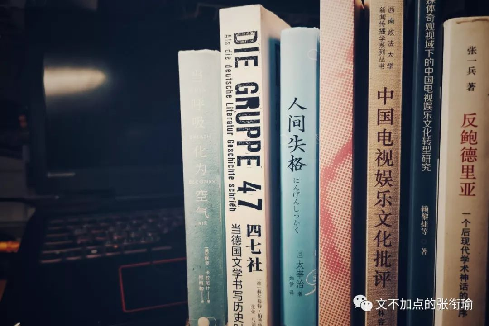
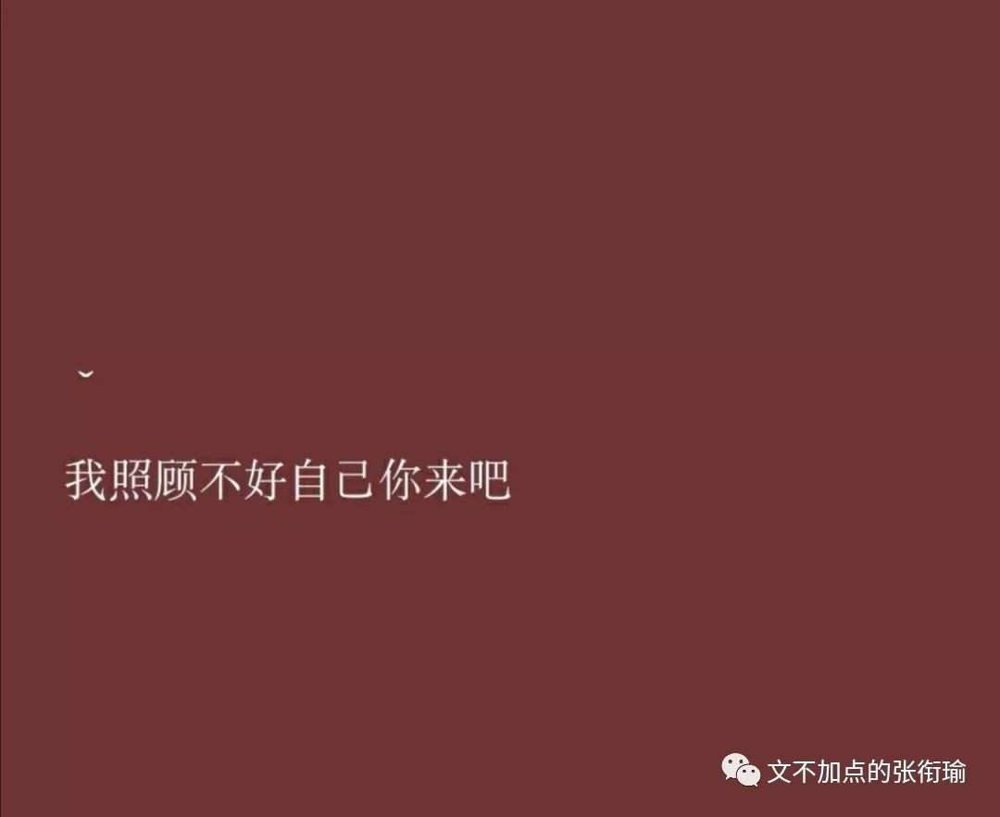
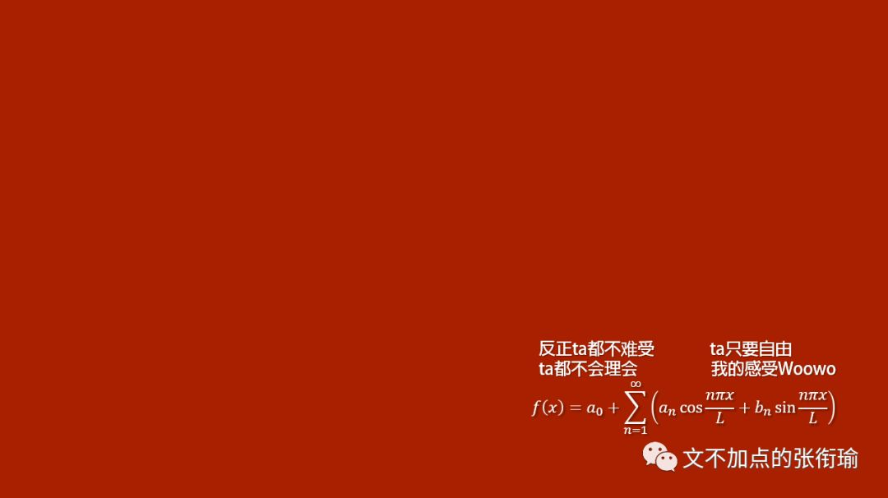
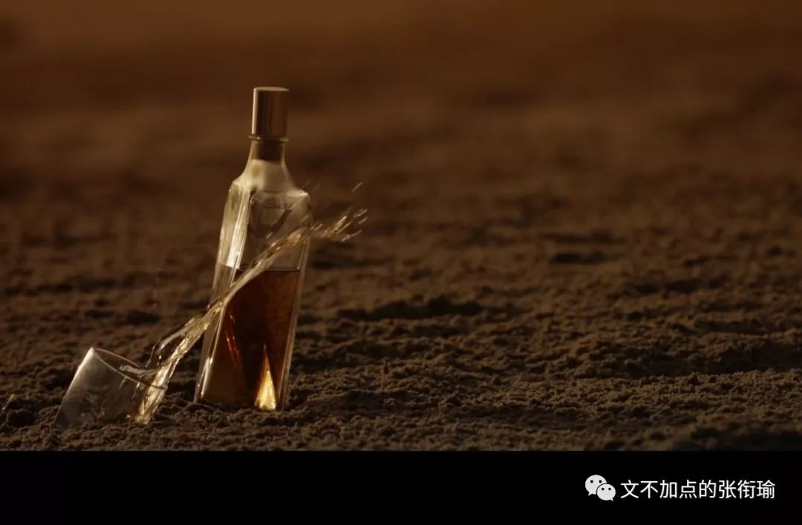
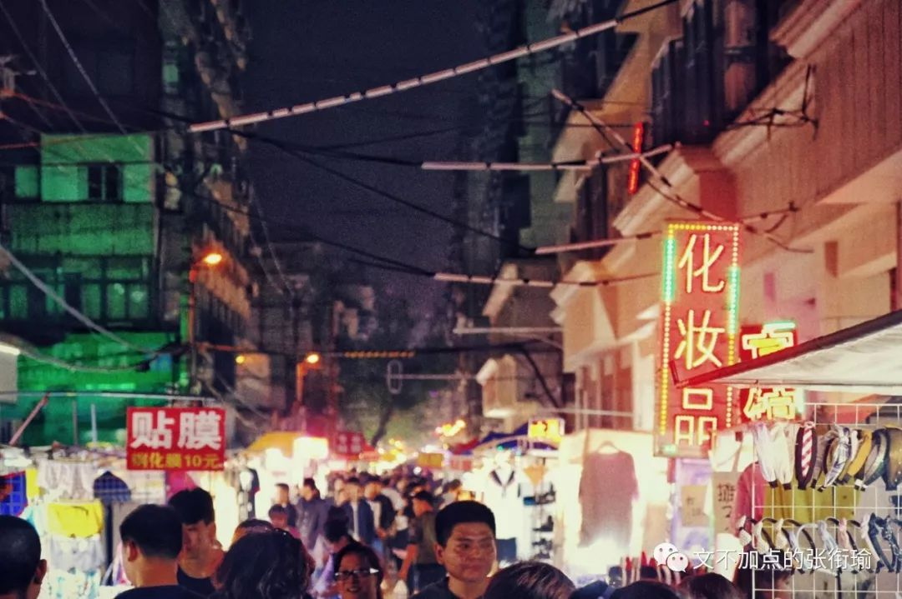

> 张衔瑜的第 90 篇文 (之前有几篇数错了 共计 5103 个字 是有 7 本书写在这里

张衔瑜的第 90 篇文

(之前有几篇数错了

共计 5103 个字

是有 7 本书写在这里

最近带了几个问题一直在想  问题的来源不止一件事但总的来说 都和选择有关 “你一定要把所有事都做绝吗？你一定要把现在的自己物尽其用去搏最好吗？没有搏得最好会不会后悔呢？” 以及如果现在和自己最大化到了一起 那么以后怎么办

总之就是关于选择的很多问题都一直盘旋逡巡 至于叩关 还一直在想着 除了显而易见的焦虑之外什么也没有  焦虑也不是一直都在 自己熟悉自己 自己也拿不准自己

于是开始看书

七本书分别是：

（从右往左按顺序）

> 《反鲍德里亚——一个后现代学术神话的祛序》张一兵著 《媒体奇观视域下的中国电视娱乐文化转型研究》赖黎捷等著 《中国电视娱乐文化批评》李林容著 《名利场——1850年以来的艺术品市场》戈弗雷著，马维达译著 《人间失格》太宰治著，烨伊译著 《四七社——当德国文学书写历史时》赫尔穆特著，张晏、马剑译著 《当呼吸化为空气》卡拉尼什著，何雨珈译著

《反鲍德里亚——一个后现代学术神话的祛序》张一兵著

《媒体奇观视域下的中国电视娱乐文化转型研究》赖黎捷等著

《中国电视娱乐文化批评》李林容著

《名利场——1850年以来的艺术品市场》戈弗雷著，马维达译著

《人间失格》太宰治著，烨伊译著

《四七社——当德国文学书写历史时》赫尔穆特著，张晏、马剑译著

《当呼吸化为空气》卡拉尼什著，何雨珈译著

这七本书里 有两本是我之前已经看过了的 人间失格 和 当呼吸化为空气 想再看一遍  另外前三本分别是在主图楼下看到刚好有人还书还了这几本 顺便淘到手的  也许是谁的专业毕设研究课题也说不定 名利场 这本艺术品市场研究是我最近看了一个纪录片之后 想去找来看一看的  至于 四七社 这本 完全就是因为封面好看 然后瞄了一眼标题所写的内容似乎也不抗拒  以上就是这次拿了七本书回来看的 直接原因

出于对每一本书的尊重 我在此写下了每一本书的名字 作者 还有译著作者 （如果有的话）

鲍德里亚 是一个 用理性的逻辑暴力来讲述真实存在被谋杀 的哲学家  所谓的 符号政治经济学 在拟真 符码 一系列我没有太看明白的哲学概念之后  看了看两本电视娱乐文化的新闻传播研究 才慢慢地觉得稍微明朗了一些

关于此人有一个重要的论断 那就是 反资本主义的 并不需要一定是马克思主义者 所谓非生产性劳动与社会反抗的窒息 在这本书当中 被 张一兵 也就是南京大学马克思主义学院的院长予以逻辑层面的钉锤敲打

如果这三本书是同一个人借了又还 那我大概可以认为 当时借这几本书的人 并不会太在意鲍德里亚的种种理性逻辑暴力  而是基于草根浪漫主义之上的 象征交换逻辑 去尝试对现当代中国的电视娱乐文化传播进行一定程度的解构尝试从物的表意性消解到编码结构的符号价值来处理现在在电视文化当中的若干问题  甚而至于开放一点不仅仅是电视文化 也可能是 融媒体环境下的多样交互发展策略 进而合理性解读现当代媒体生存发展策略

稍微从几本书侧写了一下 实非我的本来意图  至于两本电视文化批评倒是很简单  至少在我刚刚啃完这本诘屈聱牙的哲学书之后再来看传播学 是很容易就看下来了的

因为不是对应专业的学生 所以我不需要对一些小细节的表述以及概念限定去下功夫  我大可以用自己的想法去理解 审美范式 也可以从鲍德里亚那里开始理解娱乐符码和视觉消费进而用张一兵提出的思路再往前较量一番

媒介的出现与其对应的品牌价值 其实在我多少来得有些间接了

不追权游 不追复联 最近的我就像是和世界脱节了  上一次追综艺还是在看上一季的歌手 这一季的也没有看  快乐大本营 虽然芒果台从家里过去坐公交车也就半个小时 但也毕竟很久没有看了  这些时候我来理解电视文化批评 竟也不显得有多么突兀  可能成书之日还在2011、2015  所以以前的书和古旧的我 就还好

艺术品市场 是我很想看的一本书 书里面也给出了大量的艺术品交易价格  一些画家在我之前学TOEFL和在各大博物馆看临时巡展的时候也有看到过 塞尚 透纳 伦勃朗 以及没有哪里能逃脱的 梵高毕加索 倒是也提到了 傅抱石 李可染 黄庭坚 这些新兴的中国艺术品交易市场里的画家 上次应该是李可染的幼子来基科作报告但我实验加身就没有去

从谴责艺术品的天价 到谴责所有的个人奢侈消费 中间只有小小的一步 如果不厘清这个关系 那将会是一种自然而然地 逻辑跳远 但可惜是很有问题的  和许多道德问题一样 金钱与艺术的关系也很复杂  只是 人们往往认为艺术是关于生活的 一件关于生活的事情被金钱提了上来 那么就会变得不生活了吗

我在看这本书里所提到的种种例子时 也在想这些问题  可惜我们的作者巧妙地把自己的观点中立了起来 仅仅从艺术流派与理论的角度来研究 这也是这本书值得的地方

从自由的角度而言 人们可以自由支配自己的合法收入 这本身就是社会自由的一个体现 人们大可以在法律允许的范围内 去做任何自己想做的事  倘若一个人支配自己的财富去进行精神文明消费 这还会受到指摘或者政治管控的话 那么 那些在海上的游艇在山涧的别墅 那些消费额不止艺术品消费的过程当中 这些没有被大肆宣扬的事情又如何解读呢

我不想和一些被形式主义荼毒太久的人说话 很重要的一点是 这些人过于迷信自己的逻辑暴力 用最苛刻的舆论去扼杀其他的一切可能把世俗当成唯一信条 就比如艺术品消费一事 大可以有很多人会说 创下一个艺术品天价不知道可以建多少医院 帮助多少人脱贫  没有错的事情 不一定对  所谓价值观的撕裂也就在于此  现在会批判奢侈消费的人 和那些重金当前就可以一个劲地去舔的 往往是同一批人

艺术品投资 可能是很精明的一件事 《穆斯林的葬礼》 中提到过 两个 瓷瓶分别价值 10 万  投资人听说了这个价格之后化了 20 万把两个瓷瓶买过来  然后 当着卖家的面 砸碎了一个瓷瓶 这时候再问卖家 剩下的这个瓷瓶值多少钱  卖家说 30 万 于是投资人欢天喜地地走出门去 把剩下的瓷瓶卖了 净赚 10 万

你要从道德上审判这个人 那很有办法 我不是刻意要为商人开脱 在不了解别人的童年经历生活全貌的时候就做出评价 是也带有一些偏见暴力的  但没有人会努力到在做出评价的时候都去了解别人的童年经历和生活全貌那就只能靠自己克服就事论事了  可即便是这样 在我接触的不少人里面 能这样和解的人实在是少之又少 我在看这本艺术品市场分析的时候就常常因一些投资举动 （倒不一定是破坏性的） 而觉得魔幻  但也并不因此而生出多么的愤慨  我像个牧师一样 平淡地注视着一切然后揣摩里面的身心社会

终于要说到 人间失格 了  这本书实在是被丧文化炒成了一本网红书但真正能读完的 我不知道别人看到了哪里 叶藏 是一个腐烂到了骨子里的人 但偏生了一种善良的执拗 从而在整个人身上展现了一种 纯美与堕落的交织美学 阅读感受像极了作者 太宰治 所崇拜的 芥川龙之介

> 我这一生，尽是可耻之事。

可以说太宰治借叶藏整个人 毫不避讳地 告解  于是就像狂蟒之灾里 人 被蛇类困住 但并不直接吞食  而是慢慢地 锁紧 缩小 缠绕  死死地困住猎物 然后在猎物的每一次呼吸 每一声求救之后 便再紧一些 再紧一些

叶藏 每一次出门 每认识一个新的人 每一次和别人的关系破裂 就又是一次 被抑郁的巨蟒再度缠紧的时候  这样的人 世俗怎么定义呢  不过是一些八卦的人们在自己的视域里嚼舌根 丝毫不觉得有多少罪恶感  沉默的大多数与民意 请出门去找古美门把你骂一会儿看会不会好一点

> 同样的事日日反复， 只需遵循与昨日相同的惯例。 倘若避免大喜大悲， 彻骨的悲伤便不会到来。 前方路遇挡路之石， 蟾蜍都会绕路而行。

同样的事日日反复，

只需遵循与昨日相同的惯例。

倘若避免大喜大悲，

彻骨的悲伤便不会到来。

前方路遇挡路之石，

蟾蜍都会绕路而行。

> 世人对我根本不存在原谅或宽恕、葬送与不葬送之问题。

世人对我根本不存在原谅或宽恕、葬送与不葬送之问题。

之前看人间失格的时候 还是两年半以前  只是因为那段时间一直在看三岛由纪夫 芥川龙之介 川端康成和大江健三郎 所以顺便看了一点点太宰治 但并没有什么印象  这一次倒是真的看到了一个在和生活巨蟒缠斗 呼救而不得的人 如此而已

至于 四七社 和德国文学 本来是值得很多笔墨的  但可惜的是 四七社这么多人当中 我也就只是熟悉 君特格拉斯 的作品—— 《铁皮鼓》 拿着一面铁皮鼓的 奥斯卡 在政治讽喻的题材里面 不断变换叙述人称地去和法西斯相碰撞湮灭  讲道理 这本书我也没有看得多仔细当然也没有看完所以 感受没有那么多

同样的 将四七社与德国文学的这本书 后来就是一些社员之间的通讯书信 以及会议上对于四七社本身的文学导向的判定  我以为 这个题材在我读起来 也太过于无聊了一些

最后这一本 是我最喜欢也觉得最动人的一本

当呼吸化为空气

这本相当于是非虚构写作的一本回忆录 是三十六岁的作者在肺癌晚期的病榻上写的手稿 然后由自己的爱人所整理出版的 作者本是一个医生 在 斯坦福 读的文学和人体生物学的学士 然后 剑桥 读硕 再到了 耶鲁 的医学院开始进行神经外科博士最后回到 斯坦福 医学院进行博后住院医师培训

看这个人生经历 在中国人眼里几乎就是一张完美履历  如果再加上他被内定的斯坦福教职 简直就是惊为天人  再加上他自己之前弃文从医的经历 可以说就已经是令太多人羡慕的了  这样一个人 在自己作为住院神经外科医生最后的半年里 查得自己罹患了肺癌晚期 以前是自己同死神做搏斗 和病人一起追上去 和死神四目相对  现在却是死神偷偷来拜访自己了

这本书里 没有废话 没有故作忸怩之态的活在当下 更没有虚妄勇气的你能战胜癌症  有的是人类面对死亡时候的脆弱 思考 以及从容 诚恳 正直

我丝毫不吝啬对这本书的溢美之辞 深邃的思考往往出于对死亡的探讨 作者一半的笔墨在自己作为医生的时代 自英文文学转型到医学之中第一次面对出生和第一次面对死亡 如何在面对解剖和新的病人之时变得多少有些漫不经心 又如何在照顾病人的性格、价值观、家庭的时候给出治疗对策和引导走上新生活的办法 打开了一名捐献者的胃，里面还有两片未消化完的吗啡，说明是在痛苦中死去的。也许当时正孤身一身，手忙脚乱地抓着药瓶。 医者与人心是也

书的另一半 在叙述自己 如何在罹患肺癌晚期的时候 和死神赛跑  如何面对纠结 完成自己作为神经外科住院医生的最后半年  如何在自己的女儿出世的时候 感到一种力量  最后 如何抵抗不过自然 而在三十六岁的时候 在病床上平静地故去

> 当研究心电图的波动起伏时，经过冥思苦想后，正确地指出了其中致命的心律不齐的状况。然后忽然明白过来了，并在一瞬间流下眼泪：这张不知从何而来的“练习用”心电图可以看出，这位病人已经不在人世了。纸上这些弯弯曲曲的线条，不只是简单的线条，还是从心颤再到心跳停止的全过程，这写会让看懂的人心痛落泪。

当研究心电图的波动起伏时，经过冥思苦想后，正确地指出了其中致命的心律不齐的状况。然后忽然明白过来了，并在一瞬间流下眼泪：这张不知从何而来的“练习用”心电图可以看出，这位病人已经不在人世了。纸上这些弯弯曲曲的线条，不只是简单的线条，还是从心颤再到心跳停止的全过程，这写会让看懂的人心痛落泪。

并不是说 所有的人都需要在每一个时刻都背负着这样巨大的枷锁往前走去  但之为一个有责任感的医生 书作者的字里行间无不体现出了他作为一名神经外科医生的细腻心思以及和普通人一样 面对普通事情的普通想法

和解 说来轻巧 就像面对生存曲线上快要结束的人依然需要好好对待这一切 一样  面对永恒的死亡问题和在医学上赛跑的事情  如果只是职业 那也就只是一份一周工作时间大于100个小时的工作  但如果是在追求些什么 那就会真的在追求些什么

这本书是我第二次看了 看到最后 作者写给小女儿的话 还是会感受到这种在沉静理性之后 保有到的  因为感情过于澎湃 但又想给予 可因为怕对方承受不住就只稍稍透露一点点  但也就是这一点点光 照亮着整个世界的那种澄澈 透明

> 在往后的生命中，你会有很多时刻，要去回顾自己的过去，罗列出你去过的地方，做过的事，对这个世界的意义。我衷心希冀，遇到这样的时刻，你一定不要忘了，你曾经让一个将死之人的余生充满快乐。在你到来之前的岁月，我对这种换了一无所知。我不奢求这样的快乐永无止境，只觉得平和喜乐，心满意足。此时此刻的当下，这只我生命中最重大的事。

在往后的生命中，你会有很多时刻，要去回顾自己的过去，罗列出你去过的地方，做过的事，对这个世界的意义。我衷心希冀，遇到这样的时刻，你一定不要忘了，你曾经让一个将死之人的余生充满快乐。在你到来之前的岁月，我对这种换了一无所知。我不奢求这样的快乐永无止境，只觉得平和喜乐，心满意足。此时此刻的当下，这只我生命中最重大的事。

这也是我 最推崇这本书 而感觉到力量的原因  诸如伤痕文学 哲理思辨 虐心小说 看的太多太多  这样一来 如此 诚实真挚地给人以力量 而非错愕惊惶的书 也就来得尤为珍贵  自然在此之后 也就只是看到了各样的人物属种林林总总 却并不对此抱有多少恶意 而只是如佛家一般慈悲如牧师一般和解

有人会说 读书有用吗 尤其是像这样的 所谓闲书 真的对人有帮助吗 我在这篇推文的最前面也说了一直彷徨彳亍的几个问题 就一定会有人问书里面 真的有答案吗

我以为 只懂世俗的人 他们只知道每一种商品的价格 却不知道这些商品背后的价值 就像只会营销的书商 知道每一本书的流派标签与归属 章口就莱这本书里所有的金句和观点 却从来没有认真地读完哪一本书的哪一个章节 自然可以借助手段 像卖其他所有商品一样地卖出了书 但究竟书里面的逻辑是怎么架构的 优劣得所 偶尔会想一下 但并不会久留

问书里有没有答案的人 就和指责自杀的人不负责任 一样地 不负责任  坦白说 除了教材教辅和一些工程手册 没有哪本书会真正告诉你应该怎么做 答案是什么 没有

但 在书里会看到 曾经也有一个或者几个 和你一样的人 比你条件好或者更加不堪  这些人曾经陷入了同样的dilemma进退维谷 他们也彷徨 也两难 也不知所措 也难以为继 这至少 会让人不那么难过 共情者知道自己不是一个人 虽然另一个可能只生活在乌托邦 或者已故 或者还没有出生

话剧的台词里这样说道：“ 多年之后，才知道真爱是谁，这是每个傻瓜都能拥有的智慧。多年之后，才想要善待真爱，这是每个恶棍都能学会的道德。 看见那些博士论文了吗？一本一本堆得顶到了天花板，冬天阳光照进来，藏蓝书皮儿上烫金的名字就亮了起来，变成一个个模模糊糊的光晕，让人想起黄昏时墓地里一座座石碑。我人还没入土，可这学术墓地里已经有了我的一隅。这竟然就是我的世界，我竟然就是生活其中几十年的世界！ 这也算是生活！可这就是我的生活！ ”

没有什么太多好感慨的

昨天我看完最后这本 于是出门 去了趟 循礼门

保成路夜市 上 漫天的广告牌倾轧着狭窄的小道  各色的门帘装点着单色的旧时 汉口 之租界建筑  摊边小贩大声地用汉腔招徕生意 白炽灯照过了一批又一批从这里路过的穿靴戴帽的游客

保成路夜市的生活 我在这一端记下

(结尾图感谢设备支持杨哲

像记载以上的游记 记载以下的生活

那么，我，在哪？
