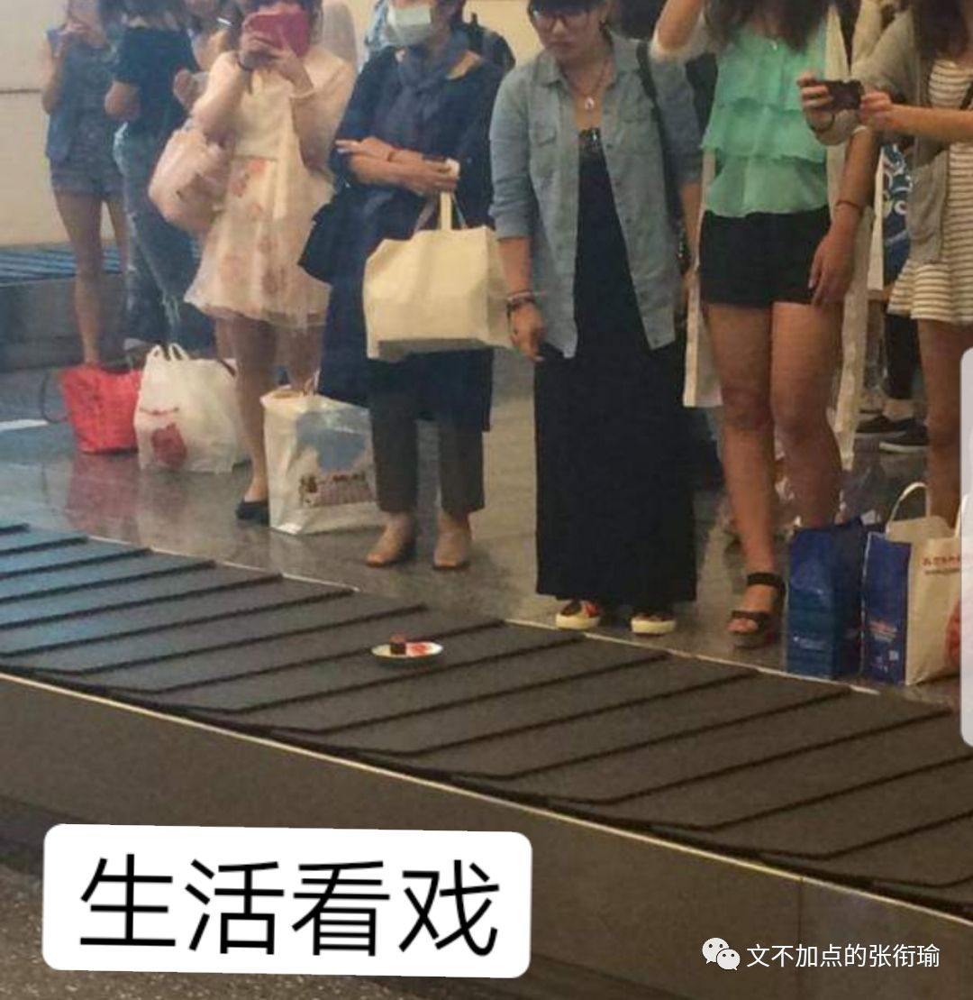
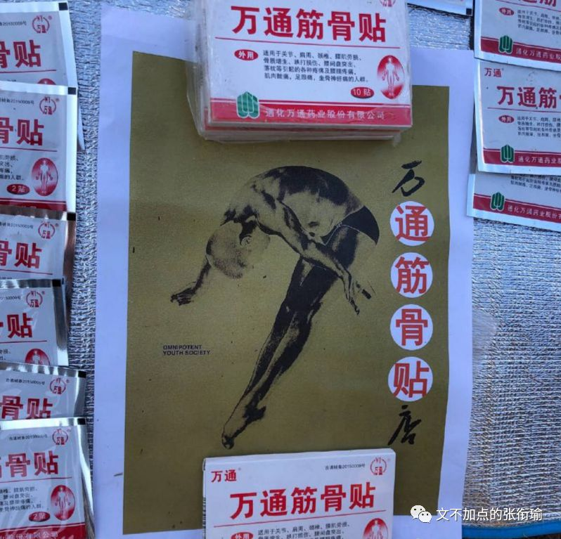
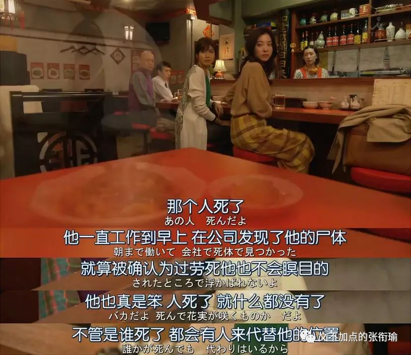
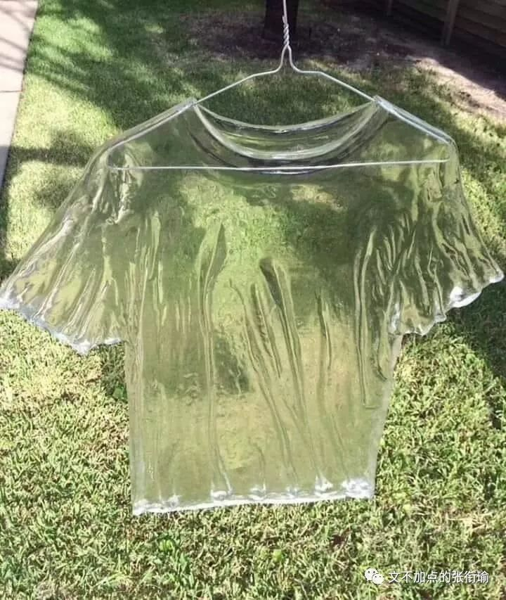
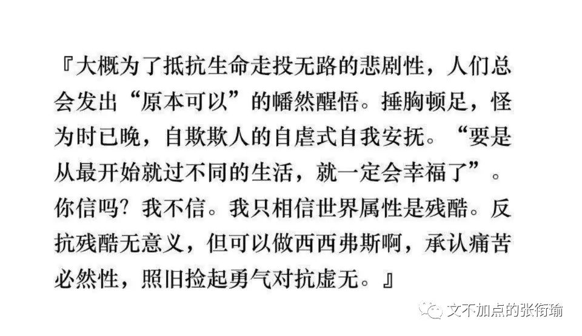

> 张衔瑜的第 91 篇文 共计 1884 个字

张衔瑜的第 91 篇文

共计 1884 个字

当我还在扣着工作的细节 一边努力 一边怠惰的时候 季节却一直在马不停蹄地更替着 就像身边的人一直在往前冲

> 雨又下起来了。这个城市从来没有这么潮湿过，断断续续，阴沉的天就像我的心情，我的心情就像被吞金鱼肚子里的承托一样黑暗而又沉重，黑暗的秤砣就像一下子砸过来的这个无人小公园的晚上。 人家说倒霉的事会一件连着一件的，这话有道理。昨天邻居家的猫无缘无故地失踪了，今天我们电器商店起火了，据说是早上一点多的时候烧起来的，是昨天有人抽烟没有熄掉烟头，或是某个店员插头忘了拔掉，再或者是风把远处的活性吹到了房顶上？我突然一下子就没了工作。转来转去，在这个灰色的城市里转来转去，就这样，我已经瘦了两圈儿了。

雨又下起来了。这个城市从来没有这么潮湿过，断断续续，阴沉的天就像我的心情，我的心情就像被吞金鱼肚子里的承托一样黑暗而又沉重，黑暗的秤砣就像一下子砸过来的这个无人小公园的晚上。

人家说倒霉的事会一件连着一件的，这话有道理。昨天邻居家的猫无缘无故地失踪了，今天我们电器商店起火了，据说是早上一点多的时候烧起来的，是昨天有人抽烟没有熄掉烟头，或是某个店员插头忘了拔掉，再或者是风把远处的活性吹到了房顶上？我突然一下子就没了工作。转来转去，在这个灰色的城市里转来转去，就这样，我已经瘦了两圈儿了。

事实上 并不会像话剧里的这样子  生活中 明确可执行的过劳归宿就只有 过劳肥 这一个  架势满了之后 生活轻踏着 失衡绕袭到你的背后 残忍地痛下杀手 一般地闷棍都是这么打的 我觉得也是如此

生活比话剧更一出一出地行走 当然也完全意料不到预想不到 会发生一些什么  有时候明明近在咫尺的东西 却向前一个弓步 侧手伸得老长也够不着些许  有时候觉得在路上有一个闪闪发光的人经过身边 虽然并不在视线里 但顺着看过去 发现不过是很久以前的伤口重新过来告诉你ta还在隐隐作痛没有忘记

倘若能一桶一桶地吃榛子巧克力 我绝不会源源不断地给自己续上快乐水  在每一个枕戈待旦的拂晓之前 在早鸟们的呼朋引伴和卖弄嗓音中 看新华社的 [新闻早班车](http://mp.weixin.qq.com/s?__biz=MzA4NDI3NjcyNA==&mid=2649450692&idx=1&sn=2bc60cf60b974f7b52c41027ab7e369e&chksm=87f66c5fb081e549c9decb52ba93d089a99ef8577eb4f7bea6dc5b72df440f40c8e1de03efa5&scene=21#wechat_redirect) 如果不是自己买的书一本都看不下去 我绝不会到图书馆去借来一本又一本的 三岛由纪夫

连续加班得太久的一个坏处就是 会忘记记录下来一些本该记录的东西  每一天之所以为每一天 每一餐之所以为每一餐 往往是因为这一天这一餐本身就如同对待一个具体而微的人那样值得尊敬

但我没有好好对待每一天因为就是这么糊里糊涂的过去了 虽然过程并不糊里糊涂 因为确实有拿着电脑在写代码写论文改PPT给别人发邮件 但我看这一天就是糊里糊涂的 像是点了一个不知道什么名字的外卖 吃了一顿不管食物不知道是早餐中餐还是晚餐夜宵的饭 只是因为要完成一个既定动作 把一些蛋白质脂肪碳水化合物吞咽了下去 仅此而已地 对待了这一餐 这个人就是那种你每天可以见到一万次的脸 但总想不起来这人长得什么样子也不知道这人究竟是不是在生活中出现过逞论侧写

> 因为这是只企鹅。你见过企鹅吗？听说它们在南极那种冷地方整天待着没事儿干，飞机飞过划了一道弧线越过它们头顶，这些企鹅盯着飞机看呀看呀，成片成片地倒在地上，爬起来又看，成片成片地又倒在地上。

因为这是只企鹅。你见过企鹅吗？听说它们在南极那种冷地方整天待着没事儿干，飞机飞过划了一道弧线越过它们头顶，这些企鹅盯着飞机看呀看呀，成片成片地倒在地上，爬起来又看，成片成片地又倒在地上。

就像所有的老师都会对你宣称说我们这一科已经变成了一个多学科融合的交叉学科 我不说全部都是在一个小范围内瞎扯淡炒概念 但事实上是都在炒概念因为自己也不做 就是搬弄别人炒过的饭再来微波炉加热一遍 前两天我在 [合肥实习](http://mp.weixin.qq.com/s?__biz=MzUzNjE3NzA3Mg==&mid=2247484932&idx=1&sn=09110fb7dd381bcd695d65caffa61db2&chksm=fafb76dbcd8cffcdea9d594d4093cb292ad2244c3a0d6a2e64a08a34505881dc261d28b33497&scene=21#wechat_redirect) 时候导师来渣科聊天的时候一桌子做量子化学和理论计算的人讲起当代人对于量子的见解 网红量子料理 淘宝量子衣饰 之类的桌子上充满了欢乐的气氛

就像当代所讲的 量子通讯 打电话给别人 当代的电话早就已经做到了人类无法辨识的即时通讯 也就是说现在给别人打电话 没有谁会质疑说自己的手机在这一时间出现了延迟 我在山的这边大喊一声 然后要计算声音在空气中传播的速度这样 没有谁会觉得当代电话也有这样的延迟 量子通讯的重点在于加密 当有人想从中窃取信息的时候 状态监测的点就会出现坍缩  类似于之前拿了个塑料袋装东西还有透视感 现在是放进了牛皮纸档案袋 还在封口上盖了戳防偷看  但炒概念的朋友不管这些 只要做到自己傻乐就可以了

这其实也是一直以来 普罗大众对于科学的态度 自然科学和人文科学都是 只不过量子还算是建立在一种笔头和计算机里能够计算出来 实验能够予以捕获的阶段  放在国内上个世纪 笑死人不偿命的 气功 再到海底两万里那个年代的 电磁波 以及三十万年前的长恨歌 临邛道士鸿都客，能以精诚致魂魄。为感君王辗转思，遂教方士殷勤觅。 本质上来说 生产力是可以有进步的 但是人性和人心总不会有太大的改变  诚然生产力在影响着生活方式 但并不如同技术变革一般地将所有的人心都变革来去

人们只要一个噱头 完成一种狂欢的躁动  并不需要知道为什么而狂欢 只要有一个能说得过去的说法完成自己内心非理性的躁狂 完成出去这种生理刚需 而已

可调理清楚这些 也挺累的  类似国家的重大急需到现在的科研前沿—学生毕业急需和教师工作急需 这之间不说有马里亚纳海沟但至少也是横亘了一条南岭  偶尔想一想 不过也就是无聊的时候周伯通左右互搏 承担什么科教的重任 不可能是我

还是fleabag 一段我觉得很棒的关于爱情的神父叨叨  其实这个剧很好的一点是 不管带着什么心情 开始看的时候都能很自然地代入到剧情当中去  这一段是在主角父亲和stepmother的老年婚礼上 最末则是最后 离别的车站  see you Sunday? I am joking. youare never ever allowed in my church again

当上帝为你关上了一张门的时候

往往也会顺手再给你带紧一扇窗

比如连续加了这么久的班

紫菘又开始放哀乐搞 唐四狼 的白事

城管说不属于施工噪音和商业噪音管不了

只能投诉派出所的生活噪音纠纷

转一张今早朋友发给我的话

因为昨晚睡得很早所有没有回复

以此作结

