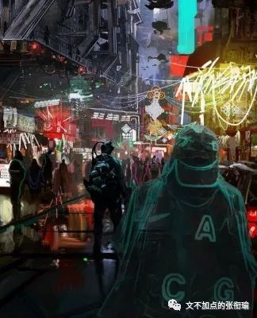
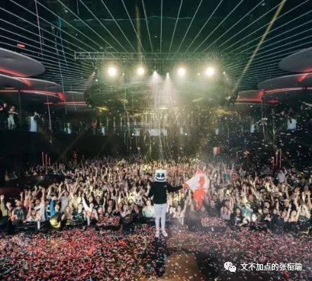

> 张衔瑜的第 92 篇推文 共计 1626 个字

张衔瑜的第 92 篇推文

共计 1626 个字

早上的风带起一整条路上的 梧桐絮 ，一眼望去，跟前全都是棕黄的团絮。像是在一张，在子夜时分，用小相机拍的耿耿星河。已经分不清哪里是星座，哪里是噪点。我也分不明白。

只骑着车一直向前去，朋友说喝醉了酒骑车也是这样，那感觉像是下一秒可以骑到天空上去。

我只有过很困的时候骑车的体验，刚刚才在 紫菘校车站 瞥了一眼校车司机，耷拉一下眼睛就到了五六十米外的 汉口银行 。也许是某种特殊的体质让我可以缩地成寸，但我不这么认为。

走到阳台上，舍友从一个墙角挂毛巾的银色不锈钢栏杆上，牵了一根明黄色的棉线到另一个墙角。线上挂着五颜六色的袜子，有的应该早已没有再和洗干净后的水渍再度亲和，晨露晚霜，不是入夏的模样。

我也想这样懒懒在棉线上挂着，隔着玻璃懒懒的晒太阳、看下雨、有时候还有楼上的男生唱着洗澡的小歌、以及每每对面每每被大作业摧残得凌晨三点还亮着小半个楼层的寝室大灯。

化工 老师上课每每讲一个例子， 自动控制与自动操作、机床开车停车之类的， 都可以找到一个地方化工厂烧毁或者爆炸的例子出来。

警示教育 ，固然什么时候都是重要的。

但人类所有的所谓经验，都不过是为过去的错误安上了一个冠冕堂皇的名头。

前几天和人说： 指责自杀的人“不负责任”的人，是最不负责任的。 不过听这些话能反省的人，自己也能反省出来，不需要别人来说。能一而再再而三说的，也没什么必要再说下去，因为，无感。相比下来， 涂尔干的《自杀论》 更像是一本随笔，首先写给自己看，调整自己的思路，然后才是和人交换思想。至于一看到这个名字，或者提起这本书就觉得作者和提及者如何如何的人，至少是有一定程度共情缺陷的。

最近找到的一个认知维度转变的例子是：

世界上有一个人自杀成功了，

那么世界上是少了一个自杀的人，

还是多了一个自杀的人？

这个我觉得已经足够清晰，我就不假赘述继续写了。可每每和智商或者逻辑令人着急的人说话的时候，总能被一些魔幻的想法惊得瞠目结舌。就像我完全没有想过，重庆人已经疯狂到可以给冰淇淋上面加辣椒一样。

兴许是入夏失败了， 西十二 窗外的风吹进来有种晚来见秋的感觉。忽然想起过 紫菘路口 的时候，不那么刺眼的阳光从 青年园 森林的树冠顶端拨开来跑向 西操 绿色的铁架网。老式的凤凰自行车上，一碗狗粮端在前边的车筐里，蹬着车撒了一路。铃铛叮响的一刹那，像一幅简笔画，像一本小说。

朋友圈的小伙伴已经在咆哮着问自己： 能不能像戒毒戒赌一样，在这一周的票圈里面不谈学习好好鬼混。 但我猜，戒断反应应该也很令人上头吧。只是我没敢说，稍稍腹诽一下。

今天开始是新的一周了呀。但新的一周也不怎么，不过是过了一天，然后再重复六天，便是一周。往后，一个月、一年、三十年。早就想得完完全全了，可是朝不保夕的生活里，是给了人什么样的果断才想出来这样的白给。

最近没有什么好看的剧作到武汉，电影也没有，网剧的话，也没有。在 Rick andMorty S04 第四季出来之前，只能再靠着 Fleabag 续命。当然前几天没看 权游 也没看 复联4 的时候，就像是人在Group Talk小组讨论里面但实际上什么作用也没有起到的样子。

想出去拍照还是一直想，但是也没有很想。昨天想出门的时候，想找几条小弄堂巷子走一走，就和美术生外出写生、歌唱家去康定采风一样。可我一发现自己的想法又开始，严重地锚定了之前去过的哪些地方我就怕了；一突然被各种各样的湍流裹挟起来，我就怕了；所有的光芒涌来在不同的空间上，我就觉得不自在。

历史的、现在的、看不到看不清看不下去的，因为一些众所周知的秘密而不能为人所称道或者所鄙夷的，不过如此。

杀死伊芙 Killing Eve 第二季的风格感觉和第一季不搭调太多，追起来也一点动力也没有。神盾局也是，新的第六季出来之前就告诉大家已经续订第七季了。不过反正 漫威 Marvel 和 ABC Studio 也就是一些我没什么好感的地方，所以也不太奇怪。

出教学楼后，想着可以凭按键的答复去找自己的车在哪里。还没走近就听着所有的车都在用嘶吼的方式和持有者相认。

抖了抖车上的梧桐絮，拍掉一层早上落的灰。事实上我在出寝室的时候特地把雨伞从包里拿了出来。现在已经有大半的路人都撑起了伞就像 米兰昆德拉 写的那样。

回寝之后擦了擦眼镜上的水。

希望擦镜纸快一点到。

Fleabag这一段我看了，有那么几遍。特意从神父进去一直截到神父拉开帘子（大概是这么叫的吧），作结以上。
