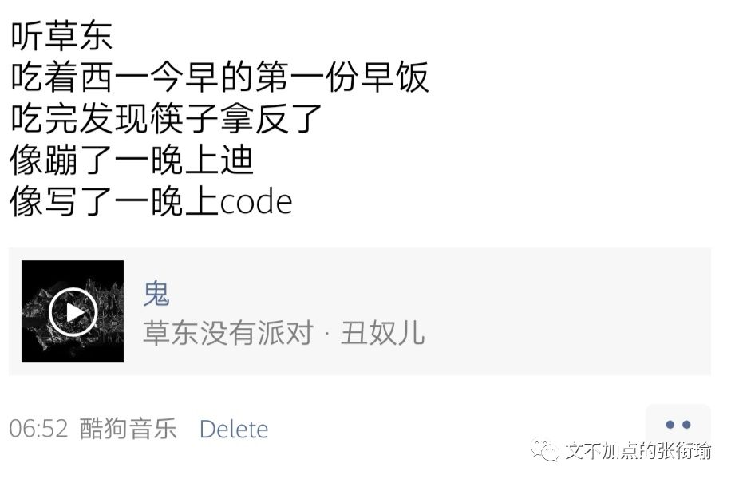
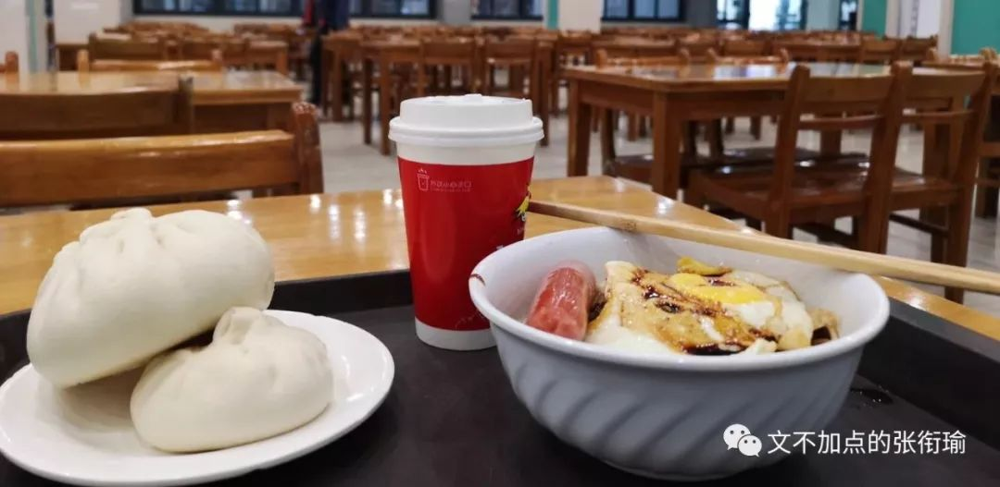
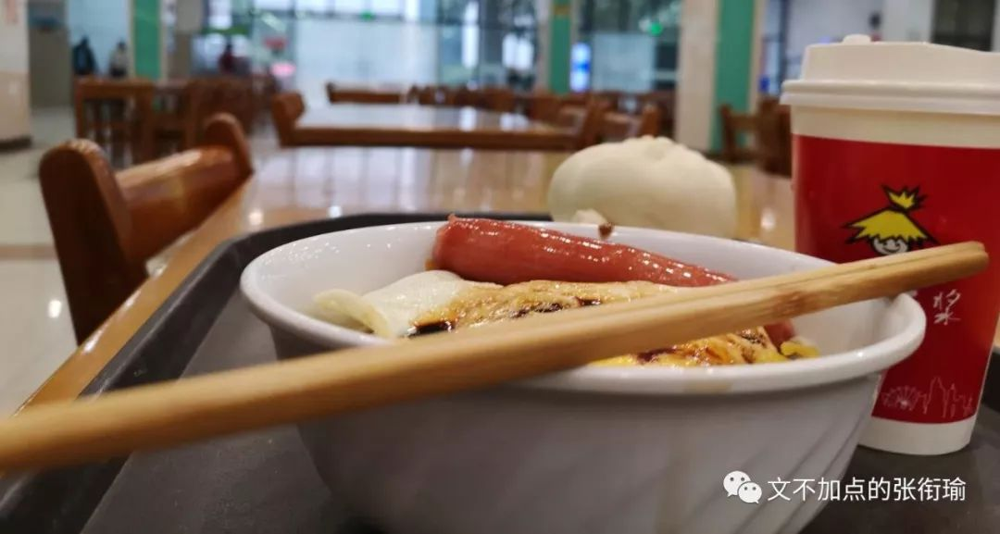
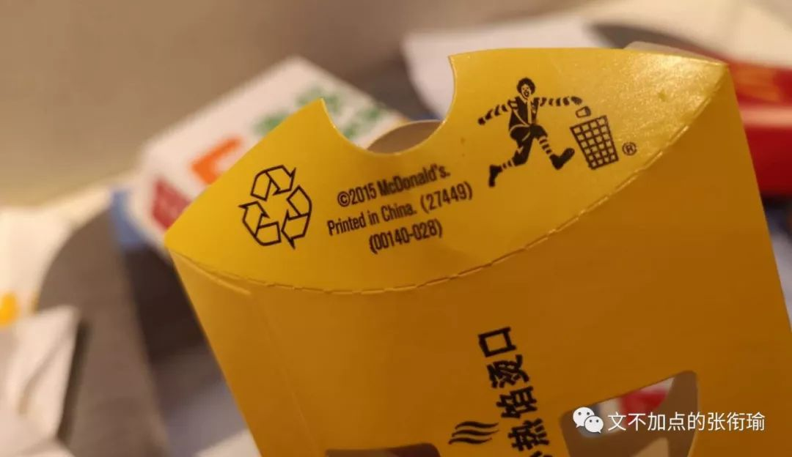

> 张衔瑜的第 93 篇推文 共计 2301 个字

张衔瑜的第 93 篇推文

共计 2301 个字

（以后都按照这个格式取标题好不好哇？

昨晚等代码跑出来的时候，摘抄了一段 简媜 在 《水问》 里写到的在台大的清晨和舍友一道出门去：

> 我想，我没有办法去描写走在雾中的大道上那种不可能以文字言语形容的感觉。有点像梦中，眼前是灰雾弥漫，身后是漫着浓雾。大道上只有雾，只有我和她，只有似远似近的跫音在雾中散来散去。禁不住回转身来望一望所来所往;来处是雾、去处也是雾。 把双眼轻合上，只觉得，如在梦之梦中、幻之幻中;如在天外之天、地外之地。只觉得，来处不知、去处不知、身在何处不知?渐渐睁眼，隐隐约约见前面有一黑色身影，仿佛在近处，又仿佛在远不可及之远处。 我不知前行者是远是近是人?后行者亦不知是真是假是我?

我想，我没有办法去描写走在雾中的大道上那种不可能以文字言语形容的感觉。有点像梦中，眼前是灰雾弥漫，身后是漫着浓雾。大道上只有雾，只有我和她，只有似远似近的跫音在雾中散来散去。禁不住回转身来望一望所来所往;来处是雾、去处也是雾。

把双眼轻合上，只觉得，如在梦之梦中、幻之幻中;如在天外之天、地外之地。只觉得，来处不知、去处不知、身在何处不知?渐渐睁眼，隐隐约约见前面有一黑色身影，仿佛在近处，又仿佛在远不可及之远处。 我不知前行者是远是近是人?后行者亦不知是真是假是我?

> 又行，远远传来一阵阵鸟声，断断续续，但清脆可闻。鸟声忽而在右、忽而在左，又似在前、又似在后。穷目不见鸟影，但闻其声。若非在仙境，又在何处?若非游于太虚，又在何处? 天光渐明，只见阳光自那云层雾幔中挣着要出来，却怎么也破不开雾浓云厚，便只好隔着雾幔，鸟瞰大地，忽显忽隐了。我恍惚之神初定，回首望她，只见她衣上、襟上沾满微露，而她，亦莞尔笑我，眉上、发梢满头雾水。 大道的黄昏，是另一番的陶醉。 像一首适合大声唱的歌，像一大杯加了冰块的冒泡啤酒。

又行，远远传来一阵阵鸟声，断断续续，但清脆可闻。鸟声忽而在右、忽而在左，又似在前、又似在后。穷目不见鸟影，但闻其声。若非在仙境，又在何处?若非游于太虚，又在何处?

天光渐明，只见阳光自那云层雾幔中挣着要出来，却怎么也破不开雾浓云厚，便只好隔着雾幔，鸟瞰大地，忽显忽隐了。我恍惚之神初定，回首望她，只见她衣上、襟上沾满微露，而她，亦莞尔笑我，眉上、发梢满头雾水。

大道的黄昏，是另一番的陶醉。

像一首适合大声唱的歌，像一大杯加了冰块的冒泡啤酒。

可能比较多内心戏的人，说话风格也总会很像。这几天没有用笔写日记，就直接码到了电脑里。就像随缘加点了一样地，其实也就随缘地用键鼠在和自己说说话。 标点还是有些限制了我的发挥，因为有些我想断开的句子，就像话剧舞台上的咏叹，本身并不会刻意地像是要用信息来表情达意。 在那样的语境里，语言可以没有信息而超脱地成为一种情感的代言宣泄。仅仅作为情感载体而存在的词句，想来就是我在公号上写文所一直喜欢的模样。

又比如这一首步步高音乐手机的广告背景音乐，全程就是一个人在哪里 “大冷大冷大冷大冷大冷大” ，其实不管是谁听一听也能够感受到一些东西——尽管，或许并不一样。

就这个破折号我其实打起来就觉得很别扭。因为在我自己的说话里边，这个“尽管”后边所要停出来的blank空余时间要比前一项更多。也许我需要当场说才能完全把语句说成我想要的模样，但总也还是抱有幻想觉得会能够有些不一样。

中文本身所带有的发音和里面所承载的，就像一首诗一首歌。不管哪种语言，其实也都如此。之前看一些 [《卡门》](http://mp.weixin.qq.com/s?__biz=MzUzNjE3NzA3Mg==&mid=2247484127&idx=1&sn=381044b3f1e01b06fc5877133ba30adc&chksm=fafb7200cd8cfb16ea0926af2cee35b51d9839c31123453081d86dd4dfe26e09c0340a8ef501&scene=21#wechat_redirect) 的歌剧现场，尽管我完全不知道这些跳 弗拉明戈 的人在说些什么，但不由自主地，就会哼进曲调里边去。

当，平常因为工作需要专业需要学习需要， 接触到的所有文章看起来都像是对着你进行着一场 有组织有预谋的定向信息轰炸 ，即使没有刻意地去进行降噪，其实也可以好好地把该抓的信息一个不漏并且条析出一个主次树出来。这时候，文字和语言的情感倾向，往往更能成为之为听者所看重的了。自然，做侧写也就是这么区分和组合。

说起歌曲又想起自己的沙雕生活方式： 出门不戴口罩等于没穿衣服，出门不戴耳机等于没穿裤子。 好奇为什么我没有找到一个APP，可以在搜索歌曲的时候同时对多个音乐软件发起搜索。比如我要听的时候，草东没有派对就得去酷狗，想听Burgundy Red就只能去云村，而听万青我又习惯了用虾米。所以如果，可以在一个接口里面，同时对几个音乐软件进行排序之后间次发起搜索，那应该就不需要每次装这么多软件——或者是个API接口的话至少也不用每个软件都打开。

在西一的时候，今早应该我吃到了第一份早饭。 六点三十一 调好了代码出门，我不止早就脸熟每天早上新华社和人民日报在公众号发的早知天下事和新闻早班车，学校早上哪里会开吃的其实我也知道。

早上六点十分左右 ，楼管阿姨打着哈欠起来把大门的物理铁锁打开。新农牛肉面一直很早，早到我从来没见过早上不开门的时候。除此之外，我一般还是按照routine惯例去西一。西一一般在 早上六点三十五的时候 开门，更早地就只能去百景。 百景的油条大概是全校最好吃的了，但我选择在西一喝豆浆。

西一的豆浆有两种，一种是 铁碗 盛着的，在包点旁边；另一种是 纸杯 装着的，在食堂的尽头，水吧那边。

铁碗盛着的一块钱一碗，但是很烫。前一个人把卡贴了之后拿走，师傅就装好一碗新的从后面推过来。虽然水吧那边有点远，而且两块钱一杯，分量也差不多，但好在可以调甜度。铁碗的豆浆有时候会有一种烧糊了的铁锈味道，但水吧的纸杯豆浆不会。

去水吧的人本就不多，可以问问师傅哪里的豆浆不会烫口，然后麻烦师傅打一杯无糖/半糖/正常糖/double双倍糖的给你。虽然私人订制的时候并不一定能很好地分辨出味道，但在一些减肥控糖的人看来，好像减下去的这半糖就已经是从自己的游泳圈上放了足足五斤的空气。

可惜今天去的时候，纸杯豆浆的师傅说： “那个机子十几年了，早该坏了。啊生产厂家都倒闭了，连配件都没法找了。 没有无糖了不好意思。 ” 我不知道这些是不是就是从铁碗豆浆那边，拿个手推车推了半个食堂过来只是装在纸杯里面给我。但最终也没有问。

最近发生的事情、再综合林林总总深夜追着我打的、好多年前的、正常的、不正常的事， 我慢慢地可以理解为什么有人会有瘾癖嗜好 。酗酒、嗜杀、甜瘾，像PTSD一样以此作为一个安全的shelter避风港，来在外界沧桑变化的时候，苟在一个自己以为绝对安全的地方。

酗酒的人以为不管怎么变化，一醉方休的时候那种飘飘然的感觉是自己可以掌控的；嗜杀的人在看到殷红的血液流出时，以为一切都还是自己锚定的那样；只要放上一块放糖到甜瘾人的嘴里，不管什么样的不安什么样的焦躁，想来都可以平复回归。

肥宅快乐水、快乐片、快乐堡，也不是一定要吃，但总归要看到要吃到一点点。感受至少作为肥宅的人看到这些还是很欢乐，味觉也一如既往地和中枢神经系统保持一致。

同样或者类似的经历，是非道义类同理心的来源。

所以西一。

没有无糖的纸杯豆浆了。

