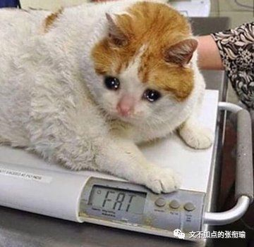

> 张衔瑜的第 95 篇推文 共计 3308 个字

张衔瑜的第 95 篇推文

共计 3308 个字

今早在主图看量子化学的书，在想不通了的时候，就百无聊赖地在书架上翻别的书看。自然地，在化学的这几个架子上，也就是化学的专业书，使得这一本格外地扎眼—— 《比较化学》 。

很久以前在自招中文系的时候，也在想去的学校里边看到过 “比较文学” 的这个名头。不管是怎么样式的比较，运用怎样的方法在哪一个学科当中，即算是没有提出来这个概念，我想手段总是日常在使用着的。

今天提到要砍向的，是 “坎本身” 和 “坎的意义” 。这两个词是我随缘选出来的，只是很抽象地提出了这个概念，但却在我很久以前开始就发现在我接触到的周遭诸事当中如影随形。

两年前写过一篇评论，叫做 《打倒辩论赛，救出辩论队》 。转贴原文选段过来：

诚然，按一般理解，辩论赛是用以引导同学们形成更为严谨的思维方式，训练以后终身受用的答辩技巧，体味自我搜集归整资料的个中况味，这个初衷，已达一定高度。但，之于每一个辩论场，该初衷是否达成了实效，是否催生了不必要的麻烦，恐有待商榷。

（列举分析辩论场上捏造数据的风气，就像高中作文开头“弗兰肯斯坦如是说”）

打倒辩论赛，是因为 当今的辩论赛从来不会达成协议 ——无论一方的论据如何苍白，无论一方的论证如何缺漏，都必得坚定立场继续铁齿铜牙辩下去。久而久之，人将不人，成为只能存活于个人的思路中的踽踽独行者，无论外力如何而始终“自我”。

救出辩论队，是从实际出发——除非有不共戴天之仇，其余的所有辩论都应该是奔着达成协议而去的。而这，就需要人们不仅会辩，还要会聆听，会认同，会自我提升，不是盯住了一个牛角尖死缠烂打揪着不放。

辩论赛办到今天，或只是因循守旧地承袭一届复一届的模式， 其希冀中的素质提升已淹没在了对漏洞的钻营之中 。如若在每次辩论评委点评结束后加一个双方都能放下身段的环节，来依据方才的辩论深入剖析该辩题在实际生活中的意义，或许能帮助我们找回辩论赛的本源精髓。纵然这提议不一定可行，但找到根除这类似活动中的怪相的办法所在却是迫在眉睫的。

可以看到我在两年前的文风，和现在真真是差别很大。提到的辩论赛倒是带有一点今天标题指向的色彩了。我更多的选择说“坎本身”和“坎的意义”，是也许真的有一道坎，有一个指向了去选择和选拔的存在。

上一次谈 [学业焦虑](http://mp.weixin.qq.com/s?__biz=MzUzNjE3NzA3Mg==&mid=2247485192&idx=1&sn=deda11375cca883b2fd81a9947f49286&chksm=fafb77d7cd8cfec1b7e2911d93f147d63e021f777ff4747186eb38631db945b61ce6c89293f5&scene=21#wechat_redirect) 的时候也提到了这一点：

对于当代大学而言 除了排名第一的脱发和排名第二的猝死 学业上也是一万个人在贩卖焦虑吧  这里的营销推手要数新东方 新航道 以及至美前程 星光二外 晨曦英语blah 一类的教育辅导机构  作为考虑留学并且现在动摇还没有定下来的一员 在留学申请当中最大的焦虑贩卖也就在语言成绩

经常有宣传只提到几个信息点 这是谁 来自哪个学校 ta经过我们的语言培训之后到了哪个层次（TOEFL GRE IELTS 或者还有人考的德福和N1这些的） 接着就直接到了申请的学校有的甚至连专业也没有  在这个过程当中 很显然对所有申请留学的人而言 普遍共有的最大的就是语言成绩所以广告营销将这个排在第一位 接着的 虽然要申请的时候必然是在现在的学校已经快结束学业了但其实也还好还可以抢救于是把学校也列入了  就这样 关于英语（或者别的什么语言成绩）在申请当中的极大地位也就凸显了出来

但事实果真如此吗？

对于最大多数的非语言类学生 去到一个新的过度是去学知识的 而不是去学语言的  就换一个思路来说 在对方的国家里 能把语言成绩考好 说好本国语言的人多了去了 更别提还耳濡目染这个国家的文化那凭什么你将要申请的学校就会因为你的语言成绩而高看一等呢  我觉得这个是申请的盲区了 即 语言成绩不应被夸大为申请的因素

申请分三项 英语成绩 GPA也就是平时成绩绩点 然后是科研经历  英语成绩决定能否日常交流到位 平时绩点是说以前的表现怎么样（当然所在的学校也很重要） 最后是科研经历在这个方向内已经做出了哪些成绩来  我要是去审核别人的材料 只会说看到有英语成绩达到基本要求就可以了然后最重要的是科研经历科研思想决定以后可以走多远 如果这里是空白的话就看相不相信对方学校的资质所给出的平时绩点 同时也是个参考  那这么看来 语言成绩就只是一个坎 有了成绩还能看 能过得去就表示可以交流  成绩好只是磨合期短一点顺畅一点 最重要的科研经历和平时成绩大概前六后四地这么区分开

我能看到的 作为硕博群体来说 最重要的是把研究做好 然后是在研究小组内的氛围搞好能和别人合作 然后才是融入这一块社会和群体 但给人的情感体验来说 却恰好是反向的 这三者能给我带来快乐的首先是融入社会圈子 然后是和同学同事合作最后是把研究做出成绩

这个现象在我很早以前就关注到了，彼时我还投放着很多的精力在 学生工作 上边。

一个有趣的群体是：他们往往在进部的笔试和面试当中表现得很出彩，也许说着一些违心的不违心的话，但总之有使出浑身解数来讨好笔试官和面试官。可一旦进了部门之后，就变得不管怎么推都推不动，刺激去做什么事也刺激不到，像个丧失了行动能力的人，最后主动或被动地退部。

如果只有开头或者只有结尾，我都不会这么大的感触。面试笔试表现得好的人，多了去了，大有人在；进部之后因为表现不好或者消极怠工，也多了去了，大有人在。但是前后组合在以前，前后差距很大，并且和其他部员、管理者一点点沟通也没有的，却真实令人咋舌。

不过也没有为此惊讶很大。 因为见得太多了将“坎本身”更重视于“坎的意义”，就会发现一些思维窠臼或者说是怪圈，如影随形在身边。 比起为了解决一个实际问题所撰写的含有思路、经验的论文，我们更重视论文是否被人引用、是否选辑在高水平刊物上；比起申请人入职之后是否能胜任并且乐在本职工作，我们更重视如何走通关系或者想方设法去合上HR的口味；之前说的辩论赛和英语在留学申请中的应用，如此不说是本末倒置那么严重，但总还是囿于成见当中。

毛泽东 《论教育革命》 人民出版社 1967 年 12 月出版，文中也就是很多人断章取义说“毛主席讲考试可以抄”的那一篇：

> 我主张题目公开，由学生研究、看书去做。例如，出二十个题，学生能答出十题，答得好，其中有的答得很好，有创见，可以打一百分；二十题都答了，也对，但是平平淡淡，没有创见的，给五十分、六十分。考试可以交头接耳，无非自己不懂，问了别人懂了。 懂了就有收获 ，为什么要死记硬背呢？人家做了，我抄一遍也好。可以试试点。 现在一是课多，一是书多，压得太重。有些课程不一定要考。如中学学一点逻辑、语法，不要考，知道什么是语法，什么是逻辑就可以了，真正理解，要到工作中去慢慢体会。

我主张题目公开，由学生研究、看书去做。例如，出二十个题，学生能答出十题，答得好，其中有的答得很好，有创见，可以打一百分；二十题都答了，也对，但是平平淡淡，没有创见的，给五十分、六十分。考试可以交头接耳，无非自己不懂，问了别人懂了。 懂了就有收获 ，为什么要死记硬背呢？人家做了，我抄一遍也好。可以试试点。

现在一是课多，一是书多，压得太重。有些课程不一定要考。如中学学一点逻辑、语法，不要考，知道什么是语法，什么是逻辑就可以了，真正理解，要到工作中去慢慢体会。

> 现在这种教育制度，我很怀疑。从小学到大学，一共十六、七年， 20 多年看不见稻、菽、麦、黍、稷，看不见工人怎样做工，看不见农民怎样种田，看不见商品是怎么交换的，身体也搞坏了，真是害死人。我曾给我的孩子说 ：“你下乡去跟贫下中农说，就说我爸爸说的，读了几十年书，越读越蠢。请叔叔伯伯、姐妹兄弟做老师，向你们来学习。”

现在这种教育制度，我很怀疑。从小学到大学，一共十六、七年， 20 多年看不见稻、菽、麦、黍、稷，看不见工人怎样做工，看不见农民怎样种田，看不见商品是怎么交换的，身体也搞坏了，真是害死人。我曾给我的孩子说 ：“你下乡去跟贫下中农说，就说我爸爸说的，读了几十年书，越读越蠢。请叔叔伯伯、姐妹兄弟做老师，向你们来学习。”

在最大范围的义务教育当中，越是强调标准、衡量、排位，相对而言越容易滋生重“坎本身”甚于“坎的意义”。正如我到湖北省来，来是来读大学的， 不是来给紫菘或者武汉这座城市接水 ——认知里边应当的是需得抓到主要的矛盾，次要的矛盾又有哪些。明白自己在哪里，该做什么。牺牲了多少，又因此在哪里抢占了先手。更高层次的运筹，是发挥自己现在的最重要之处。

值得一提的是，我并不是说标准不好。标准，或者应用于其他场景的法律和道德， 不过是一种约束力，而不是囚笼桎梏。 法律规定着社会的底限，让那些放纵恶毒的人，感受到震慑；道德标榜着社会的方向，让那些有心帮助他人的人，得以收到尊敬和嘉奖。礼仪风俗，让情绪太过于暴烈的人克制一下自己，也可以屈就到；让情绪太过淡漠的人受到些许感召，跳一跳也能够得着。

倘若，抛开具体的社会环境，抛开公序良俗而去讨论法律、道德、礼仪风俗和我所说的“坎”，这都是没有意义的。 所以，如果只是一直盯着“坎本身”，而乖违设立“坎”的初衷，是不可以的。 但恰恰在我所提到的如上诸事，包括说到这里听着读者所可以回想到的事情里面，魔幻的事情如影随形。为什么会这样子呢？

前面我一直在讨论，或者说解释今天推文的标题，辨识“坎本身”和“坎的意义”。接下来想说一说为什么会出现重视“坎本身”更甚于“坎的意义”。

别想了，如果可以在说完指明了“坎本身”和“坎的意义”之后，还从社会认知的角度把解构完成，我感觉我都可以到文科院系去申请一个研究立项了。不是说立项或者更深刻一些不好，而是我犯懒了qwq

