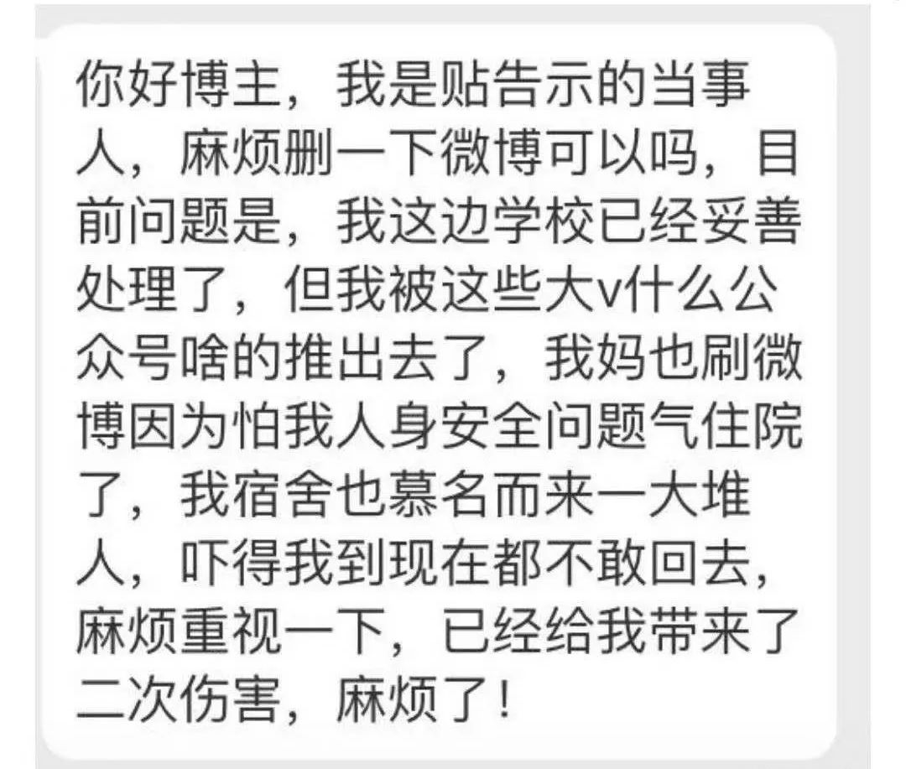
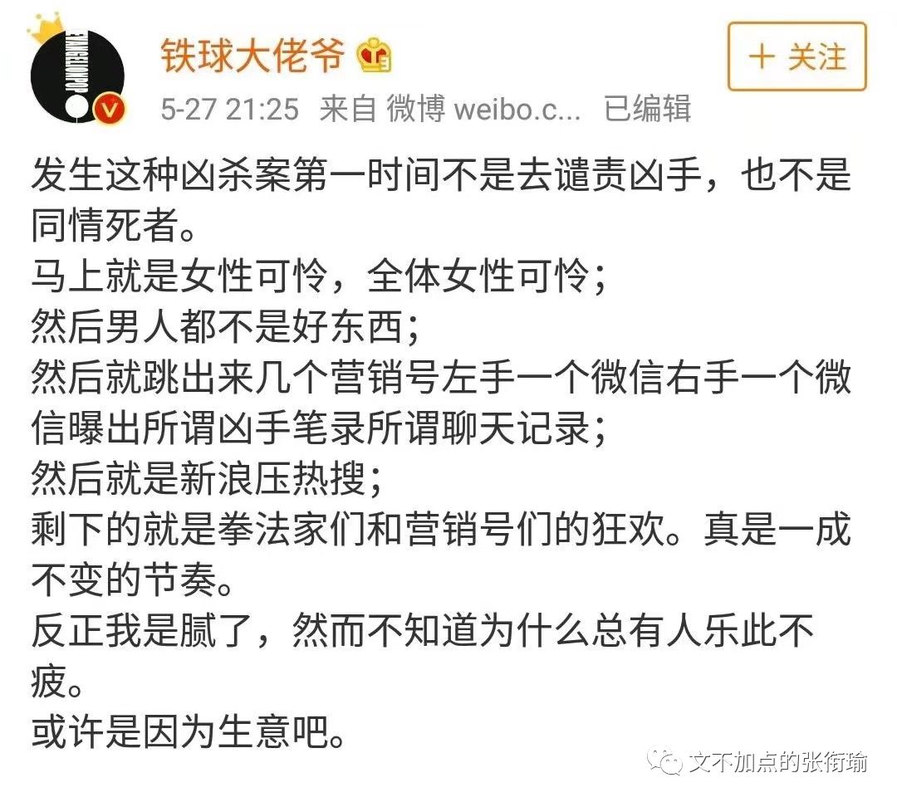
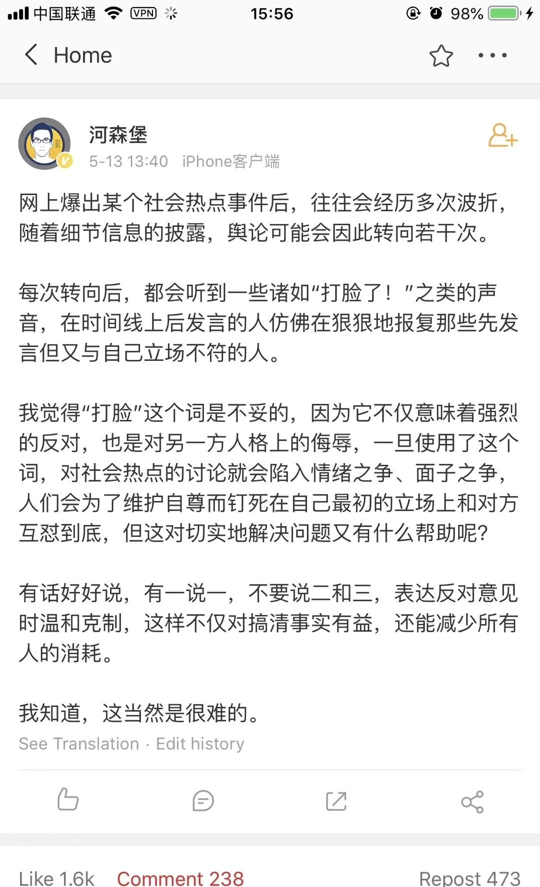
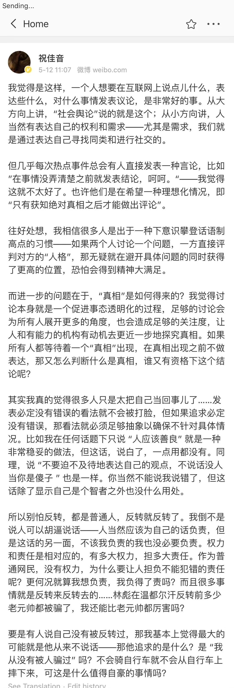
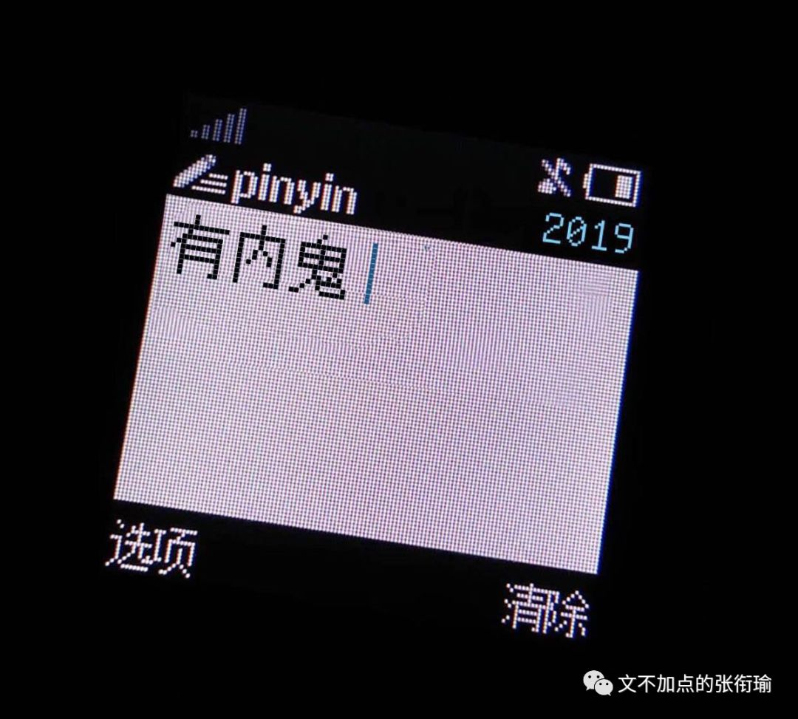
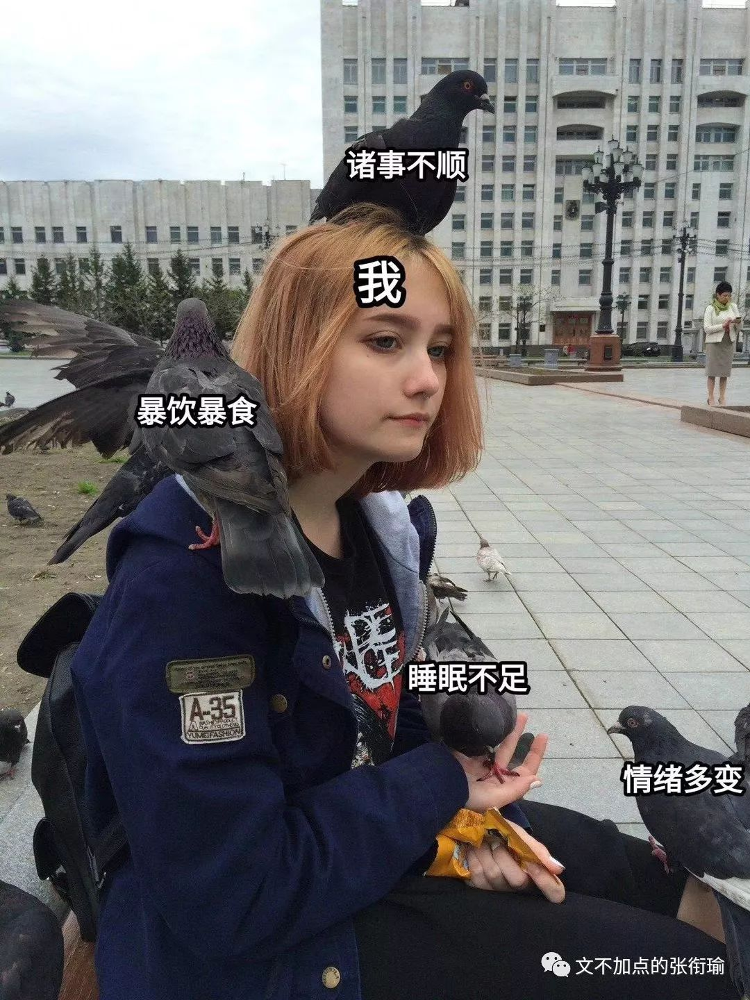

> 张衔瑜的第 96 篇推文 共计 3467 个字

张衔瑜的第 96 篇推文

共计 3467 个字

各种自卑、憎恶、羡慕的一些观察结果。

说实话这篇没什么结论，我也不准备输出什么观点。最多把思路理一下、设定几个可能。来找我撕的请回吧，我撕不过你。我的时间要用来吃和减肥。

鉴于最近你渣科发生了一件众所周知的事，并且很短的时间内就有几个外校的同学，其中包含人不再国内的，也来找我问这件事。于是我觉得，还是有要提笔来写一下这件事情的必要。

事件的起因大概是一个研究生暴躁学姐贴了几张纸，怒怼 偷了自己晒在天台上的内衣 的本科生学弟。那一栋里边是有一张进寝室楼的大门，也有分开男女寝的小门，还有自己寝室的门。这些都是正常存在的。只是公用着一个天台。学姐措辞激烈，语言暴躁，紧接着以此文传播开来，引发了一些讨论。紧接着就有了不少同学看到了来问我。

现在几个群里都在cue这个事情。甚至还有人因为别人在蜗壳表白墙发了消息，选择不匿，于是有人在空间把表白墙和发消息评论的人一起挂了，选择群起而撕之。

要看这个事，至少得把自己思路厘清一下：

> 1. 这个偷衣服的人做错了吗？ 2. 做了错事的人，应该值得被怎样对待？ 3. 社会该不该、该怎么接纳“改过自新”的罪犯？ 4. 非公众事件会不会被舆论裹挟？ 5. 在看问题的时候有没有隐藏前提？

1. 这个偷衣服的人做错了吗？

2. 做了错事的人，应该值得被怎样对待？

3. 社会该不该、该怎么接纳“改过自新”的罪犯？

4. 非公众事件会不会被舆论裹挟？

5. 在看问题的时候有没有隐藏前提？

主要是要打乱顺序再重新看，因为认知会出现 锚定和偏移 。

当这是本一件私事（指公众属性较弱），因为一封信而带有公众属性之后，私事所具备的信息不对称也一并代入到事件当中——我想说的是， 我们需要对进入到视野的信息进行怀疑进而解构。 我个人从情感上完全倒向这位硕士生学姐，但还是需要继续怀疑不对称信息。

当然这样的怀疑不一定有结果，我不是那一栋楼里的人，也不认识这位学姐。至于怎么采集指纹的我也只是好奇，按理说采集到其他信息也显得有些不切实际。如果诉诸法律惩戒，也应当是执法者才能掌握对方的家庭信息。不过问题不大，这封信的整体情感没什么问题。我也不准备对这件事本身或者这封信，如何声讨、谴责抑或继续剖析下去，只凭一个张贴的信是不能完全做判定的，而我也不是meant to judge被要求去做判定的人。

稍晚一点的时候，蜗壳的抡人后续吃瓜群也解散了——为了保护那位研究生学姐。 这本来就应当是一个很严肃的事情 ，如果只是因为热度而变成了受害者反而被加害，那不值得也不对头。

舆论传播之所以可以进行下去，是因为其受众有获取信息的渠道、有共情事件的能力，以及如果可以的话，继续传播的动力。

谈论这件事情的人，想必也会关注到05月24日在江西南昌，在路上被杀害的女孩。以及更久远以前，林林总总。在时间的推移上，固然会有新加入的力量，和退服离群的话语， 但长久坚持在一线的，依旧是熟识的那几位。 虽然不知道是为什么，但我身边一些人不约而同地表现出来了类似斯德哥尔摩综合征的情况。 我只是说类似，没有说，境况完全一样，只是因为找不到其他更合适贴切的形容方法。

比如这些因性别而起的恶意，越是关注，越是像刺猬一样凡遇到一事即亮刺相向；同理地也有中美贸易战冲锋在舆论一线的斗士，从语言艺术、战争艺术，各种角度无所不用其极——结论还有“这是大陆收复台湾的时机”之类的；以及吐槽停电停水停网和内涝，各种不爽基建的，也是那几个。

我不是说长期关注，跟踪，这有什么不好。 问题在于addicted ，有点上瘾和迷恋这种感觉，变得有些不自我。普通心理防线建设在这一点做得尤其差，不像医生面对病人、警察面对罪犯，可以有专业的心理建设虽然不一定有用。但普通人面对这些addiction，是容易被带跑的。

我所言一件事情能传播开来，必然是有其 共情出处和传播的可能 。还有外校的朋友也来找我问瓜，大抵也是对类似的事情深恶痛绝了的。可倘若一贯地对一些事件特别敏感，这就不是 “宁可错杀一千，绝不放过一个” 的问题，而是容易被夹带私货了地伤害。

例子也不是没有，以前有饭圈朋友日常在微博骂架气到昏厥，事实上我去看的时候甚至觉得两边都是 在空对空地怼修辞学 ，不管是逻辑还是事件都没有。那我觉得这能骂起来就全靠各自火大，只要事件一出就可以开始操戈上阵，也就是所谓地被夹带了私货。试想一个事件的闭环营销：

又比如后来传的两张从外边拿很长很长的衣架偷宿舍衣服的低清照片，那一看就不是紫菘。但也有人拿着在说。所以讲，不能眉毛胡子一把抓。以及我在写的时候，还有后续提到，拍图的那个地方就不是紫菘的墙，贴纸的背景不是紫菘的墙。这我倒觉得还很像，whatever.

我所期待的，不是需要在掌握了全部信息之后，再来狠狠地打下在信息不全的时候，就发言的那些人的脸。 眼下所需要的，是正常地有脑子地对自己所捕获的信息有合理怀疑和推理。而不是突然火大。 无论是在一件事中被怼了的火大，还是怼人的时候站在逻辑制高点的火大，都没有必要，伤肝。戾气，是把所有三次元逻辑，进行二次元崩坏的必经之路。

作为一个，自己一手制造过在QQ空间转发4K+、点赞1.2W+的前网络推手，我大概也觉得这之中是有很多站在刀尖上跳舞的舞者，自己的足下把握。

至于渣科之前的骂架当中，李昀锐拉票、西操一群拍了照就走的人都不乏如是。跳开来看前几天发生在紫菘的事情。

16年武汉暴雨内涝，紫菘所有一楼的寝室里柜子都浸泡得不能用，就连西操也泡的不能军训。发布灾害天气预警倒是说清楚了只有一天，但是校内校外所有的便利店、面包店都 像是马上要台风过境了一样地被整柜整柜地搬空 。令我称奇得想起了福岛核电站泄露的时候，一些地方莫名其妙开始抢盐。

明明只有一天，不知道在暴雨前一天为什么可以这么疯狂。

我问一些人为什么囤这么多三五天都吃不完的东西，他们回答我说， 反正就待在寝室啊我哪也不去，吃不完也没什么损失，下次再吃咯。 我只觉得有些事虽然没有错，但确实很令人迷惑。当然有些人也就每天都待在寝室，睡觉、游戏、学习，本来也是每个人自己的生活方式。

但整柜整柜地搬空令人觉得实在是有些魔幻，往大了往小了说都可以，我竟一时间找不到合适的槽点。

不过东边也真是这样了。

每天diss基建的人就是我。

也还有近日迷惑的，是在一些答疑群和要开始夏令营了的招生群里面，出现的众多学婊。我尝试描摹一下这个群体的群相：

> 喜欢匿名问问题，渴望得到答案，但又不希望别人知道自己是谁； 经常窥屏翻所有的聊天记录，别人稍微说一点不相干的话都觉得是在耽误自己的时间； 经常在所有的招生群里都能看见ta，希望在所有的地方获得便利； 但最重要的是，他们只享受这一获得便利的事件，最后依然会最势利地考虑所有的事； 最不能忍的是，即是这是对方在牺牲自己利益、时间来提供的一个回馈feedback，但依旧可能会被权衡掉； 以及在这一过程中，和不熟的人都习惯性地使用着酸酸的语气： “原来是XXX，那一定很厉害吧。 既然是XX学校出来的，果然很强。 大佬带带我。 C++很简单，就跟扫雷一样。”

喜欢匿名问问题，渴望得到答案，但又不希望别人知道自己是谁；

经常窥屏翻所有的聊天记录，别人稍微说一点不相干的话都觉得是在耽误自己的时间；

经常在所有的招生群里都能看见ta，希望在所有的地方获得便利；

但最重要的是，他们只享受这一获得便利的事件，最后依然会最势利地考虑所有的事；

最不能忍的是，即是这是对方在牺牲自己利益、时间来提供的一个回馈feedback，但依旧可能会被权衡掉；

以及在这一过程中，和不熟的人都习惯性地使用着酸酸的语气：

“原来是XXX，那一定很厉害吧。

既然是XX学校出来的，果然很强。

大佬带带我。

C++很简单，就跟扫雷一样。”

我很少用钻营这个词来带贬义地描述，但这个确实值得人恶心。在学习阶段的答疑群和招生群里边，是面向学习本身、还是面向学位学分，二者不可割裂，但精力分配上须得要有区分。

开源节流，一方面是开源，一方面是节流。这样子的学婊出现，以为也应当如是。

不在其位不谋其政，这句话也只不过说到了一个方面。另一面自然是在其位谋其政。这才像是一个正常的社会，有明确分工和司职，会区别内外界限的社会精神。

昨天在《光明日报》看到了一篇书评，评高鹗和各种续写的红楼梦，选段如下：

> 我曾对这种“大团圆”很鄙视，觉得俗套肤浅；吾国难得有这样一部深刻的大悲剧，何必妄加改篡？但随着年齿日增、阅世渐深，遂觉得自己这种轻蔑 纵然不算太错，却也是肤浅之见。 中国人何以热爱大团圆而不忍睹悲剧？ 盖吾国近数百年来，现实人生之残酷，固已超越一切文艺之所形容， 每个人，生此世界，值乱离崩裂之战时自是刍狗，即使当太平繁盛如康乾际，也不过如草芥微虻，势禄不足自全，平民尤如鱼肉。

我曾对这种“大团圆”很鄙视，觉得俗套肤浅；吾国难得有这样一部深刻的大悲剧，何必妄加改篡？但随着年齿日增、阅世渐深，遂觉得自己这种轻蔑 纵然不算太错，却也是肤浅之见。 中国人何以热爱大团圆而不忍睹悲剧？ 盖吾国近数百年来，现实人生之残酷，固已超越一切文艺之所形容， 每个人，生此世界，值乱离崩裂之战时自是刍狗，即使当太平繁盛如康乾际，也不过如草芥微虻，势禄不足自全，平民尤如鱼肉。

> 我们看《红楼梦》第十六回，贾府正在为贾政过生日，忽然皇帝派了太监来传旨，就“ 唬的贾赦贾政等一干人不知是何消息，忙止了戏文，撤去酒席，摆了香案，启中门跪接……贾赦等不知是何兆头，只得急忙更衣入朝。贾母等合家人等心中皆惶惶不定，不住的使人飞马来往报信……” 这真是一段极精彩的文字——专治时代，世宦勋荣如贾家，突然得到皇帝宣召，上下就如此惶惧无措， 那是他们深晓天威莫测宦海无常，不知已亲历目睹过多少飞来横祸与灭门惨剧。

我们看《红楼梦》第十六回，贾府正在为贾政过生日，忽然皇帝派了太监来传旨，就“ 唬的贾赦贾政等一干人不知是何消息，忙止了戏文，撤去酒席，摆了香案，启中门跪接……贾赦等不知是何兆头，只得急忙更衣入朝。贾母等合家人等心中皆惶惶不定，不住的使人飞马来往报信……” 这真是一段极精彩的文字——专治时代，世宦勋荣如贾家，突然得到皇帝宣召，上下就如此惶惧无措， 那是他们深晓天威莫测宦海无常，不知已亲历目睹过多少飞来横祸与灭门惨剧。

倒不是说不可以，我看一些所谓的"护校蛆"和同样暴躁的人互撕，真是让人围观都觉得闹心。以及也许只是两波人长大了之后，换了一些别的话题继续撕下去。像 绝大部分时候，我觉得都像是我在尝试convince家里一些我觉得明明逻辑很简单清晰的道理时， 同样一点增益也没有。

一些地方低级红，无脑捧的人——没错我就是指的各种“网友总结”，总结校名那三个字有什么谐音。“这是美国白宫和深圳某街道办的斗争”、“这次不火都难”、“合作共赢，成果共享，再创辉煌，合作有为”。

不得不令我想起05月25日，南阳的 “水氢发动机” 。不管是化学化工的内涵，还是报道中的若干批示、指示，真的是让人觉得我国这个社会主义初级阶段的定义还很恳切，建设依旧在路上。

想来这些事情，其实蛮无聊的。

或者就，“还行”，然后敷衍过去。

迷信非黑即白、迷信举报后公权介入、迷信科学，这都不过是一种出于自我视角的自私罢了。

迷信非黑即白 ，但事实上没有错的也不一定对； 迷信举报后公权介入 ，就例如那些在外国机场因为天气正常滞留却唱起了国歌的，只不过是觊觎公权力的能力，而以为自己用这种方法就可以使用公权进行保护或者压榨； 迷信科学 倒是最后了，就如丁香园辟谣的那些，仅仅在迷恋"啊我也懂科学"，而对思想方法和原理定律研究表现选择性忽略。

回到所说的迷惑行为，可以见得的，都不单一。遇到的人大多差不多，都有着一句话能把人气得隔夜饭都喷出来的能力。 人艰可以不拆，但是不能因此而不认识人。

其实我早在下大雨的那一天，在寝室写完代码就准备把开始动笔写这些带一点自卑有有点酸酸的迷惑行为大赏。但是后来出去吃鸡爪了，就忘了。

昨天的事情搞得越来越多人在问，于是把暴躁也放到了这一起。

至于鸡爪什么的，等下一波。 那个大概是武汉最好吃的鸡爪了。 要不就等我下次去探店了再说。

附16年基科海景：

