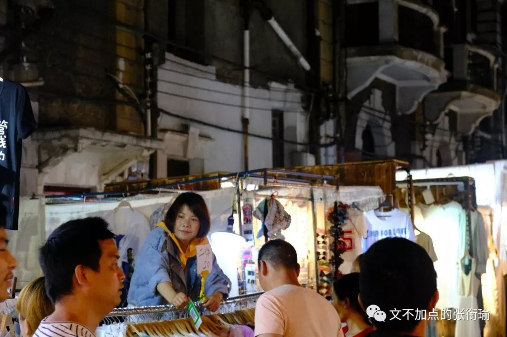

> 张衔瑜的第 98 篇推文 共计 2722 个字 配乐的空气感极好

张衔瑜的第 98 篇推文

共计 2722 个字

配乐的空气感极好

朝花夕拾，就像鲁迅旧时提到的那种旧事重提，字面意思挺明了的了。

我刚刚去翻了一下图，上一次po自己在外边很郑重其事地随意尬走的时候，还是偷渡了一张四月底拍的 保成路夜市 。

如果非得要和我较真，那除了我的相机之外，保成路夜市的真实物质言说，不过一条拥挤的小巷。往来的街坊邻居、游人访客，在各色的顶篷和点亮的日光灯下，与商贩小摊讨价还价。

我看过一篇名为 [《九问|人类与科技的相爱相杀》](https://mp.weixin.qq.com/s?__biz=MjM5NTcyNDA0Mw==&mid=2650693146&idx=1&sn=d6b0d790545d908b20a0feecd4068d24&chksm=befed07e89895968e0e90f470658722f7f5328283b48775ece592f4d23f852e4952472c5ea7c&mpshare=1&scene=21&srcid=05284cZO9PZW60hGvRxrl6Ns&from=timeline&ascene=2&devicetype=android-28&version=2700043b&nettype=WIFI&abtest_cookie=BgABAAgACgALABIAEwAVAAgAnYYeACOXHgBWmR4A0JkeANyZHgD4mR4AA5oeAAqaHgAAAA==&lang=en&pass_ticket=Am0Hj2AL37z9E 4gAxmC bkx7Q1xMGjT/sp3pRx5Bs/mWbCSv2J3oZIHG30/XPGc&wx_header=1#wechat_redirect) ，作者在从景观设计学的角度在研究新科技对城市环境规划与设计的影响提出问题与思考。摘抄前两问如下：

> 一问： 设计观念创造了图像， 还是图像创造了设计观念？ 图像技术使得对场所的高度表达和复制变得轻而易举。一方面，我们的城市变得更加单调乏味和缺乏匠心；另一方面，少数“美景”被反复用于图像制作，成为一锅十年不换的“老汤”，被大众反复欣赏和消费。 于是，在绝大部分时间里，我们身处粗劣甚至恶俗的城市环境中，却在方寸屏幕前享受着令人神往的“美景”——那些由图像所传达的、二手的诗境或彼岸。 更为可悲的是，设计师甚至是三手、四手图像和观念的生产者。当前大量的设计作品是从图像（来源于设计杂志、书籍和网站等）到设计的一种武断而粗糙的翻译和拼接，并常常被作者冠以“原创”的名头。

一问：

设计观念创造了图像，

还是图像创造了设计观念？

图像技术使得对场所的高度表达和复制变得轻而易举。一方面，我们的城市变得更加单调乏味和缺乏匠心；另一方面，少数“美景”被反复用于图像制作，成为一锅十年不换的“老汤”，被大众反复欣赏和消费。

于是，在绝大部分时间里，我们身处粗劣甚至恶俗的城市环境中，却在方寸屏幕前享受着令人神往的“美景”——那些由图像所传达的、二手的诗境或彼岸。 更为可悲的是，设计师甚至是三手、四手图像和观念的生产者。当前大量的设计作品是从图像（来源于设计杂志、书籍和网站等）到设计的一种武断而粗糙的翻译和拼接，并常常被作者冠以“原创”的名头。

> 二问： 被图像驯服的设计？ 在项目建成以后，设计师对图像效果的关心远远超过对大众使用感受的关心。“网红”项目甚至不需要过分担心自己的品质—— 许多人造访的主要目的不再是追求完整和连续的场所体验，而是寻找可作为摄影对象的地点，而后在美图软件的协助下制造下一批可供炫耀和传播的图像。

二问：

被图像驯服的设计？

在项目建成以后，设计师对图像效果的关心远远超过对大众使用感受的关心。“网红”项目甚至不需要过分担心自己的品质—— 许多人造访的主要目的不再是追求完整和连续的场所体验，而是寻找可作为摄影对象的地点，而后在美图软件的协助下制造下一批可供炫耀和传播的图像。

所以当我在出行的时候，如果网红拍照打卡点，就只是一个拍照、修图、发票圈收一堆赞的点的话——放在奶茶里边，就是我觉得很无聊的 一点点 了。奶茶的重点既在奶茶食味本身，又在奶茶店的文创氛围，如果都没有的话，很正常的 COCO 也不错。都做到了，那就是 茶颜悦色 和 喜茶 。

喝奶茶当然要茶颜啊！！！

其他的妖艳贱货根本比不了好伐

（无脑自来水开始）

所以我在扫街的时候，并不会一定要去扫网红店涨流量，而是在看着周遭的架势，决定是否按下手中的快门。网红没什么不好的，之所以能扩开，不管是各种自来水还是宣发手段，拿钱办事或者不拿钱也办事，至少办事这个过程是主动的——也就是有人在努力，想让一个地方、一种单品获得更多曝光。网红店坏在无脑安利，看到一张网图之后自己脑补一下现场可能的环境，其实也大多能在脑海里建模完成了吧。

仍然在循礼门地铁站，五月末的一张轻轨向晚：

真正出门扫街，除了定点的景之外，那些在路上走走停停的人们和所有的天色，都是意外。

看到我在 循礼门地铁站 里拍 保成路夜市 ，于是自己也拿出手机开始拍的路人。

保成路上的游人，摆着摊的摊主。

以及拿着那个一直在重复能量变化的小玩具商人，弹性势能—动能—重力势能—动能，也就是一拉、然后一个小物件飞上天空、再落下。

江汉路 上一位带着发光的头套买着小物什的老爷爷，以及我柔焦的一张。

五月一直都是Mayday。

稍微抬头看看夕阳，也觉得有种万青所唱作的重工感。

后来的某一天，到了汉口的 宝岛公园 。那天有朋友一起去。朋友问我要不要拍一组像是摄影师的工作照。

不过事实上，风光摄影师的真实生存状态，就是因为还不敢、不想、不愿意或者没有人拍照，所以总是到处找点。真正在顶楼之上，拿着相机拍下一组照片，就连自己的思路一起，变得很是开阔。

远处的高楼，层层密密叠叠地错落，割织割织着天际线。

宝岛公园，以及这附近的台北路blah。我问朋友，叫这个名字是因为这附近有很多台湾居民住在这附近吗？那倒不然。叫这些名字约莫是在当年的一篇 《告台湾同胞书》 发表之后，以示友好而命名了一批的街道和街区。

附近还有一个地铁站，名叫 取水楼 。我当时也很疑惑，怎么取水还要建一栋楼，不知道居民们是怎么想的。在众多百科的考据之后都提到了这么一段传闻，估计也就是互相抄而且也没找到出处，摘抄如下：

> 相传早先取水楼这里的百姓吃水十分困难。因无钱挖井，只得到当地财主家买井水吃。财主有个心地善良的美貌女儿，经常偷偷接济穷人。她多次看见一个书生帮助前来汲水的老人，且长相出众，渐萌生爱心。这青年父母双亡，孤身一人寒窗苦读，小姐得知愈加怜爱，让书生到她家提亲。可财主嫌贫爱富，小姐只好暗中资助。书生赴京应试，财主把女儿许配一有势有财的浪荡子。迎亲那天，小姐在绣帕上写下遗书后投井自尽。

相传早先取水楼这里的百姓吃水十分困难。因无钱挖井，只得到当地财主家买井水吃。财主有个心地善良的美貌女儿，经常偷偷接济穷人。她多次看见一个书生帮助前来汲水的老人，且长相出众，渐萌生爱心。这青年父母双亡，孤身一人寒窗苦读，小姐得知愈加怜爱，让书生到她家提亲。可财主嫌贫爱富，小姐只好暗中资助。书生赴京应试，财主把女儿许配一有势有财的浪荡子。迎亲那天，小姐在绣帕上写下遗书后投井自尽。

> 书生中进士后，皇帝恩准其回乡做县令。书生得知小姐不屈投井的事情后大哭一场。上任后他支出官银，开挖一个大水塘，供百姓饮用，因县令姓白，大家取名“白水湖”。后县令又在小姐自尽的水井旁盖起一栋漂亮的楼阁，取名“取水楼”，表达对小姐的赞美和怀念。如今，取水楼早已被拆除，但地名仍沿用至今。

书生中进士后，皇帝恩准其回乡做县令。书生得知小姐不屈投井的事情后大哭一场。上任后他支出官银，开挖一个大水塘，供百姓饮用，因县令姓白，大家取名“白水湖”。后县令又在小姐自尽的水井旁盖起一栋漂亮的楼阁，取名“取水楼”，表达对小姐的赞美和怀念。如今，取水楼早已被拆除，但地名仍沿用至今。

约莫也是那种淳朴可爱的沙雕传闻，马上就要高考了那么应该寄予着当地居民的blah blah思想感情。

不过如果知道了 积玉桥 在《江夏县志》记为 “鲫鱼桥” ，建于清光绪十三年(公元1887年)，是座内室一丈多的石桥。后来这里成为运送铸造铜元材料的车辆至铜元局必经之地，便取堆金积玉之意，将鲫鱼桥谐音雅化为“积玉桥”。看到这些来历总令人内心OS，几条弹幕就从我的眼前一晃而过。

顺便把四张图组成黑白，也是有趣。

我以前不知道刘禹锡写的“案牍之劳形”究竟会难到一个什么样子，现在想来，那大概就是一种 生命力的失去 。

想说却还没说的还很多、想去却还没去的也很多，久而久之，做不了的梦、那换个梦不就得了。打开锁的钥匙，归结起来就是一把——生命力。而 市井，就是最大的生命力。

我以为， 武泰闸 大概是整个武昌，最市井的地方。闸最早由张之洞修建，设于巡司河上。徒步可达的地方，就是首义。而首义，就是武昌起义打响第一枪的城门。到了《风味人间》， 小民大排档 也就成了武汉夜市的代表。不过我吃小民大排档是在光谷的分店，而在武泰闸吃的是另一家叫 江城燕子大排档 的地方。

和朋友一起随便点了些，想着都是多少有些生物知识的，于是知趣地避开了蛙类。

店内嘈杂、吵闹、喧嚣，不管用什么形容词来描述这个地方的人声，都不为过。我和朋友面对面坐着，中间不过是一张长条桌的距离，说话都几乎要用吼的声音。一旁临近毕业了来寝室聚餐的、拖家带口年长年幼坐一起的、社畜生活完了之后来大排档救赎自己的， c'est la vie 。

而武汉的夜市上，约莫鸡爪越做越成了一种特色，在小民吃起来也是如此。夹起了之后，只有掌心的部分还有些刚性的支撑感，而一旁的骨头却都已经散落下来，耷拉着软糯。如果说入口即化要找一个代名词的话，那烧制的鸡爪则居当如是。

出门也就是出门了，相比于今年三四月，五月出门扫街明显少了许多。

除了很烂，很热也是真的。

六月至今也没有出门。

稍微能看的不过是昨天修到过饱和的这一章言叶之庭低配仿制款。但是之后几天也许有一组图出来，于是赶着写完了这一篇。

武汉昨夜大雨之后，江阔云低断雁叫西风，今天的天气总算有点和人亲和了。

大家端午安康

有时间就来一起做2019年的真题吧！
