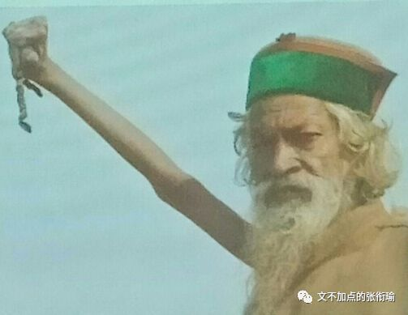
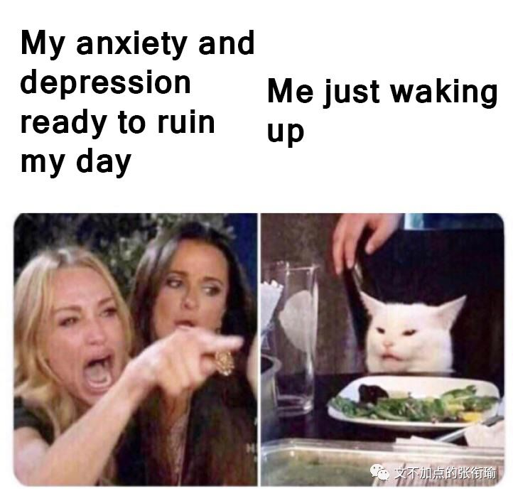
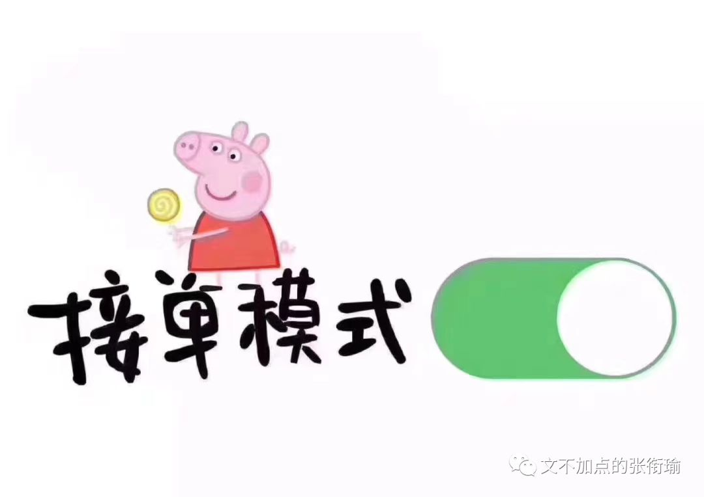
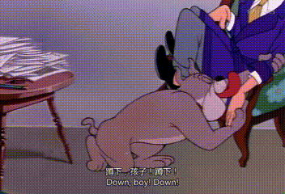
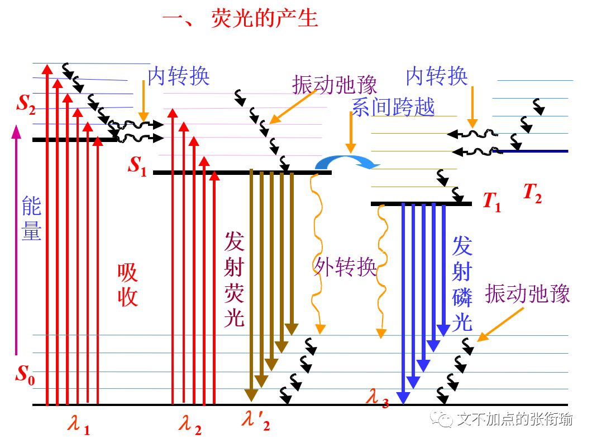
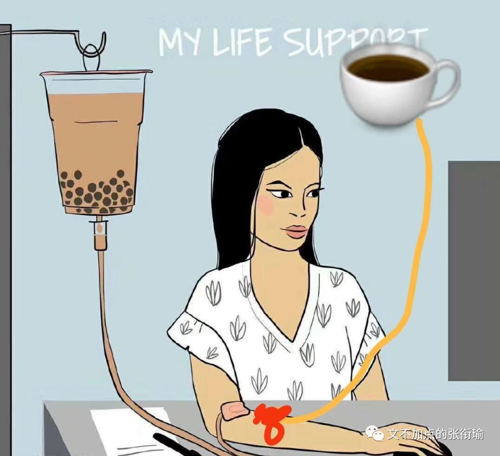
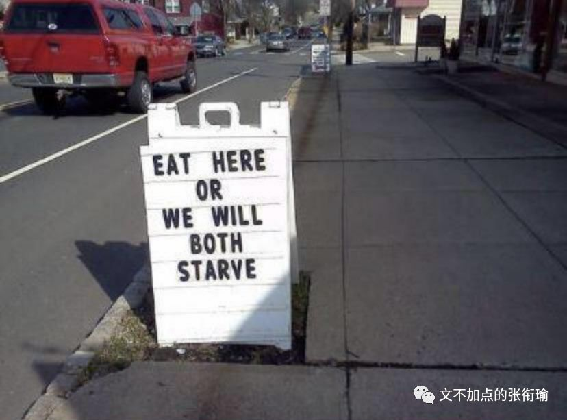
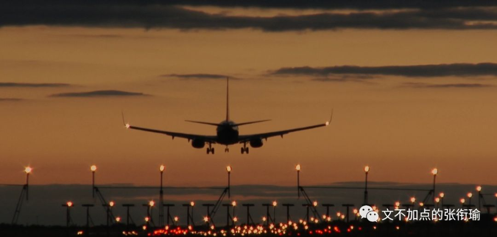

> 张衔瑜的第 99 篇推文 共计 3655 个字

张衔瑜的第 99 篇推文

共计 3655 个字

我一直以为，数字在中国传统文化当中，扮演着超脱于数字之外的含义。

言及皇帝，我们会称 九五 之尊；言及老北京，我们会说 四九 城；以及海南本土作家崽崽的作品，《我们的 三六 巷》。数字本身只是一种计数的工具，本没有太多含义。十进制、十六进制、二进制，可在此之后令我觉得惊奇的是，数字里包藏着一种关乎于生命的美学感觉。一一、四九、九五、三六，长沙话里边甚至还有一个词叫 “五六七三” ，具体意思很难解释，语气当中显中性偏被生活虐待了的悲惨感。

写下这个标题时我才发现这已经是第 99 篇了，反正也不会有很多不一样，不过是我自己一直在碎碎念罢了。

昨天晚上实在是太困，在洗衣机旁边晒衣服，哈欠打到下巴掉在地上，然后一不留神把衣架子吃下去了。

冰镇的 焦糖味 百事可乐其实还可以，比什么可口可乐出的香草味还有巴菲特樱桃味不知道高到哪里去了。也许我和巴菲特之间也就只是差了这一瓶樱桃味可乐，anyway天天受这种罪怕是难怪可以 行拂乱其所为 变成巴菲特。

我自己也很奇怪自己。

有时候又突然很有耐心 ，早就烦透了的人一直在拖延我也可以嗯嗯嗯好好好没问题你慢慢来注意安全不急；

有时候又很暴躁 ，遇到了一起走的人不怎么准时，就会先走一步然后去到地方了边玩边等人追上来。

也可能就是阴晴不定，冷烟寒食。

所以我尽量在还算平复的时候去写代码肝论文，在暴躁的时候去写推文打游戏。

// 斜杠青年 \\ 应该指的就是我这种，有很多看起来完全不相关的技能，也有很多，分裂的人格和性格。我不确定人格和性格能不能并列用，whatever, I've tried. 别说弄明白别人了，想把自己厘清都很难。

而且相比于熟悉的人，已经因为和我在这个频道里聊得很开了的，我会自然而然地觉得已经和这个人认知固化了而更难拒绝别人的请求；但如果是不熟的人，相比起来不会是这样 “低头不见抬头见” 的情况，拒绝那些 蹭鼻子上脸 的请求也就心安理得了。

还有一个神奇的在于，但凡是出去玩，不管是谁都很容易把我约出去， 但我自己还是有很多很多戏。

只要约我的时候，我没有其他的事，那就一定不会推辞。不管日程表有多紧，只要这是安排的自己做事， 那我一定会让给别人。而且，最后把所有事都做完。

但我答应的时候，从内到外都会很开心。可答应之后，又多少开始后悔，想鸽掉。直到快走之前，虽然自己不会提，但一直盼着别人鸽我。而且别人说要鸽我的时候我会很开心，因为总算可以做自己的事了。

不管出门之前多不情愿，出门之后又好了。 只要一出门心情就会变好，而且很好很好。吃喝玩乐，我也都很在行。玩了之后，也会很开心。

于是我就积攒了很多出去玩的照片文字，和很多走之前的纠结内心。不管多少次了约出去玩都还会这样，开心~糟心~开心，糟心总是在。 这样情绪跌宕起伏 ，多的时候可以有很多很多个平台、过渡态，平常操作罢了。

最近不知道为什么，在明明很熟悉的地方频繁 踩雷 ——我指的就是食堂。我向来觉得，食堂的菜就是无功无过也还行，勉强对得起人的那种。不过最近吃了西一仿佛是咸鱼做的鱼丸拉面、甜奶茶冲的苦龟苓膏、还有在锅底擦了灰的豆皮之后， 我觉得我看这个食堂更加马哲了一些 。

说实在地关于金钱认知，也就是数字认知。

当代大学生在用钱的时候仿佛刻意避开了20~40的这个区间。

20以下 是正常的每次消费，比如在食堂吃一顿饭、点一份外卖、出去玩买一杯喝的、买一下地铁票这样子，如果在20以下我就会觉得还好。不是说每一餐都会冲顶，差不多就在10±，就也还可以接受。

40以上 就是出门大聚餐、探店、参观一个展览、买景点的门票blah，也会觉得反正已经出门了去参加活动，就不要太和自己过不去。

难办的就是20~40，和所有不猧不魀的事情一样。如果要我花20以上点一顿外卖，一般都会觉得多少有些奢侈，不符合日常每天的消费水平；

如果说30左右去买一张会员卡电影票，其实也还不如通过IPV6访问的教育网去找找资源，然后下载下来自己去看。

这个区间里面做什么都觉得不舒服，仿佛一个天然屏障把两种金钱认知的自己隔开。

当然对应到不同的事情也会不一样，就像我在去 [香港尬走笔记](http://mp.weixin.qq.com/s?__biz=MzUzNjE3NzA3Mg==&mid=2247483911&idx=1&sn=d03f50934536437929624ba6a7720095&chksm=fafb72d8cd8cfbce8f0ab19ffc52e5af4d9615ee616a247245c72c783d82c48142e2d74257dc&scene=21#wechat_redirect) 里提到的那样：如果平常自己给自己置办行头一直都在三百一下，突然某一天被要求去挑件一千块钱以上的衣服，其实是没法挑的。因为，根本不知道从哪里开始挑。

这也就回应了为什么我总是在骂光谷这一片地方基建搞成个鬼样子。倘若一个人，到了一个新地方，觉得这个地方很完美、哪里都好，而自己提不出来任何有增益的建设性意见，那其实这个人是surplus多余的、冗余的、剩余的。

迟到的正义，仍然是迟到了。不能因为是正义，所以我们对于迟到就可以闭耳塞听。同样的偏正也还有善意的谎言，我们也会既关注善意、又关注谎言。我很奇怪为什么有人就可以对明明写得很清楚的一句话只看一半，以往秀才认字认半边，现在人看句子也只看半句的吗？

印象派的画作里，莫奈、塞尚、雷诺阿，如果不是事先有知道哪一幅画作的归属的话，看起来既像兄妹又像表亲的。写作或言语完全的句子应当是完整地传达了信息的，不可太过。

未经调研的发言，以及一知半解的拿正确的废话来搪塞，就和下面这些对话差不多：

> 老师，秦和汉，哪个在前哪个在后？ 按顺序来。 老师，我想学写作赚钱，怎么做？ 先开始写。 老师，我也想年薪100W，怎么做？ 先达到年薪10W。

老师，秦和汉，哪个在前哪个在后？

按顺序来。

老师，我想学写作赚钱，怎么做？

先开始写。

老师，我也想年薪100W，怎么做？

先达到年薪10W。

我每每看完人民日报的报道之后，顺带地瞄一眼底下的评论区。本来其实没什么问题的，有正能量的东西多说一说也是极好极好的。只是比如将中国高校获得新成绩的消息，多少是真正觉得扬眉吐气的、多少是因为有人在这个学校读书而来评论的、多少是不管什么东西只要人民日报说了就都觉得好的。

非黑即白不可以，就像化学所言的电子激发，不是激发上去了马上就直接下来了这样子，比如荧光的产生：

所以标题才有， 作为过来人，我告诉你别过来。

当有人说要来看看的时候，我从窗户口伸出手，手上一张纸，纸上写着： “快逃！”

那些觉得高三就已经是人生知识巅峰了的人，估计知识巅峰也就只能在那里了。如果只算总量不一定要求要每个点都掌握得像高三那么细致的话， 我现在两个月就要学掉整个高中那么多的知识 ，说知识巅峰都是骗人的鬼。

牛虻2532 是一个神奇的公众号，目测是武大法学的一个同学。有一篇文章是： [这样下去，你还能活过多少个考试周？](http://mp.weixin.qq.com/s?__biz=MzU1OTU2MTY5MA==&mid=2247484089&idx=1&sn=1647155f69c5e174d5734da28a6a4dc2&chksm=fc142c0ccb63a51a3e4ac7df59f82102f0bdcefd3171c764c691de3fb70dac69b06ab22cb34a&mpshare=1&scene=21&srcid=0611OUyZrm2jaM44XmLYDrmJ#wechat_redirect) 摘取一部分如下：

> 很多人都觉得，期末之所以会复习得要死要活，都是因为平时不好好学习。 所以一到期末就有人开始在朋友圈赌咒，说早知今日何必当初，下学期自己一定好好做人。 而恰恰是个悖论： 越是平时学的认真的人，猝死的可能越大，平时不怎么学的人，考试前反倒不容易死。

很多人都觉得，期末之所以会复习得要死要活，都是因为平时不好好学习。

所以一到期末就有人开始在朋友圈赌咒，说早知今日何必当初，下学期自己一定好好做人。

而恰恰是个悖论： 越是平时学的认真的人，猝死的可能越大，平时不怎么学的人，考试前反倒不容易死。

> 复习这种事情，弹性很大。给你三天你可以从头到尾自学一遍，给你两天你可以把书看一遍，给你一天你可以把重点过一遍，就是给你2个小时你也可以转发锦鲤。 复习的策略多的是。 熬夜猝死复习的原因往往是：明明5个小时的复习时间，你却非要制定12个小时的复习计划，还拿其中的2个小时转锦鲤。

复习这种事情，弹性很大。给你三天你可以从头到尾自学一遍，给你两天你可以把书看一遍，给你一天你可以把重点过一遍，就是给你2个小时你也可以转发锦鲤。 复习的策略多的是。

熬夜猝死复习的原因往往是：明明5个小时的复习时间，你却非要制定12个小时的复习计划，还拿其中的2个小时转锦鲤。

> 一个平时不怎么学的人，一般是不在意成绩，要么就不喜欢自己的专业，让他们拿出点时间复习一下重点求个及格是理所应当的，但让他们冒着猝死的风险去通宵复习，估计也是不肯的。 倒是那些平时课上课下很努力的学生，期末季的压力最大。要认真学专业，压力是重的，要牺牲很多的课外生活，拿不到好成绩，就学习学到最后一无所有了。 但更心酸的是，考试考的东西和平时学的东西实在没多大的关系别，人就算平时不学，考试前背一背，和你也差不了几分。 之前学的，全成了沉没成本。

一个平时不怎么学的人，一般是不在意成绩，要么就不喜欢自己的专业，让他们拿出点时间复习一下重点求个及格是理所应当的，但让他们冒着猝死的风险去通宵复习，估计也是不肯的。

倒是那些平时课上课下很努力的学生，期末季的压力最大。要认真学专业，压力是重的，要牺牲很多的课外生活，拿不到好成绩，就学习学到最后一无所有了。

但更心酸的是，考试考的东西和平时学的东西实在没多大的关系别，人就算平时不学，考试前背一背，和你也差不了几分。

之前学的，全成了沉没成本。

> 人们总喜欢给个体扣帽子，说这个人猝死了是因为太功利了，不值得，那个人挂科了怪他没追求，不努力。 但我们不关注制度和群体。 我们只会问，为什么他平时不学，却不会问，为什么平时教育的内容学生不愿意学？ 我们只会问，为什么为了点分数要那么斤斤计较，但我们不会问，为什么一个人发展的机会就取决于一个数字？ 我们只会问，为什么考试前那么紧张，却不会问，为什么考试、课程与现实之间的距离那么远？

人们总喜欢给个体扣帽子，说这个人猝死了是因为太功利了，不值得，那个人挂科了怪他没追求，不努力。

但我们不关注制度和群体。

我们只会问，为什么他平时不学，却不会问，为什么平时教育的内容学生不愿意学？

我们只会问，为什么为了点分数要那么斤斤计较，但我们不会问，为什么一个人发展的机会就取决于一个数字？

我们只会问，为什么考试前那么紧张，却不会问，为什么考试、课程与现实之间的距离那么远？

> 现实就是，学生学的东西毕业以后用不到，讲的东西和书上不一样，考的东西和讲的、用的没关系，而教育在评价人的时候，往往也只看几张纸和上面的数字。 反倒是考试给了我们一个和现实和解的机会，给了我们一个可以合法的不听课的理由—— 只要你肯接受这个规则 ，这个注定每个期末季都要渡劫的规则，你就可以把你的时间投给你喜欢的事情，用期末季的煎熬换一学期的自由。 于是我们接受了，我们和这个制度和解。我们把学习和考试拆分成两个完全孤立的阶段。你根据你的人生道路去选择这门课你学不学、听不听。而用你的体力、意志力、记忆力和命，去搏这门课多少分。 但别忘了， 考试的工具理性夺取教育的价值理性 ，就是一个瞬间的事情。

现实就是，学生学的东西毕业以后用不到，讲的东西和书上不一样，考的东西和讲的、用的没关系，而教育在评价人的时候，往往也只看几张纸和上面的数字。

反倒是考试给了我们一个和现实和解的机会，给了我们一个可以合法的不听课的理由—— 只要你肯接受这个规则 ，这个注定每个期末季都要渡劫的规则，你就可以把你的时间投给你喜欢的事情，用期末季的煎熬换一学期的自由。

于是我们接受了，我们和这个制度和解。我们把学习和考试拆分成两个完全孤立的阶段。你根据你的人生道路去选择这门课你学不学、听不听。而用你的体力、意志力、记忆力和命，去搏这门课多少分。

但别忘了， 考试的工具理性夺取教育的价值理性 ，就是一个瞬间的事情。

亦即为什么有人会报班再花钱去上什么考研补习、托福雅思GRE GMAT留学培训，却不来教室听课。我始终以为，做什么都可以只要不违法乱纪危害社会，只要自己觉得过得去。

但不管怎么样，我作为过来人呢，其实也被很多我前面的过来人，一遍一遍地来了又走、走了又来。

我只是不喜欢还要给人再从头开始解释，为什么我的生活会是这个样子。就如同上面所说的这些论断也好、碎碎念的小感觉也罢。如果都是打开视野的全新内容的话，那应该不用我告诉你别过来，你自己也不会来的罢。

再见了，落日飞车。

不对，这一张是落日飞机。

whatever

