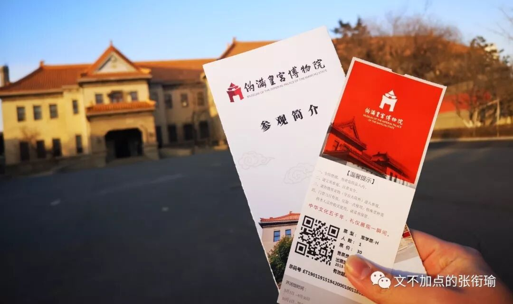
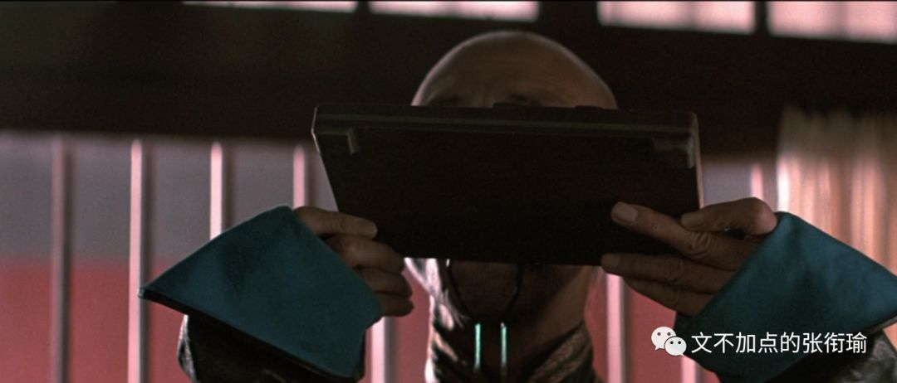
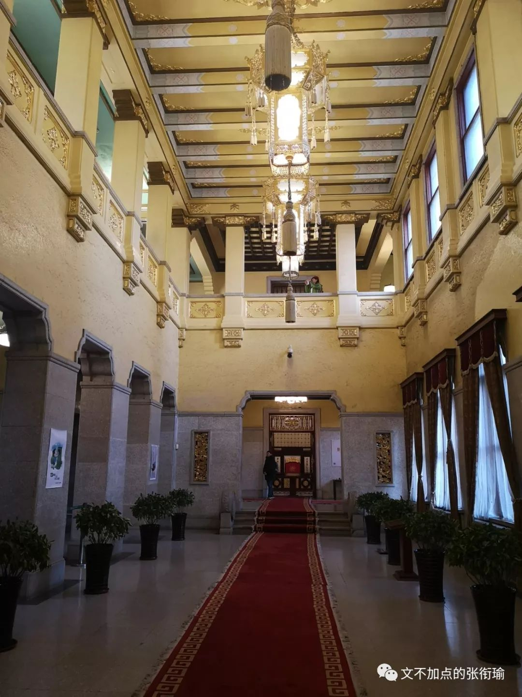
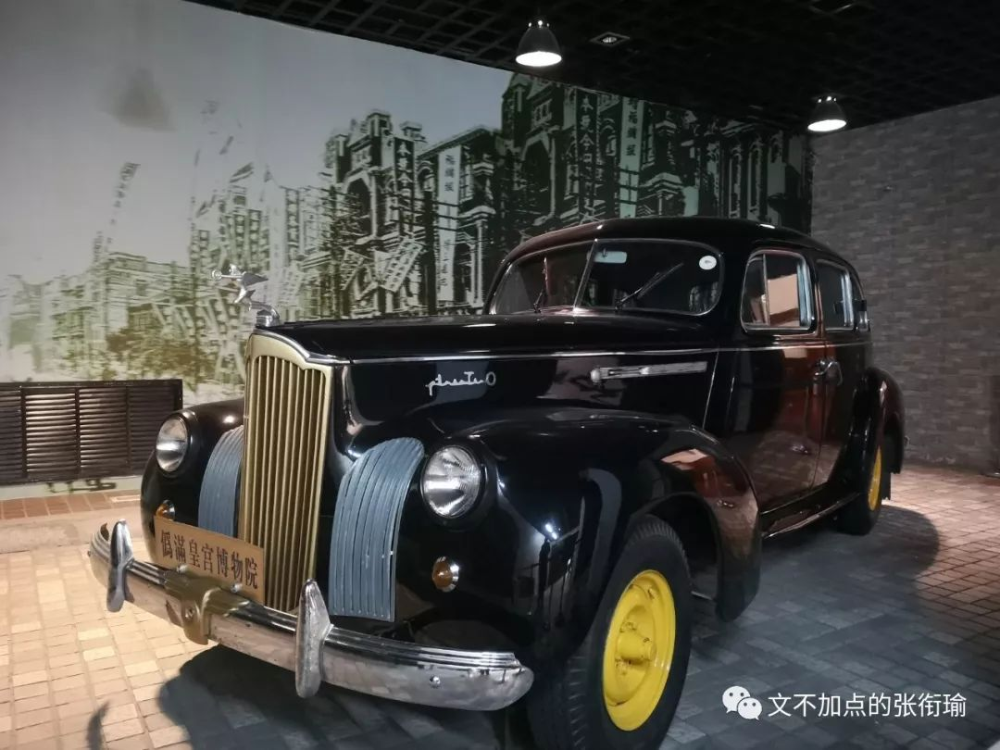
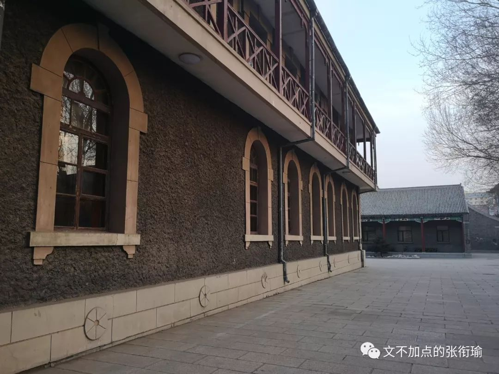
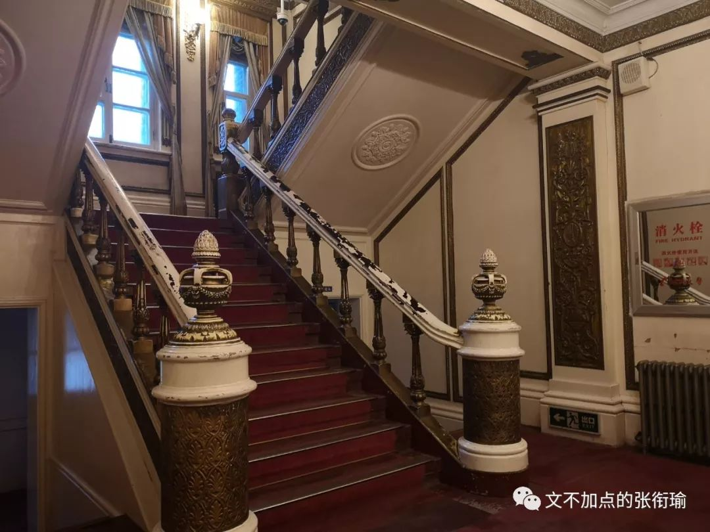
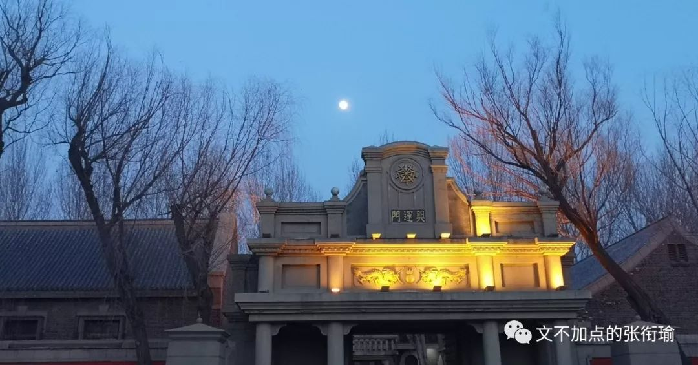

> 张衔瑜的第 100 篇推文 共计 2368 个字

张衔瑜的第 100 篇推文

共计 2368 个字

> 除标注截图和视频外 图都是长春伪满皇宫实拍

除标注截图和视频外

图都是长春伪满皇宫实拍

个人不过是被历史轻蔑的对象。

断断续续地看完了 《末代皇帝》 ，这个上世纪八十年代的电影。

倒不是说年代感受有多大，镜头语言、情感张力、影视文学色彩，洞悉人性的这些导演并不会因为不在一个年代而对世界少了认知。我之所以说断断续续，是因为全片的拍摄手法实在是太稳了，稳当地闪回剪辑、稳妥的人物叙述、稳健的事件架构。所以我在中途，不得不停下来， 因为和现在的观影习惯相去太远。

起初在家里看了一二十分钟，然后昨晚看着看着睡着了，今天写着论文看了会儿去午餐，接着下午继续看。对于一个习惯了看 《四重奏》 这样的剧，并且一直开两倍速，像看网课一样检索信息的张衔瑜来说，正常速度看下来 218 分钟接近三个小时的电影，着实是一个挑战。

不适应我的观影习惯，并不代表我不喜欢这个电影。相反地，这部电影的情感冲击实在是太大，列举几个镜头。 （此处假定读者已经看过了电影，或者至少知道溥仪、婉容、文绣、陈宝琛、Johnston这些名字和他们之间的关系）

第一组镜头是，溥仪 生母过世 的时候和婉容离开伪满皇宫，两次都是溥仪追上去，然后大门关住。前者是在紫禁城中，溥仪只不过是这一方小小的紫禁城内的皇帝，宫外正是军阀混战；后者则是婉容刚刚诞下和司机私通的孩子，尔后弃溥仪而去，溥仪 追车时被阻拦 ；

第二组镜头是，两次溥仪和人说， 我是皇帝 ，别人挑战他 prove it 的时候。第一次也是在紫禁城内，胞弟溥杰告诉他在宫外是一个共和国，那里有共和国的总统。溥仪为了证明，于是指定一个跟班太监说：“Drink the green ink你来喝下这碗墨汁”。旁边的太监忧心忡忡地看向被指定的这个，被指定者也只能如此强饮；

后者是老年溥仪，已经成为中华人民共和国的一名合法公民，方才被特赦。这里导演用了超现实的手法，面对故宫守门人儿子的质疑，溥仪坐上龙椅，从龙椅底下掏出一个沾灰了的装蛐蛐的笼子。

溥仪擦了擦灰，守门人的儿子打开盖子，一只蛐蛐爬了出来，而溥仪已经“故”去。

第三个是文绣的离婚出走，导演这里多少宕出了全片最浮夸的一笔。文绣在从舞池返回的车上从平静、到咆哮地连续说： “I want a divorce. I want a divorce! I want a divorce!!! 我要离婚” 紧接着便是冲入雨幕和川岛芳子上楼。

第四个是婉容吃花，此时溥仪已经到了 伪满洲国 。我在上个寒假才去了一趟长春，去了伪满皇宫， [写了一篇游记](http://mp.weixin.qq.com/s?__biz=MzUzNjE3NzA3Mg==&mid=2247484906&idx=1&sn=18caeb80b686315ad9b7eb5379013e6e&chksm=fafb7535cd8cfc2310bc2efd53e55c9fee406398f8ba990b173f1c933421b92fa0f6af890892&scene=21#wechat_redirect) 。那里和影片中拍摄的样子，几乎没有什么变化。这一段里的婉容，则没有任何言语，只是在觥筹交错和阿谀奉承之间，自己坐在镜子前，摘下的花瓣吃掉。镜头拉近，一行清泪。

我很佩服导演的广角、色彩这些镜头语言的运用，溥仪之为一个个体，在全片当中能看到的不是对于这个人如何地故作丑态、如何的百般鄙视。这是一个人，尔后是皇帝。冲龄登基，这是全世界最桀骜最没有拘束，同时也是最孤独的孩子。

最后一个也是我最喜欢的一组对话，发生在 辽宁抚顺的高墙之内 。彼时溥仪已经经过共产主义改造，在监狱服刑期间完整地回忆了自己的前半生，尔后也获得了一些基本的生活技能训练。

这里是典狱长找到溥仪谈话，问溥仪为什么承认那些自己并没有犯过的罪行。我能理解那种忏悔感，自己虽然什么也没有做错，但是感觉自己对这一切都负有责任。像告解，又像普渡。

电影没有让你觉得，哪些人就是生来应该被憎恶的，哪些人生来就是伟光正的形象。

溥仪他交织着各种感情、思潮，从东方的儒释道、到想去牛津Oxford留学，从以为自己可以统领所有的一切、到皇后婉容因为吸食鸦片过度而在自己面前陷入疯癫的绝望。

《末代皇帝》好在：

溥仪越是想把自己那份皇权夺回来，也是被利用、被当作傀儡、被撕裂；导演拍得越真实，我就越感觉荒诞、越觉得被历史裹挟、越觉得渺小。

对于历史史实，清废帝也好、宣统也罢，溥仪是一个纠结了太多历史史实在一起的悲剧符号。

最近看认知科学，翻开的新篇章叫做 hinder sight，后见之明和叙事谬误 。好的故事为人们的行为和意图提供了简单且合乎逻辑的解释，比如一个人又高又壮很容易让人觉得ta打球很厉害，而又矮又瘦的运动员却总是会让人低估ta的体育竞技能力。这也就是我们说的：好人只做好事，坏人只做坏事的光环效应。与同的还有被相关度分析证伪了的 英雄崇拜 ，和中国人一直以来的 死亡崇拜 。

我们现在来看溥仪，言这个人在历史上扮演着怎样无知的角色，对政治没有一点增益之类的，我们知道他的存在和作为是错误的。这个错误很明显，但这在溥仪的那个叙事角度，根本无法事先知道，谁能知道后见之明这四个字怎么写呢？

结果偏见很管用，没有共产党就没有新中国。可《末代皇帝》从溥仪的视域出发，无疑展现出了并非一贯集体主义色彩的推翻三座大山，而是 从一个个体开始，不能预测未来的 这个人怎么三次称帝、三次退位，最后在监狱内接受改造和回忆。

历史的洪流裹挟，如果仅仅只是看到一个人，啊，ta被巨浪巨浪不断的增长卷走了，那不过是看到了而已。

我欣赏，想写下这篇影评的原因是在于，我在这部电影中感觉到了悲悯的力量。 悲悯是一种同理心、是一种同情心、是一种怜悯心。悲悯不光是看到了人，知道了故事，而还在于和人有情感上的互通：你觉得很悲惨，我不仅看到了你的样子，我的世界里也有几朵乌云飘过，像要下雨的样子，已经起风了。

至于每个人，除了不像溥仪，有那么显赫的地位又正好在多事之秋完成了他的一生，谁又不是被忽明忽暗的生活卷在车底呢？我特地多看了几眼长春伪满皇宫里拍的那一段，也去找了几张我还没有修的伪满皇宫原图。

个人不过是被历史轻蔑的对象。 溥仪越挣扎，越是失去；导演拍得越真实，我越觉得荒诞。也许生活更是一个玩笑。

全片结尾，即是导游在太和殿介绍说，这里是溥仪加冕的地方，又有谁会超现实地想到，龙椅下还有个蛐蛐笼子呢？

往后别人说我们的时候，看到张衔瑜的推文到这里已经是第一百篇了的时候，又会怎么讶异唏嘘呢？

我知道所有的分析、预测、反思，能直接带来哪怕一点点的好处，都是非常机缘巧合的情况。但好在，能作为一个人，步履不停、不围城。

所以，生活还准备了多少玩笑呢？

结尾曲是很棒的一首，文绣的暴雨夜离婚出走。

结尾图为伪满皇宫外，三九天的冷火秋烟。

摄于2019年01月19日。

记于2019年06月17日。

