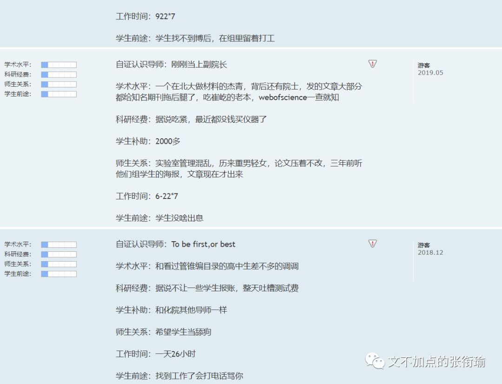

> 张衔瑜的第 102 篇推文 共计 3437 个字

张衔瑜的第 102 篇推文

共计 3437 个字

最近和家人和朋友说话反复提到一句： "我怕自己一手好牌打得稀烂。" 那些抓着一手烂牌的人，乱棍打死老师傅，大家觉得这很厉害，当然ta自己也开心。而如果本来就在攥着各种成果、经历，被当做范本地攒着一手好牌。只稍微次一点点，旋即招致铺天盖地的质疑。

越来越暴戾，越来越看不起妥协。

指我也指所有人。

我觉得不管是读什么学科，去哪个学校，又参加什么组织，最基本的一点应该就是，不能让这个人比没来之前还讨厌这个地方。

学化学，不能越学越讨厌； 夏令营报学校，不能越了解越心寒； 凭着某些爱好去了兴趣组织，不能最后连这个爱好也丢了。

这样就不对。

我最近在做夏令营的调研，随缘投了之后也就只过了一个学校。 但是在我看学校的时候，按照自己的标准和侧写，看下来却越看越心里凉凉的。

这么介绍背景吧：

这是一个战功卓著的学院，一直以来也作为王牌存在于这一所无数光环和荣耀加身的学校。

所以，外人看起来总是无限的风光旖旎，我无论在高中的时候，还是在本科听各种传奇史诗，策源于此的数不胜数。

可细看之下就会发现，和我之前观察到的有些人面试时候的表现同进部之后的作为差异巨大，这样的类比情况甚至在这所容易 近亲繁殖 的大学、学院里更甚。看过去本硕博都至少有一个阶段在这的系内教师，近亲繁殖倒是可以理解，毕竟已经触顶了。

令人心寒的在于：我不想拿自己一个正在求学上升期的年龄，去伴随一个一直在守旧守成的既有大院。

我从未否认这个地方的赫赫战功。

如果没有这批人的奠基，当代人的生活水平尚不知道要下降多少个层次。但问题就在于： 是睡倒在过去的荣誉上，还是夙兴夜寐欣然起行？

也许是阴差阳错地，我在高招的时候到了现在的本科、现在的学院。

私以为： 我们是这个学校里上升加速度最快的学院。

虽然速度不是最快、位置不是最高，但无论是谁都明显地能感受到，这个学院因为积淀和时机机遇，正在经历一轮爆发增长。这时候，给青年学生的感觉就像是在草创创业，我们正在为自己而建设和奋斗，从无都有地垦荒创造。 这就已经非常鼓舞人心了。 可在我将要去的那个亦步亦趋的地方，似乎我看不到这些品质。

又换一种，更数据化地来表达我想说的含义。按照国家自然科学基金各种项目的划分，我对我们学院的投入资金和成果转换来主观感受，差不多还是 20 个单位的投入得到 15 个单位的产出这样，就也还挺正常；

而我调研我现在夏令营将要去的那个地方却发现，他们约莫是拿着 90 个单位的投入，产出着 50 个单位的成果。

我们此前的比较都是，看人家拿资金的能力，哇别人90我们20，真的不如人家； 再拿成果比较，哇别人50我们15，也少了太多了。

可大家比较还不都这么看么，评价一个科研院所好坏以前就唯文章论，现在稍微解除一点点了但也还在看各种项目成果这本来也无可厚非。 于是大家评价，这是一个战功卓著、有着赫赫威名的地方； 内行还互相比一比，谁做的项目可以拿到更多的经费支持，这也跟别人比不了。

但是我们作为求学的个体关心什么呢？

除了别人关心的我们都关心，更还有自己品格的养成和自己的工作激情。在辉煌的投入和辉煌的产出背后，是很难看出来 转化机制本身是较为低效的 。更别提因为人才聚集效应，这里还有这本专业全国最好的人才梯队。

那么为什么会这样呢？

我给的指向就是： 守旧守成，睡倒在过去的荣誉上。

人们都很难避免这一点吧，我也想一劳永逸然后不做事了。但这毕竟不是该有的学习规律，我趁大脑还清醒就该规避这一点。

我为什么说我越看越心寒，原因也就在这里。我怕我如果因为那里战功卓著而过去，最后发现将领已经开始只在为自己、为学院谋求守成的各种荣誉和称号，却不是想着怎么获得新的战功。 那这时候，在我一个新来的人，会看着以往的诸多功绩，觉得更加地格格不入。

博雅塔前人博雅，未名湖畔我未名。任何一个有理想有信念的人，到了这步田地都多少会觉得有些难堪吧。

看多了 报告文学 的人，从我的角度来观察的话会觉得他们的视角多少有些畸形。

喜欢看一些残血反杀、滴血反杀的例子，一手烂牌打得贼好，比如草根创业、贫民窟的百万富翁之流；

另一方面又总是不吝啬展现对一切美好事物和科技进步的敌意，但凡有新的科技产品上市，总疑心是在炒概念。 但凡遇到些新的交叉项目、或者新面孔提出一个新思路出来，总觉得没有经过自己或者信赖的论证就觉得一定不靠谱。

诸如此类的。

说起话来是真的很累。

当然如上的这么多，都是基于：我想踏实下来做点什么事情，才会挑出各种各样的毛病。如果觉得什么都完美了，那对这里面就真的一点建树和建设性意见也没有。 我能够辩证地看待他们，自然也能够辩证地看待自己。

毕竟，自己总是在兜兜转转当中自己和自己不住地打架。

住宿和通勤。

我之所以不在现在挺喜欢的学院和有点臃肿的学校再待下去，很大一部分原因就来自于住宿和通勤。 观察了一下新世相、国馆、WYN这些公号写的租房人群，很有一种可以把自己当月工资的一半用于租房。 其实省吃俭用一些兴许也可以积攒下来，不过这就是一种消费观念和生活方式了，这一半的钱用于在一个通勤方便而合理的地方，租一个有着大大的落地窗的一整套房（而不是一整套房里的某一个单间），将此作为自己安身立命于一座新城市里的心灵港湾。

或许和那些老一辈的农民工没什么不同吧，虽然一年到头在外面累死累活地，但是年终了回家总要置办上新衣裳、给家里点几样新家具或者翻修个几面墙。 我以为这就是最朴素的，留存一方空间给自己的生活了。 我没有直接表现成这个样子。但也会有点近乎于苛刻地把自己的生活留出来一块，就像医学生在任何时候都会像手术时候一样，把自己的周边分出来超净、干净和医疗废物的几块区域。

我也会想把自己的生活布置成这样的样子，只是他们最近总是交叉感染让我非常头疼。

住宿和通勤真的是一件让人生命力产生波动的事情。 而把自己救赎回来，报复性熬夜是一种、暴饮暴食也是一种，就好比各种失恋了之后想要去戕害自己的办法一样，林林总总借助痛觉来检测自己是不是还活着。 有点像人在睡觉的时候，偶尔会突然之间某个部位抬一下，那是大脑在检查你是不是死了。

另外还有导师评价网。

人们可以自由地在网上发布关于这个老师学术水平、科研经费、师生关系和学生前途之类的评价及打分。 当然这个网站我也去看过了。 我能够从公开的新闻传播信息上侧写获取原本学院的信息，自然也会还算中肯地对待这些评价。

不乏有为了报复老师什么时候给自己穿小鞋、使绊子的时候写的话，也听说有老师自己看到了之后，随缘在这个网站上自己给自己写评论。 这都很正常。

看这些的时候只要关注，这个人评价老师坏是坏在什么方面，有没有什么可信度。 对 于人的复杂而言，本来事情也没有什么定论。

而赞美之类的，如果只是 “今天天气好好，你好好看” ，而不是 “诶今天的围巾和上衣的色系搭配和柔和” ，滥竽充数的赞美就不过是流于形式的舔狗罢了。

好当我们现在来回溯一下我上面点出的这些： 背景、投入产出比、求学目标和住宿通勤之类的，就会发现其实都没什么用。 分析起来头头是道，但这些实际上是欲加之罪何患无辞的内容。 只能表现一个人想法很周全，工于分析对比，但是还忽略了很多因素。

比如， 这个集体原本确实如此，但人也很重要。

考虑到既然是个小集体，那么变动也就更大。自然而然，你也许会是生力军，灌入新鲜血液来搞活；你也可能是老鼠屎，一进来就打坏了这一整锅汤。但我是谁呢？前前后后，我现在在观测的时候，组里是这个状态。可按照学制来看的话，年复一年又不断有人加入，这怎么办呢？

所以说，事物总是在遵循着基本规律的时候，振荡盘旋抟扶摇地发展。 同样的外力作用下，质量越小，加速度越大，振荡函数的二阶导影响更显著。 而事物本身的发展规律，依旧在那里。

这就是我为什么总和别人说， 怕自己一手好牌打得稀烂。

看得清清白白地自己手上抓的牌，是自己流汗流泪流血一张一张抓上来的，可以用基本标准来衡量认定的是一手还不错的牌。但如何打，怎么打，打出去会跟别人的牌怎么冲突？

人类一思考，上帝就发笑。

遵循着一个还算好牌的基本认定标准，然后去搏那一个振荡规律中间的点。

这就是悖论里反认知的那一点： 越是平常勤勤恳恳学习的人，到了考试之前越是努力、越容易猝死。 因为不知道到时候的振荡会到哪里去，因为平常不学习的人也懒得把气力花在这里，因为更厉害的人可以平时和考前都不学但一样顶呱呱。没有全覆盖的才多少像个正常人，而不是出人远矣。

碰巧，张衔瑜是个普通人。 没有太形式的作风，也不过于拘泥在一城一池。 很佛的背后稍微有点点斗战的意思。 如果最后齐下牌局而去，像本来随缘来打手牌，结果越来越觉得这一手牌没意思，现在还没到能罔顾的时候。

由是题中有叹：

能够正常安分地过完，就已经是个奇迹了。

