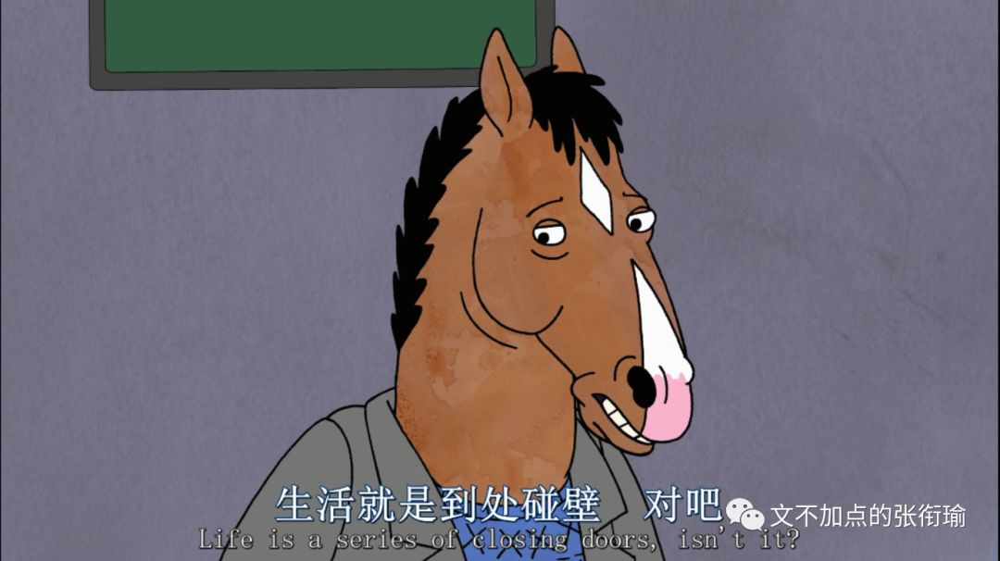

> 张衔瑜的第 103 篇推文 共计 2801 个字

张衔瑜的第 103 篇推文

共计 2801 个字

昨天的晚餐点的是外卖。

我并不认为网恋是多么不靠谱的东西。 因为恋爱是和人，和不是和网络。 网络社交只意味着人出现的方式， 尽管有着莫须有的未被证明的错误，但出现的方式并不能为错误的人背锅。 说网恋不靠谱的话，解释只应当是网恋的人不靠谱。

外卖也日常被诟病。但还好我点的是 吉野家 。毕竟这是我去年同期在 [北京](http://mp.weixin.qq.com/s?__biz=MzUzNjE3NzA3Mg==&mid=2247484463&idx=1&sn=26f02e578de44fd5803481060792fb22&chksm=fafb74f0cd8cfde6d340e13e53082d0877decd84d2213d2a6e5cd4b2b9394788a91d3fb70106&scene=21#wechat_redirect) 实习的时候，给自己的救赎餐。记得在大众点评上点两个14的套餐，然后一顿饭管一整天。还是挺信赖的连锁，这次又点上了。

下楼拿上来的时候，想起自己没有配喝的。 不存在没有想到，早在拼单满减的排算当中，就已经把价格不甚合理的小瓶可乐扔出了购物车。 毕竟，该点多少就点多少，就算买的没有卖的精，但总归能在这里面找到点乐子。到世界城的店里对比过堂食和外带的差别之后，的确外卖会显得比堂食要来得划算也节约时间。

时间是很宝贵的事情。 不管是高效地拿来应用，还是像散财童子一样闲散地随缘弃置。 能顺路完成的事，就可以想想要不要顺便做完。 当然不一定要表现得那么tough顽固，非得锱铢必较每一个时间。 随缘一点，就算和生活眼对眼也没有关系。 上楼，就可以在自动贩卖机给自己添一听330mL的可乐。

> 你们的计划千疮百孔，只要能忠实的执行，就一定能顺利的失败。

你们的计划千疮百孔，只要能忠实的执行，就一定能顺利的失败。

事实上也不是那么需要这一听可乐。即使我到现在也没有想明白，这个一听 tin 有没有什么词源学的说法。 我不需要非得找理由来为这件事情开脱、解释，这就是一件很平常的事： 洗衣机里洗衣服的时候你今天倒进去的洗衣液为什么比昨天的少、今天买的面包为什么拿的是第二排的第三袋、下雨天从操场回来为什么走到三分之二的时候才想起来可以光脚踩在草坪上。

打开这一份牛鳗双拼加唐扬鸡块加两份饭的外卖，这一餐确实是一个人吃了两个人的量。生活已经够苦了。 所谓不受控制地饮酒、抽烟、吃糖和雨中狂奔，各种人们能想到的戕害自己的方式不过是要通过某种外界的物理化学生物刺激，来让自己的机体能够 biologically 生物地做出规律应答，以此确认自己还在这个世界上存活，存活还有着某种回应。

虚怀若谷，大山深处的回音和暴雨之前轻轨站上吹的风。

从自动贩卖机里拿出来的这听可乐毕竟渣得很，一边自己出着汗但喝起来挺凉快的。初中的物理老师培养起来的自然科学认识和基本原理与现象，这样看来还是令人受益匪浅的人生经验。

> 多年之后，才知道真爱是谁，这是每个傻瓜都能拥有的智慧。 多年之后，才想要善待真爱，这是每个恶棍都能学会的道德。

多年之后，才知道真爱是谁，这是每个傻瓜都能拥有的智慧。 多年之后，才想要善待真爱，这是每个恶棍都能学会的道德。

想用可乐来压一压，吃饭的时候堆在食道里，会厌软骨底下一点点的汤汁泡饭。忘记了是在哪里看到的洋葱新闻，说在吃饭的时候配上一杯碳酸饮料，从纯味的苏打水到一杯特调，都是比较合适的餐中爽口选项。我深以为然。

可喝过两口之后，觉得似乎没有很把饭咽下去。也许是我已经吃饱了然后都停留在食道里，也许是最近忽而厌食、忽而暴食、忽而什么也不感觉的高压生活振荡到了这里。 也许就是个错觉。

我觉得下饭剧马男波杰克太理想了一些。这里我没有说反话或者怎么的，就直接取本意好了。之前我看过一些但是不是很全，可我并没有同感像其他人觉得的那样，说这是一部致郁的剧。在想要不要换一部剧来下饭或者干脆关掉的时候，手已经先我一步去把电脑从垫着的词缀词典上撤下来。

这一撤，插在侧面的网线像 crush in 一般刮倒了我放在手边的这听可乐。

我吃饭的习惯一直都把饮料放在侧边，替代电脑鼠标或者台灯的位置一般。除了去喝咖啡喝茶，应该每个人都会这么做的吧。 只是这一次，可乐翻倒在了桌上。

新鲜的二氧化碳气泡在液相里团聚、相对位置上升，这不是一个物理时间上要分出明确先后的动作，只是开始在空间上在那个铝箔纸包着的被我们称之为听装模样里边，而现在则是在用了不知道多少年的木质桌面面板上、存活了快二十年的有机质机体表面和釉质碳酸盐凹凸不平处。

除了有点点惊讶，别的情绪一点也没有。

拿着被漂白之后再染成竹黄色的纸张，铺展开来贴在桌上。不一会儿就有新鲜的液体浸润了纸张，就像一旁并没有觉得这个事情有多大的意义、或是有多么不堪、有多么引人注目之列的感觉。

事情就这么将发生、发生着、发生了。我继续吃着饭，桌子边缘还有些湿润。

饭后喝完了里边剩余的可乐，扔进垃圾桶哐当记下。退出椅子，拿拖把毁尸灭迹。如果不是随后去打球的时候喉咙里像是有酱汁鳗鱼在游来游去，堆着的大肚子在每一下跳传的时候都蹭嘟蹭嘟地动个不停，我会以为事情就这么结束了。

但就算当时不结束，也不会在很长的时间里不结束。 生活肆意倾倒了二十桶的浆糊在广场上，人们站在一旁不知怎么收拾。不管怎么样痕迹终会淡去，刮风、下雨、雪落、安排洒水车一顿猛冲或者用吹雪的车来吹走。可人们想现在就对着干试一试。祝好。

> 如果我们的手上没有鲜血，我们的献身就成了一句空谈，我们的爱就成了金蝉脱壳，我们的清白就成了我们的耻辱。

如果我们的手上没有鲜血，我们的献身就成了一句空谈，我们的爱就成了金蝉脱壳，我们的清白就成了我们的耻辱。

生活把我的每一天酝酿出了各种奇怪的色彩，像音乐厅的指挥不停地被台下的哭闹和咳嗽声打断。 早上该干什么？ 中午有什么事？ 下午还能学多久？ 晚上去打球吗？ 深夜大家是不是都在报复性熬夜？ 谁还会来找我告解，我又会去找谁告解？

循礼门地铁站 的这个点仿佛成为了仅次于 光谷尚都 之后，对于我而言又一个去的频率挺高而又看起来挺不错的机位。

或许等我集齐了很多张这个点的样子之后，就会看到这个点在不同时候的变化，而控制的变量是时间。当然对比起来也没有什么用，非要追寻一个切实可求的意义，我会怀着对 保尔柯察金 同样的尊敬看着您。

去循礼门是因为每次二号线转一号线都会经过，这一次的理由，是终于可以去中南剧院看 《空中花园谋杀案》 。

先锋戏剧里的空花剧组，一些人开始划分音乐剧、话剧、戏剧之类的，哪一部分应该被归在哪里诸如此类的。剧评有说这是包藏着话剧梦想的音乐剧。我依旧粗放地只去体味剧场观众能体味到的剧本和情感。

上文所有引用部分标注成了灰色的，都是来自于今天听的这一场的剧本。就是脑内了而已。

剧院成了类似教堂般的存在。

人们被生活驱赶着，高呼 “圣殿避难” 进入剧场里。在牧师咏叹的晚祷词当中，看话剧演员演绎自己或者别人生活的片段。离开城市的喧嚣太久，返回的时候只记得该如何嚎叫、咆哮和嘶吼。还有没有可能被救回，救赎该缴纳多少的赎金，是什么夺走了变得只剩这一点点的生命力。

进入剧场之前，看时间还早，于是在武汉人艺附近溜达。解放大道上的天桥，我站在路中护栏的正上方，向远处举起相机。

黑云用能胁迫和摧毁一整座城市的压迫感宣战，调色时刻意调亮的视野中央，和低配置聚焦不到的路面，把反射的车灯光轨作弄得愈发迷离。

> 你知道狗为什么摇尾巴吗？ 因为狗比尾巴聪明，要不然尾巴就该摇狗了。 那你知道流浪狗跟流浪猫的区别吗？ 不是狗跟猫的区别，而是流浪狗跟流浪猫的区别。流浪狗是被主人抛弃的，而流浪猫呢是主动离开人的。所以养狗的人比养猫的人多，因为人们喜欢抛弃，而不喜欢被抛弃。 你说人们像狗？ 对呀。如果生活不抛弃人，那么人就会服从生活、顺从生活、取悦生活。 那你说人要是像猫一样选择主动离开，那人会不会也有九条命呢？

你知道狗为什么摇尾巴吗？

因为狗比尾巴聪明，要不然尾巴就该摇狗了。

那你知道流浪狗跟流浪猫的区别吗？

不是狗跟猫的区别，而是流浪狗跟流浪猫的区别。流浪狗是被主人抛弃的，而流浪猫呢是主动离开人的。所以养狗的人比养猫的人多，因为人们喜欢抛弃，而不喜欢被抛弃。

你说人们像狗？

对呀。如果生活不抛弃人，那么人就会服从生活、顺从生活、取悦生活。

那你说人要是像猫一样选择主动离开，那人会不会也有九条命呢？
