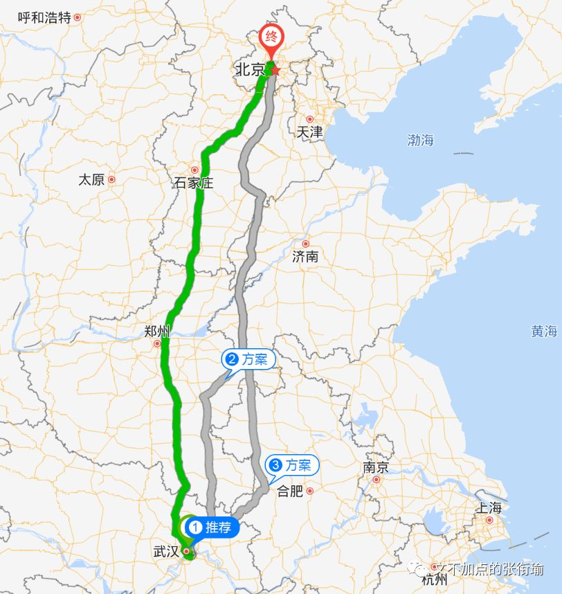
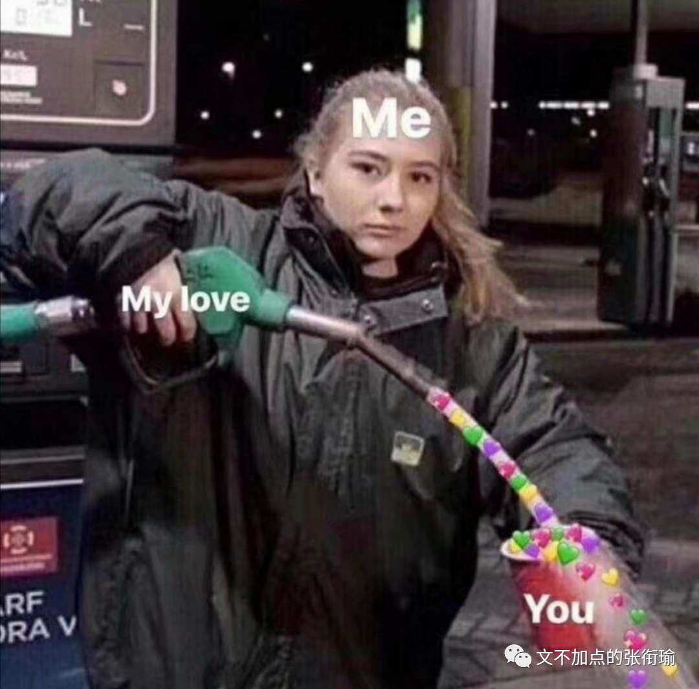
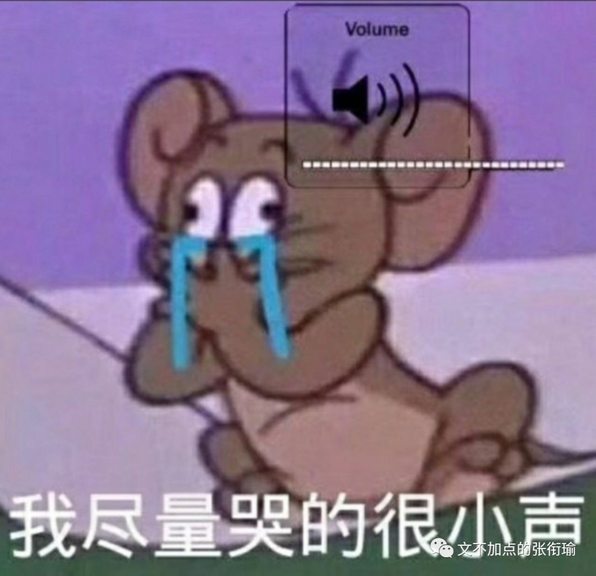
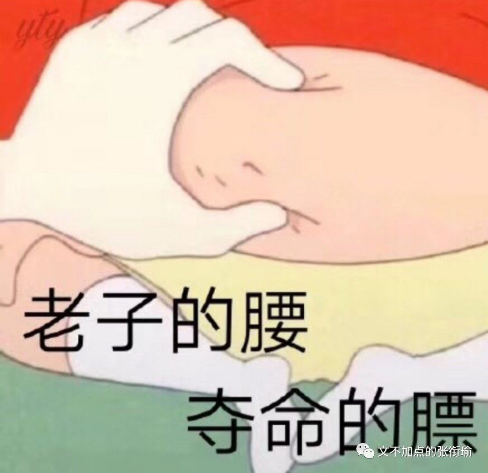
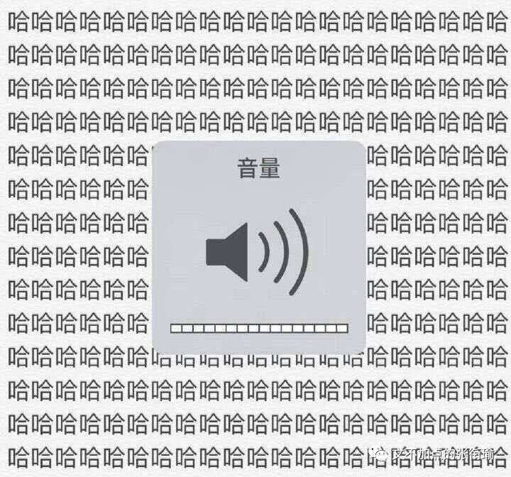

> 张衔瑜的第 103 篇推文 共计 1984 个字

张衔瑜的第 103 篇推文

共计 1984 个字

一千两百公里，是武汉到北京的距离。

京广这条高铁线，我不止一次坐过。

长沙往返北京、武汉往返大连、武汉往返北京、武汉往返长春。

每次都完整地穿过了河南全境，却从未落地。

信阳、驻马店、漯河、许昌、郑州、新乡、鹤壁和安阳。

进了河北，则是邯郸、邢台、石家庄和保定。

这就和我知道从长沙到武汉，闭着眼睛都能想起来是汨罗东、岳阳、赤壁、咸宁北。

她说她喜欢郑州冬天的阳光，巷子里飘满煤炉的味道。

雾气穿过她年轻的脖子，直到今天都没有散去。

有些歌，听着听着就没了，只变成了旋律还留着。

减压是有一整套流程的。

实在是太累了的时候，就可以去写点什么，不管写什么都是可以的；

然后过几天，再又累了的时候，把 荧光笔 拿出来，把自己觉得之前写的好的不好的拿荧光笔画一画、标出来，自我欣赏或是自我批评；

当这一页纸全部用荧光笔涂满，连纸张留白的部分都赏析完毕了的时候，就点上一把火去烧水洗澡。

连减压都有一套流程，做得这么精致、熟练而自然。 像做久了引体向上的人，手指和手掌相连部位的老茧，厚实的保护。

我觉得搞笑的是： 我竟然会因为一些原本就是笑话的事情，而并不以搞笑的方式对待；不光笑不出来，而且越来越觉得糟心；更搞笑的是，在不同的时间还会出现镜像翻转，就像是左手讥讽右手，邻里隔壁的泼水节打翻了我家的热锅冷油； 而事实上，我并不觉得这些很搞笑，这才是令我觉得搞笑的。

所以人们生活着、生活着，妥协、衰老。

空气刘海，如果 缺氧 的话会怎么样？

油腻腻的高附加值产品就会来浸润表面，让一切不按规矩昂起头的部分都只好俯首称臣。

好看的锁骨千篇一律，有趣的肚腩弹来弹去。

最近在路上碰到朋友，不是问我怎么脸这么大是不是没睡好，就是问我一点笑容都没有最近是怎么了（摊手

如何早睡？不要熬夜。

这就像纯粹理性批判，是完全一点用也没有的随缘扯淡，和留白是一个效果。兴许留白还好一点，可以揣测或者脑内白的内容，但是涂彩之后，是一点办法也没有。

你知道爱情和外卖的区别吗？

爱情可以迟到，但是外卖，不，可，以！！！

这有什么好说的，有些人连双标是什么意思，旨用在什么样的情境都不知道就开始出门献宝。一直以吐槽而闻名于世的张衔瑜竟然，一下不知道从哪里说起。

逻辑吐槽太难了一点，那就只好让基础教育这个背锅侠来背一背。

有些话说出来，就是纯粹无聊而已。

你是可爱的人，我是可爱。

这和：

买了一颗草莓回来，把草莓上所有的黑头都去掉；

买了一支铅笔和一个削笔刀回来，先削到手指长，再削到指节长，最后削到指甲盖长，扔掉；

把一页纸上，所有全封闭的图形里，比如“如”字的“口”、“的”字里面“日”的部分，全部涂成黑色。

：和些事情和土味无聊没什么区别，就是认真了一点。

那么我起初骗自己的时候也以为，学一门理学、写一篇论文、参加一个夏令营也不过是太无聊了才来做的事。

后来做起来之后才发现，一切都变得不一样了起来呢。

最近发现华为手机实在是很有城府，阴谋都藏在暗地里 （废话不然还阳谋不成） 。

有个机制我实在没有搞懂，不知道你们的手机是不是也会这样，就是 在学习的时候，手机自然而然地就跑到了你的手里来。

这实在是很令人费解，究竟是用什么来作为我是不是在学习的判据，又是用什么方法突然跑到了我的手里来？

我搞不懂这些，正如我不知道更久远以前说的那些事。

拿鸡毛当令箭，意思是有些人拿一些明显是用来戏谑的话，却作古正经地来和我说。

曾经我没得选，现在只想做个好人。

滑稽！滑稽！以前没得选，现在也选不了。世界，公平而守恒，种下希望，就会收获失望。

冷门专业自然有冷门的道理，这倒并不以学校好坏为转移。

流行性错误认知就说， 只要是好的学校，不管读什么都可以 ；啊你现在拿一个好学校的学位，以后出去了也会有promised future。 滑稽！滑稽！所以我打了删除线。

反倒是好学校出去的人，在这种“普遍错误”的认知影响下，更加走不出去。

往高了走，走不上去，这放到哪里都可以被理解。毕竟强中自有强中手，在普遍自卑的次生思维产物里边，很容易发现。

向下兼容只存在于理论上，并不能实践。

换一种说法，本来就是很一般的公司，如果收到了一封绝好的简历，按正常地来说会觉得自惭形秽。这里的庙太小，安不下一尊大神，或者说留不住这一尊大神。

我们是要保证一个公司良好而稳步地上升，而不是突然做违反基本发展规律的“大跃进”；

又或者换一种思路，这么优秀的条件，跑到我们这个地方来，是不是申请人本来就不行、素质不过硬？

还是说到处都被拒绝了才把我们这里作为备胎垫底？

不可被量化的那些，所谓学习能力、社交能力和发展潜力，在快速流水筛选的机制之下，我以为是很难做到 “路遥知马力日久见人心” 这种程度的。

最后，只能和与同自己，大概匹配的那些做交易。

抛开了向上和向下之后，能匹配的这些，突然拉上了一道 看似不可打破 的铁幕。

所谓看似不可打破，不是说去试了然后知道不可打破，而是发现打破需要很用力、很用力，不仅不一定能打破，而且打破了之后背面是什么现在还不能透视，看不清。

这就是我现在，对生活里一千二百公里的疲惫感觉。

