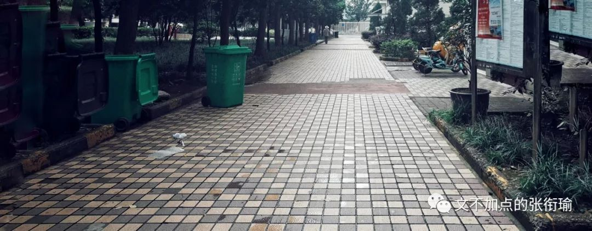
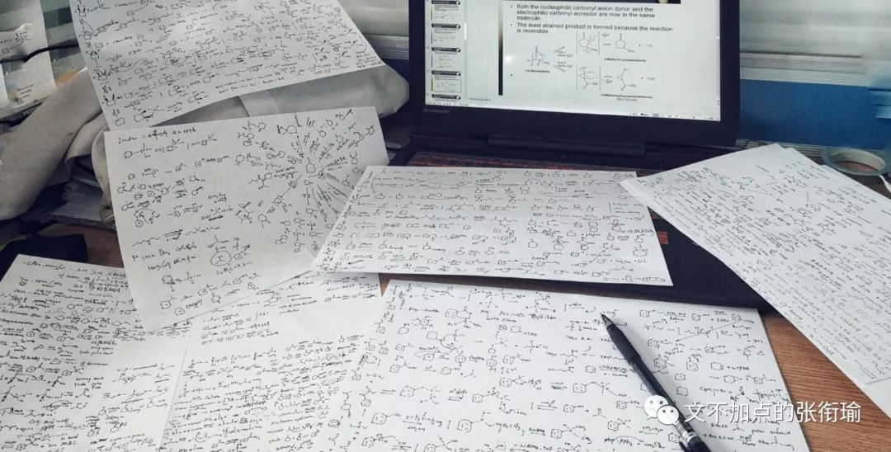
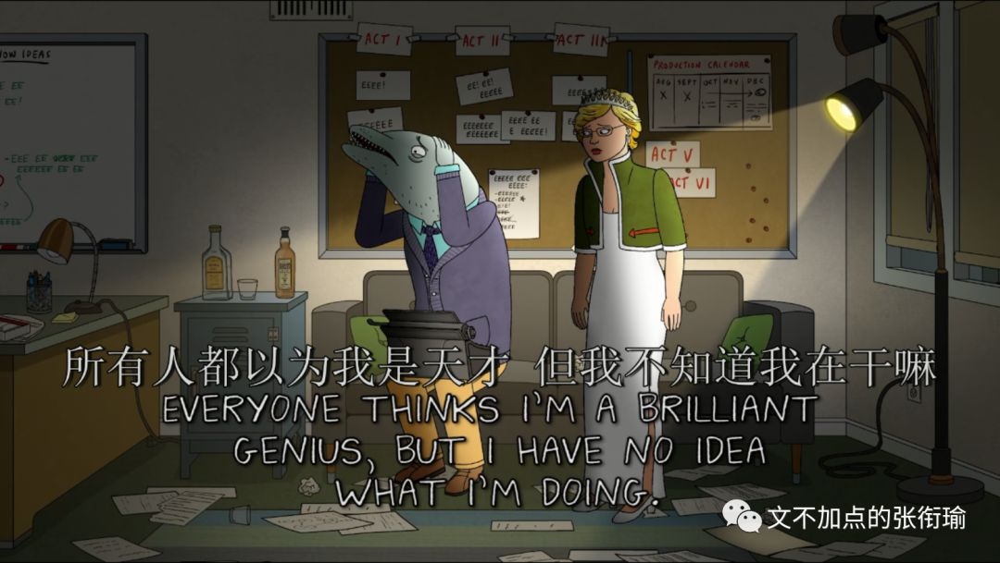

> 我在后台看了下数据 最近的几篇都没有人点开上面的歌 不过这也没什么 我本意也只是放个插件 比留白稍微好一点

我在后台看了下数据

最近的几篇都没有人点开上面的歌

不过这也没什么

我本意也只是放个插件

比留白稍微好一点

> 本文是张衔瑜第 105 篇推文 共计 2795 个字

本文是张衔瑜第 105 篇推文

共计 2795 个字

在极度疲劳的时候，我几乎放弃了向人叙述自己的疲劳，这件还勉强算是在和人交流的事情。

当别人问我 “hey，今天过得怎么样” 或是 “最近看你很不好，能和我说说吗” 之类的，通常情况下我回答 还好吧 ，其实掩盖着非常糟糕的内里。

说了之后其实也一点用也没有，我挖的这些坑，找人来帮忙填只会越填越大。当然也不完全是我挖的坑。回答这些问题也不过是出于礼貌，就像有人告诉你说 “我今天感冒了” ，留白和直男说“多喝铁水”，和回复一个“朕知道了”，本质不过是礼貌而什么别的意思都没有。

不是说完全没有意思，而是，不知道回复什么了。

如果我如实记叙自己的生活，比如今天一早又 早醒 了，一会会之后想给手机充电，寝室就 断电 了；出门看看，整栋楼都停了；

于是六点半，我本来想洗澡，却只能先出去吃个早饭回来看来没来电；到了最近的面馆，发现已经把 店面拆了在装修 ；

和食堂大妈说，要一碗 “绿豆浆” ，鬼知道我在说什么；因为实在是太早，而我想要叫住的时候没来得及。食堂大妈在 滚烫的 一锅绿豆汤里面，拿着大勺子上下翻动了四次之后，从底下筛了一碗给我。不知道这算不算报复，因为我到要走的时候喝起来，从食道一直烫到心里烫得脔心痛。

回来路过寝室门口，楼管阿姨说还没来电，也不知道要到什么时候；我急需一点喝的压一压焦躁的热干面，而自动贩卖机和楼栋一起停了电；想从西小门出去，施工队巧妙地把我所有想走的路都 封 住了；

路过一辆垃圾车。倒是没有和上海现在那样子，有人站在你面前问“你是什么垃圾”。只有其他栋的楼管站在门口，你正好过去，然后楼管巧妙地三点一线你和垃圾车，然后指桑骂槐 “垃圾来了，垃圾来了！ ”

顶着大油头到了罗森，原来罗森也停电了； 看了看饮料的柜子，没有一点想买的冲动。 只是因为想喝点苏打水之类的。

罗森的店员们在争风吃醋，两位男服务生和一位女服务生； 显摆着知道我手上的这瓶冰红茶四块五，似乎很厉害的样子； 我结了账赶快离开。

明明看起来大家年龄都差不多，为什么人家在早上七点的时候还很有活力地在停了电的店里打情骂俏，而我 早饭也没吃完，只想买点饮料然后回寝洗澡明明昨天晚上也洗澡很久一个礼拜花钱最多的就是智享校园的热水APP但还是 什么用都没有。

人们说是压力过大的时候，不适合看密集的东西。今早路过这里的时候，我完全不敢让余光瞟向下方。因为我感觉加速不一样。

当然也真的没有用，因为楼栋停电了，没法用热水，因为 “智能” 水阀也没有电；好像也并不那么智能uha；没热水就没热水吧，反正也不是很冷，就洗冷水好了；冷是冷了点，也没什么关系。

背着电脑包去实验室，回来还得去缝纫店上一粒扣子；

第一个到实验室开门； 打开空调，一会儿就凉快了。 科技改变人们的生活啊（笑

打开电脑，打开PPT，准备一沓A4的白纸准备写草稿。 遇到要演算的和不知道的就写下来好了。

一上午过去了。

眼睛很累但是一点也不饿。

下小雨了，从窗户伸出手，其实觉得还好。稍微 犹豫 了一下因为背了电脑，但还是出门了，直接冲回去吧。

相比起雨伞，我很少在雨天用雨衣。很不喜欢粘在身上的感觉，就像被生活死缠烂打一样；但是今天我 妥协 了，就像最近反复做的那样，和这里、那里，妥协。原因是，雨，比我想象的大不少。

过了绝望坡涵洞再向上的时候，有那么一刻，我停下了车，只想往回去，到涵洞底下躲会儿雨再走；我停车准备返回的时候，一个不打伞也不穿雨衣的哥们， 狰狞着脸 从我旁边过去。是什么让他那么急着要冒雨走呢？

我没有返回了； 我也继续走我的路； 雨越下越大，以至于素来以森林大学著称的学校里，从树林细缝间打下来的雨、和叶脉顶端漏下来的雨一起往下砸。

我戴着眼镜。我 犹豫 了那么一下：摘下眼镜骑车还是继续这么戴着走，因为都看不清；后来决定还是戴着眼镜继续走，因为既然都看不清了，那等雨直接打到眼镜上更不舒服。

记得我一开始说，还要去缝纫店补一粒扣子对吧。

集贸一条街，三百里， 找不到 一个能停车的雨棚；一边想着施工队的恶劣行径，拆我紫菘一条街的店，竟然变成了一个停车场。放在高中我比较猛的时候，应该会想方设法不露声色地搞点破坏；但是我现在真的很累了，不会这么做的。

如果我每餐吃饭的时候，只吃到自己觉得饱了就停下来，那么即使是均量的一碗美食屋的手撕鸡，也最多吃到三分之一的样子；

红色的雨衣像车前框耷拉着，在肚子的正前方，雨衣上兜着深深的一窝水；

我是先把车停到门口，然后穿雨衣回寝再打伞出来好不湿鞋子，还是直接把车停到车棚去这样不淋雨，只是我走得远一点？

前几天复习的内容，过了几天之后又忘了。本来怎么可能呢？十几天复习完三年的内容，然后只为了 应付 一堂考试；

而这堂考试又无所不包地贼难；

之前都是先有复习周，然后再在考试周花上个一两天然后全力攻一门，考完就丢；哪有这样一趟记下来，然后去考。

又一下午过去了。

我平常也不见得，多么能用到这些。 他们的关联就，和大学主修化学的学生所理解的化学，和超市里在食盐、牛奶、洗护专区的导购员所理解的化学差不多。

如果天天在手上过的东西，比如我昨天梦到的 四氢呋喃 和 碘甲烷 反应、导购员每天人云亦云的纯天然有机，自然是什么复习也不需要的。

那是谁造成了这之间的差距？

为什么人们只讽刺不努力和努力了没用的学生，不去看看为什么学了这么多但是依然没用？

应试和现实的差距在哪里？

我们究竟应该掌握什么？

反正我也累了，我考虑不了这些问题。

考虑了又能怎么样呢？

当别人问我 “hey，今天过得怎么样” 或是“ 最近看你很不好，能和我说说吗” 之类的，通常情况下我回答还好吧，其实掩盖着非常糟糕的内里。

我该怎么回答呢？

倒不如回答，挺好的，没什么问题。

因为反正别人也只是礼貌的问候，或者出于好意的询问，没有有活力到要来把你破碎的每一块再重新组装起来。

那既然这样，倒不如让他们继续好好地去做自己的事，不用和你一起 浪费 时间地纠结一些问题，然后其实都没有什么进展也只是让人多感受了一些难过的瞬间。

所以我重新叙述一遍这些事情的时候，本质上就像是 屎壳郎 对出来的一座山然后自己做那个愚公又去慢慢移。

而如果有人来帮我的时候，嘘寒问暖或者打笔巨款，其实越发地不真实。

啊，竟然生活这么惨的之后会得到帮助？

竟然生活惨了之后，就会收到 巨款 ？

当然事实上这两个都是我脑内出来的。 嘘寒问暖微软小冰也每周都告诉我ta升级了，收到巨款在我现在的日子里也用不出去。

我希望，我在很久以后，能说起我身边的人谁 喜欢 什么口味的冰淇淋、 讨厌 什么时候给ta发消息， 而不是 哪个朋友的朋友又在什么令人错愕的时候猝死了；

我想知道 我做的东西真的顶破了科学前沿的哪一方天、或者落地下来解决了产业中的关键问题， 而不是 又和谁吹嘘说自己哪一篇灌水的文章又混到了一个并不匹配的期刊得到了多少的引用；

我想能去完美术馆之后就近到一家店里吃天妇罗、然后背起小包包在附近走一走或者搭公交不远就可以去看一场话剧， 而不是 还在为别人的体制的各种僵化畸形窝在寝室家里不停埋单。

为什么你要害怕鬼呢？

明明害你的全是人。

而且就算躲在夜里忍受着黑，

也没有人能杀死鬼。
