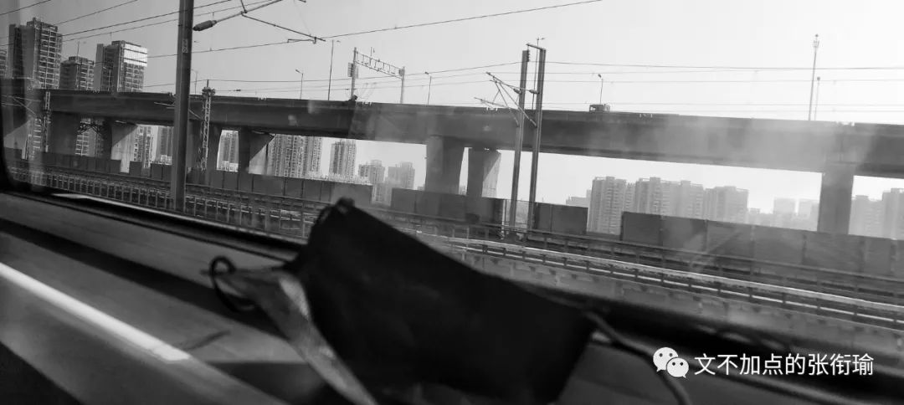
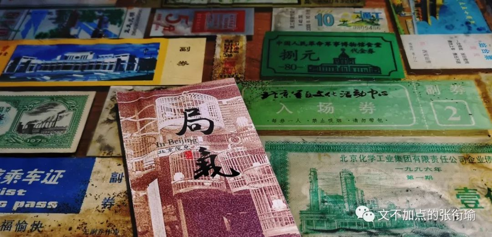
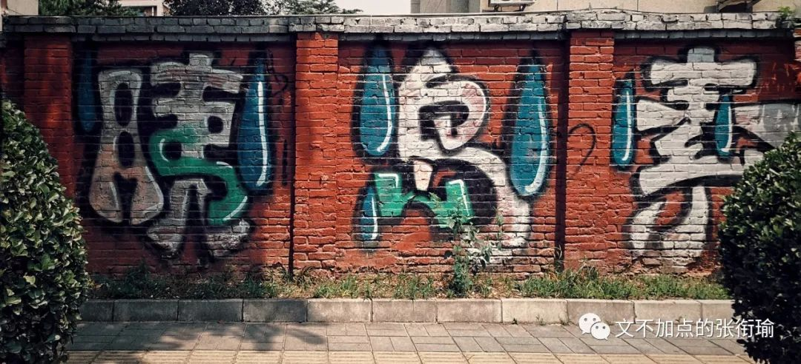
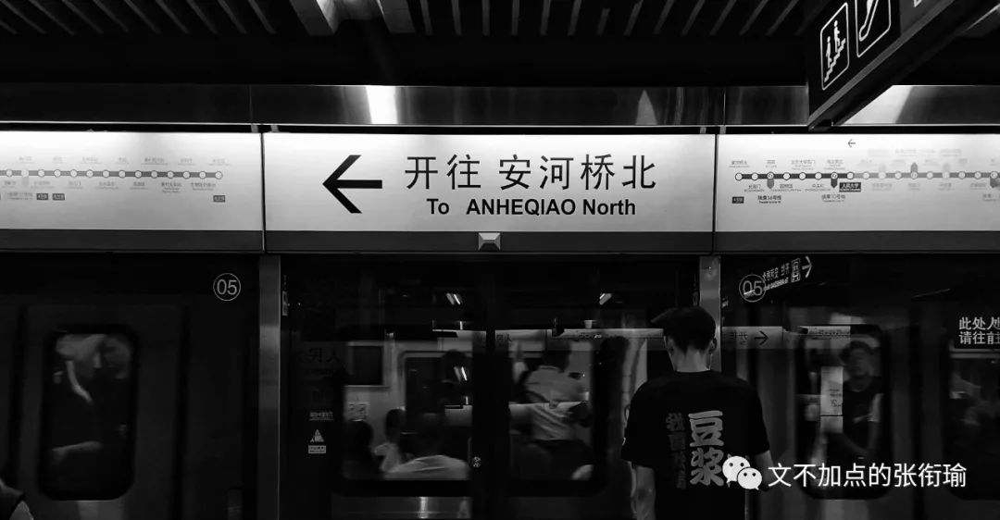

> 又点开了张衔瑜的一篇文 请问你是不是想偷看我的生活 然后来暗杀我？

又点开了张衔瑜的一篇文

请问你是不是想偷看我的生活

然后来暗杀我？

> 本文是张衔瑜第 106 篇推文 共计 3356 个字

本文是张衔瑜第 106 篇推文

共计 3356 个字

北行的列车是沉重的。我像穿着黑色高领夹克的别里科夫，在永夜的日子里戴着墨镜出行。什么也不知道，什么也看不清。

阳光炽热而又毒辣，正如北漂的生活，处处在理想/梦想和现实/苟全之间逡巡。

我并无意于对他人的苦难做出怎样的评述。我以为，最可憎的事情是 对一切美好的事物怀有 不自觉的破坏心 ，从而一点羞耻心和自责感也没有。

这句话我现在要写下来，如果很久以后，我在很长一段时间里感受不到羞耻心和自责感，希望可以提醒自己不要变成这么让人讨厌的样子。

说这个是因为，人们很难完全同理于不是发生在自己身上的苦难。饱暖不知恶寒、学霸不识学渣之类的，这本身是个体认知结构正常限制了的。而不设限的是，人们对他人苦难的共情。 轻飘飘地说几句风凉话刻薄一下，实在是太容易，而理解结构苦难之下的疾苦，实在是太难。

最常见地，一个人腿上蹭破了皮，正流着血，坐在马路牙子边疼得流眼泪。另一个人从旁走过，说一声 “害，我以前穿刺伤得见到骨头碴子了也没多大点事” ，吐了吐舌头走过，逢人便说自己今天如何见到人摔了一跤，嘴上带着戏谑。

王小波在《沉默的大多数》中，一篇关于 《人性的逆转》 有如下的内容：

> 我们吃了很多无益的苦，虚掷了不少年华，所以有人就想说，这种经历是崇高的。这种想法可以使他自己好过一些，所以它有些好作用。很不幸的是它还有些坏作用：有些人就据此认为，人必须吃一些无益的苦、虚掷一些年华，用这种方法来达到崇高。 这种想法不仅有害，而且是有病。 说到吃苦、牺牲，我认为它是负面的事件。吃苦必须有收益，牺牲必须有代价，这些都属一加一等于二的范畴。我个人认为，我在七十年代吃的苦、做出的牺牲是无价值的，所以这种经历谈不上崇高； 这不是为了贬低自己，而是为了对现在和未来发生的事件有个清醒的评价。

我们吃了很多无益的苦，虚掷了不少年华，所以有人就想说，这种经历是崇高的。这种想法可以使他自己好过一些，所以它有些好作用。很不幸的是它还有些坏作用：有些人就据此认为，人必须吃一些无益的苦、虚掷一些年华，用这种方法来达到崇高。

这种想法不仅有害，而且是有病。

说到吃苦、牺牲，我认为它是负面的事件。吃苦必须有收益，牺牲必须有代价，这些都属一加一等于二的范畴。我个人认为，我在七十年代吃的苦、做出的牺牲是无价值的，所以这种经历谈不上崇高； 这不是为了贬低自己，而是为了对现在和未来发生的事件有个清醒的评价。

> 逻辑学家指出，从正确的前提能够推导出正确的结论，但从一个错误的前提就什么都能够推导出来。 把无价值的牺牲看作崇高，也就是接受了一个错误的前提。此后你就会什么鬼话都能说出口来，什么不可信的事都肯信--这种状态正确的称呼叫做"糊涂"。人的本性是不喜欢犯错误的，所以想把他搞糊涂，就必须让他吃很多的苦--所以糊涂也很难得呀。因为人性不总是那么脆弱，所以糊涂才难得。

逻辑学家指出，从正确的前提能够推导出正确的结论，但从一个错误的前提就什么都能够推导出来。

把无价值的牺牲看作崇高，也就是接受了一个错误的前提。此后你就会什么鬼话都能说出口来，什么不可信的事都肯信--这种状态正确的称呼叫做"糊涂"。人的本性是不喜欢犯错误的，所以想把他搞糊涂，就必须让他吃很多的苦--所以糊涂也很难得呀。因为人性不总是那么脆弱，所以糊涂才难得。

我以为，之为人，去做一件什么事，但凡还想多做打算和考虑的人，都不外乎会 “顶天立地” 地考虑问题。

所谓“顶天”就是形而上地，去思考自己做这件事情的意义甚而至于是人生价值；所谓“立地”就是形而下地，拿到哪些物质器件，住大房子、买大车子之类地。

永夜的日子里，所有的光芒积攒起来，都不过在这两座灯塔之上。而现在物质的灯塔突然变得有些黯淡，人们的方法竟然是把原本就很缥缈的精神灯塔用算法进行一下修复和重构美化，以此转移注意说你们可以不看另外那座灯塔。

只有爱情的人能不能活？

我不知道。因为这是一个普适问题，尽管我有所看法，那也只是看法。会造成什么后果，我也只能凭我的认知来预测。

只是我能自主地知道，那样的话我是没法活下去的。

上一段随笔有着实际的背景，在于我如果会去的读PhD的地方，提供的住宿条件和通勤学习条件，并不如我们最理想的那样。或者换而言之，需要克服一定困难才可以。这一段的描述我认为是基本客观的。

主观的是：看到这样一周六天的全天科研、加上周日不定期的加班生活、基本上每天也就回去睡个觉洗个澡就到实验室继续去了，在看到这样的情况之下，我们怎么处理自己的生活。

慢慢习惯了吗？

至少，在我现在而言，我要这么说我读博。如果说我读博，说这几年是要我过过苦日子，睡差一点什么的，让我克服困难，我觉得这都说得过去。

说不过去的是，我来读博，不是为了要来适应这样的生活而来的。

读博本来就很辛苦，这正常。但是读博是为了我出来之后，去世俗地搞大项目、赚大钱、住大房子、看话剧做最中间的位置，君子爱财取之有道，何尝不可。如果说读博还告诉我说，你生活的追求就只有这么一点点，你生活单调得就是实验室食堂寝室，还给你寝室搞成这样然后说你住吧大家都这样子。

那么多人就这么沉沦下来了就是觉得这很正常。

就像那么多人吸毒、惯犯并且觉得那也很正常。我最怕的就是泛庸俗化，骗自己说你可以的可以忍受的。没有了生活追求实在是很可怕，就像没有爱情的婚姻，那以后不管变成了什么样子都能忍下去。

去北京之前，是我最近三年里，最自闭的时候。直到去了之后，慢慢地卸下包袱又陡增包袱。冷水里面冒热气、打出去的球总是擦着边边走。这是我最擅长的事。 也是我最讨厌的事。

去北京的主要目的是为自己之后去做什么而考虑。我就很纳闷有些人果断得不成样子，要么就是左要么就是右，不是通过思考之后的果断而是好像巨婴一样拒绝了思考只想要别人说是什么就可以完全相信的认定。

虽然想不通这个，但是至少也由此解释了，为什么反转一来的时候，认识管定可以翻脸比翻书还快，我说的翻脸是指的掉头转向这种认知转定。

今晚看一篇讲章子欣家里人目前状态的文章，其实让我想到，和吐槽山东大学“学伴”的那些人，认知上都在同样的鞍点里。节选自 《【观见】在章子欣家守了几天之后：替没有被看见的痛苦辩护》 ，应该算是一篇采访记者的随笔。

> 比如他们觉得，痛苦就是茶不思饭不想，就是号啕大哭，就是昏倒在地，这多符合常理啊。 这种痛苦当然有，我多次看到奶奶哭着捶打自己，也看到爷爷瘫坐在沙发上喘不过气来。如果要写，作为记者尽可以不放过在场的任何细节去写，以满足读者的想象。 但是，且不说这对家人可能造成的二次伤害，难道这就是全部的痛苦吗？ 作为在场者看来，这些戏剧性的场面描写，比起家中真正的痛苦，实在太过轻薄。那些痛苦是迟钝的，沉潜的，无声暗涌的。那些痛苦在哪里？它们弥散在这个家庭的每一处空气里，在墙上挂着的“吉祥如意”对联里，在章军赶回家抱起外甥时微笑的刹那里，在奶奶沉默转身给记者端上来的那杯苦茶里。

比如他们觉得，痛苦就是茶不思饭不想，就是号啕大哭，就是昏倒在地，这多符合常理啊。

这种痛苦当然有，我多次看到奶奶哭着捶打自己，也看到爷爷瘫坐在沙发上喘不过气来。如果要写，作为记者尽可以不放过在场的任何细节去写，以满足读者的想象。 但是，且不说这对家人可能造成的二次伤害，难道这就是全部的痛苦吗？

作为在场者看来，这些戏剧性的场面描写，比起家中真正的痛苦，实在太过轻薄。那些痛苦是迟钝的，沉潜的，无声暗涌的。那些痛苦在哪里？它们弥散在这个家庭的每一处空气里，在墙上挂着的“吉祥如意”对联里，在章军赶回家抱起外甥时微笑的刹那里，在奶奶沉默转身给记者端上来的那杯苦茶里。

> 太多的痛苦没有被看见，而更多的痛苦是看不见的。 问题在于，在屏幕前围观的人群，可以理解这种痛苦吗？ 他们能理解，世界上有一种痛苦，会是以微笑表达出来的吗？ 与其说这是考验读者的阅读能力，不如说是考验读者对自身人性之幽微的理解。如果能接受痛苦的复杂，就能接受更多的自己。 关于人性，永远没有非黑即白的答案。一如眼前这千岛湖，在秀美的岛屿和平静的湖水底下，是深不可测的千万沟壑。我们能不能接受人性的复杂？能不能拒绝二元思维？能不能拒绝仅凭猜测得出情绪化的结论？这恐怕是互联网围观时代里，对所有人的质问和挑战。

太多的痛苦没有被看见，而更多的痛苦是看不见的。

问题在于，在屏幕前围观的人群，可以理解这种痛苦吗？ 他们能理解，世界上有一种痛苦，会是以微笑表达出来的吗？

与其说这是考验读者的阅读能力，不如说是考验读者对自身人性之幽微的理解。如果能接受痛苦的复杂，就能接受更多的自己。

关于人性，永远没有非黑即白的答案。一如眼前这千岛湖，在秀美的岛屿和平静的湖水底下，是深不可测的千万沟壑。我们能不能接受人性的复杂？能不能拒绝二元思维？能不能拒绝仅凭猜测得出情绪化的结论？这恐怕是互联网围观时代里，对所有人的质问和挑战。

> 出事后，家里人几天没有正经做过饭，根本吃不下，只能随便应付。我到的那天，他们认认真真做了几个菜，邀请我和同行的记者一起上桌，他们依然淳朴善良，活着的人要吃饭，要活下去。这在我们看来，完全可以理解的事情，姑姑却突然提醒我们，你们拍照还是不要拍到这桌子菜吧，她怕网友看到做了几个菜会骂他们家庭还有心思做这么多菜。 可他们明明是受害者，没有正经吃过饭的也是他们，不是网友。他们凭什么要受到这些指责呢？

出事后，家里人几天没有正经做过饭，根本吃不下，只能随便应付。我到的那天，他们认认真真做了几个菜，邀请我和同行的记者一起上桌，他们依然淳朴善良，活着的人要吃饭，要活下去。这在我们看来，完全可以理解的事情，姑姑却突然提醒我们，你们拍照还是不要拍到这桌子菜吧，她怕网友看到做了几个菜会骂他们家庭还有心思做这么多菜。 可他们明明是受害者，没有正经吃过饭的也是他们，不是网友。他们凭什么要受到这些指责呢？

理解 苦难不是请客吃饭，不是抱着一本佛经或者把某些民政方针背得一字不落就可以了的；同样地， 对抗 苦难也不是请客吃饭，不是再嘲笑一点小小的坎坷在他们的眼里成了偌大的苦难，更不是嘲笑别人反抗苦难时的痛不欲生。

理解 苦难，如果不是完全一致、或者尝试解决自己的生活，那么仅有的办法只不过是理解他人在苦难中的情感； 对抗 苦难，除了自己对抗自己已有的部分之外，还应当想想，是什么造成了这样的事情？

不要扯什么乱七八糟的。如果还坚持像小学老师一样认为 "一个巴掌拍不响"，"为什么ta不去找别人麻烦就来找你" 还坚持这样想法的人，一直要求别人努力努力在努力，不坚持一下你都不敢相信自己可以做到什么样子。这样的言论简直诛心。

我是已经深受荼毒了，而且，也没什么办法来解决这样的事情。

逐渐接受了这一个事实，对不可调和的矛盾，做出的办法只能不去再激化矛盾、或者和矛盾妥协。

比较难过的是，一点羞耻心和自责感也没有的人。所感受到你所做的一切不是无足轻重就是表演作秀。

生活太累了。

累而无功倒在其次。

面对一些minor factor但总是层出不穷，就拿着毫无敬畏心的熊孩子一点办法也没有。

因为他们膨胀得难以约束。

只好慈悲一点。

哪天我成佛了说不定也要去庙里祭拜一下我自己，真好。

抄一首小诗在这里吧，还有这次在北京拍得最满意的一张图：

> 没有人是自成一体、 与世隔绝的孤岛， 每一个人都是广袤大陆的一部分。 如果海浪冲掉了一块岩石， 欧洲就减少。 如同一个海岬失掉一角， 如同你的朋友或者你自己的领地失掉一块。 每个人的死亡都是我的哀伤， 因为我是人类的一员。 所以， 不要问丧钟为谁而鸣， 它就为你而鸣。

没有人是自成一体、

与世隔绝的孤岛，

每一个人都是广袤大陆的一部分。

如果海浪冲掉了一块岩石，

欧洲就减少。

如同一个海岬失掉一角，

如同你的朋友或者你自己的领地失掉一块。

每个人的死亡都是我的哀伤，

因为我是人类的一员。

所以，

不要问丧钟为谁而鸣，

它就为你而鸣。

