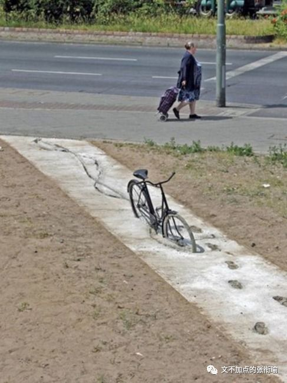
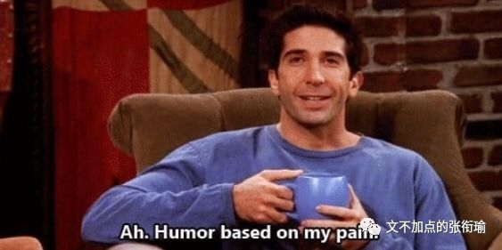

> 本文是张衔瑜第 107 篇推文 共计 3123 个字

本文是张衔瑜第 107 篇推文

共计 3123 个字

凌晨一点，城市里忙碌了一天的夜行动物们，在新雨后打着伞，回到公寓内、关上房门、卸下伪装、露出素颜。

雨滴从疏水的雨伞表面聚集成滴，坠而成股，滩在公寓门外的地砖上。

夜行动物的群体里，倒不见得都是生来基因编码夜行。瘫倒在睡椅上、床褥上的夜行习得者们，其生命力恰如滩在地砖上的雨水。所有的生命力都渗透去了砖缝衔接处，被生活的长风带到了空气中，随缘离去。

人们由是，把那去处叫做 “不可方物” 之地。

这一时间，后来也被称之为 “丑时” 。

中国控烟协会之前发表了一份2018年热播国产影视剧烟草镜头检测，其中 《我不是药神》 因烟草镜头过多获“脏烟灰缸奖”。

其中影片时长116分钟，出现烟草的总时长达1010秒，占总时间的14.5%。

细致说来，这部影片是在教唆青少年去学习、去模仿抽烟这种行为吗？

看过影片的人，也许会回答，未必。

可如果有心理学、行为学相关的人站出来说上几句。也许会觉得这人有些杠，不过也没什么好反驳。

就像推文最开始写的，凌晨一点之为“丑时”的原因，我当然知道什么叫做子 你 寅卯、什么叫做生旦净末 你 。戏谑的，不过是调谐普通的社畜生活和丑时的字面含义。

我有在说我熬夜了吗？

不，我不熬夜。

我有说把雨伞撑开了在楼道里阻塞消防通道吗？

当然不是这个意思。

这不是 “你要这么想，那我也没办法” ，而是我可以好好地来和你解释，比如 《我不是药神》 里每一个人做的都没有错但是事情就这么发生了我们到底该怎么办，比如我说的 《凌晨一点和丑时和水》 明明就只是 “Humor based on my pain. 幽默源于苦痛。” 的一个随手侧写。

我可以解释这些。当有人听不懂、要来问、愿意听的时候，我可以解释得好好地。感情充沛得就像蓄得有如洪泛的东九外路上，突然有一个地方可以收纳了一般。

不解释的原因，不是 “可以但没必要” ，而是解释过很多次了，但没有用。于是就累了，并不代表放弃，但是需要休息。

不解释就不解释吧，就像

【不爱了就不爱了，反正一辈子也没有多长 】

。

狠的心下来的人，连毒品都能戒掉。

不要说这没有用。

虽然我不知道，但 “戒毒所” 是实实在在存在的机构。

倘若只是收容所。

我不继续往下解释了。

不解释是因为前两天去隔壁寝室串门，他们正好有刚刚从家里返校来安心考研，说起还有人在信什么 “可乐喝多了杀精” 之类的话。

如果还要解释什么是生殖细胞的减数分裂，可乐是一杯糖水里边有焦糖色、咖啡因和压进去的二氧化碳。

当然曾经也有人尝试解释过这些，但是得到的答复并不是 “原来如此我知道了” 或者 “减数分裂分为哪些步骤你能说说吗” ，而是一句轻飘飘的敷衍 “噢” ，还有很明显地知道别人根本没有在听你说 “但是反正喝了还是不好。”

以及很自然地可以预知这一认知还是存在于他们的脑海里，并且下次还会继续对别人说起“可乐杀精”、“警惕！这款随处可见的饮料正在毁掉中国的未来”。

事实上，我感觉我们正在经历着“语言的衰退”，与此同时带来的是思维的钝化。

就比如“可乐杀精”这个事情，讲出这句话的人你去跟他说自然科学原理这种需要长期积累和系统化训练的知识，是没有用的。

因为出发点是觉得“可乐”这个东西不好，虽然我不知道究竟不好在哪里，但是有人说可乐杀精，所以我也来说可乐杀精，以此表达我的憎恶。

但究竟是不是杀精我不知道，杀精怎么杀的也不知道，我只是想表达憎恶那么就这么说了。

久而久之，可乐杀精就成为了一种固化认知，因为正好feed适配了 “我认为可乐不好” 。于是才有了那一幕，虽然费尽心思解释了为什么可乐不会杀精，但最后还是收获了一句 “但是反正喝了还是不好。”

这样看起来是根本没有在一个频道的对话，感觉上来说，双方也觉得没有任何的增益。 无非是下次换一个言辞再继续说，前人讲气功、现在讲量子纠缠和什么量子料理。

更精确地来说的，这种“语言的衰退”所衰退的并不是语言本身，而是因为语言的符号化所带来的思维衰退：我们逐渐地只会使用宽泛概念，而不会精细地表达自己的想法；我们满足于给事情定个性扣上了帽子，却不管这帽子扣的是不是松垮，因为我们根本不知道这帽子的内径有多大、外径有多宽。

我在推文最开始戏谑的 “不可方物” ，本意是不能识别，无法分辨，也指无可比拟。其中的“方”，意思是分别（方位）、辨别（方位）、说出（方位）。

《滕王阁序》中有一句是 “俨骖騑于上路，访风景于崇阿。” 其中“俨”通“严”,整齐的样子，应为使动用法“使……整齐”，也就是驾驭。古代驾车的马若是三匹或四匹，就有骖、服之分。中间驾辕的马叫服，两旁的马叫骖。一说服左边的马叫“骖”，服右边的马叫“騑”。骖服和骖騑，又泛指拉车的马或车马。

这样说起来也还和王勃这篇有些关联。 文不加点的张衔瑜 虽然加点了，但究其本意而言， 文不加点 意思是说文章写出来竟不需要任何的修改。点：涂上一点，表示删去。文章一气呵成，无须修改。形容文思敏捷，写作技巧纯熟。

说这些不是为了显示我推文最开始那一篇埋下了多少心机、还记得高中的课文或是标榜一下自己文不加点。

试着想一想从科研圈子里谈 “交叉学科” 、想一想凡在朋友圈发点什么就有护校蛆跑来抬杠说你这 “负能量” 、想一想 不是体现在字面上 而是体现在思维方式深处的 《xxx竟然又做出这样的事情》 ，再想想我们在同一顶帽子之下扣了多少的大头和小头。

我发现我身边很多人，要ta换一种表达方式来说话，这件事他们已经做不到了。

写《1984》的那位英国共产党员GeorgeOrwell，“一代人的冷峻良知”已经提醒大家这一点了。

语言的衰退，或者更精确地说是主动或被动地被符号化，所带来的只会是对生活和世界的认知越来越粗放，越来越沉不下心来感受生活中那些美好和丑陋的细微差别。

自然科学向着微观尺度的探究从未停止，怎么能先就在 生活的十字军东征 中被剥夺走或者自主放下了这一戍卫内心的语言武器呢？

语言，

不考虑自己说的话到底意涵了些什么，

那么思维也会随着退化。

化学界有一句名言，叫做离开了剂量谈影响的行为都是在耍流氓。

1. “可乐杀精”

2. “但是反正喝了可乐还是不好”

3. “可乐喝多了不利于身体健康”

4. “可乐日摄入量 2L/50Kg体重 长达一周或将造成低钾症”

这四种看起来不过是表达方式，我也不一定要在表达方式上和所有的人事都来死磕一遍 （最后这一句里面的量其实是我随口按照隔壁寝室消耗可乐的量瞎编的） 。

如果没有营养学家或者医生来专业地说出 4 ，那么我们至少是不是应该把自己的思维放在 3 上面，而不至于自闭地成为 2 ，甚至继续传播着 1 可乐杀精的恶臭谣言。

如果只是想表达厌恶，那么就好好说。

犯不着找一些冠冕堂皇的理由，然后把自己也赔的人模狗样。

也是因为朋友们都最近越来越觉得，越来越被暴露在了“语言衰退”带来了“思维衰退”的环境之下，这越来越成为了一个issue甚至隐藏的炎症。

不解释是因为那些问题我实在已经解释得乏力了。就像写代码写到疲劳，就把程序在后台开着，然后来码字消乏。总也还是要提出来一些不一样的东西，有主心骨自然不是什么坏事，这能使人在生活的暴风骤雨中因为有所仰仗而保持镇定。

但主心骨不应仅仅只是自己总结的那些金句和让人能舒舒服服躺下的过去荣誉， 主心骨应当是能持续保持创造和反省的动力 ，而不是人能偷走的物质、人能剽窃去的学识。五花马，千金裘。

语言终归只是语言，《我不是药神》里边关于烟草的分镜也只是分镜。

我并非为语言做什么开脱，或者为这部电影做什么开脱。很多的语言也是高度凝练的优秀的语言，《我不是药神》这部电影在去年我去北京实习之前看过后，我还专门为此写过 [随笔影评](http://mp.weixin.qq.com/s?__biz=MzUzNjE3NzA3Mg==&mid=2247484463&idx=1&sn=26f02e578de44fd5803481060792fb22&chksm=fafb74f0cd8cfde6d340e13e53082d0877decd84d2213d2a6e5cd4b2b9394788a91d3fb70106&scene=21#wechat_redirect) 并影响了我之后的实习生活。

最后再换一个视角，我前文一直所持有的这种提到我们应该更关注影片主旨、更关注于作品想要传达的精神和语言所蕴含的逻辑思维能力， 其实又何尝不是另一种视域下的暴戾呢？

只是因为另一种声音过火了，这一种才很是清凉。

会不会像人类解决谜团一样。

旧的解决了，新的又出现了。

从蒙昧，再到蒙昧。

从无知，再到无知。

