> 本文是张衔瑜第 108 篇推文 共计 4534 个字

本文是张衔瑜第 108 篇推文

共计 4534 个字

标题《青春万岁，都要颗粒归仓》

出自我前段时间去看的话剧 《空中花园谋杀案》。

乍一看这个标题，确实会觉得像是最近周杰伦的粉丝围绕着打榜和超话来了一次 夕阳红 狂欢。

我以为，国人所意旨的“士气”、“精神面貌”之类的词语，在语义细节上固然有所差别，但最终都会把群体行为推向一个结果——狂欢。这也就为什么我们在学习各种各样的斗争历史时，总是会提到的“保存胜利果实”，和比较有名的 “袁世凯窃取了辛亥革命的胜利果实” 。

之所以要加上国人，只是因为学习的历史当中，最多的和最细节的是在讲这片土地上之前发生过什么，结果是什么。区分开来是界线以外的事情，除了能其他手段获取消息信息之外，也就只剩了界线以内谈界线以外的宣传途径。

我倒并不是很在意说豆瓣上面提问的人，怎么看待明星一定要出数据这件事情。毕竟自己越在做数据科学，最终数据也只是参与决策的一个方面，比较能量化的参考而已。数据并不会和历史一样，成为任人打扮的小桌子 （上钩拳警告） ，但数据并不是决策。

如果可以说清楚道理的话，当然可以减少很多麻烦。 但夕阳红们用行动来吊打了数据，并且没有觉得这是一种负担。在狂欢中的人，是不会感觉到累的。这不是集体无意识，我更愿意描述为“集体浅意识”或者“集体表层意识”。

不管是出于什么原因，祭奠自己逝去的青春、弥补青春不曾接触的那一块、向正值青春的人证明自己，总归有一个由头。最终要做的不过就是去超话刷一刷，得到的附加值是能好好地在一块自己也觉得新奇的地方宣泄一下情绪、并且像自己同龄的周围人炫耀 （或者用拉入伙的方式炫耀） 、最后在对手最擅长的领域将对手击败 （假想敌？） 。

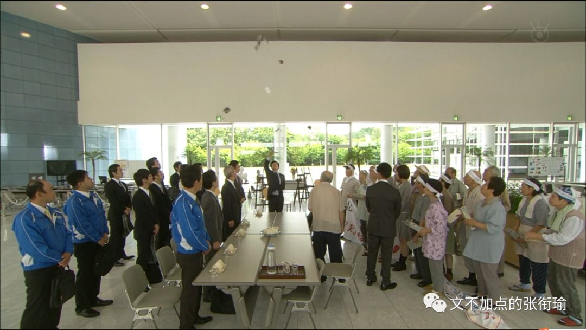

所以这件事情变得完美而恰到好处地抽象出了一个轮廓。而最终也无疑会走向结局，那就是随着夕阳红团队被生活压榨得变形、或者觉得自己已经完美地过了狂欢的瘾，渐渐淡去。

最后 “胜利果实” 成为了给豆瓣提问者之流的一个 “教训” ，成为了一个夕阳红们更老了之后的一个谈资，成为了近几年还可以向唯数据论者证明的一个实践真话。

狂欢的发生是需要契机的，政治上的五四运动导火索历史书说是巴黎和会上的外交失败、体育界在长沙贺龙体育馆外的全场齐唱 《浏阳河》 的导火索是中韩关系紧张时正好中国队踢赢了韩国队。

这次打榜的契机不过是一个提问，而剥离了能看到的不仅仅是一些被认为是比较片面的认知，也还有应该想想的这种认知是因为什么而产生。

狂欢只是裹挟着人往前走的潮流，把多样化的集体扁平成了“集体浅意识”。我倒是无意去辨识这种形式的好坏与否，毕竟只是一项spontaneously自发形成的表象。

如果看过了这一次打榜狂欢，就不如顺便看看最近的香港和京阿尼。

关于 香港 ，有人抄了一首稼轩词在空间里，其中有两句是这样的：

> 四十三年，望中犹记，烽火扬州路。 可堪回首，佛狸祠下，一片神鸦社鼓。

四十三年，望中犹记，烽火扬州路。

可堪回首，佛狸祠下，一片神鸦社鼓。

辛弃疾的豪放词，里面总是有些人们听不太懂的典故。我直接全文引古诗文网的赏析：

（手动提醒，这里应该要有引用）

“四十三年，望中犹记，烽火扬州路。”在此，作者将笔锋从沉寂远去的历史拉向切近的自身，开始追忆住事，回顾自己一生。辛弃疾于绍兴三十二年（1162）奉表南渡，至开禧元年至京口上任，正是四十三年。这四十三年中，金国与宋朝战事不断，连年不绝。而作者虽一直极力主战，并为收复故国不畏艰难，戎马一生，但眼看英雄老去，机会不来，于是心中自有一腔无从说起的悲愤。

下三句中的“回首”应接上句，由回忆往昔转入写眼前实景。这里值得探讨的是， 佛狸是北魏的皇帝 ，距南宋已有七八百年之久，北方的百姓把他当作神来供奉，辛弃疾看到这个情景，不忍回首当年的“烽火扬州路”。 辛弃疾是用“佛狸”代指金主完颜亮。 四十三年前，完颜亮发兵南侵，曾以扬州作为渡江基地，而且也曾驻扎在佛狸祠所在的瓜步山上，严督金兵抢渡长江。以古喻今，佛狸很自然地就成了完颜亮的影子。

如今“佛狸祠下，一片神鸦社鼓”与“四十三年，烽火扬州路”形成鲜明的对比，当年沦陷区的人民与异族统治者进行不屈不挠的斗争，烽烟四起，但如今的中原早已风平浪静，沦陷区的人民已经安于异族的统治，竟至于对异族君主顶礼膜拜，这是痛心的事。不忍回首往事，实际就是不忍目睹眼前的事实。以此正告南宋统治者，收复失土，刻不容缓，如果继续拖延，民心日去，中原就收不回了。

（手动提醒，引用到这里结束）

为什么要谈“集体浅意识”和狂欢，是因为当“集体浅意识”和狂欢如果长期保持或者沉湎于这一状态当中，人会变得有些奇怪。

京阿尼 之为一家动画企业，是一群具有匠心的、用自己的实际努力在创作、为了美好的理想而奋斗的人所共建的企业。如果说连其他国家、种群、社群内，一些一直在追求的美好、一直在用自己的双手打拼创作的人受伤，这也要被拿出来嘲讽，我以为嘲讽者自己的内心就已经被妖魔化了。

巴黎圣母院 亦然。如果激进到底的激进分子，认为说欧洲总有一天要被征服，到时候巴黎圣母院也将作为国宝被珍视，现在只是托管给你们而你们没有保管好，为此“我”感到气愤，那这样的人我觉得也不错。但倘若只是一味地讽刺，拿圆明园来说事。

偏激和偏执 ，我觉得用在对京阿尼和再久远一点巴黎圣母院的评头论足人身上，似乎他们还够不着这个词汇。

那到底怎么样才可以呢？

美帝在种族矛盾上，约莫从历史书上“罪恶的三角贸易”开始、到南北战争出来了林肯、以及后来的马丁路德金，我以为是另外一个主题，但内里仍然是偏见、一群人对另一群人的压迫。

想到另一个视角来自于 《绿皮书》 ：

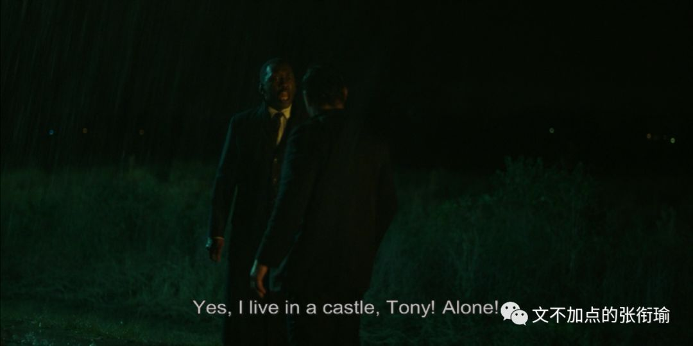

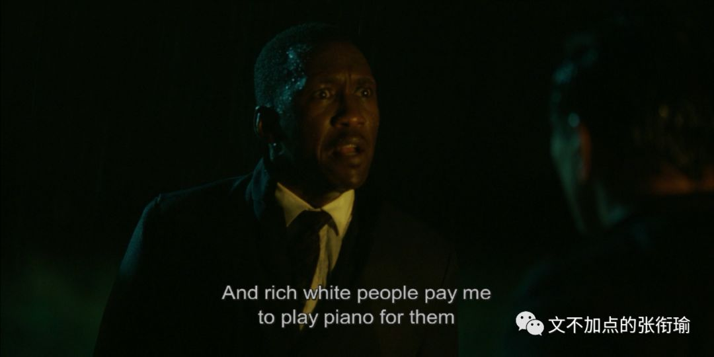

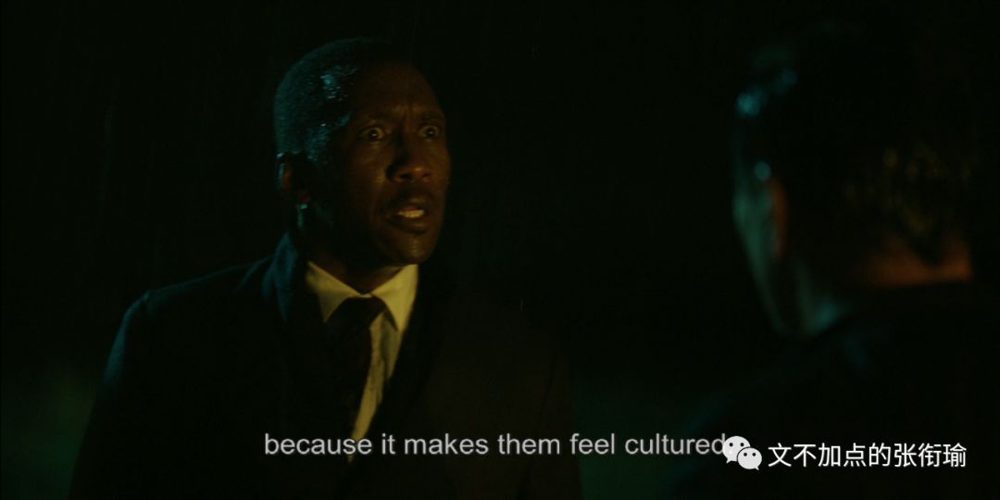

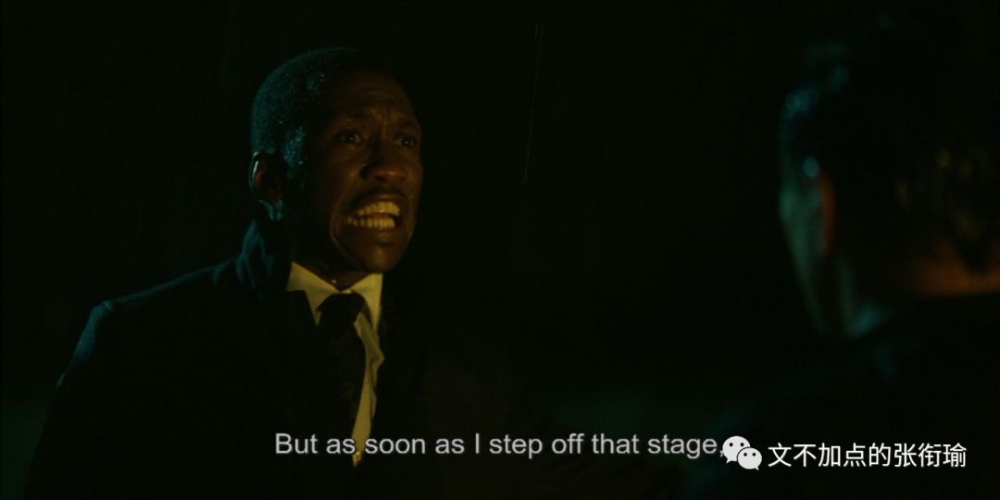

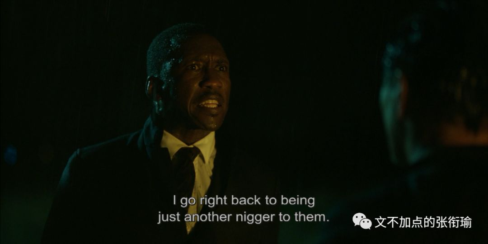

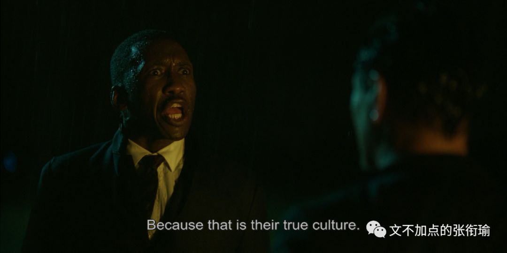

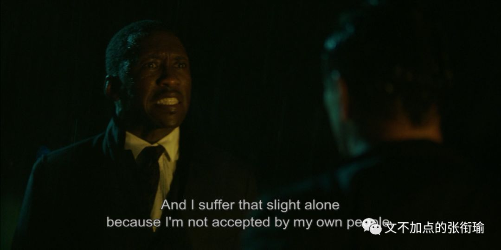

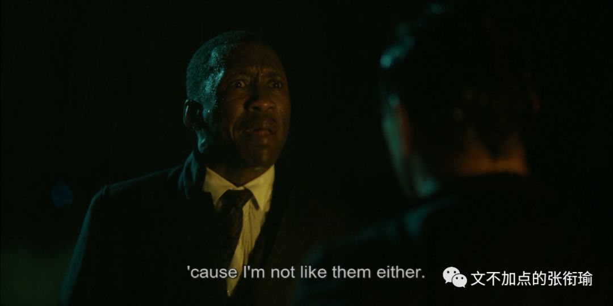

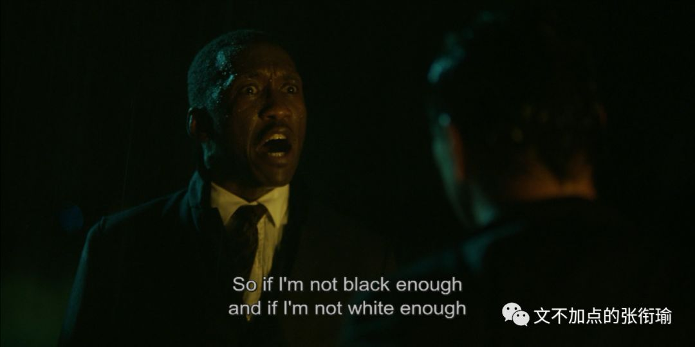

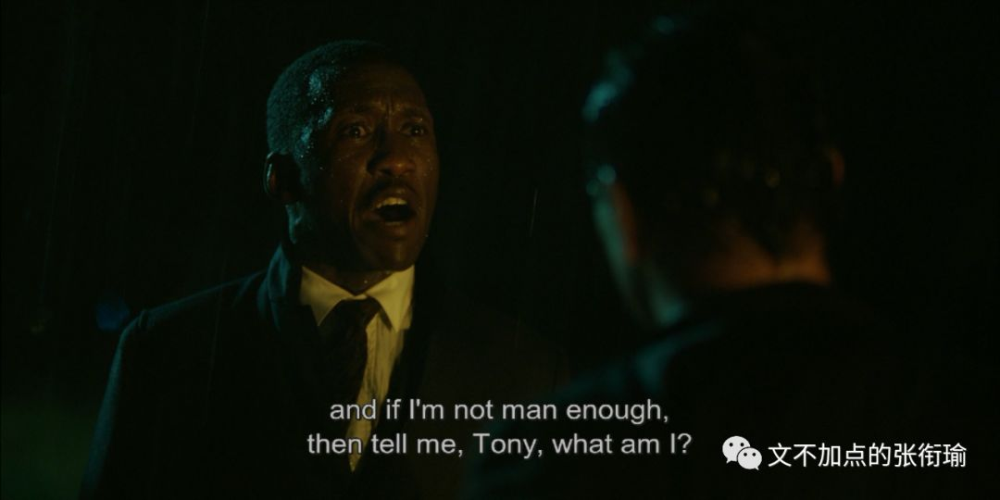

“集体浅意识”和狂欢，会让人意识不到自己做这件事的初衷是什么、最后的发展到哪里去，这就是斗争历史为什么要求我们“保存运动果实”和尽量减少“运动式执法”。说到底，这两个要求也很浅， 掌握适度 本来就是很难的一件事情，不管是火候还是狂欢。

形式固然重要，但土偶木梗也叫形。神位背后是真的有神灵在坐镇，还是仅仅用着一块木头进行了开光装脏这些所谓的流程，我以为这是不一样的。往往来说，革命进行的最激烈的那些狂欢者们，沉寂下来就会变成最顽固的和稀泥 “大过年的”、“来都来了” 。

顺便想起一个片段，也算换一种视角，在《成龙历险记》当中，老爹说：“要用魔法来对付魔法。”

我也就是在自己的日记本里、在公众号上写一写我看待所谓的狂欢和“集体浅意识”的心路历程，并没什么想去做什么或者将会怎么做。

又想起一个片段，也是在这个层面的视角底下（和之前不一样了没有过渡因为我懒），在 Legal High S01 E09 当中，也有一段古美门律师接受了受化学厂排放毒害试剂影响的老年村民的诉讼委托。

后来当化学药厂给了村民们一些小恩小惠，村民们觉得这么说来似乎也可以和解了，于是向古美门提出说，我们觉得这样也就够了。

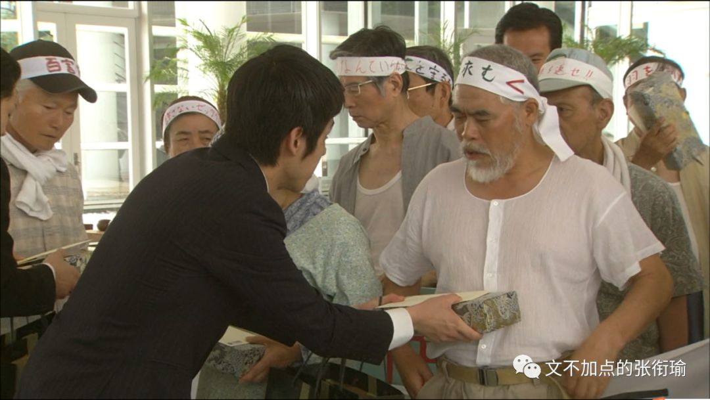

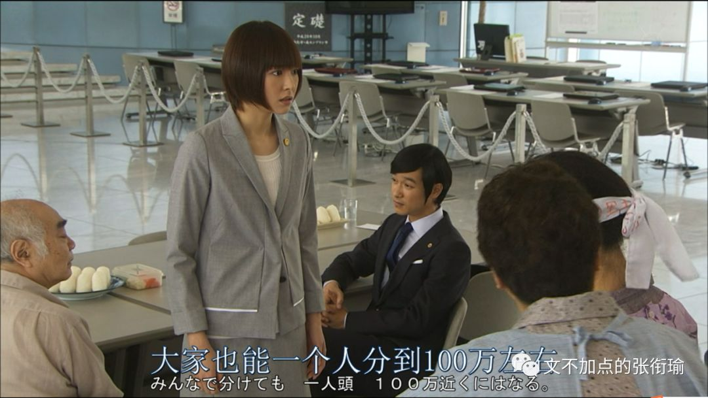

但古美门就非常的刚。

（由于迅雷影音不知道怎么带着加载的字幕截取，而我也听不懂日语，所以找了一段当时的台本。引用只能一次打三百字还是四百字，我在这里指明一下以下台本内容均为引用。）

古美门：我很钦佩大家的想法，不愧是心灵相通的羁绊之乡，那么就这样办理手续了，小黛之后就拜托你了，再见。

黛：律师，这样就可以了吗？

古美门：可以了，他们说好就好了。对吧，各位。

村民：对的这个世界上，有比钱更重要的东西，对吧？对的，对的。

古美门：看吧，他们如此满足的表情，盲珠雪怪蟹自助旅游回来的大巴上，就是这样的表情。小黛，你记清楚了，这就是这个国家根深蒂固的 互舔伤口 这一文化，人类习惯被长期饲养的话，就会像这样变成寄生虫一样的生物。

村民：寄生虫？你说的是我们吗？

古美门：除此之外还有谁？连这点自觉都没有，我真心羡慕，就连被欺侮了也不知道，就这样近了坟墓。真是幸福的人生啊。

村民：你说的太过分了吧。

古美门：十分抱歉，就像我最开始说的一样，我十分讨厌像大家这样悲惨的老人。

村民：喂，臭小子，你想干什么，你有什么了不起的。

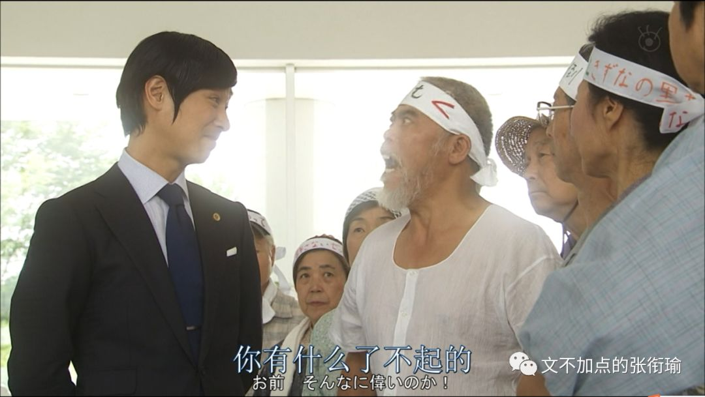

村民：就是，不知道尊敬年长者吗？我们活得比你两倍还长。

古美门：活得比我两倍还长，却还不清楚自己的处境，我才好心告诉你们，知道吗。大家是被国家抛弃的人，是弃民，是为了国家的发展，消费退休金的老人，因为没有价值了，所以用畚箕扫到一起赶到角落，给点羊羹让你们闭嘴， 你们就是寄生于大企业的心地善良的寄生虫。

黛：律师，不要再说了。

村民：你才是寄生在寄生虫身上的细菌，你对我们有什么不满意的？

古美门：过去，在这片土地上，有着广阔的桑树田，因为每家每户都养着蚕，他们都能纺织出美丽的丝绸。以此为傲的人们。不知什么时候开始将这里称呼为 绢美 。

养蚕业衰退了之后，就转为种水稻，种出了适合酿制日本酒的优质大米，但是因为政府的农地改革也衰退了。这以后也没什么特别的产业，人眼日渐稀疏，通过反复的市町村合并发放的补助金熬过来。

5年前，化学工厂来了吧，掀起了反对运动之后，得到了一笔小钱，很多人连农业都放弃了，还建了交流中心这种，没有意义的气派的建筑物。明明不用还牵了光纤，真是可敬啊。

抛弃了 绢美 这个陈旧的名字，改成了 南蒙布朗 这样时髦的名字，是多么的时尚，流行，最前端啊！

然后现在土地被污染，水源被污染，被疾病侵扰，就连这片土地都有可能不能再住了。 但是拿到了商品券，也感觉到了诚意和羁绊。

实在是难得，真是太好了，太好了！这样土地和水都能再复苏了吧！病也能治好了吧！就算工厂继续排放污染物，但是肯定不会再有什么问题了吧！因为你们有羁绊在！

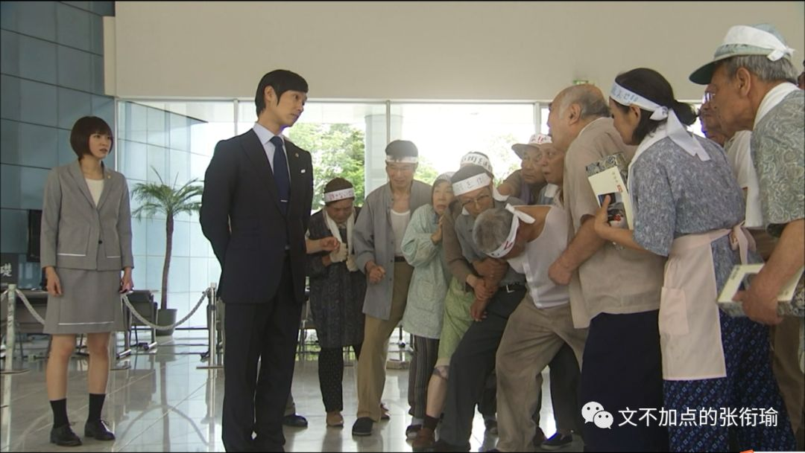

村民：像你这种人，怎么会懂我们的痛苦。你所说的，尽管不情愿，但是我们还是知道的，大家无论如何也不甘心，但是，大家都拼命压制自己的怒气，让自己接受。

古美门：为什么？

村民：什么？

古美门：明明知道自己被当做垃圾处理，为什么还逼自己接受。

村民：因为我们年龄都大了。

古美门：年龄大了又怎么样？

村民：尽管身体不好，大家都一路努力过来了！

古美门：那又怎么样？所以就希望受到怜悯吗？所以就希望得到抚慰吗？所以别人一对你们好一点就会很高兴吗？难道你们不觉得对不起祖先？不会愧疚于子孙后代吗？什么南蒙布朗， 绢美村 明明比真正的 南蒙布朗 还要美得多，为什么你们都不这么想？！

不让任何人承担责任，不想看到的东西就回避，大家能友好地生活下去就可以了。但是！如果想夺回值得夸耀的生存方式，就必须看那些不愿意看到的现实，必须带着身负重伤的觉悟前进，这才叫做战斗！有怨言的话到坟墓里面说！

钱不是全部，钱就是……是你们向对手报一箭之仇，见识你们骨气的方法，是夺回被剥夺的东西和被践踏的尊严最合适的代价，除此以外什么都不是

锦野春夫先生，你以前是邮局局长，这个村的邮局好几次都差点倒闭，你保护着它坚持到了最后！

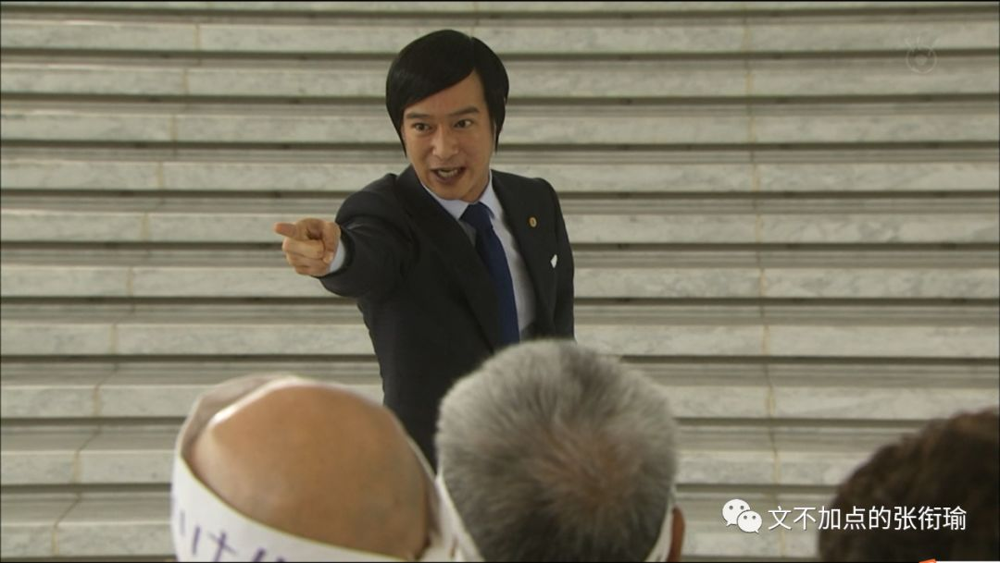

守口三郎先生是小学的校长，村里以前的所有孩子都是你的学生！

您夫人久子是街上百货商场的化妆专柜月销售记录的保持者！

乡田让二先生实际上开垦了100公顷的土地！镰田里子女士和丈夫一遍做着农活，还兼职了好几个工日！

富田康弘先生是商店街的会长，每年炒热祭典气氛，曾经还被成为Christel之王！

板仓初枝女士明明一介女流，还操作起重机，养育了6个子女！

将这个国家从战败的谷底，建设到如此繁荣期的你们大家，一定在心中的某个地方留着这样的灵魂！

如此期待过的我真是非常愚蠢，听好了，希望不要再把我卷入你们消磨养老时光的事中。心地善良的寄生虫，互相舔舐着伤口，平稳安和地走向人生的尽头吧。那么，各位，再也不见！

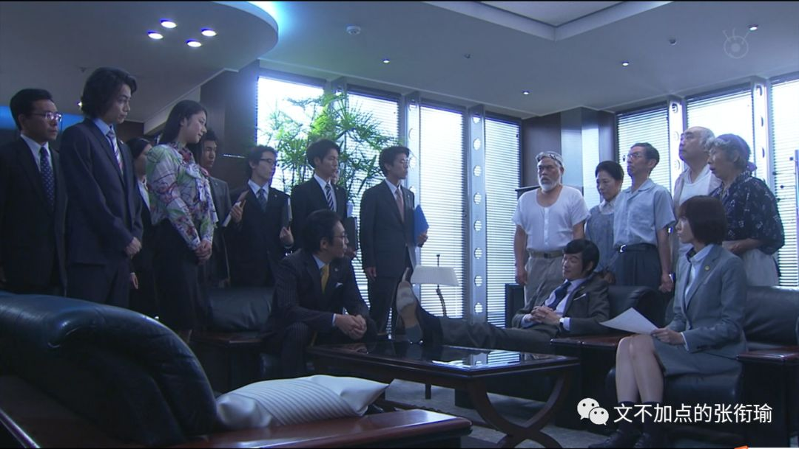

（手动提醒， 引用到这里结束 ）

（讽刺“改地名、楼盘名”？）

（This is the end. ）
