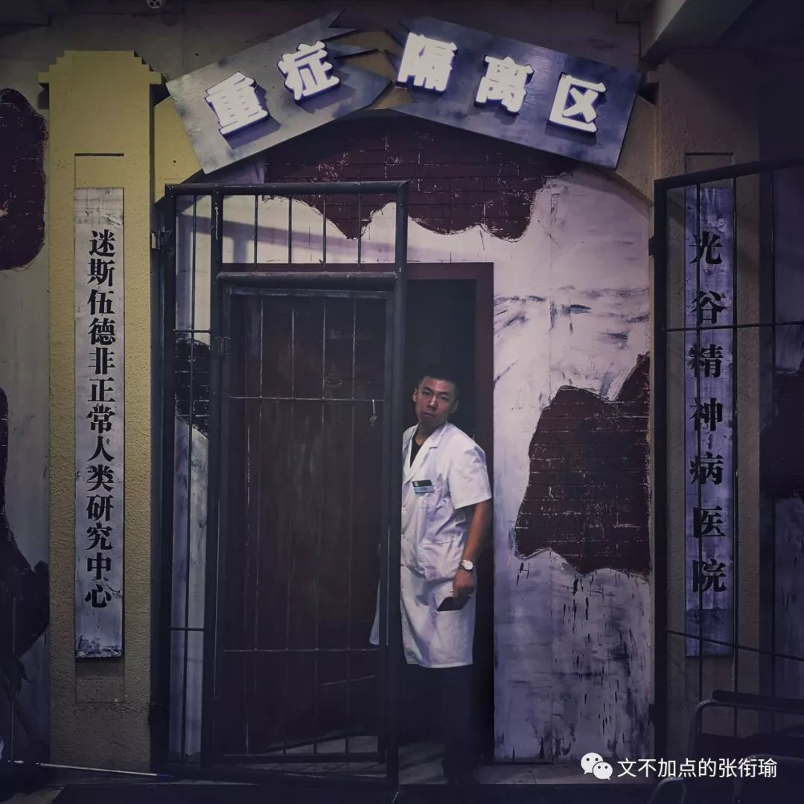

> 本文是张衔瑜第 109 篇推文 共计 1594 个字

本文是张衔瑜第 109 篇推文

共计 1594 个字

空腹的人可以吃饭吗？

正如你问一个二十八岁左右、被生活磨平了棱角又磨出了拐边的社畜：

“单身的人可以结婚吗？”

原本只是一件普普通通的事情。

因为人们对自己的生活有了要求，对周遭的一切开始产生不满并感觉到自己为此负有多多少少的责任，从而故事就在那个时候发生了。

我有一个朋友喜欢每天都发票圈。

很多并不是来自于获得关注的心理倾向，而是想着如果哪天有老朋友想来找自己说说话，可以 自然而然地 过来聊一聊最近的生活状况，倒不必再找别人打听自己最近又在跟什么项目、给斜杠后面增加着哪一个tag标签。

还挺喜欢摄影的，把目力所及的景象用 电荷耦合器件 进行规则化记录、而后一刀一刀裁剪画面、一点一点拉RGB曲线到自己想要的风格。

回头翻了翻我自己的票圈。从北京回来也有快十天了，我看了看配图下来，只有是去街道口吃烤肉时候的照片。

按说如果我出门了的话，随手抓拍，对象 （就只是象棋里面的一对“象”、Python面向对象编程的对象） 可能只是在路边的一个标志牌、掠过天空的惊鸿、普通的午餐或是等地铁的旅人。

这本是 扫街 的乐趣所在。按照自己的方向而去，但是并不以此羁绊自己。

因为方向只是一个方向，让这次随心所向不致于太过散漫、不致于在迷茫的时候感到无助。

能有闲暇时间、闲暇心情出个门，有一个小方向但又不苛刻地自己勉强自己，这真的是最好最好的事情了。

在能恒温恒湿的屋子里，虽然不一定要求得那么严格。

码字的时候听到窗外下起了雨、出门被热浪推了回来、随时都能舒舒服服地洗个澡而不用太担心停电停水会给生活带来多少困扰。

理想的生活里应该有能不被延迟干扰观影体验的王家卫、李安，有朋友不管能力大小但怀着像陈虻、柴静、欧阳常林对待新闻与传播的态度，可以高声地朗诵雪莱、济慈甚至可以的话自己自导自演拍下来剪辑成全本的话剧《茶馆》，可以去用长沙话和人交流在餐馆点单、在摊贩买菜、在家里说笑。

没有peer pressure是不可能的。当我看到我的朋友们都趁着假期在天南海北走来走去：稻城亚丁、苏杭乌横、伦敦剑桥、新奥尔良。

就算不是旅行摄影师，只是出出门走拍，一张张照片在像我这样腿脚不便但想象力丰富的人看来就已经在用我习惯的后期办法来重新架构一张图、 反演 拍摄者所在的视角。

而我还在和算不对的数据死磕。还在为自己新开的方向改了第 十八 稿，却要推倒 70% 的内容然后重新来过。

我以前觉得自己已经生活很紧凑了，再紧凑也不可能更紧凑了，然而生活却屡屡对这一底线发起质疑和挑战。

所以后来我都不这么说了。

毕竟以前在我还有 “一星期”、“一星期” 概念的时候，在工作日里挑一天出门然后周末继续工作，差不多是我合适的张弛方式。

但是现在也没有“一星期”的概念了。

这几天如果不是中间有一个自己的农历生日，我甚至不会出去吃那一次烤肉。其实就是暗示一年只有两次。 （最后的倔强是农历阳历都可以）

> 你是我温暖的手套，冰冷的啤酒，带着阳光味道的衬衫，日复一日的梦想。

你是我温暖的手套，冰冷的啤酒，带着阳光味道的衬衫，日复一日的梦想。

说起生日就正好想起在 Fleabag《伦敦生活》S01 E02-03 里面，女主的亲姐姐某一天突然到了她开在伦敦的一家门可罗雀的咖啡餐吧里面：

剧中因为姐姐自己要生日了，但是想以此聚拢自己身边的同事们努努力、来获得去 Finland芬兰 的升职机会。

于是走到和自己磕磕绊绊的亲妹妹的咖啡餐吧里边，这里全程的想法都只是安排女主去做，其他的包括时间周五晚七点半的“Surprise Party惊喜派对”，都是这位姐姐自己一手操持。

因为是这位姐姐自己的升职事项，姐姐自己的生日，放在姐姐自己的手里比较稳妥。

这里的稳妥，包括什么事情可安排给妹妹做、什么时候该从容淡定、什么时候进入策划派对的工作状态，甚至包括什么时候该表现得惊喜。

如果吃饭感觉到自己吃饱了，就不要再吃了。

除了会胖，吃饭的目的本来就是feed身心。

身体机能已经反馈说吃得可以了，又不是强迫症要吃完，对自己好一点，就不要再吃了。

未来的你会感谢你现在少吃一点，不然会追刀的。

最后是女主给姐姐过的真正的小生日，蛋糕仅仅只是女主早上在墓园里晨跑时候带的一块小面包。
