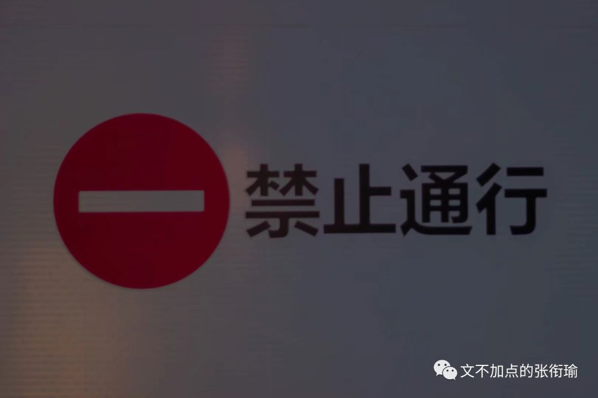
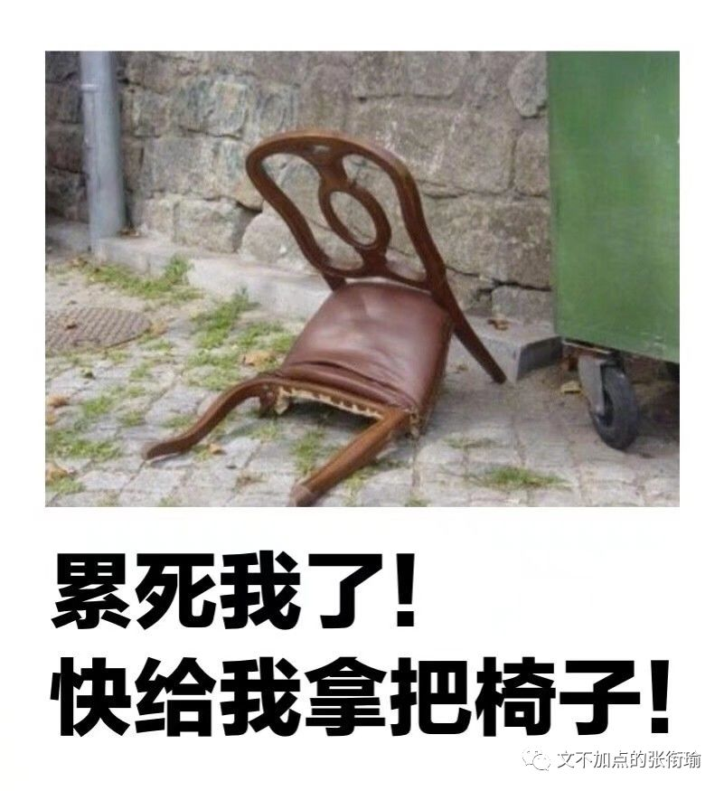
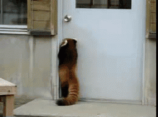

> 本文是张衔瑜第 110 篇推文 共计 1242 个字

本文是张衔瑜第 110 篇推文

共计 1242 个字

虽然每天被生活刁难，但其实还是想在没事的时候再刁难一会自己。最近的办法是对于困难的生活，怎么 换一种表述方式 来倾诉、表达、描述生活中的这些莫名其妙的事情。

即使是看起来，生活中好像也就那些一件一件的事情，单开来看都没什么大不了的。或者即算是有真的很严重的，那也只是一件事情而已。而生命力就是在这么 一件一件 的事情里边消亡殆尽的。

举个栗子。

一位朋友小时候偷偷拿家里的钱，偷了100块钱去买一包5毛钱的辣条。然后再把剩下的99块5还回去，以为只偷5毛钱不会被人发现。

理所当然的，小屁股会被打得很惨很惨。

但是从认知上来说，人们也总只会发现自己有一只袜子不见了。因为如果是两只袜子都不见了的时候，你根本发现不了。宕开一笔，都买同一款一种颜色的比如白色的棉袜。 这样就当我没说。

回到脱敏地表达生活是怎么杀我。真的会发现就是自己一天的好心情膨胀成了一个很大的气球，然后屁大点的事情一戳，气球就破了。充盈着让气球保持悬浮的氢气，也都逸散得一干二净，量级降到ppm以下。

看到沙雕票圈：

——看好你的男朋友/女朋友，我要出门了。

——（配一张照片一般是自拍或者秀什么其他的）

每次都很想回：

——怎么？怕我女朋友/男朋友开车撞死你？

——（暗示实在是太黑了或者找撞）

当然事实上每次都 没有回 。

因为只是随缘脑内的小剧场罢了。每天不过是面向对象编程，很多很多的class and def。本来可以甩一脸车马炮，也就自嗨。

还有一点，既可以从逻辑的角度来说，又可以从认知的角度来说。

在一般的生活经验里边： 自来水（也就是生水）是不能直接饮用的、苹果没有洗之前也是不宜直接食用的。但是如果用自来水洗过了苹果，那这样的苹果就可以食用。

当然也可以跟我说有些人不管什么时候都要削皮。但从自己吃的认知来水，用自来水洗过的苹果如果不指出来用的是自来水，那么我们并不会觉得用水洗过的苹果吃起来有什么问题。

这就是在不点破的时候，自己其实平常在生活中，不自觉地逻辑自洽：觉得自己的生活方式思维逻辑并没有什么问题，可如果细想下来还是会很意外。

我以为，盘算逻辑并不是什么了不起的事情，重要的是会有 歉疚、愧疚 。因为愧疚而引出羞耻，才会将自己的行为、思维进行调整。许久感觉不到自己的行为对他人造成了影响，并因此而自己负有一部分责任的话，这是很失格的。

换一个强加逻辑的 栗子 ：

你喊别人出去吃饭，别人答应了，ta可能是对你有意思；但是如果你叫我出去吃饭，我答应了，那是我真的很喜欢吃饭，我只是个没有感情的测评机器。

你不过是个人质，

被典当给学分。

如果蓝天是一本无字天书，

云必是无字的脚注。

时间像一个无聊的典狱长，

不停地对我玩着黑白牌。

生活是一个刽子手，

刀刃上没有明天。

深情即是一桩悲剧，

必得以死来句读。

语言粗糙一如陶土，

不如神游，

风是唯一的衣裳，

催我出门，

云在等着。

这篇断断续续写了很久。

写到现在，我正在翻越南岭大山。

草木葱茏掩着高铁向前行驶。

如果只是山川湖海，

那就放给丘陵横断；

如果偏爱孤鸿片影，

那就付与稻城雪山。

故而有言：

佛是开悟了的众人，

众人是未开悟的佛。
