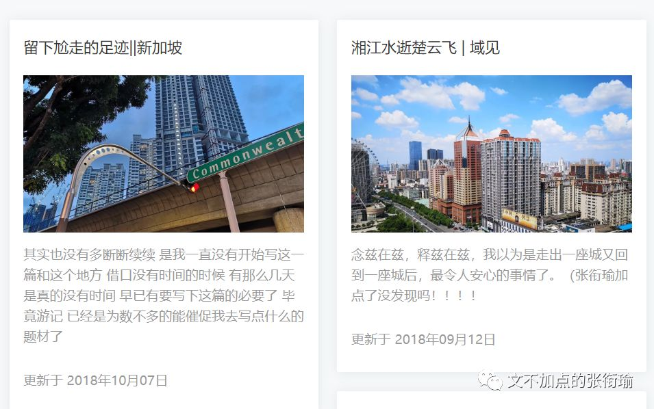
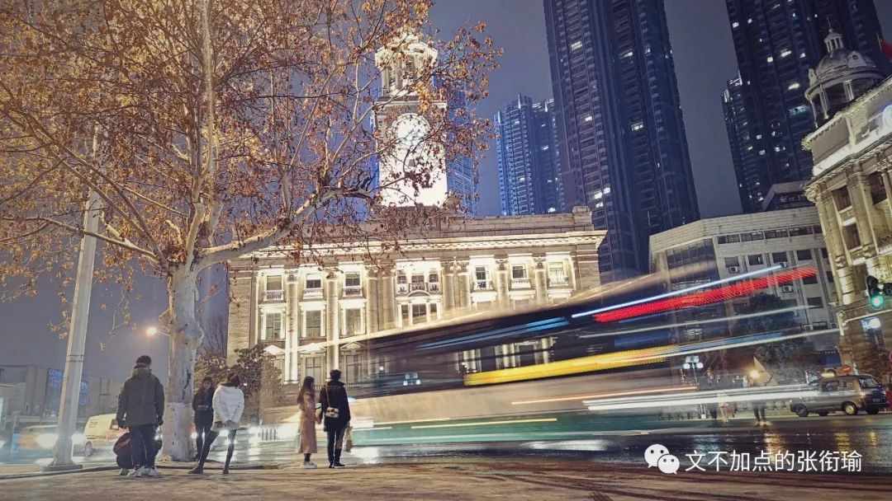
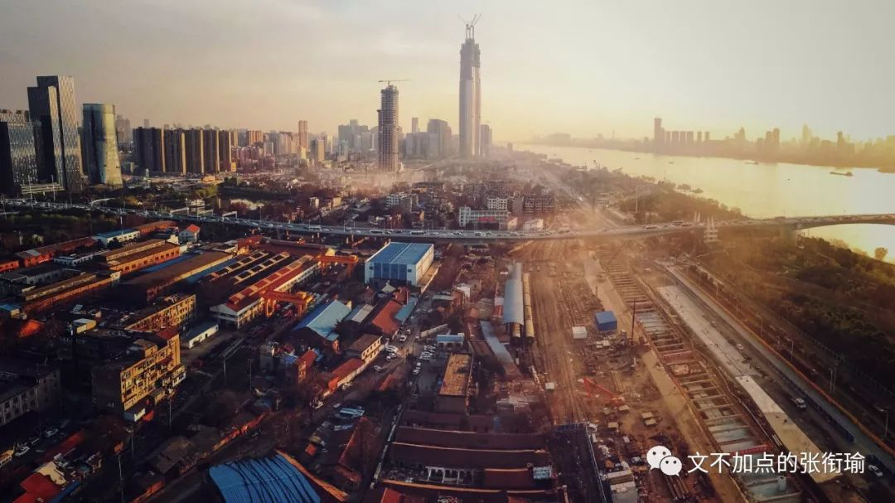
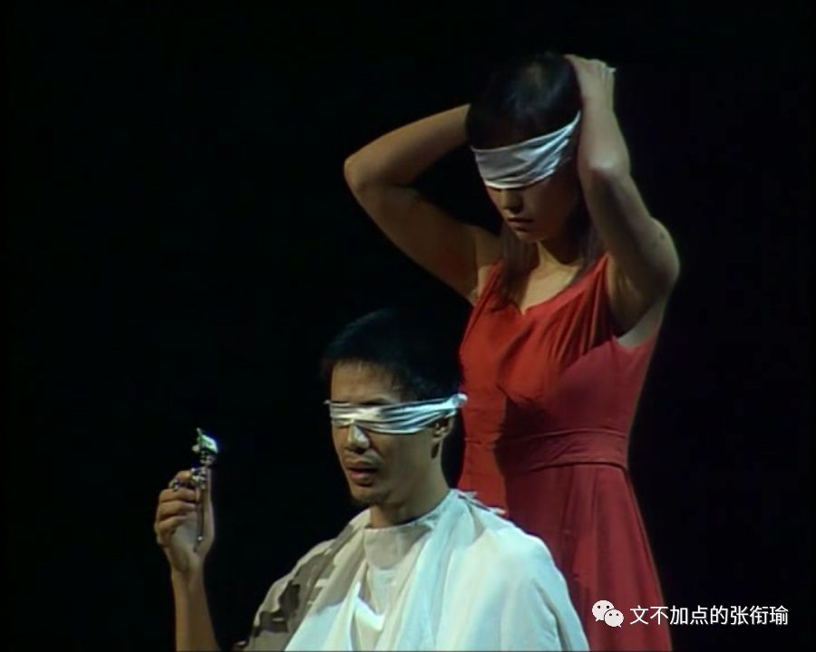
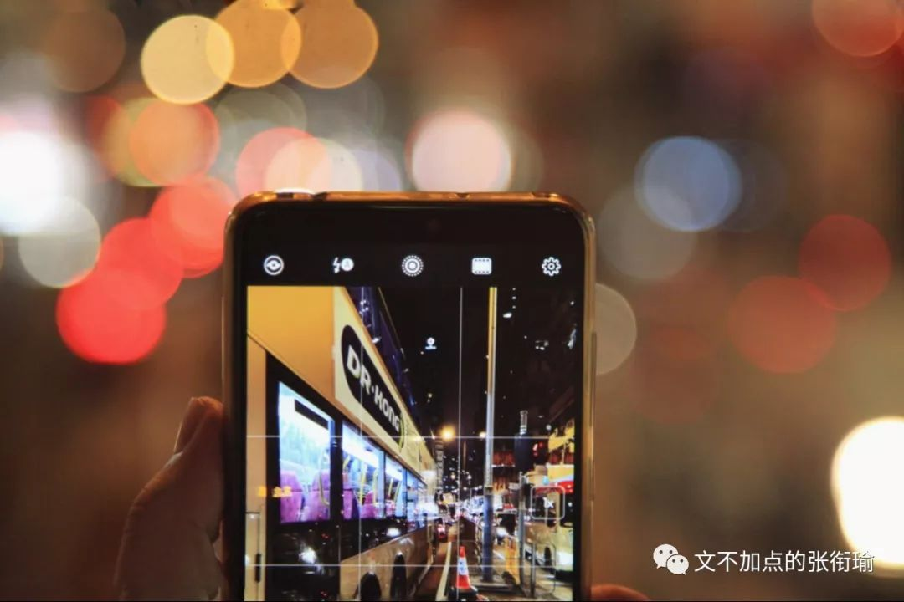
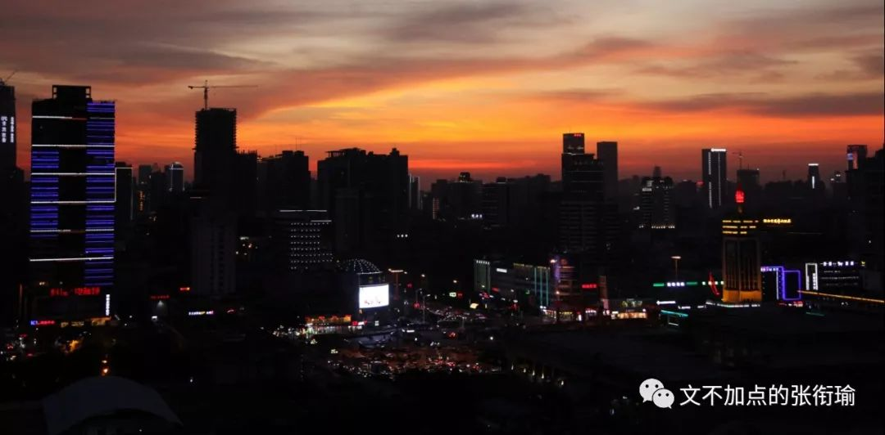

> 本文是张衔瑜第 111 篇推文 共计 1242 个字

本文是张衔瑜第 111 篇推文

共计 1242 个字

好快啊。

从前年这个时候，为了给自己一个生日礼物，就开了一个公众号自己写点什么。

第一篇当时还是 [破蛋推](http://mp.weixin.qq.com/s?__biz=MzUzNjE3NzA3Mg==&mid=2247483662&idx=1&sn=897c1104a0d2833f702a122d852b935c&chksm=fafb71d1cd8cf8c7d01a964dac19225504d9d7c0e0b04e50ddb575d72ab00a03eca8050a82d0&scene=21#wechat_redirect) 。

满一年的时候，我开开心心地写了一篇 [《又吃成长快乐啦||文不加点的张衔瑜一岁ler》。](http://mp.weixin.qq.com/s?__biz=MzUzNjE3NzA3Mg==&mid=2247484475&idx=1&sn=2463857699340fe09ef8f4a809c2109e&chksm=fafb74e4cd8cfdf2f7a56d637334d8969a91d2018deed7293997f600f0d40077e9d2f0e2622d&scene=21#wechat_redirect)

最早在写的时候，我 完全不知道自己会写一些什么内容 。探讨过很多，也描绘过很多。

以前的排版很花哨对吧。

其实哪怕到现在，我仍然在秀米的后台保留有当时进行版面处理的蒙版。有人和我讨论过 字号 的问题，我的解决办法只是：自己打开微信右上角，然后拖动字号进行调节。

我不大能完全地一下想到，过去一年里，究竟写了多少文字。一篇篇地来看，既然现在是第111篇，按照每篇差不多两千五百字的篇幅，加之正好看了一下这两年自己写的篇幅数量相仿：那么55×2500=137500，差不多十三四万的样子估计看来。

大学之前总会列一些清单什么的，不管是列着要去远足一次、通宵一次、还是恋爱一次，我在校车上当时和小班某森说：“想出一本自己的诗集、随笔集或者什么文选，总归是铅字了之后的纸质稿。”

现在看来，哪怕不管写下的其他文字——原来写的新闻、公文、优美的实验报告还有自己的日记，那现在也已经足够了。

这一年还是很多的地方。

去年写生日推的时候，还没有把 [北京](http://mp.weixin.qq.com/s?__biz=MzUzNjE3NzA3Mg==&mid=2247484509&idx=1&sn=8636d9c5e3faa952e64923f8e75c1c40&chksm=fafb7482cd8cfd94e4fb1eb8fc1b66a4c82c6768ada2110e800808eabc7a505e7a54a1c3b9bf&scene=21#wechat_redirect) 的这一篇算进来。今年写生日推之前， [再到北京](http://mp.weixin.qq.com/s?__biz=MzUzNjE3NzA3Mg==&mid=2247485596&idx=1&sn=0195c54dba9b0c4b0dcefa44bd399988&chksm=fafb7843cd8cf155f2a7f1f0e69142ef225b8537373290b006c7616bc46700b79f52abd2b02b&scene=21#wechat_redirect) （小张小张，卑微开张）却已经扎扎实实地完成了，只是安的名字因为没有太多旅游成分、多在随笔思考，所没有叫上尬走的名字。

但尬走远不止北京。

去年夏天从北京实习回来之后，八月底就去了 [新加坡](http://mp.weixin.qq.com/s?__biz=MzUzNjE3NzA3Mg==&mid=2247484561&idx=1&sn=38abfcb9f79650f4eb255a1324251bea&chksm=fafb744ecd8cfd58e26edcd4ad384a5a2d7292f27ad2c8a0b6cecb81bcb19703a487f36235ff&scene=21#wechat_redirect) 。在去新加坡之前，还专门应姬哲湍而写了一篇 [湘江水逝楚云飞||域见](http://mp.weixin.qq.com/s?__biz=MzUzNjE3NzA3Mg==&mid=2247484527&idx=1&sn=bfa05b8ea6e102e90bf3826ad86bed0b&chksm=fafb74b0cd8cfda632b93c0c42d497e59c3e0ca5d78f789efea829689f91621dfcb74dd24da6&scene=21#wechat_redirect) 。后来关于长沙的还有一篇是作为本土长沙人，专门拿着自己的嘴巴为朋友们测评 [臭豆腐](http://mp.weixin.qq.com/s?__biz=MzUzNjE3NzA3Mg==&mid=2247485039&idx=1&sn=40a9209693f9955eb20276e97734afd7&chksm=fafb76b0cd8cffa60a0159fcd09032749366f64ad1b87b3ee1958e1f0744da0033dccd9392d6&scene=21#wechat_redirect) 的。主注意这里选择了茶颜悦色作为参比。

这两篇文章多少成为了我在纯粹写游记时候的最高峰。

学期中总是没有太多机会。

这个意思是，只要想，就还是有的。

刚刚入手稳定器的时候， [汉阳火车站](http://mp.weixin.qq.com/s?__biz=MzUzNjE3NzA3Mg==&mid=2247484609&idx=1&sn=8b0d87d7d70e3d2cf47dda3c06202621&chksm=fafb741ecd8cfd08f39fb7d15fb5159286e1c41dd43444f15a95f12bee54ca66026fd9ff13d8&scene=21#wechat_redirect) 有一次， [光谷](http://mp.weixin.qq.com/s?__biz=MzUzNjE3NzA3Mg==&mid=2247484576&idx=1&sn=6d574c01332526873d623b54b8e86347&chksm=fafb747fcd8cfd695a8b05885a3fba80454e5f3d5184b667b9df3a1dda7ca1dd13f209e06e62&scene=21#wechat_redirect) 有一次， [鲁磨路](http://mp.weixin.qq.com/s?__biz=MzUzNjE3NzA3Mg==&mid=2247484586&idx=1&sn=04d72085c9308db983860ed83d515e89&chksm=fafb7475cd8cfd6391286688fbe8db5ba10d5014dc4940d227f8d3083844523d509853ad8f5c&scene=21#wechat_redirect) 也有一次。甚至我之后自己寝室停水了，连 [紫菘](http://mp.weixin.qq.com/s?__biz=MzUzNjE3NzA3Mg==&mid=2247485397&idx=1&sn=013a8453166d49434fd5da69eeb612d5&chksm=fafb770acd8cfe1c5fbdecd014354e0f2ceef2d3e5326ef96565239a182d78f83a9b5c6e143c&scene=21#wechat_redirect) 都有一次。

于是我用100张图，给 [2018年](http://mp.weixin.qq.com/s?__biz=MzUzNjE3NzA3Mg==&mid=2247484796&idx=1&sn=b4968ff62baabb5e9368642b0f14d421&chksm=fafb75a3cd8cfcb5d52fcc342aba6f347e5741e7b72cef234ec910f05d42200d873bf36248cd&scene=21#wechat_redirect) 做了一个结束。

很喜欢的那一张，在江汉关羡慕情侣们看着他们眼中看不到的车轨，原载于特别提到说 [一周图集](http://mp.weixin.qq.com/s?__biz=MzUzNjE3NzA3Mg==&mid=2247485145&idx=1&sn=1ccd0d0cf8d858bac4151f6a0b69cb64&chksm=fafb7606cd8cff10523492808234c682d16853401d31ccad20f5528e4ce8741bf3ad40eff5ac&scene=21#wechat_redirect) 的那一次。 [朝花夕拾](http://mp.weixin.qq.com/s?__biz=MzUzNjE3NzA3Mg==&mid=2247485476&idx=1&sn=bedd87b07451c0e4ab819b179cd2367d&chksm=fafb78fbcd8cf1ed1aecbc14294829662fac636ed8fce7d680c1b6afd86754e096665806d60e&scene=21#wechat_redirect) 算第二次。

这是我可以好好看到的美，我还想再加到今天的推文里边来：

寒假开开心心，过完了大学最后一个会集中考试的考试周。在武汉小众的展览馆写了一篇 [未写完的不具名](http://mp.weixin.qq.com/s?__biz=MzUzNjE3NzA3Mg==&mid=2247484879&idx=1&sn=08784a8876a520f43895a803e89169a5&chksm=fafb7510cd8cfc0682b031239e57331268bd044c39bbca9ce5bbb9c6bafb2e9a817101913cd9&scene=21#wechat_redirect) 之后，又坐着京广线去了一趟 [长春](http://mp.weixin.qq.com/s?__biz=MzUzNjE3NzA3Mg==&mid=2247484906&idx=1&sn=18caeb80b686315ad9b7eb5379013e6e&chksm=fafb7535cd8cfc2310bc2efd53e55c9fee406398f8ba990b173f1c933421b92fa0f6af890892&scene=21#wechat_redirect) 。返回之后，就去了 [合肥](http://mp.weixin.qq.com/s?__biz=MzUzNjE3NzA3Mg==&mid=2247484932&idx=1&sn=09110fb7dd381bcd695d65caffa61db2&chksm=fafb76dbcd8cffcdea9d594d4093cb292ad2244c3a0d6a2e64a08a34505881dc261d28b33497&scene=21#wechat_redirect) 展开新的一次实习。

过完年，收假上来。

三月份被爆肝的GRE搞得头疼。虽然更早之前就已经在开始说 [秩序与不万能](http://mp.weixin.qq.com/s?__biz=MzUzNjE3NzA3Mg==&mid=2247484644&idx=1&sn=8f245aabbc8e636445c5dff5972c8746&chksm=fafb743bcd8cfd2daeb5aadedbc7124c396af9ddbefe5c314d932dba1a57efb88e25d6982578&scene=21#wechat_redirect) 的GRE。

考完之后不吐不快，一连写了四篇： [生活应该怎样继续](http://mp.weixin.qq.com/s?__biz=MzUzNjE3NzA3Mg==&mid=2247485164&idx=1&sn=d0a46792ddb14e16dda9ffc7a29c14b1&chksm=fafb7633cd8cff255161998fd335a7dd9e0d2db7353119815be74a4e67b2884c4d5d841c77dd&scene=21#wechat_redirect) 、 [“对抗焦虑”是如何被制造出来的](http://mp.weixin.qq.com/s?__biz=MzUzNjE3NzA3Mg==&mid=2247485181&idx=1&sn=f5fb9b198cd0fcc6d040ca6b88aaa62c&chksm=fafb7622cd8cff3421d4ff353894bbfc5a49ebf246d11c52c051682d66c30103c4032af3a520&scene=21#wechat_redirect) 、 [别说跳出舒适圈现在的问题是没有舒适圈](http://mp.weixin.qq.com/s?__biz=MzUzNjE3NzA3Mg==&mid=2247485192&idx=1&sn=deda11375cca883b2fd81a9947f49286&chksm=fafb77d7cd8cfec1b7e2911d93f147d63e021f777ff4747186eb38631db945b61ce6c89293f5&scene=21#wechat_redirect) 、以及最后一篇在小吃城吃 [肠粉](http://mp.weixin.qq.com/s?__biz=MzUzNjE3NzA3Mg==&mid=2247485206&idx=1&sn=13844f4ee03c1eb517d539682b25c206&chksm=fafb77c9cd8cfedf992380a28c1d6401fbdeb13f99891ef7e159a29282fff4885fefa1cf29c0&scene=21#wechat_redirect) 时候开始慢慢平静下来了的推文。

接下来四月，开局就是和Amber一起在外面用 [愚人节私奔](http://mp.weixin.qq.com/s?__biz=MzUzNjE3NzA3Mg==&mid=2247485236&idx=1&sn=da4232231bb0fb0bed68c014983f6e2d&chksm=fafb77ebcd8cfefd6fe1f8489be14d6143658b10ac324523c9c258a659ee491386d53ae7994a&scene=21#wechat_redirect) 的方式开始了这一个月。 尔后， 大学第二次到了 [深圳](http://mp.weixin.qq.com/s?__biz=MzUzNjE3NzA3Mg==&mid=2247485271&idx=1&sn=aa9b1dc34785f8a7491f8611dc27f9ac&chksm=fafb7788cd8cfe9e6c65b9b2a8e757edafa0908348b5e2b284a90db38fe8880def0f0b727f3f&scene=21#wechat_redirect) 。一篇没写完，还有意难平的 [暴戾标准化](http://mp.weixin.qq.com/s?__biz=MzUzNjE3NzA3Mg==&mid=2247485287&idx=1&sn=7912ff32a0e9d475394947914f522fd1&chksm=fafb77b8cd8cfeae8bb2b5dc90e3b1707ddb01b049473290e1fff746c572ebf8fee4f5b3b245&scene=21#wechat_redirect) 。

当然前天我也又到了深圳，这是大学第三次了。 两次之前并没有隔上几个月，但一次去的城市东北角快到东莞，一次跑的西北角晃着晃着就到了惠州。

这一次来深圳，走访了学校之后，昨天又到了香港。虽然前年来过，现在的局势并不太明朗，但是大丈夫。没记错的话应该是十二年前，也是在香港Disney迪士尼过的自己八岁生日。时间真的很快。

话剧。

这真的是我自己生活当中非常重要的一个组成部分。虽然，虽然占比真的不高，好在每次都给我以很大的冲击，或者换而言之，给我以很多spiritual精神上的重载唤醒。

忘掉是一般人唯一能做的事，可是我决定不忘掉她。

《恋爱的犀牛》确实是一部大名如雷贯耳的好评剧，不管多久我重新开始说起黄昏，都总会觉得有一股要咆哮着说出点什么的劲儿。 [恋爱要不要苟延残喘？](http://mp.weixin.qq.com/s?__biz=MzUzNjE3NzA3Mg==&mid=2247484679&idx=1&sn=dbf6943ae6c602eab348f84dc02117b4&chksm=fafb75d8cd8cfcce3f996bd4f41335348530782e0a3722a99a0e3b24bbceba13518b6d7dde4e&scene=21#wechat_redirect) 这篇就是写在观剧之后的。

另一个虽然标题看不出来， [打翻可乐](http://mp.weixin.qq.com/s?__biz=MzUzNjE3NzA3Mg==&mid=2247485564&idx=1&sn=654c6afb125d4523ced6b84440dc32b0&chksm=fafb78a3cd8cf1b57738d8af5dd155f7df246e5d0c9f902b148ae7490b91113a2e1c56679cce&scene=21#wechat_redirect) ，但是内容实实在在地是在我看完《空中花园谋杀案》这个先锋音乐剧之后随缘写的。

此外的还有纸牌屋里边出来的 [我今作力所能及的解说](http://mp.weixin.qq.com/s?__biz=MzUzNjE3NzA3Mg==&mid=2247484624&idx=1&sn=ea030904a1d03a3275d5cfcf6524b1f1&chksm=fafb740fcd8cfd19f2ccde210bbe8499e8a21a9e8f0d9f43e910934145d4edc803448f294d21&scene=21#wechat_redirect) ，金庸先生千古之后写的一篇关于 [倚天屠龙记](http://mp.weixin.qq.com/s?__biz=MzUzNjE3NzA3Mg==&mid=2247484564&idx=1&sn=8bcd7c613772d6d407839c7325b0647c&chksm=fafb744bcd8cfd5d93c891310a8390aebfa72f4b03bd5322bf326998b753d54fc981e8a83512&scene=21#wechat_redirect) 。不得不提的是 [成 龙 历险记](http://mp.weixin.qq.com/s?__biz=MzUzNjE3NzA3Mg==&mid=2247484830&idx=1&sn=fb8782101cbd3103a9f299e13cece7b8&chksm=fafb7541cd8cfc57bbdad1f0663120f9e12a12ebad809ddf3a6b2a12847214cbdd9b577d2478&scene=21#wechat_redirect) ，叁万年下饭番剧。

《 [末代皇帝](http://mp.weixin.qq.com/s?__biz=MzUzNjE3NzA3Mg==&mid=2247485519&idx=1&sn=6129f2f0a75a7bc29b9f62cfe5ed1814&chksm=fafb7890cd8cf1863798340d547698af8365286ddac0226949599755a951e2e2629238f1513b&scene=21#wechat_redirect) 》的那一篇影评也不错。主要是电影可以。

PS：扎扎实实的 [读后感](http://mp.weixin.qq.com/s?__biz=MzUzNjE3NzA3Mg==&mid=2247485334&idx=1&sn=5a2193037ca61c2d3e0dbeeed97adfdf&chksm=fafb7749cd8cfe5fdcbb5bd58b2afc8e280bf02415cc9df486f31e94283f5771350f38f8bcd2&scene=21#wechat_redirect) 真的很可。

沙雕。

这兴许是最令人激动的衔瑜形式了。

不管是我最早开始只是有一搭没一搭地说着 [聚酯不回来](http://mp.weixin.qq.com/s?__biz=MzUzNjE3NzA3Mg==&mid=2247484524&idx=1&sn=8d4c5bbf72e4c9000b1a40d0fd098d9b&chksm=fafb74b3cd8cfda5ee9eb1858e4320af816fd947f2d2710bad2172facdde98cea1516df2e8b1&scene=21#wechat_redirect) 、夹带一点点在 [故事集](http://mp.weixin.qq.com/s?__biz=MzUzNjE3NzA3Mg==&mid=2247485054&idx=1&sn=340e8b6f2de6692cd87506a50c11e72c&chksm=fafb76a1cd8cffb72b150ec74262749102258ebbfdbb92b6577dae8e3468c192c5fe45707060&scene=21#wechat_redirect) 里边。

后来专门出了 [沙雕图研究](http://mp.weixin.qq.com/s?__biz=MzUzNjE3NzA3Mg==&mid=2247485089&idx=1&sn=4ffc0af3102ddb7a596671292927ecd8&chksm=fafb767ecd8cff6891575f8ed7f0ebcf5be77f262885af0c0905b00eebc4f02ccafbfded5068&scene=21#wechat_redirect) 和最近的这个 [沙雕栗子](http://mp.weixin.qq.com/s?__biz=MzUzNjE3NzA3Mg==&mid=2247485655&idx=1&sn=42ceeb566be36173be10b216cd83af96&chksm=fafb7808cd8cf11ea28690c755fd138e94cca688aa21485bb2e549ea06ec83c9a8c36ddeece5&scene=21#wechat_redirect) 。

其实这些都是我很喜欢的东西，一点也不会 [疲劳驾驶](http://mp.weixin.qq.com/s?__biz=MzUzNjE3NzA3Mg==&mid=2247485575&idx=1&sn=887166474a33649b07f21593f9edb28a&chksm=fafb7858cd8cf14e28d05ab2720f7e8d6f6cffce81fbd4af412970b0444f6dfe8becf30887da&scene=21#wechat_redirect) 。毕竟就是有毛病的脑洞，随缘消食就像前几天吃完烤肉之后的 [空腹吃饭](http://mp.weixin.qq.com/s?__biz=MzUzNjE3NzA3Mg==&mid=2247485644&idx=1&sn=4eb69232c37d8b22ef1169df0f365a78&chksm=fafb7813cd8cf105ae80aa7b3dc8898bb51bdb46aa224eb878ec53c26001844b4ee0be1e40ce&scene=21#wechat_redirect) 。

就像进校时候看到的那些学长学姐，每个人都作为 [过来人](http://mp.weixin.qq.com/s?__biz=MzUzNjE3NzA3Mg==&mid=2247485496&idx=1&sn=1d8a41e2e23234e27bf01a4221d06953&chksm=fafb78e7cd8cf1f14d480f64c16b192004fde712583c8b70183ab28cbcb106395849fe351112&scene=21#wechat_redirect) 给出了很多很多的建议，也许是自己感受过的痛过的。但事实上，没有人好好地说出了，到底怎么才能好好地对待生活。只是说要这么做，但是怎么看待呢？

后来，大家 [毕业](http://mp.weixin.qq.com/s?__biz=MzUzNjE3NzA3Mg==&mid=2247485445&idx=1&sn=d8c57815c2899cdc81524e8142d7d7aa&chksm=fafb78dacd8cf1ccee1172b7468127ff382e2c5e8a60ba024d54bc89f68de941fa366d15f173&scene=21#wechat_redirect) 了。我也快了。

有一些评论稿，让我我依然觉得自己很精妙。比如解构 [迷惑行为](http://mp.weixin.qq.com/s?__biz=MzUzNjE3NzA3Mg==&mid=2247485431&idx=1&sn=0420a6c3142b6854a57dcf790e10e110&chksm=fafb7728cd8cfe3e62cbfbbc58ba583abf5ef3b6036df2a6a22e23bd10fd75b67bfbf3e7702f&scene=21#wechat_redirect) 的这一篇、调研 [西一豆浆](http://mp.weixin.qq.com/s?__biz=MzUzNjE3NzA3Mg==&mid=2247485376&idx=1&sn=e5a4df580b6852d3db2f51d3cdf5266c&chksm=fafb771fcd8cfe098ac948cc48513414f60353cc6a9efb4bbd912ffae7c8b7131ec973b1988f&scene=21#wechat_redirect) 的这篇、对于只关心进入 [坎](http://mp.weixin.qq.com/s?__biz=MzUzNjE3NzA3Mg==&mid=2247485409&idx=1&sn=d2e882949ab97f828f14a91a7afb6f39&chksm=fafb773ecd8cfe281f2f1f79e92774ecb4e53cb57c53149460885ef2e1a5cb5c2ecb1bbf2fa8&scene=21#wechat_redirect) 而不看坎后边的认知学讨论、还有注意力 [失焦](http://mp.weixin.qq.com/s?__biz=MzUzNjE3NzA3Mg==&mid=2247484806&idx=1&sn=68993c9803f22256843699150d782762&chksm=fafb7559cd8cfc4f29e79f132276042bca7eaaef15cc8283b70734aad9bc32105f195992d31c&scene=21#wechat_redirect) 。

认知科学真的好玩。

我每次看自己写的这些标题，有的还好，看着标题就像上面这些一样，大概可以想起来自己写了些什么 like [加班](http://mp.weixin.qq.com/s?__biz=MzUzNjE3NzA3Mg==&mid=2247485355&idx=1&sn=7f8608b9ae6853f849abea6e6fd53c98&chksm=fafb7774cd8cfe62b0bb250cd58837e8bc04c41164d31e7e76f9044c221cb474d537e0ca9e81&scene=21#wechat_redirect) 。但是有的，我甚至看完标题，看完题图，也看完了默认抓取前54个字的副标题区域，还是想不起自己写了些什么鬼东西在里边。

我只记得是自己第一次主动加标点的 [第十三周周一的早课和白日梦](http://mp.weixin.qq.com/s?__biz=MzUzNjE3NzA3Mg==&mid=2247485360&idx=1&sn=e9c9b9821c7d5d7fdd2a0f54ea4e4014&chksm=fafb776fcd8cfe79cb9969f2178c266c94a5fd8053a7d38c4e6a80779d5f4e6a079f9bd301b4&scene=21#wechat_redirect) 、看过千与千寻之后的一个 [心情](http://mp.weixin.qq.com/s?__biz=MzUzNjE3NzA3Mg==&mid=2247485539&idx=1&sn=d76df8d66eaacb5dcf87e91c8d9391b5&chksm=fafb78bccd8cf1aaa729f211dbd9a044096572d1924e38e65306d4a314057c6088583af0d030&scene=21#wechat_redirect) 随笔。和 [郁结](http://mp.weixin.qq.com/s?__biz=MzUzNjE3NzA3Mg==&mid=2247484593&idx=1&sn=02f13cbabc7a5527001d81bf9f9ddb38&chksm=fafb746ecd8cfd785585e0ca77fe9c526f9c7b9a43149ec214abacbb99613d994bc415f99f01&scene=21#wechat_redirect) 坐下来谈妥一次。

心情这个东西很魔幻。

可能有过一些什么事情，也可能没有。

可能我想好好说些什么，也可能不说。

就像好想去讨论问题，但是一 [讨论](http://mp.weixin.qq.com/s?__biz=MzUzNjE3NzA3Mg==&mid=2247485632&idx=1&sn=378a7ea4de787d2954673e19e959a321&chksm=fafb781fcd8cf109b295a9aafd8856af3137b8e3da614b4958735e3a9feec290e0ff73650fa8&scene=21#wechat_redirect) 就嫌累。小张慌是不会 [慌张](http://mp.weixin.qq.com/s?__biz=MzUzNjE3NzA3Mg==&mid=2247485584&idx=1&sn=a181b5286b5258632716cbbb49dcaf47&chksm=fafb784fcd8cf1593ff3a85d86c9d6aafa20feee9bbea78607e5144d4fb8733fc84d7668f9c6&scene=21#wechat_redirect) ，就是一直怕一手好牌打得稀烂， [正常而又安分](http://mp.weixin.qq.com/s?__biz=MzUzNjE3NzA3Mg==&mid=2247485554&idx=1&sn=c68749f60a7682094c5bdb344f76fec5&chksm=fafb78adcd8cf1bbe55091b800c5e3bc96e2309d8b6f6053aa6e53860424f5c6b3e2516a3140&scene=21#wechat_redirect) 。

讲了的不过 [传播对立](http://mp.weixin.qq.com/s?__biz=MzUzNjE3NzA3Mg==&mid=2247484515&idx=1&sn=13a0f61f30af119b8f9686ef62d36f21&chksm=fafb74bccd8cfdaab71b3a1810b2dc9bc27fce6167ec5f13d070a2d9d42aabd9245f6d96cf97&scene=21#wechat_redirect) 、 [狂欢数据](http://mp.weixin.qq.com/s?__biz=MzUzNjE3NzA3Mg==&mid=2247485632&idx=1&sn=378a7ea4de787d2954673e19e959a321&chksm=fafb781fcd8cf109b295a9aafd8856af3137b8e3da614b4958735e3a9feec290e0ff73650fa8&scene=21#wechat_redirect) 、语言单一怎么导致 [思维钝化](http://mp.weixin.qq.com/s?__biz=MzUzNjE3NzA3Mg==&mid=2247485609&idx=1&sn=9a3939f3bb409fd2d76aba3be0b34f63&chksm=fafb7876cd8cf160fcb959ebbc960d3fe3d90e4073841c4c369027bd0a97ae2eee6cce897e39&scene=21#wechat_redirect) 、思路的 [重载](http://mp.weixin.qq.com/s?__biz=MzUzNjE3NzA3Mg==&mid=2247484485&idx=1&sn=640ea8fcc50daf44fef4e77c93c2a2d4&chksm=fafb749acd8cfd8cc5ad1ad46e665066989661614cf5d7a84eb465dc04e1cfe9f206a4384cb6&scene=21#wechat_redirect) 又来一遍。

最近，在香港见到了一些不一样的事情，虽然这些在我之前的脑内中都有出现过。

我这么说吧，不管是对某个地方抱有强烈的幻想：觉得这个地方如何地好或者如何地坏，最好地消弭这样一种暴烈情绪的办法，即是去真实而切实地在那个地方生活上一段时间。感受一下大家之为一样的平权个体是如何地调谐生活关系。

天下的乌鸦一般黑。没有一只 啄木鸟 是不咬人的（好像说是蛇的话更合理一些

附一张前景图：

文不加点的张衔瑜，两岁的这一天，和之前的每一天也没有什么不同。以前生日在一起的人，来来去去；正如街上的行人走走停停、港湾的浪花卷曲舒展。

照例这里应当是一连串的感恩，和不少的致谢。

但我更希望这里保有了歉疚和愧疚。对于之前多少年荒唐的不荒唐的、少不更事或少年老成的。林林总总。

展望的失望了、表白的被拒了，求学的失学了、喷饭的噎饭了。

不寄希望于一刻的时来运转，哪怕那看起来是多么地触手可及；

好好看着到过的每一座山、每一片湖，那里的每一朵云都在歌唱、每一颗星星都在眨眼。

张衔瑜，两岁了。

