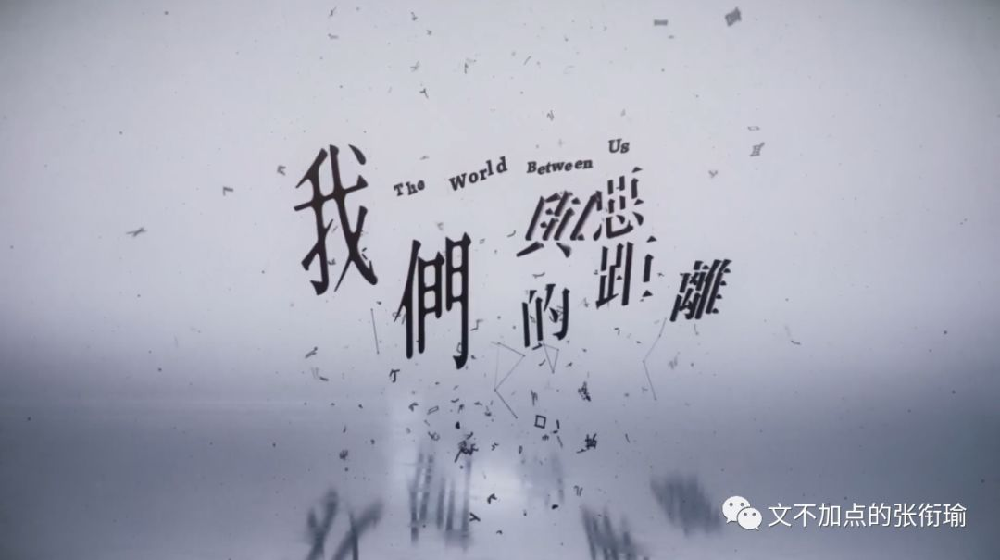

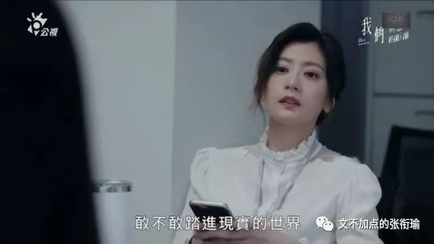

> 本文是张衔瑜第 112 篇推文 共计 3592 个字

本文是张衔瑜第 112 篇推文

共计 3592 个字

无论从哪个角度来看，这都是一部很棒的剧。没有脑残担当，没有明言明语。每个人都在和生活厮打， 大家都是好人， 都在自己的领域内逻辑自洽而又没有固执不堪，都在向外界求救并且愿意和解、愿意接受。

Retrospectively, 通常我很少这样回顾剧本，毕竟不是营销号，就把自己的想法记录在这里。但吕蒔媛的剧本真的很不错：起因是一件随机杀人事件，而又不在这上面着墨太多。受害者家属、犯罪嫌疑人家属、介入的媒体和世俗的旁观者。

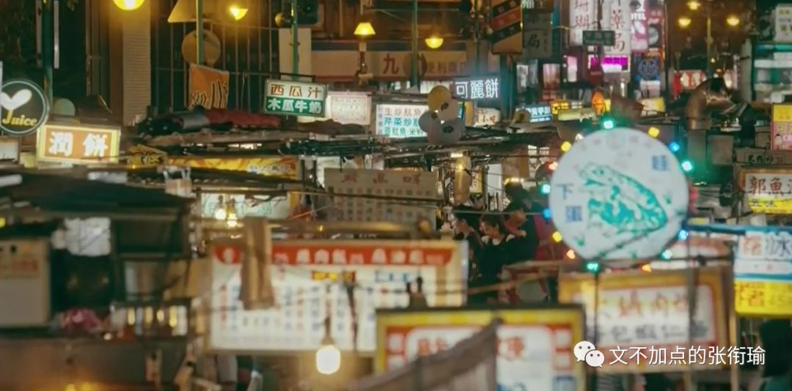

我从来不觉得，世俗是多么有情感色彩的一个贬义词。正如最近有人打着“民主”、“自由”之类幌子，但做着令人恶心的勾当，可这些词语并不会因为有人扯了虎皮而被污名化。世俗也是如此，不会因为有人在世俗的时候做了世俗的事情，兴许很自私、也欠妥，但世俗仍然代表着其固然具有的一部分。

这部剧完全当得所有给予它的赞誉。

四个家庭的纠葛： 新闻人家庭 ——父母都是新闻执业者，两个孩子中的一个在随机杀人事件中丧生； 社会底层家庭 ——父母都是个体户，两个孩子中的一个成了随机杀人犯，另一个希望借助学新闻和自己的努力来改变命运； 律师家庭 ——男方是有社会学关怀的法律扶住律师，女方来自富二代家庭，小孩还在幼稚园； 饮品店家庭 ——老人已经因为身体原因退休，女方自己开了一家糖水店，未婚夫来自经济条件更好但是很龟毛的家庭，有一个亲弟弟正饱受思觉失调也就是精神分裂的困扰。

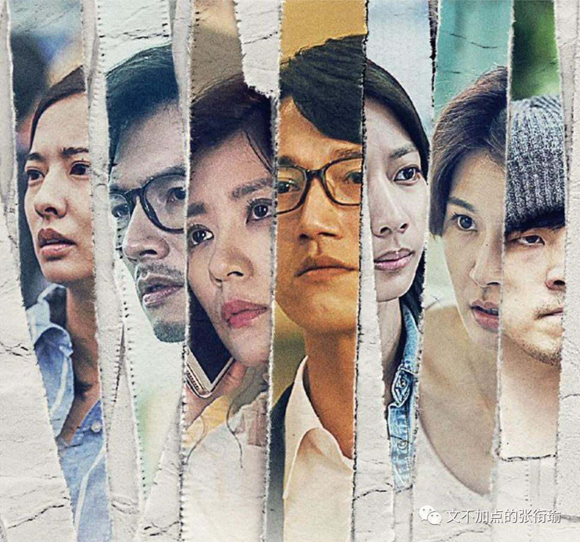

加害人的妹妹，主管是受害者的母亲；思觉失调的病患，闯入了法扶律师的孩子所在的幼稚园；法扶律师在为加害人和精神病患辩护；加上还埋着的一条精神科医师的线，剧本已然可以用所有人的正常视角，来一起贡献这一项《与恶》的社会议题。

我本来以为，最后会揭开随机杀人背后的社会学成因和具体心理动机是什么。但是没有。

十集的短剧里面，犯罪嫌疑人在第五集就被执行枪决了。

以下是法扶律师王赦 （看这个名字） ，好剧标杆吴慷仁，听闻执行枪决后，在自己的岳丈家和拌嘴的爱人说的一段话：

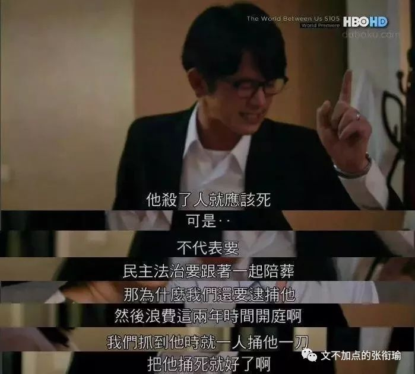

我知道他会死啊，没想到会这么快，他前面还有52个死刑犯，为什么要跳过那么多人处死他，我不知道啊。

就好像告诉社会大众，我们国家可以合法杀人。

我是他的辩护律师，我没有收到通知，我相信他的家人也没有收到通知，可是新闻媒体可以在第一时间收到通知去拍，为什么不让他和他的家人见最后一面呢？我不懂，这合法吗？合理吗？合情吗？

他真的该死，他杀了人确实该死，但是不代表民主法治要跟着一起陪葬。

那为什么我们还要逮捕他？然后浪费这两年时间，开庭啊，调查啊，我们抓到他的时候，就应该捅他一刀捅死他好了啊！你们都希望他死，我知道，舆论媒体都希望他死， 但是民主法治是用来讨好人民，讨好媒体的吗？ 这算什么民主法治国家。

他杀人，他是该死，但是他生病了，他生病了，美国的死刑犯被杀的时候写的是谋杀啊，可是我们的死刑犯死亡原因写的是他杀啊，就算真的罪证确凿，判了死刑没有关系，为什么一个国家要这么粗暴地夺走一个年轻人的生命。我到现在还不知道他到底为什么要这么做，他死了之后就再也没有人知道了，没有人知道了。一个民主法治的国家要靠杀人，要靠杀人才可以抚慰人心，保障我们的安全，这个我没有听过啊，太荒谬了……

到底什么是好人，什么是坏人，有标准答案吗？谁有标准答案？

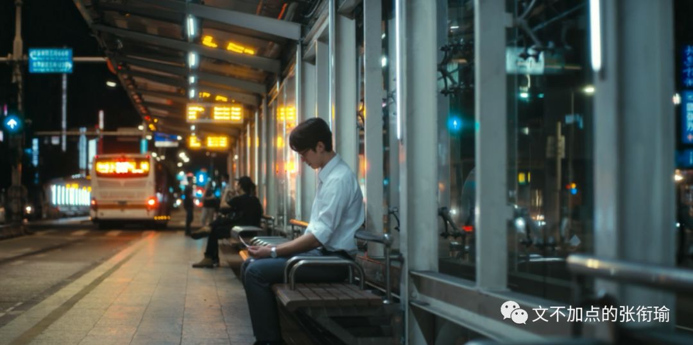

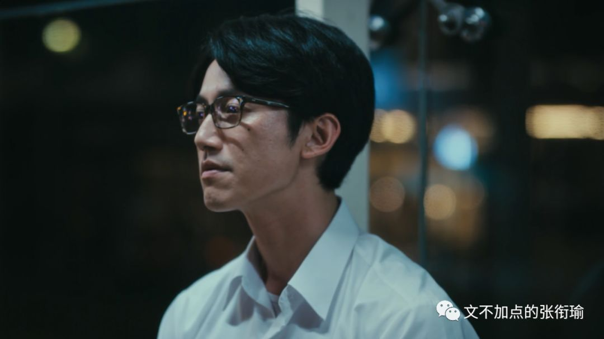

可以说他真的是一个，关于民主和法治/法制的理想主义斗士，其精神就像是在无数报告文学作品和革命作品里提到的为共产主义事业而前仆后继的共产党员那样大无畏。

之所以进行法律扶助，是因为想找出杀人者背后的 心理动机和社会学原因 ，是什么诱导、引发了这样恶劣的随机杀人事件， 并且直面情绪勒索的质询 。所谓圣母是在宽赦所有人的罪行，而他不是，他是在守护程序正义、像白帽子一样在陪练和守护法律的严正。

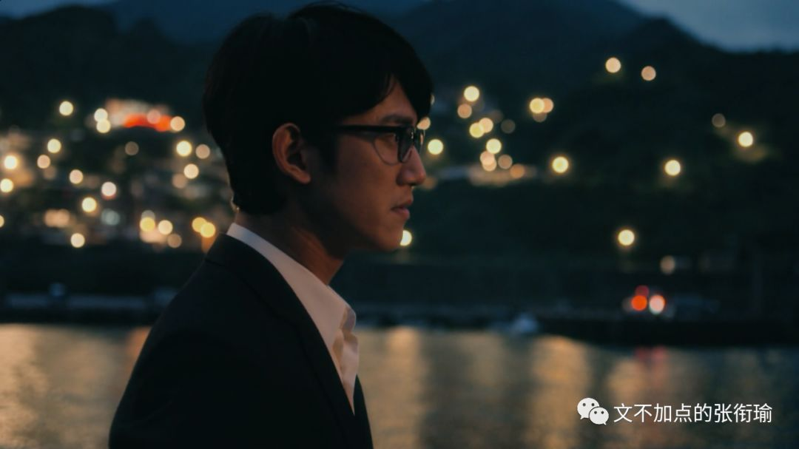

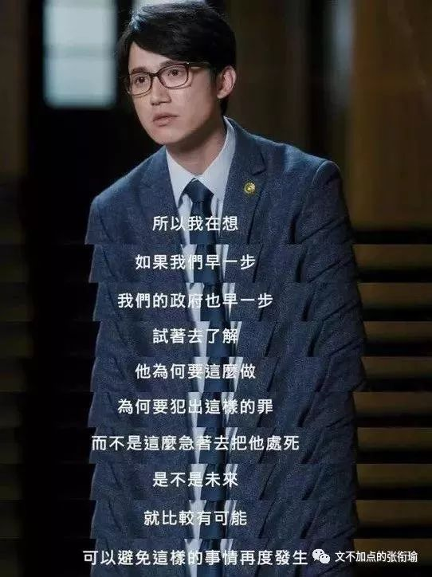

如果说，我一直在偏法律、或者偏社会学关怀地来看一部剧，那么我和那些拿着这部剧来只是去讨论新闻伦理、讨论死刑废除和精神病患关怀的人没什么区别。

哪吒出来了之后，也有人点着说自己在剧中看到了当前的职场生态；有人读完红楼梦，只想着怎么复原那几道刘姥姥进大观园之后吃的几道菜。我以为，这些都可以，但从来都不应该成为主流，而且是偏狭对待了一个编剧的作品。

我们与恶的距离，英文片名the world between us，不是简单地在废除死刑、新闻伦理和病患关怀可以说清楚的。这个距离，在所有的场景里面，而又不在所有的场景里面。

这是编剧的高明之处。

我们与恶的距离，用片中的话来表达，叫 “病识感” ——简单地来说，是是否能意识到自己生病了awareness of illness，译作insight，与intellectual联用。

以下是律师在向一位精神科医生咨询，讨论精神病患收监的问题。里面提到的陈昌是一位精神分裂患者，在公园内随机对两位女孩痛下杀手，判处无期徒刑。其中就提到了“病识感”。

我们谈论所有的议题，追根溯源是我们基于自身的条件，然后发出对社会的感知描述。

跳开这部剧来看香港问题，我有信息也有理由相信总有一天，香港的问题会好好解决，只不过是时间、过程、手段是否合法合理合情。但我也同样可以现在就预言，到时候一定有现在被内地媒体定义为“乱港分子”的人，到时候跑到别的平台上去哭诉 “啊，香港人，你们真的不值得我这样对你们” 诸如此类的。

乍一听，实在是太有情感渲染力了，但是在长期受到爱国主义熏陶的视角里，这无异于痴人说梦、呓语连连。 我们把议论焦点放到这样的人头上时，是能好好地拿起法律程序正义去评价其过去的行为，还是长枪短炮一篇篇的文章去驳斥观点，还是讨论其背后的社会学成因与心理学动机、反思自己之前在对待和看待时候的种种行为。

我们与恶的距离，并不遥远。

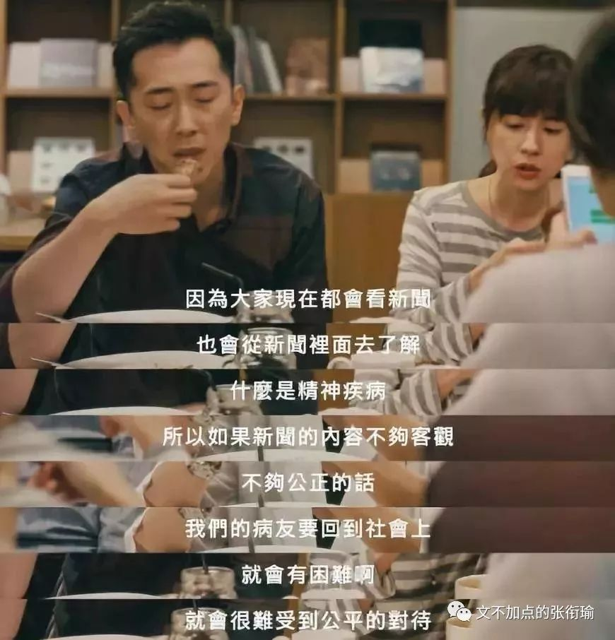

正如我没有考证过的伏尔泰所说， 人人手持心中的圣旗，满面红光地走向罪恶。

一些人受到鼓吹和蛊惑，走到了不合理的道路上，做出了不理智的行为；另一些人只不过因为前期有了预防，而走到了更合理的道路上，但行为依旧极端。

后者的行为依旧适用贬义的词汇，只不过是接受了统战的思想，却并没有因为道路而改善自身的行为哪怕一点点。

剧中最有情感冲击力的，莫过于这一张随机杀人犯的父母，在面对一众媒体时的下跪。

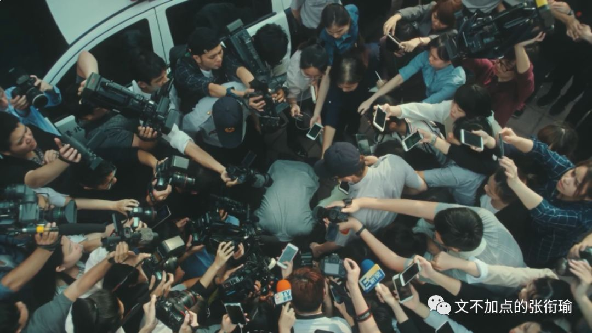

媒体记者继续追问，下跪是发自内心的吗？请问下跪是有人指使的吗？下跪也不能换回九条人命！

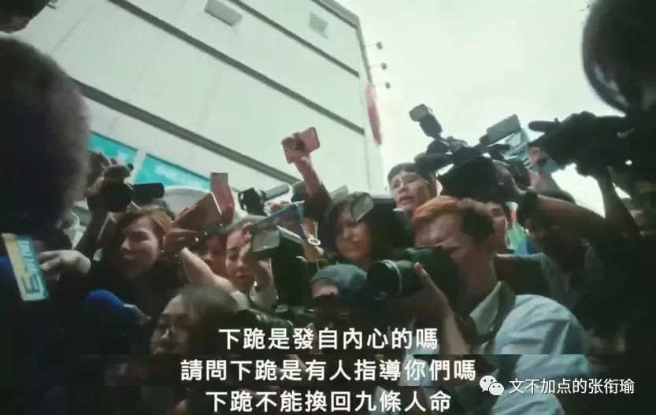

在任何一部其他的剧作里面，只从某一个人的视角，都可以成为伟光正的说辞。但这部剧就好在这里，把事情明摆地拿出来。就像这个镜头， 和前些天 章子欣 的父亲在灵堂前，被围观群嘲的样子何其相似。我们与恶的距离真的不远。

问题看似在新闻伦理，但实质上，仍然在病识感。

Vista 看天下 [昨天](https://mp.weixin.qq.com/s?__biz=MjM5NDA5NDcyMA==&mid=2651731673&idx=1&sn=fb5c446409dd73b54efce083ac118f29&scene=21#wechat_redirect) 评“黄晓明”一类人的认知偏差时如此设定：

“小明们”上学的时候，成绩不理想，老师们跟家长说的永远都是“ XXX挺聪明的，就是不努力/太粗心，一努力/仔细一点儿成绩准上去”。 小孩子听得多了，会真的以为自己不鸣则已，一鸣惊人了。在把社交网络上的签名改成“为年轻时吹过的牛逼，奋斗终身！”后，他们紧接着到问答网站上匿名提问：我现在280分，高三拼命一年，有没有可能提高到600分？

“小明们”第二个特点，是理解能力为0，永远读不懂空气，永远品不出弦外之音。可能一只训练有素的边牧，都比他们会看脸色得多。相亲对象说“我配不上你”，他们往往能惊讶地瞪大双眼，真诚又大度地回上一句，“没关系，我不嫌弃你啊”。于是，在“小明们”的眼中，那些礼貌而不失尴尬的围笑，都成了释放爱意的信号；那些自以为云淡风轻的嘲讽，也全都是真情实意的恭维。

自我感觉良好，不允许别人质疑。

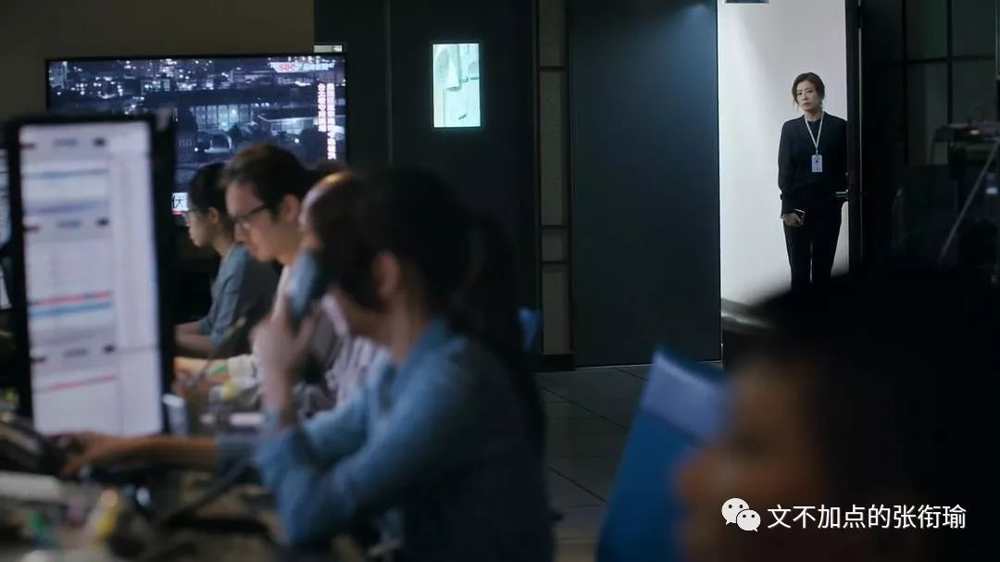

要命的是第三点，他们往往没有恶意，你还真的很难跟他们撕破脸。有时候就算你忍不了了，也会被人劝和“算了算了，他是好心办坏事”。于是，你只能静静看着他们无知且无畏的笑脸，从牙缝里挤出一句“没关系，你也不是故意的”。 然后，继续和六老师一样继续做一些正能量的开花事情。

你所有的锋芒毕露，收效都不过是一盘和稀泥。

你所有以为无足轻重的、以讹传讹的，在那边却成了惊诧愕然的头等大事。

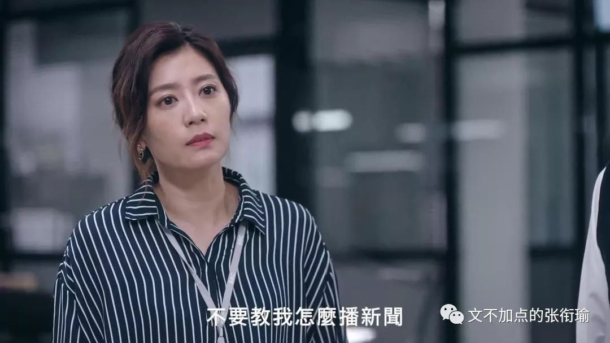

“病识感”和此前的推文中提到的歉疚，我都在指向同一类事情。而这些在落到每一个具体事情、具体情境上的时候，都有对应学科专业人士总结的规律，需要之为每一个涉足于此的人怀有如是的悲悯力量去解构事件。

“不是每个人生下来都可以选择，我们可能有个爸爸，因为找不到工作就酗酒打妈妈，我们没有办法好好读书，甚至没有办法好好睡觉。我们很穷，很小的时候就开始去外面打工，有时候做一两个月就会被炒鱿鱼，我们自己都不知道为什么。我们是在不断地被否定当中成长的，甚至相信那些声音是真的。

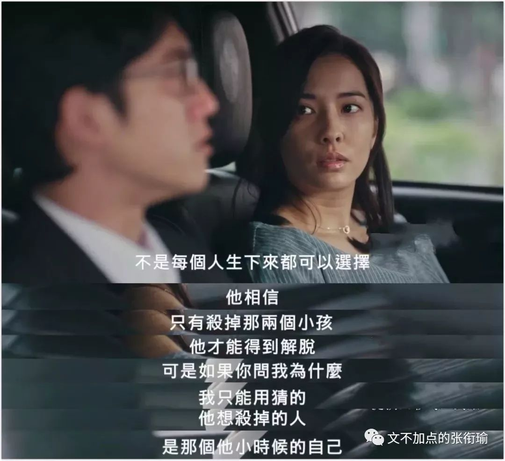

陈昌他就信了，他相信只有杀掉那两个小孩，他才能得到解脱。可是你如果问我为什么，我真的不知道。我只能用猜的，他想杀掉的人，是小时候的自己。他的确犯下了难以原谅的罪，我会说他是个罪人，可是他不一定是个坏人。”

最后附一段，是新闻人家庭中的另一小孩早恋之后，执业新闻人的父母从教师办公室出来，接着掌镜从这条线转向加害者父母。编剧和导演都很高明，并且演员也很用心，无愧为实实在在地今年份好剧标杆。

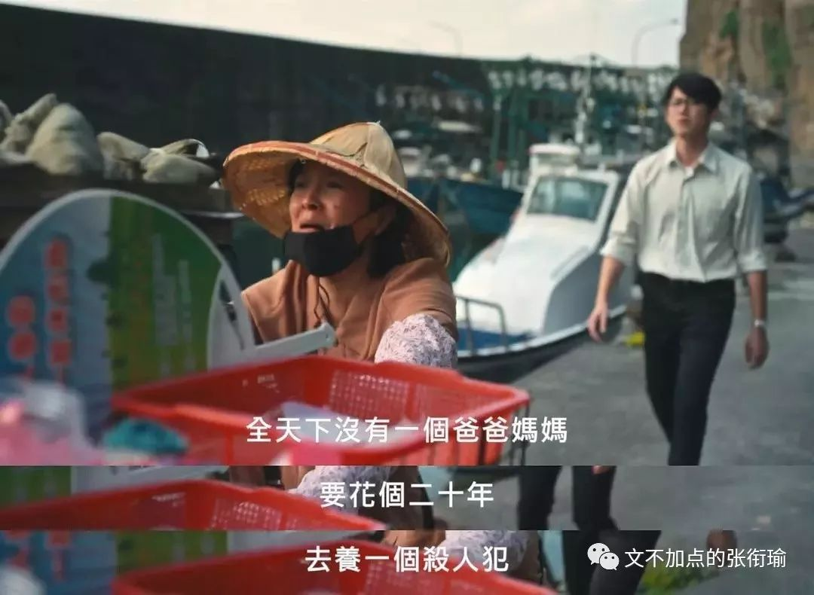

保有一点“病识感”，想想做过的事、说过的话。

我们与恶的距离，the world between us。
