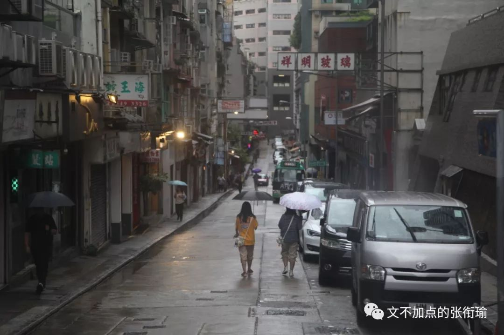
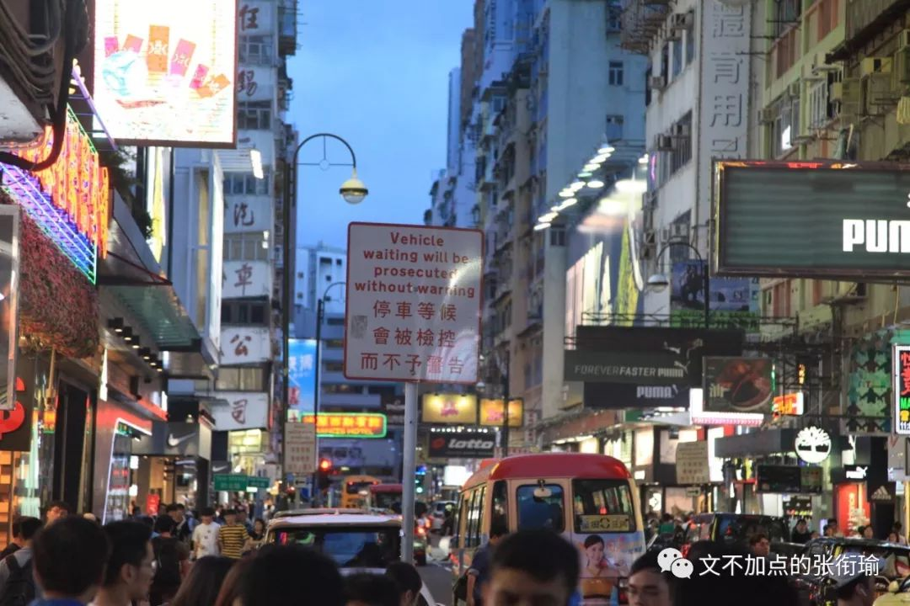

> 本文是张衔瑜第 113 篇推文 共计 8400 个字

本文是张衔瑜第 113 篇推文

共计 8400 个字

前言

时间顺序上来说，这次是先去的深圳、再到的香港。深圳一天，香港三天。机缘巧合地跟随着一个理工科的走访项目，顺便在路上印证、调整一些自己之前对于深圳和香港的想法。时间在七月底。

大学到现在，已经去过了除籍贯和武汉之外的10座城市，一共15次。这次是本科期间第三次到 [深圳](http://mp.weixin.qq.com/s?__biz=MzUzNjE3NzA3Mg==&mid=2247485271&idx=1&sn=aa9b1dc34785f8a7491f8611dc27f9ac&chksm=fafb7788cd8cfe9e6c65b9b2a8e757edafa0908348b5e2b284a90db38fe8880def0f0b727f3f&scene=21#wechat_redirect) ，第二次到 [香港](http://mp.weixin.qq.com/s?__biz=MzUzNjE3NzA3Mg==&mid=2247483911&idx=1&sn=d03f50934536437929624ba6a7720095&chksm=fafb72d8cd8cfbce8f0ab19ffc52e5af4d9615ee616a247245c72c783d82c48142e2d74257dc&scene=21#wechat_redirect) 。这一次，正遇上香港在政治尤其是司法中出现了一些不和谐的声音。作为一名合格的共青团员，我坚决拥护党的领导和国家领土与主权完整。除主要的学术走访之外，我也本着尝试分析和解决问题的态度，关注了一下内地新闻报道与香港本地报道之间的差异。

写下域见随笔之前，我先想宕开一笔，截取一帧恰好我这次去走访之前看的1991年杨德昌执导的 《牯岭街少年杀人事件》 。故事讲述了20世纪60年代初在台湾的一宗杀人事件的始末，更像青春片而没有多少悬疑推理的色彩，却无一镜头不在指向台湾社会割裂的生存状态。

01 深圳·又到深圳

七月二十九日到深圳的时候，与三个月前到此的感受无异。深圳北出站之后的路牌，行道栽种着的朱瑾，以及在区和区之间通勤都需要驱车高速的交通需要。在我的视角里，这些都很熟悉。

在深圳即便待上一两个月，也不见得有很需要说粤语的时候。几次在深圳：宝安、福田、龙岗，将日常生活中听到和说到的语言仔细想一想，像其他广东城市一般使用粤语 （或者白话） 的机会倒真没有很多。在用语上，广州和香港就没有这样。

香港地铁的播报，如果我记得不错的话，顺序是“粤语—普通话—英语”。这一点在我去香港中文大学参观，看到的办学章程提到的大意为“两种文字、三种语言”也很类似。即便都是在中文内，内地说“垂直电梯”，香港说的“升降机”（用繁体），很像lift and elevator。这一点很体现出语言作为一种工具的意义，让我们能用之来交流对于世界的认识。

在不对含义界定、用法细微等等要求得那么苛刻的时候，也就是我说的在深圳的时候，完全不用到粤语也不会有什么影响。我并非意在条析深圳图和从一个小渔村成为改革开放的亮点，但从 普通人 的生活生存、尤其是作为学生在深圳求学会接触和遇到的林林总总的人这一点社交圈子内，我们大抵可以认为很多人来自非粤语区、或成长在粤语区但并不太常用粤语。

早餐随意在龙岗区找了一家肠粉店，虽然并不知道是不是本地人开的店铺。可我们认为的本地人做出来本地味道一定更加正宗，这一点认知虽不说多么正确，但也不会错到哪里去。

依托工厂而建立的生活区，工人们从思想到生活都单纯得像还在学校里。学校外边出现的小吃街，供学生们每天上学放学去小憩片刻；工厂外晚上十点多了，各地来的食物也纷纷出现在了塑料纸铺张好的餐桌上。

上边想法本身不是让步或者妥协，而如果把思辨带到包括吃东西的菜式讲究，带到这样方方面面里边去，也是喜欢自己给自己制造麻烦教条。有时候走着笑起来，可能只是觉得自己的一种想法和另一种想法相冲撞，发现了这一点之后又自己觉得好笑。

好在脑子还没有很乱。

02 香港·关于交通

从深圳湾口岸边检过关。过关之后，事情就变得有些不一样了起来。

最直接的依然是交通。作为刚刚拿到驾照十个月的新司机，四百公里的驾龄令我对道路行驶有了更深刻的感觉。在内地，行车靠右是基本操作。而香港沿用英属时期的规划，却仍然是行车靠左。

所以当我坐在大巴车上，感受到自己右方来车的时候，有着源于内地安全驾驶已久形成的肌肉记忆，觉得很不安全。尽管一直告诉自己： 没事在香港你不用自己驾驶机动车 ，可还是会在路上看风景放空自己了的时候，某一刻突然惊醒察觉交通有些不对劲，然后继续告诉自己没事的。

这是我在 旺角东 的路中间，用华为手机屏幕为前景、单反相机为后摄，拍下的一张虚化。应该算是这次到香港拍的很好看的一张照片了。

03 香港·关于措辞

正常的学术交流之余，香港的部分理学 （区分于文史哲和工农医） 老师也对内地的科研现状颇有微词。虽然照顾到我们团队的交流体验，大部分时候都是在用普通话讲述这自己的观点和看法，小部分时候用英语，但细节用于中体现却体现出了香港人在认知上的一些不经意的认知态度。

比如我在这篇走访随笔当中，一直在很谨慎地使用 “境内”、“国内”、“境外”、“国外”、“内地” 这些词语。这应该算是我自己从少先队员以前开始，到整个教育过程当中，都一直准确而干净地学习并区分清楚了哪些是“国外”、哪些是“境内”。

一位香港的老师称，内地科研不应当以论文太作为评价发展的指标：“QS排名 （一项大学排名榜单） 当中很重要的一点CPP （Cited Per Paper篇均引用率） 竟然占了三分之一。国内的一些高校什么‘长江’（ 指长江学者） 、‘杰青’ （指杰出青年基金获得者） 又很看出身的排名。我们香港xx大学的老师们就说，那不就文章发得越少越好吗？所以如果这些国外的排名算总量的话，那香港八所高校和国内体量那么大的比又不知道掉到哪里去了。”

这里我隐去的这所高校的真实名字。出于共青团员一贯的政治敏感，虽然这段话的信息我是认可的，但也还得在处理信息的时候，自动把 “国内高校” 替换成和他们站在自己角度的 “境内高校” 。

我以为这其实是大部分香港人的认知局限。知道自己和外国人有区别，但也说不上对内地有很狂热的好感。

04 香港·权力意志

回忆一下，在随笔最初我提到了杨德昌执导的《牯岭街少年杀人事件》：

> “民国三十八年前后，数百万的中国人随着国民政府退居台湾。绝大多数的这些人，只是为了下一代的一个安定成长环境。然而，在这下一代的成长过程里，却发现父母正活在对前途的未知与惶恐之中。这些少年，在这种不安的气氛里，往往以组织帮派，来壮大自己幼小、薄弱的生存意志。”

“民国三十八年前后，数百万的中国人随着国民政府退居台湾。绝大多数的这些人，只是为了下一代的一个安定成长环境。然而，在这下一代的成长过程里，却发现父母正活在对前途的未知与惶恐之中。这些少年，在这种不安的气氛里，往往以组织帮派，来壮大自己幼小、薄弱的生存意志。”

民国政府是在1911年辛亥革命后，1912年元旦《中华民国临时约法》成立的。自然政治正确地算下来，民国三十八年我们也就应该废止民国纪年、并称呼为 “台湾当局” 。

特别值得点到的是，这种生存意志和权利意志是有区别的。一位叫尼采的唯心主义哲学家、唯意志论者，在《权力意志》中提到：

> 权力意志分为追求食物的意志、追求财产的意志、追求工具的意志和同化的意志等等。不仅具有生命力的有机物的本质是权力意志，就连一切自然事物和自然过程也都反映了这种意志，物理学中，物质相互吸引或相互排斥就是不同权力意志争夺的结果。 生活在本质上就是尽力争取超级权力，知识、道德、理智等都是求生存、谋权势的工具，而只有应用于此，这些才能凸显它的价值。所以，幻想和真理同样是必要的。

权力意志分为追求食物的意志、追求财产的意志、追求工具的意志和同化的意志等等。不仅具有生命力的有机物的本质是权力意志，就连一切自然事物和自然过程也都反映了这种意志，物理学中，物质相互吸引或相互排斥就是不同权力意志争夺的结果。

生活在本质上就是尽力争取超级权力，知识、道德、理智等都是求生存、谋权势的工具，而只有应用于此，这些才能凸显它的价值。所以，幻想和真理同样是必要的。

马克思主义是完整的科学体系，它包含三个主要组成部分：马克思主义哲学、政治经济学和科学社会主义。马克思主义哲学即辩证唯物主义和历史唯物主义，而辩证唯物主义是由辩证的唯物论和唯物的辩证法、辩证唯物主义认识论三部分组成。这和上文唯意志论尼采所提到的权力意志，有着出发点上的根本区别。

05 香港·割裂的抱歉

更重要的是，我们怎样来看待割裂的生存状态，怎样触碰和解构一个社会在融入大量外来、流动的人口，或是经历了巨大社会风尚与体制的变化乃至变革之后，所留存下的这些问题。 快刀斩乱麻是一种方式，但我们是一个个活生生的人。 如果说语言只是一种表达与交流信息的途径，那么让语言从工具成为一项艺术的，必定是言说者内心的恻隐和悲悯。

语言的细节依然重要，我谈论这些问题的时候，遣词造句很难达到社会学等人文科学学生的那么精准。 不能 寄希望于每次都说一句 “你懂我意思吧” ，毕竟不是每一个人都曾经试过把自己摆到他人的位置上去考虑问题，也不是每一个人都明白就事论事这项品质代表着什么行动内涵。

我所见到的这一部分在香港教授理学/工学的老师，都会客气地使用礼节性的描述来同理我们团队到香港期间的心路历程。在朋友圈询问最近有没有人一起去香港的时候，我得到的最多即是来自朋友们的提醒 “你最近怎么还去香港？香港那边乱得很，当心废青！” 之类。到了香港之后，香港的老师和同学也带歉意地说 “大家都知道，最近香港发生了一些事情，希望这不要影响到我们的交流。”

06 香港·学术学校

三天在香港，我一共去了四所高校做理学的学术交流。这样的交流就非常学术化，先是学术报告、后是实验室参观，期间随时提问、随时回答。双方有来有回，知无不言但基本只在纯粹学术领域上有交流。

因为 [两年前](http://mp.weixin.qq.com/s?__biz=MzUzNjE3NzA3Mg==&mid=2247483911&idx=1&sn=d03f50934536437929624ba6a7720095&chksm=fafb72d8cd8cfbce8f0ab19ffc52e5af4d9615ee616a247245c72c783d82c48142e2d74257dc&scene=21#wechat_redirect) 我也跟过类似的深圳工业园、香港高校的走访项目，所以对这些并不陌生。之前来的时候可能还只是惊叹羡慕，觉得人家的实验室多么好、干净整洁又有先进的我没听说过的设备。两年前自己还很青涩，去过的地方也不多。 两年后 再来看，就只觉得是正常、合格、标准配置的理学实验室。稍微不同的是自己的摄影水平提高了不少，又拿着一台很好的相机走来走去。

从学术这一点上来说，和我无论去哪里做参观走访、实习学习抑或是参加学术会议，感受上没有太大的差异。依然正常学习，正常提问。

在每一所去到的高校内，就我个人的行动轨迹内，我的确看到了很多写着不友好标语的宣传Post海报、许多写着往后日程的集会时间，也的确看到了很多根正苗红的贴纸、以及在 “反送中” 内部也分出来的不同见地。同时， 没有 任何哪怕一个人出现在现实世界中， 对我 主动进行有关 “反送中” 的政见宣传，或是有明显而强烈的敌视、敌对行为出现。

唯一感觉到警觉的一次， 是我在香港科技大学的餐厅里，觉得内饰陈设很好看，于是端起手中的佳能单反边拍边调参数。一位相貌约莫四五十岁上下的男子站在离我三步远的地方，有些奇怪地 盯着（而不是打量着） 我和我手中的相机看了大概我调两张参数的时间。拍完第三张的时候，身高超一米八的我略带轻蔑地磕了他一句“Anything wrong?”事情就这么结束了。

以下是我当时拍的那个餐厅：

07 香港·街景市容

日薄西山，薄，是靠近的意思。当黄昏附近的blue hour来临， 旺角、洗衣街、窝打老道、弥敦道、尖沙咀， 这一线就成了理想的扫街去处。有着鲜明港式风格的招牌，总令人疑惑是不是香港人一直觉得灯泡越多的店就一定东西越好。

放眼望去，用老派点的词来形容，应该叫做“霓虹闪烁”或者“灯的海洋、光的世界”。在一个叫Instagram的图片社交分享软件上，很多tags#标签了citykillerz, way2ill, streetphotograpy的内容都出现了不少香港的街景。大意像这样：

随缘走进一家茶餐厅，老板见我们不会说粤语，于是蹩脚地用着英语和普通话混杂的话语帮我们点单。认真地喜欢这家的 港式灯泡奶茶 和 奶黄流心多士 ，真的一切开就感觉到戳破了外边酥酥的一层多士脆皮。

08 香港·群相描摹

在描绘香港人心理群相之前，我觉得要同理香港人的话，还应该从另一个客观事实出发：香港的容积率超高。

容积率 的定义为：总建筑面积÷总土地面积。听起来很抽象对吧。高容积率意味着一个区域内，比如一个小区，房子建得很多很多。高容积率的住宅，伴随以五平米内解决吃喝拉撒睡所有生活需求的 “ 香港龙床” ，意味着香港除富豪外的大部分人都生活在有着高密度居住人口的生活环境内。

内地出门多的游客，都知道旅游旺季要少去人多的景点，因为往往配套设施体验会降低——餐厅变差而且坐地涨价、洗手间门口排起了长队还很脏。高容积率所对应的高人口密度区域，换而言之是单位土地面积上承载着令人咋舌高的人数。游客到了只觉得是新奇、手举相机拍下几张cyberpunk的照片回家炫耀，媒体关注一下描摹群相、同理片刻写出一篇深度好文，但试想真正在这样的环境中生活每一天的人都要经受怎样的 生活蹂躏 。

当自己家需要和别人家共用一个洗手间；当楼道装的鲁棒性最高的门把手，但因为使用得太过频繁所以隔几天就坏了；当电梯里不管什么时候都总是装满了人，风扇呼呼的但没有一个人感觉自己吹到了风。我不敢把自己太代入这样的生活里边去，因为我想 我是不能接受的 。

一座城市的良心，得看下水道。

富裕的人们用财富挑战着社会想象力的极限，而制度兜揽着社会的结构和不致于颠覆的天平。当我在街道旁留意鲜花的价格、当我在学校里遇到老师学生侧写他们的生活状态、当我在冰厅吃到香港的种种食物，我想我能理解香港居民们撕裂的生活感受。

同时，理解并不意味着赞同，存在不意味着合理。

理解指的是我能理解香港人为什么会有今天这样的心理状况，合理是指的我能尝试找到合理的理论解释为什么不和谐的声音在香港会有生存的土壤。这并不意味着我否认游行示威的事实，对过激的行为有立场上的让步和妥协。

我对于在香港发生的暴行，从污损国徽国旗到逼停多条港铁，感到愤怒甚至觉得耻辱；但同时更对普通香港人，尤指不是将政治生活作为组成自己生活主要部分的那一批人，有感同身受的痛楚。这不仅仅来自于日常的通勤因为运动而受到冲击，更有因为一小撮人的破坏行为，而导致自己在其他时候受到无端指责的屈辱和不堪。

更重要的是，我们发声，不是为了把香港人推向我们的对立面然后打倒、打趴下。如果仅仅是想诉诸精神或者物理暴力，那和兽群冲锋有什么区别？

我只是觉得，大部分政治教化对于普通的个体而言，进行完整而成体系的理论讲述，短期作用比不上只进行观点输出。尤其在能让人觉得，这种想法是有逻辑根据和道义支撑的时候，观点输出几乎变成了凡出之后必奉为圭臬的精神领袖存在。

这不是什么好现象。

09 香港·游行狂欢

游行集会本身是一种抗争方式，五四运动口号中的“外争主权，内除国贼”激励着一代又一代的中华儿女救亡图存。

但游行到示威和引入暴力，往往得靠每一个个体的理智和克制。

甚至犬儒主义一点，如果有游行队伍中的人，被境外势力策反了去打砸抢烧，那有一部分是因为参与游行并不需要任何的门槛，谁都可以混进来； 况且，如果游行的人可以被策反，那么被派来处理游行的人，同样有可能被策反。 还有可能在双方都被策反了但互相不知道的情况下，由其他势力导演出了一部 闹剧 ，将原本还不是很激烈的游行突然冲上一个小高峰甚至失控的状态。

对于学生而言，所有的游行集会的归宿都会进入狂欢，而狂欢之后又还剩什么呢？

信息的定向轰炸是一件很可怕的事情。 蔡徐坤到底出圈了哪几首歌我暂且按下不表，但 “数据流量意味着歌手实力和当红程度” 这种认知的产生，比认知内容更令人后怕。所以在说起香港问题的时候，我采取的写作方式也是本着解决问题的思维方式，本着用理性逻辑和情感思维解决问题，而不是纯粹的观点输出。

内地已经立法禁止了大字报这种形式。但在香港高校所谓的民主墙、连侬墙上，还是能看到许多不同的声音。有鼓吹 “光复香港” 回到英属，也有说警队中有人被策反收买了得找出害群之马，更有香港大学里把“吾等学子誓与抗争者同行”的 “学子” 两个字划掉后用繁体写上 “废青” ，什么类型都有。

令人高兴的是，这些都写在校园的 既定部分 ，写在同一面墙的区域内、或者张贴在饭堂里。教学实验室内没有任何的张贴内容“入侵”，几方似乎还会互相撕海报但都集中在墙面上，繁体、简体、粤语音译和英文的都有出现。

内容我们可以辩论，可以对话，可以有很多的办法。但能在这种形式之下进行表达，那也不失为一种方式。内地不仅法律禁止这种方式，而且同样带有对于纯粹观点输出的膜拜。我们看一些我党许多早期成员的简历，都能找到他们在加入党组织之前， 无一不经历着积年累月、整晚整晚不休息的思考和辩论， 才最终确立了自己的信仰和解决社会问题的方式。但在习惯了做观点输出接收方的人看来，他们不想这么接受。

有人在香港的游行中打出英属时期的旗帜，也有人打出美国星条旗。而就在不久前的法国巴黎黄马甲事件当中，也有人打出“中国工农红军”的锤子镰刀红旗。“香港 民众 ”的前两个字只是修饰和限定，从后两个字的角度来看大家都有着相似的特征。

所以我描摹香港普通人的生活，应当是： 生活在水深火热当中。

大部分地，还在为高昂的住房价格和不那么匹配的住房条件、生存条件而奋斗。 这些人因为特定的历史环境，而或多或少生活在割裂的社会条件当中。他们知道自己是中国人，却也不得不面对声音听起来都很大的“返送中”和以新华社为代表的“批评策反”——对应到香港本地则是苹果、大公等几家。面对了太多的声音，而自己只是普通人，于是变得浮躁而不安。上街游行，或是以为这样就可以，正如被信息数据定向轰炸一般，形式不同而已，但还是得面对铺天盖地的指责；至于港独，就和知道自己是中国人一样，也完全知道这是一种 “端起菜碗吃肉、放下筷子骂娘” 的行为，但还是得面对自己一贯经历的“民主教育”和有时候为了反而反、接受了其他无名挫折和愤懑时候的发泄。

这里的每一条都不一样，不能一概而论。以人为本地谈论每一个个体所持有的见地、所表现出的行为，才是真正地在负责任地解决问题。我很讨厌，也觉得不少香港人都讨厌被贴上一个 “废青” 的标签，一个大板子一股劲打下去也不管是不是打着名号上本该打下的人，只满足打下板子的这个行为、过程。

另外，关于境内媒体报道上的一些瑕疵。诚然，主流媒体上，像新华社、人民日报、光明日报在这样的重大时期都体现出了作为主流媒体的担当。但这样的担当，在我看来显得有些单薄。单薄不在于发声的内容上有问题，而在于很少看到、听到有相当的声音，在用不同的视角发出不同的声音。

无论是 “出国了就越来越感觉到爱国” ，还是 “劲风知劲草、路遥知马力、日久见人心” ，主流媒体之所以成为主流媒体，是因为还有各种三教九流鱼龙混杂发出着不一样的声音，于是愈发显得高大。但在境内，很少能接触到像在香港高校所谓的“民主墙”、“连侬墙”前面一般，如此深刻地感受到长期接受主流媒体思想引领时铸就的 主心骨 。

就像战士们训练了很多的技巧，年年都被授予 “钢铁战士” ，这还不是真正的战士。只有到了战场上，动作有没有走形、配合能不能出来，才真正体现了战士的素养，人们才能以此评定，这是一名真正的战士。所以另外一些时候，当我们的媒体报道双边关系的时候，如果只是在介绍基本信息后，用大篇幅强调 “我们说”、“我方认为”、“本方提出” ，则体现不出双边或者多边的交锋，而更像是单方面的命令和部署工作。这样选择性的报道，恐怕都不能认为是符合逻辑、实事求是了的报道。

10 香港·关于游记

我能意识到问题，并且把问题提出来，这仅仅代表着我意识到了问题，并且提出了问题。并不意味着我知道怎么解决问题，并可以被“强制”要求提出整改办法，甚至经受质询，稍不留神就要被认为是幼稚发言。对这些我不予理会。

这一次到深圳、到香港，没有我想象中出现那么激烈的对抗，但也可能是因为我没有被风暴刮到。七月三十一日，正好是我和这个公众号的 [生日](http://mp.weixin.qq.com/s?__biz=MzUzNjE3NzA3Mg==&mid=2247485666&idx=1&sn=acdc1cc8d60f1590dbb736f37f980bdc&chksm=fafb783dcd8cf12b6fee8894925673e24e266079939bc372450c7ec02bcb0c4bf9056dde18f7&scene=21#wechat_redirect) 。当天，香港天文台挂出了 “八号风球” ，台风的边缘扫过香港，所有人理论上都可以凭这一通告而不用上班。朋友说如果在风暴的最中心， “风眼” 所在的地方，其实也可能是晴空一片。我想，也确实会如此。

去香港之前我也有些忐忑，自己不会粤语而且内地媒体一再强调事态严重。但自己切身走一下，侧写一会香港居民的生活状态，自然地从民众的视角有了更新的体验。

如何解决事态矛盾、什么时候化解危机，肉食者谋之；香港社会还有哪些割裂的矛盾状态、这些状态应该用怎样的人文学科语言来定义，肉食者谋之；我只是站在一个普通人，因为种种原因而生活在了这样的社会环境下会产生什么样的认知，稍微提了几句。

可能因为长久接受GRE阅读的熏陶，从点到线，然后二线比较，再三维、四维地引入其他参考条件，有时候还自己和自己掐架，这些都可能让我的随便变得更加思辨、也不想呼告文那样地对读者友好。

不管怎样，所有人都在为着一个 更美好、更理想 的生活而做出自己的努力。可能这个更美好、更理想，是很小市民地仅限于自己、自己的家庭，或者更宽广地倒了自己所在的地理政治区域、甚至包容博爱地到了全人类的范畴，这都很好。对于违法乱纪，该打压、该针对，这都是正常而且必须、应当的。可我们普通人，作为沉默的大多数，如何正常、美好地过完这一生，真不是一件容易的事情。

尾声

> “绝大多数的这些人，只是为了下一代的一个安定成长环境。然而，在这下一代的成长过程里，却发现父母正活在对前途的未知与惶恐之中。这些少年，在这种不安的气氛里，往往以组织帮派，来壮大自己幼小、薄弱的生存意志。”

香港和深圳，地缘相近，但采风的时候却给人以很不一样的社会体验，都很值得。本来准备在回家之前再去一趟广州，可从香港西九龙高铁站到了广州南之后，看到未来一周的台风暴雨，也就取消计划直接换乘回家。

希望我们的城市能更从个体出发，实在地凝练普通人群体背后的心理状态和社会根源，而不是一开始就贴标签，揪着一小撮跳梁小丑“帮忙打广告”。希望信息繁芜的时候，我们可以实际地去走走看看听听，而不是闭门空想造车。

后记

从西九龙回来、整理笔记，到这篇发出来之前，香港的局势又几经变幻。情绪宣泄，我以为只是和情绪隐忍一样，同属被纳入在沟通艺术当中的一种谈判技巧而已。如果把问题解决等同于情绪宣泄，喧宾夺主之后问题依旧是问题，暴力之下是臣服而非信服； “自由”、“民主”、“法制”，这些词语依旧承载和寄托着人们对于美好生活的向往，并不会因为有人挂羊头卖狗肉，而污名了这份信念。

情绪，应该被管理入对他人生命和遭遇的同理。而信念，应当被审慎考量后化为理性的目光和行动。我支持并理解香港，支持包括香港警察在内希望香港变得更好的所有人。我也支持并理解所有地区、国度，正在追求人性美好的路上逐步前行的个体和团体。

上一篇文中，我谈论的是 [我们与恶的距离](http://mp.weixin.qq.com/s?__biz=MzUzNjE3NzA3Mg==&mid=2247485691&idx=1&sn=ff2c8c7f2a84be4facf2b51aa951ea92&chksm=fafb7824cd8cf13225f3209c940a8ab7bfdf73b1cd1ce9bc744e4719e356d128e0e5f082b5a2&scene=21#wechat_redirect) 。只是想，永远都不要去挑战人性。

