> 本文是张衔瑜第114篇推文 共计2921个字

本文是张衔瑜第114篇推文

共计2921个字

三万年前，有朋友推荐我去看乐队的夏天。

终于，我也没有去看。

但是里面的歌毕竟已经跑到我的歌单里了，不知道这算不算是变相地在看。 其中一首我听了很多次。

滚圈的迷惑名字，实在是让人迷惑。九连真人、刺猬乐队、反光镜、唐朝，以至于有人说今天要不要去拜菩萨的时候，滚圈朋友会问： “拜菩萨？什么风格的乐队啊？怎么没听过？（挠头）”

新裤子——《没有理想的人不伤心》，换到歌词里边成了 “没有文化的人不伤心” 。我不知道综艺在对此的时候有没有做出说明，当然我也没有任何要去求证和寻找的想法。不过这首歌打动我的地方，是开头的一段：

> 我最爱去的 唱片店 昨天是她的最后一天 曾经让我陶醉的碎片 全都散落在街边 我最爱去的书店 她也没撑过这个夏天 回忆文字流淌着怀念 可是已没什么好怀念 可是你曾经的那些梦 都已变得模糊看不见 那些为了理想的战斗 也不过是为了钱 可是我最恨的那个人 他始终没死在我面前 还没年轻就变得苍老 这一生无解 没有我的空间 没有我的空间 没有我的空间

我最爱去的 唱片店

昨天是她的最后一天

曾经让我陶醉的碎片

全都散落在街边

我最爱去的书店

她也没撑过这个夏天

回忆文字流淌着怀念

可是已没什么好怀念

可是你曾经的那些梦

都已变得模糊看不见

那些为了理想的战斗

也不过是为了钱

可是我最恨的那个人

他始终没死在我面前

还没年轻就变得苍老

这一生无解

没有我的空间

没有我的空间

没有我的空间

我有时候甚至会忘了，到现在自己玩得很开心的一段时间。 那时候还在高二上。 很多高中时候输机打字留下来了的文，都在那个时候出现。

长沙太平老街 · 从北面街头南行 · 第一个岔路小巷往东边走 · 一排长沙古旧三层民居当中的第一家店，就是 飞鸟和鱼唱片行 。

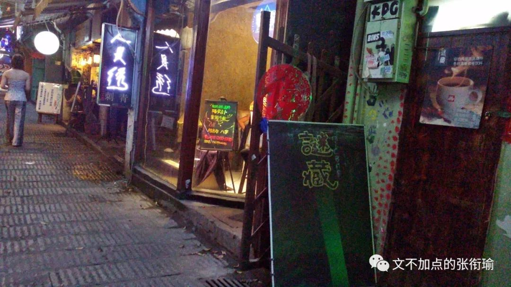

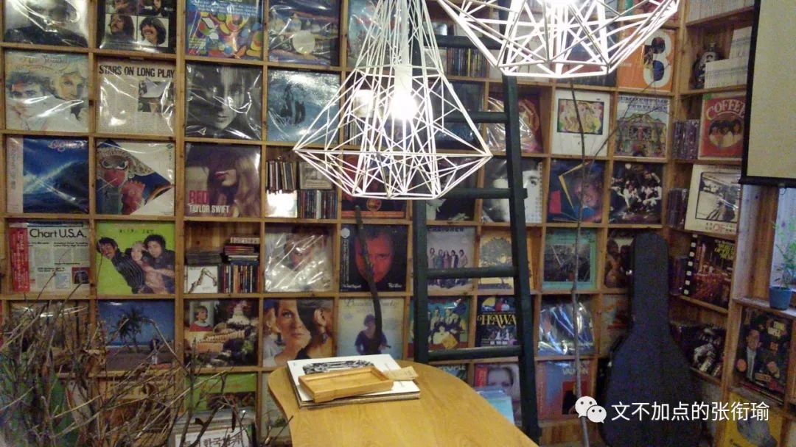

一楼，和以前在长沙定王台书市或者其他街边碟店看到的CD架子没什么两样，毕竟没什么新奇；

而到了二楼之后，事情变得不一样了起来。 吊顶下来的镂空装饰灯，和四周背景墙上的黑胶唱片。

店主人把刻录着蓝调音乐的唱片，用唱片机扩音出来，一时间甚至会令人忘记窗外还是长沙最热闹、本地人最常去的民俗街坊麻石小巷。

高二上之所以会喜欢出门，以前是给自己说一些借口：

去岳麓山骑车减肥啦~去杜甫江阁看焰火啦~去喝一杯茶颜悦色啦~（当时不管是店员还是顾客都远远没有现在这么多）。但事实上，就是喜欢自己骑着 自行车 出去玩。

习惯的生活方式是换上骑行装、戴上提高抓力的骑行手套、用绑腿绑好裤脚、架上夜间强光手电、打开前后提示小灯，选一个好听的歌单或者podcast、连接了蓝牙，然后自己出门从心所欲。 那时候我常听的Rammstein德国战车，上次世界杯又被拿出来炒了一次。

从岳麓山回枫树山的路上，沿着湘江一桥往东，下桥便到了太平街。

很好找的一家店，只是在当时一个很少去营业店铺的高中生的眼里，越好的装潢越是会写着 “生人勿近、非请莫入” 。起先不过是我帮了朋友一个忙，朋友说没什么好用来feedback，不如一起去一个有意思的地方，于是就到了这家。

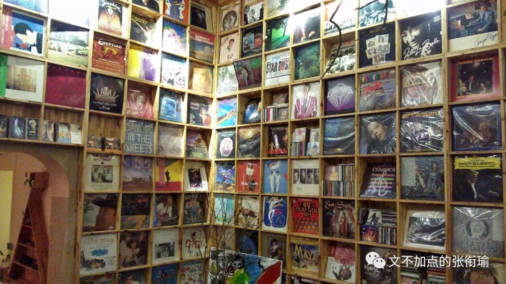

想和老板搭搭话，盘算了一下问题，发现自己想到的又是一些 “把店开在这里有没有声音？店铺租收平衡真的可行吗？” 之类的问题。于是，知趣地不这么说话。

倒是老板看我们上楼，然后在黑胶馆里边待着，于是走进来随意取了一张，在唱片机上放了出来。

钢琴和贝斯的声音在斑驳的长沙古民居中，像一瓶启封的香槟注入高脚酒杯时声响的优雅。

四面是 黑胶 唱片碟的音乐馆里边，我想自己搭着梯子上行些许，但并不见得非得有什么原因。当时我还分不清这些，所谓的音乐风格和流派，音乐素养仅限于猫和老鼠在不知不觉中培养起的交响乐常识，和一些浅薄的乐理。

老板随缘问我们，有没有什么想买的，或者想听的，都可以来取下来买回去或者在这边放着听。

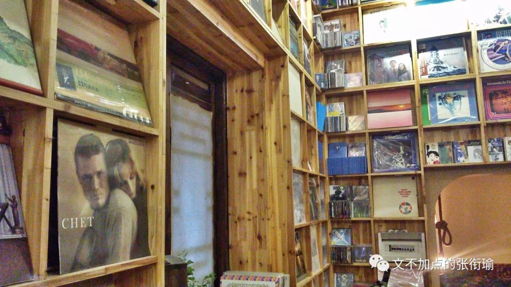

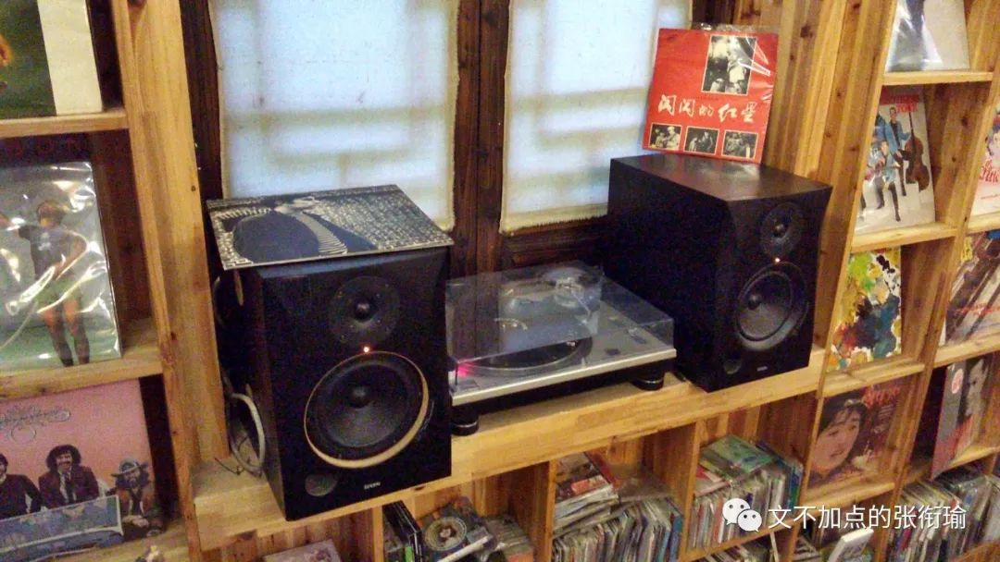

毕竟那时候还怯生生的，如果说去骑车上下岳麓山三四次、去太平街上和少给了我一片臭豆腐的摊贩店主吵架、解那么四五十道圆锥曲线的数学题或是自己下厨做两波年夜饭，可能都没有好好和人打交道这么难。

老板轻松地坐下，和善地问是不是中学生，平常就来这里听听曲子也挺好呀。顺便介绍说 三楼 是一个朋友们一起看看电影，办办小演出的地方，也会及时发布消息。彼时的即时通讯工具还是QQ。

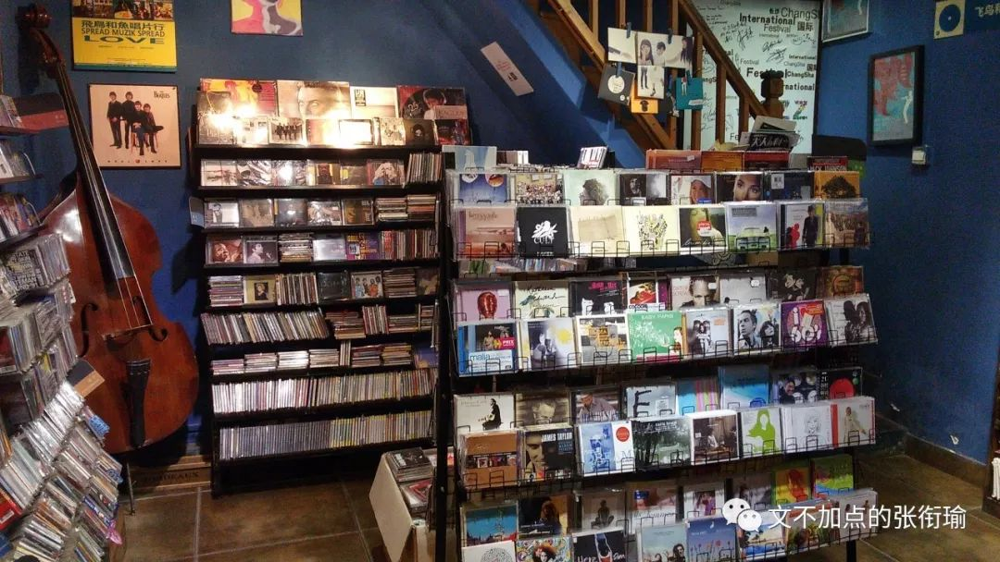

现在想起来，老板已经约莫是和生活厮打了很久，但还是音乐有在也没有放弃。可能就是到了那种，连别人说 “1+1=5” 也不会去争辩的佛门中人，静静地感受着音符、看着装饰灯发呆、做梦。

我以前不能理解，为什么会有人连最基本的生活也不要了，就去追求那些有的没的，把自己全身涂装到连牙齿都武装齐备，真的有必要吗？

这家唱片行没有如此。

在我到的时候，老板和店员都安安静静地在听歌，甚至为了音乐的效果，特地将空调设置在了黑胶室的外边然后把冷风引进去，而不至于干扰。 现在觉得，一批人是不管在什么时候，都想着用外在的改变来增强自己那点可怜的自信； 而另外一些人，是把绝望唱得大声。

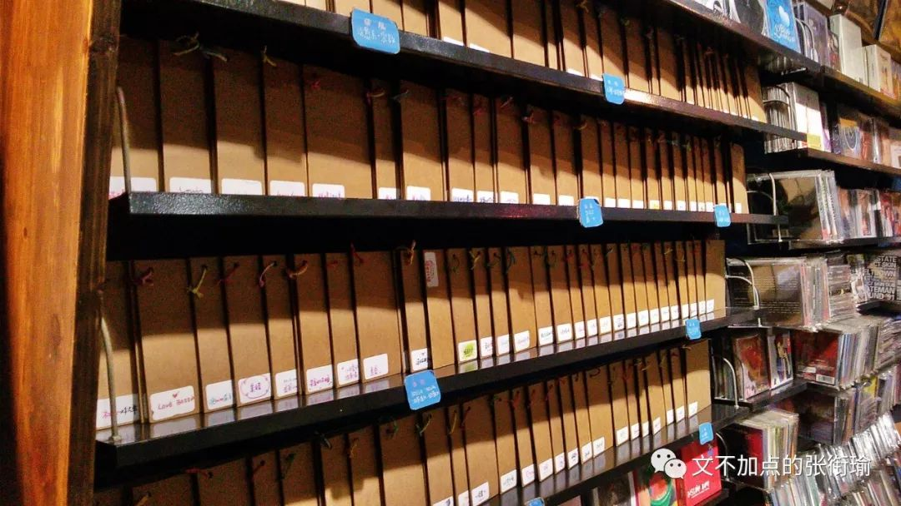

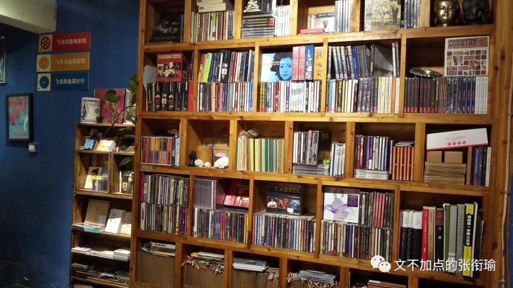

老板招徕一会，便去整理了自己的东西。 我也有就自己待在里边，拿着当时很可爱也很不错的三星S3，录下了这一段。 所有这篇推文里的插图，也都来自当时（但是不是同一次）的几张照片。

以前觉得，老板也竟然不担心弄坏了什么东西或者有些手脚不干净的人，后来只觉得是人家有更重的事情要去做，才不是什么都控得死死的。

网上有人说，老板在收藏的时候，这些碟得先满足老板自己的收藏欲望， “如果只有一张，肯定是自己留着，等找到第二张才会卖出去”。 在我几次到这家店的感觉来看，这话也许像是店主在说的。

算来算去，又到这家店过几次。

有时候是骑车从旁边过，找好心的店主接点水喝，有时候仅仅只是路过，然后作为一个我熟老板但是老板不熟我的顾客； 也偶尔说出来过自己以前学过音乐，然后店主显然很有兴趣，音乐流派地说了很多、又讲了讲自己作为乐队一员时候的过往现在未来。

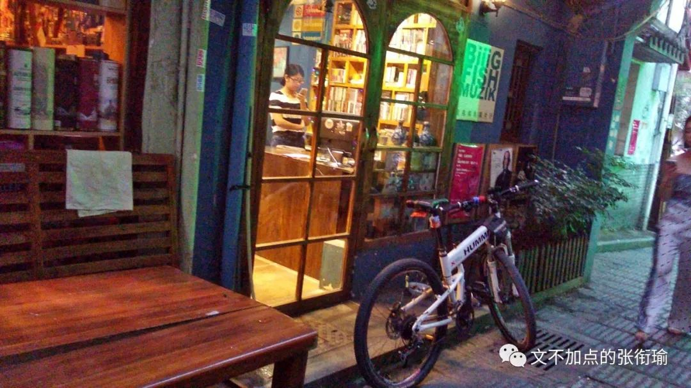

直到我快高三了，自行车就要被家里人没收了不准再在外面天天云游。 而这家唱片店，老板给了我一个新的地址，说这里的门面马上就要移走了，不会再在这里停留，好像要去解放西的某一个小角落里。

我弄丢了那张纸。

自然，也没有再去过这家店。

甚至很少想起来。

上一次还是在带人玩长沙的时候过 太平街 ，瞟了一眼这家店发现不再，而改成了和唱片不想关的大概是小酒吧或者音乐餐吧之类的文艺小店。也许是那种任何一个城市都能在大众点评上搜到很多的，适合小年轻们去附庸风雅或者感受优雅的静谧五星去处，但并不是 飞鸟和鱼 。

我也是这次提笔写下唱片行，才想起来去查一下《飞鸟和鱼》的出处。似乎有很多义项，其中假托泰戈尔诗歌的义项里，有那句很有名的 “世界上最遥远的距离，不是生与死的距离”。

一些人对于作者提出了一些质疑和争议，那就提吧。

我没去较真了。

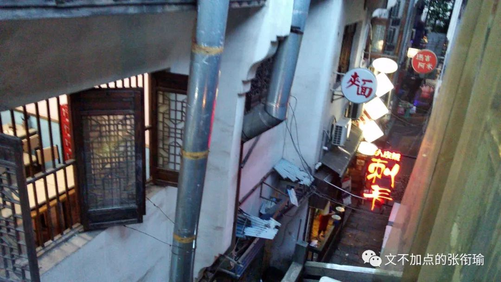

听到新裤子的歌，写下这个 老朋友 。其实只是年岁老，交情不过是萍水相逢然后我觉得这家唱片行的生存状态、店主的生活状态很令人安心。也许我也没有看到别的难过，能唱出民谣眼泪的人，都是在和生活厮打。

我既不熟这家唱片行、也不熟滚圈大家赏析的乐理和生活，包括乐队的夏天这部综艺，我也没有看。只是有很多很多的生活，有一些久远的 little bonus ，在某一个时间节点突然合辑出来，然后所有的回忆汹涌澎湃。

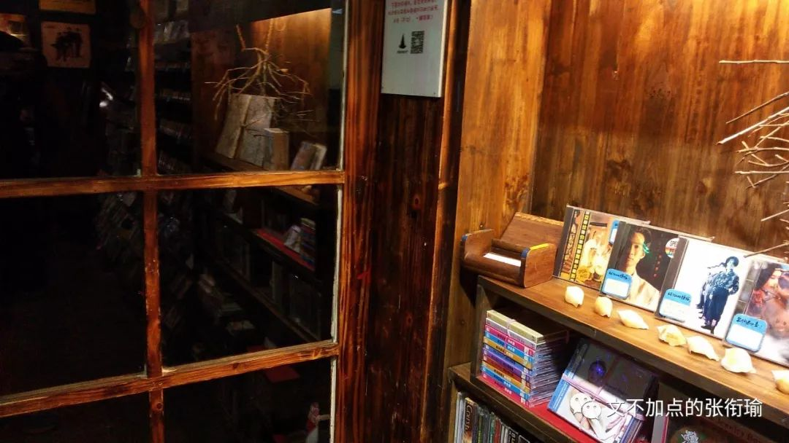

听着黑胶蓝调写下这篇推文，会一直想到的那时候把自行车停在店门口，然后坐在阶梯上解开绑腿放松一下肌肉。 夜深忽梦少年事，梦啼妆泪红阑干。 是很美的一句诗。真的这么感受过一次的时候，就好像听到了一首歌，代入到了当时的情境当中。也许我还得系上绑腿以防裤腿绊上飞轮，从岳麓山速降下山的时候又有行人闭闪不及。也许，还可以听听歌。

《不能说的秘密》这部电影里，很叶惠美的一个场景，是在唱片店戴上视听耳机，耳机里传来的那首女低音《情人的眼泪》： “为什么要对你掉眼泪，你难道不明白为了爱。只有那有情人眼泪最珍贵，一颗颗眼泪都是爱。”

音乐大抵如此。
