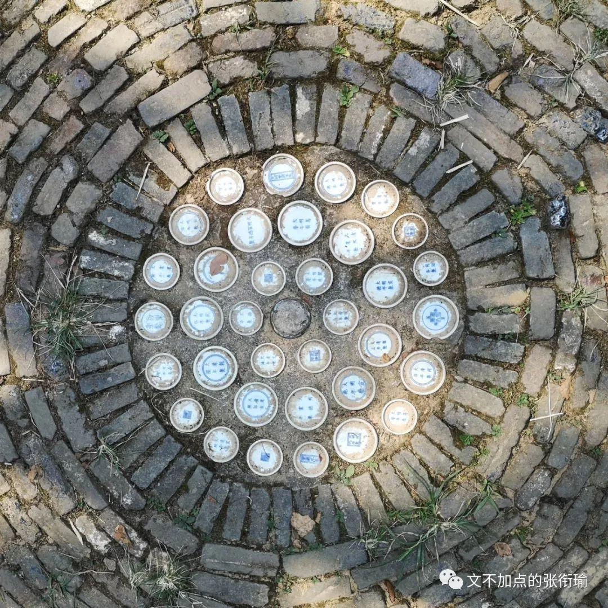

> 本文是张衔瑜第 116 篇推文 共计 3012 个字， 27 张图

本文是张衔瑜第 116 篇推文

共计 3012 个字， 27 张图

从湖南广电出城去，一路向东，便到了幕阜山脉。

在暑假的尾巴上自驾经过的时，就令人背诵起 《白杨礼赞》 的开头：

> “汽车在望不到边际的高原上奔驰，扑入你的视野的，是黄绿错综的一条大毡子。 黄的是土，未开垦的处女土，几十万年前由伟大的自然力堆积成功的黄土高原的外壳； 绿的呢，是人类劳力战胜自然的成果，是麦田。 和风吹送，翻起了一轮一轮的绿波——这时你会真心佩服昔人所造的两个字‘麦浪’，若不是妙手偶得，便确是经过锤炼的语言的精华。 ”

“汽车在望不到边际的高原上奔驰，扑入你的视野的，是黄绿错综的一条大毡子。 黄的是土，未开垦的处女土，几十万年前由伟大的自然力堆积成功的黄土高原的外壳； 绿的呢，是人类劳力战胜自然的成果，是麦田。 和风吹送，翻起了一轮一轮的绿波——这时你会真心佩服昔人所造的两个字‘麦浪’，若不是妙手偶得，便确是经过锤炼的语言的精华。 ”

而潇湘大地并不如同茅盾所写的这般境地，我也不打算以本文象征怎样的精神。建设部队和工程专家们将九百六十万陆地国土用混凝土联系起来，我一直觉得有条件的话，要开着解放牌的 大卡车 摸索过每一个角落。也许这只是一个成年之后，要去做的很多件事情之一，姑且写在这里吧。

这次出门倒没有做什么详细计划安排。从初中尝试着把每天安排到分秒之后，就觉得大可不必像完成任务一样凡有时间必须利用了去。于是也只有将要去的地方和大致的行程安排。想到了要去黄山，徽派建筑群也就在附近，除此之外再无他想。

连绵的幕阜山脉带来的是不绝的隧道。隧道限速80码，普通高速限速120码，超速10%之内可以接受。进入二十岁之后的一个改变是我也开始 算术 “拖把20块，撮箕10块，打85折”，只不过换了换形式。

路上看到 白鹿洞书院 的牌匾，于是随缘跌路下高速。以前只知道岳麓书院是朱熹张栻在城南讲学后驻地岳麓，这次到了白鹿洞书院发现也有朱熹的一份。旁边的店铺多以 “半亩” 为名，想来是在借字《观书有感》。如果名叫“问渠”的话，也会是很不错吧。

此前说书院的话，只去过长沙的 岳麓书院 和衡阳的 石鼓书院 。

相比起来，石鼓书院当时是初中和老师同学一起去的已经印象不多，但和岳麓书院积年累月游人香火不绝地来看，白鹿洞书院确实人气少很多。除了在布告展板上看到的活动介绍之外，游人也见到得不多。

兴许同在庐山脚下，人们要么直接去看瀑布，要么就在摇头晃脑《归去来兮辞》然后去看彭泽五斗米。

令人觉得神奇的是，白鹿洞书院真的养了不少的 白鹿 。就和石鼓书院真的有一面石鼓一样，表里如一（顶呱呱

到了黄山汤口之后，根据推荐的从后山上、前山下。按照规矩，是要致敬一下 “五岳归来不看山，黄山归来不看岳” 。黄山的确也当得一份山水心灵寄托。

我好像很少用，很情绪化的词语来像唱诵赞歌一样地去表达情感。

也许是没什么好表达的、也许觉得用词还不可以、也许仅仅是屏蔽关键词太久了然后那一部分就是只能认识但并不作使用的词汇。

写下这些是想说明，黄山真的当得。

游人在西海大峡谷的松枝旁经过，背包客们讨论着这样的通天栈道怎么去修建。

抬手修出这张 水墨山水图卷 ，只留少部分青绿而全无蓝色。

小火车被各路导游盛赞为“网红抖音小火车”，好像提到说网红之后大家的兴致就会高上不少。但其实所有的流量的口碑，如果不是自然积累，那么背后也必定包含着推手对于此寄予的希望。我以为可。

我们区分网红、流量、广告和口碑，仅仅来自于人们对于此的情感偏见，而忘记了这些代表着的是什么。当然也许很多人在九岁的时候就已经冻龄了不再长大，积累的全都是泡沫一般的人生阅历。我不会选择这样子。

黄山和其他的中国名山大川一样，也有挑山工在为景区里服务。挑山工们跟腱健硕，我们普通人平步上下还觉得小腿拉扯得疼的时候，他们还人人担着担子来去。导游说这叫 高贵 ，越高的地方价格越贵，挺符合逻辑的。

我详细数过过路的挑山工背上担了多少，单边四箱水，一箱水四排五列就是二十瓶。一边八十瓶，那么身上就是一百六十瓶水。一瓶水三百五十毫升或者四百毫升，那么至少是五十六千克，一百一十多斤的担子。

这都是 生活 。

当时就有在说，看看这些挑山工都年龄不小了，证明现在的年轻人都不能吃苦。

当然这个逻辑是很 荒谬 的。看得到的苦叫做吃苦，看不到的就不叫吃苦了吗？挑山工只是一个工种，并不可能所有人都必须得来吃这份苦，挑山工们本人如果不是生活所迫也不会来吃这份苦。所以挑山工们都年龄不小了的问题在于，原来只有吃这份苦才有救的人，现在还需要再来吃这份苦吗？

诚然这是一份很累的工作，但是看问题的视角如果扁平到了，你看看没有年轻人可以来做这份工作，那就真的应该好好反思自己了。未来这样的工作必定会被机械化取代，当然也会有人来跟我杠说那么多人成天无所事事出去为非作歹，那这就是一个社会问题了，提得简单答得难。

复杂的问题就更加不可能 “用一句话来解释清楚” 。

扁平着感动自己是不负责任的。

尔后则是安徽省的地标——迎客松。

黄山的最高峰——天都峰。

我到的时候正好碰上黄山天都峰封山，重新开放了莲花峰。那段时间恰巧看完哪吒，于是总盘算着旋律——“今朝我三头六臂，身后的莲花盛开”

下黄山之后好几天都腿很疼，连去民居玩都不愿意上楼梯。

潜口、宏村、西递、呈坎、屯溪，这都是关于徽派建筑的名村落。轰轰烈烈的社会主义新农村建设活动到了湖南的农村里，不少家的楼房都换成了模仿徽派建筑的倚山面水、黑瓦白墙。我是很早就想到真正的徽州民居里来看看究竟是个什么样子。

不可否认，这的确是为人称道的美丽。

民居内的倾泻的阳光

流水潺湲的夏日林局

远眺 呈坎 。其中坎卦，出自《易经》，展示在“坎”的形势下各种变化的可能性。黄山龙溪，阳为呈，阴为坎，唐末易名“呈坎”。Splash之后，蓝得就很像王希孟的『千里江山图』

而须得反思的是，轰轰烈烈的建设，有时候在令人怀疑到底是把我们的生活变得更好了还是变得更坏了。是凡言说之后必暴躁？还是并不言说只绥靖以待？

我拍下第一张被砸坏的 潜口 民居墙砖和被用毛笔蘸墨写下又拭去，第二张 屯溪老街 上作业的工程挖机。要更好的生活，这大家都知道。但以后更好的生活是一定要现在牺牲这么多吗？以后的以后会不会又还在向着更好去努力呢？

屯溪老街巷子里，电动车载着人渐渐消失在街墙拐角

西递 的湖边，全是搭着小马扎，背着写生木板雕梁画船的学生们。

我在 宏村 旁捕捉下这一张日落，和湖面的倒影一起，真好

当晚，离开安徽前往景德镇。

在瓷都的博物馆里，连地面的装饰都用的是瓷片。

我在看到里边半成品的瓷器工艺时，就开始幻想脑内：如果有相机那岂不是可以在这里修出来几张超好看的中景。可手机相机毕竟自调光圈构图太难，不管怎么都做不到像上一篇写去香港深圳的时候在实验室里修的那张洗瓶。

手艺传承人当着大家的面，一笔一笔地给盘面上色。

不远处的创意工坊里，木叶盏里盛水之后，烧制进的叶子像是又重新浮到了表面上来。

兜兜转转到了南昌，食味就基本和湖南很相似了 （不然怎么说去老表家蹭饭呢） 。

会要去的滕王阁和八大山人纪念馆，准备修图的时候看了看滕王阁的照片确实挺一般的，也没有要去修的想法。倒是放一张八大山人的签名logo，又哭又笑就像可以在五分钟内变换五种情绪的精分患者衔瑜。

在南昌街头的一家锅店门口，颜色擦除了这一张。当时朋友圈的配字是“看到了吗？这些锅都得你来背。”店里两个人的神情也的确像是在模仿我，感人至深。

绕鄱阳湖一周，在江西和安徽的省界线上自驾跑了跑，不愧是在汉口老城区的菜市场里敢倒车的我。

自驾出行确实自由很多，想去哪个县市里，想拖点什么东西直接走就是了。但如果都要靠火车和其他公共交通，感觉都不是这么灵活。可也不太一样，开车几百公里来再防疲劳，也的确挺累的。

不过感觉方向在自己手上的，也的确很棒。

不用很多感叹词了吧，皖赣之行告一段落。

-END-

-留下尬走的足迹-

- [大连](http://mp.weixin.qq.com/s?__biz=MzUzNjE3NzA3Mg==&mid=2247483833&idx=1&sn=962495d09a27d3d3a8993524d4134ce4&chksm=fafb7166cd8cf8708def007b372b850e9a4a856d6264c3525b6c01cb618edd29994651fd6fd1&scene=21#wechat_redirect) - [香港](http://mp.weixin.qq.com/s?__biz=MzUzNjE3NzA3Mg==&mid=2247483911&idx=1&sn=d03f50934536437929624ba6a7720095&chksm=fafb72d8cd8cfbce8f0ab19ffc52e5af4d9615ee616a247245c72c783d82c48142e2d74257dc&scene=21#wechat_redirect) - [苏州](http://mp.weixin.qq.com/s?__biz=MzUzNjE3NzA3Mg==&mid=2247483790&idx=1&sn=bab161c9ec342966da763c03c95d8f53&chksm=fafb7151cd8cf8476e48f3cb754c6aa22ef3a0520fca256988e2e461ef108d502422829da9f2&scene=21#wechat_redirect) - [杭州](http://mp.weixin.qq.com/s?__biz=MzUzNjE3NzA3Mg==&mid=2247483765&idx=1&sn=d4a84f483424470357f69e566f2ef118&chksm=fafb71aacd8cf8bc54453a58adec40a9a7ae6d6c4489c8fe0dfb0ecfd08b28a7ea1f15e45fdb&scene=21#wechat_redirect) -

- [上海](http://mp.weixin.qq.com/s?__biz=MzUzNjE3NzA3Mg==&mid=2247483809&idx=1&sn=74225fdbbdf6b66b605c282ea31038f7&chksm=fafb717ecd8cf8685b6a3e2a792253fa9c0ee22fa4f054eab8f38daf2cb220122741dfb506fa&scene=21#wechat_redirect) - [再到上海](http://mp.weixin.qq.com/s?__biz=MzUzNjE3NzA3Mg==&mid=2247484421&idx=1&sn=fb650c977a7a366534415a20195d0cf5&chksm=fafb74dacd8cfdccc27df74c87eac7822646405762a36e1d80fc293543dfe32a71a248c6733d&scene=21#wechat_redirect) - [北京](http://mp.weixin.qq.com/s?__biz=MzUzNjE3NzA3Mg==&mid=2247484509&idx=1&sn=8636d9c5e3faa952e64923f8e75c1c40&chksm=fafb7482cd8cfd94e4fb1eb8fc1b66a4c82c6768ada2110e800808eabc7a505e7a54a1c3b9bf&scene=21#wechat_redirect) -

- [新加坡](http://mp.weixin.qq.com/s?__biz=MzUzNjE3NzA3Mg==&mid=2247484561&idx=1&sn=38abfcb9f79650f4eb255a1324251bea&chksm=fafb744ecd8cfd58e26edcd4ad384a5a2d7292f27ad2c8a0b6cecb81bcb19703a487f36235ff&scene=21#wechat_redirect) - [长春](http://mp.weixin.qq.com/s?__biz=MzUzNjE3NzA3Mg==&mid=2247484906&idx=1&sn=18caeb80b686315ad9b7eb5379013e6e&chksm=fafb7535cd8cfc2310bc2efd53e55c9fee406398f8ba990b173f1c933421b92fa0f6af890892&scene=21#wechat_redirect) - [合肥](http://mp.weixin.qq.com/s?__biz=MzUzNjE3NzA3Mg==&mid=2247484932&idx=1&sn=09110fb7dd381bcd695d65caffa61db2&chksm=fafb76dbcd8cffcdea9d594d4093cb292ad2244c3a0d6a2e64a08a34505881dc261d28b33497&scene=21#wechat_redirect) -

- [深圳](http://mp.weixin.qq.com/s?__biz=MzUzNjE3NzA3Mg==&mid=2247485271&idx=1&sn=aa9b1dc34785f8a7491f8611dc27f9ac&chksm=fafb7788cd8cfe9e6c65b9b2a8e757edafa0908348b5e2b284a90db38fe8880def0f0b727f3f&scene=21#wechat_redirect) - [再到北京](http://mp.weixin.qq.com/s?__biz=MzUzNjE3NzA3Mg==&mid=2247485596&idx=1&sn=0195c54dba9b0c4b0dcefa44bd399988&chksm=fafb7843cd8cf155f2a7f1f0e69142ef225b8537373290b006c7616bc46700b79f52abd2b02b&scene=21#wechat_redirect) - [再到香港深圳](http://mp.weixin.qq.com/s?__biz=MzUzNjE3NzA3Mg==&mid=2247485716&idx=1&sn=b12d3b1bb30324e75b47ef87fb9df9a6&chksm=fafb79cbcd8cf0dd0cd4f007da9fc745df99e5a6655a0b7f861f6d2eb2cac4beb545652f570b&scene=21#wechat_redirect) -
