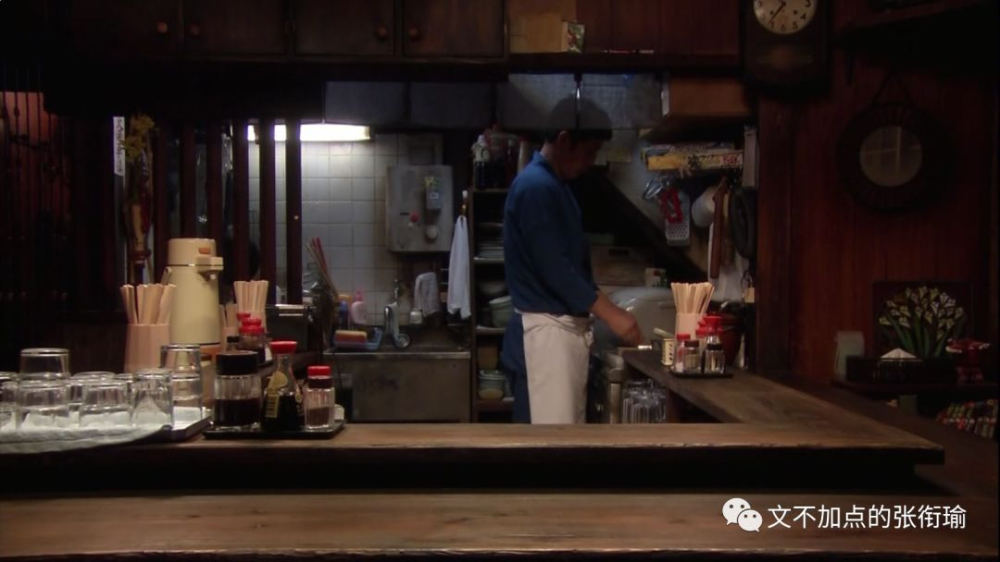
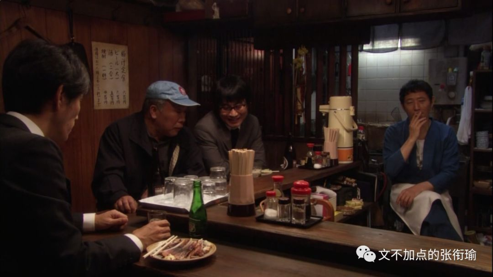
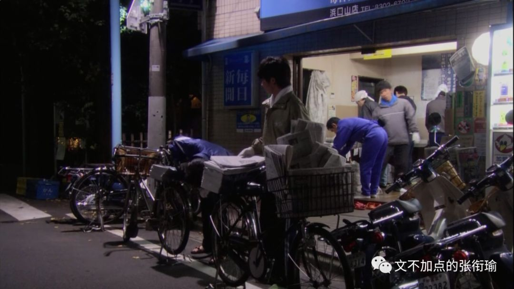
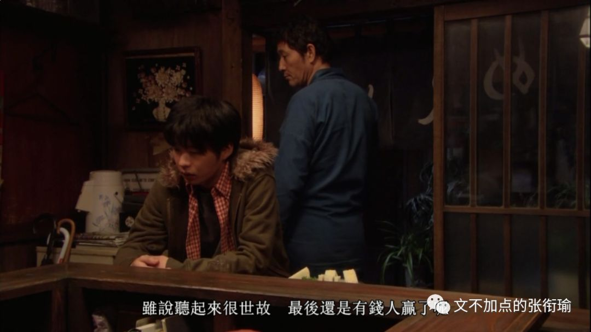

> 本文是张衔瑜第 118 篇推文 共计3008个字

> 写稿时忙，家里常备的速食是螺蛳粉。王小七的老家在 广西桂林 ，她总惦记着米粉的味道，干拌的尤其好吃，还有油茶、菜花、腐竹…… 这些东西她觉得和外乡人用语言说不明白，反正不是他们理解的那个意思。 写完稿了她开始发愁，找谁吃饭呢？大学同学都在武汉，在北京的只有一个读研的同乡，可人家在西三环，她在东四环，中间隔着七个环。

> 住隔断间的日子让王小七感到压抑，她花了月租2900元租了个11平米的卧室。同在一个屋檐下，她与室友之间只互相知道名字，彼此的生活是完全隔离开，毫无交集。 来实习前，在她的想象中，北京是人情味很浓的城市——大爷提着鸟笼子在胡同里遛弯儿，一条街走到头，跟每个人都打招呼。 她来了之后才发现，那样的生活离自己太远了。 她感触最深的是凌晨的三里屯，从酒吧出来打不到车，只能坐夜班公交车回家。公交车上全是带着折叠电动自行车的代驾司机，刚刚开了“豪车”，或者正在去开“豪车”的路上。王小七觉得和他们一样，“这城市里，没有什么是我的。”

> 第二周选题会上，她说，想写三里屯这趟夜班车，其实是写异乡人。 异乡人王小七怀念走在桂林街头到处都是熟人感觉。有次碰到一个不认识的阿姨，问她是不是某某的女儿，她有些惊讶，“我和我妈长得有那么像吗？”

