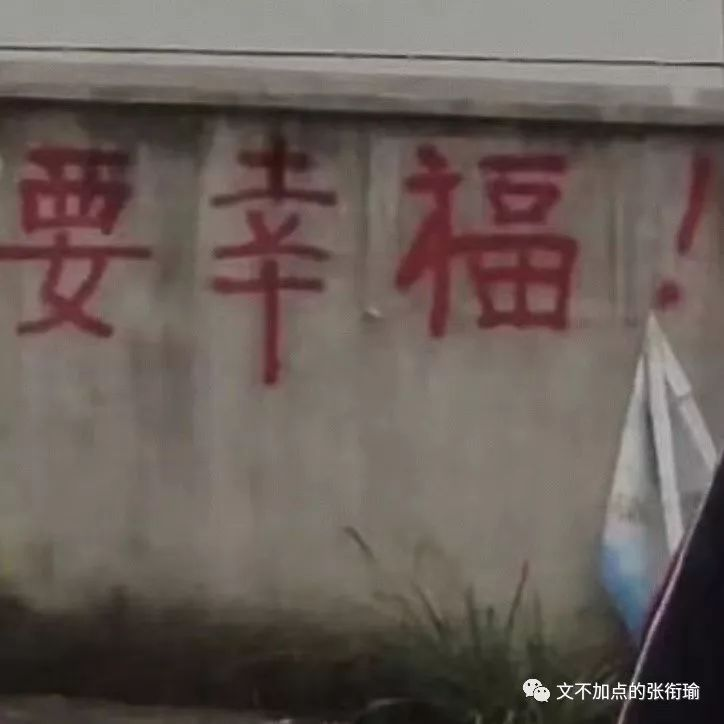

> 本文是张衔瑜第 120 篇推文 共计 1814 个字

本文是张衔瑜第 120 篇推文

共计 1814 个字

所爱隔山海，山海皆可平。

这句话告诉我们：

——欲壑难平，更甚于山海。

主要是最近又有很多迷惑人类，在各种场合、各种图旁边配上这句话。那感觉就像是在留白，留着瑕疵而不洁净的白。

不过也可能是我肝 火 旺。

没有不偷腥的猫，可谁知道呢？

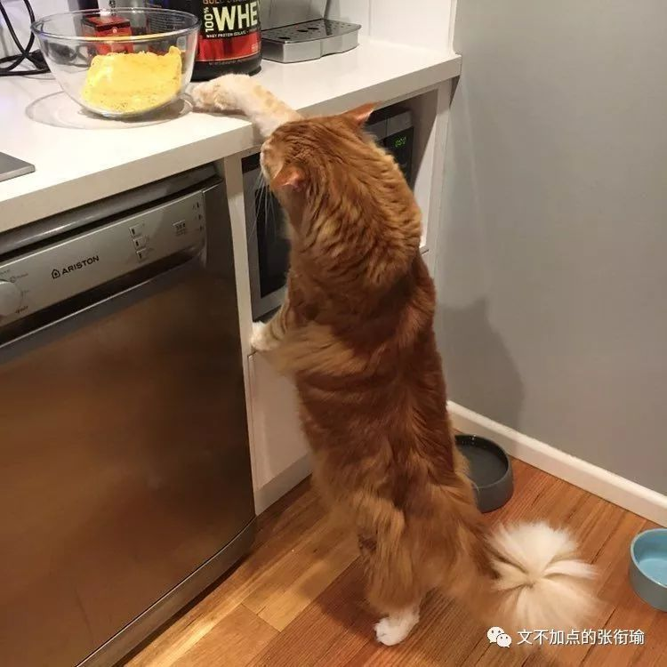

有人去店里买白纸。

白纸十块钱一沓。

这人指着旁边看着很脏的纸，觉得凑合的话也能用，于是向店家询问。

店家说那纸得 三千 。

来人不乐意了，凭什么越脏越贵，于是去消协投诉。

检查人员到店后，店家解释道，旁边脏脏的纸上是一幅画。

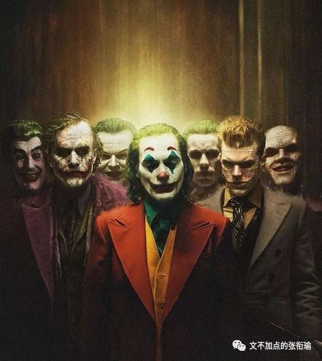

你知道人们为什么坐在 马桶 上思考人生吗？

因为人生是抽象而不具体的。

尽管我们可以描述生活，但时间段实在太长、而且出场的又很多。绘画和叙事的能力，并不是像呼吸睡眠一样写在基因里的。可只要一看到屎，屎有了具体的形状、视觉开始冲击、甚至伴随着很难用网络媒介传播的嗅觉触发。所以人人都觉得自己有了特别之处，也就想到了自己的生活。

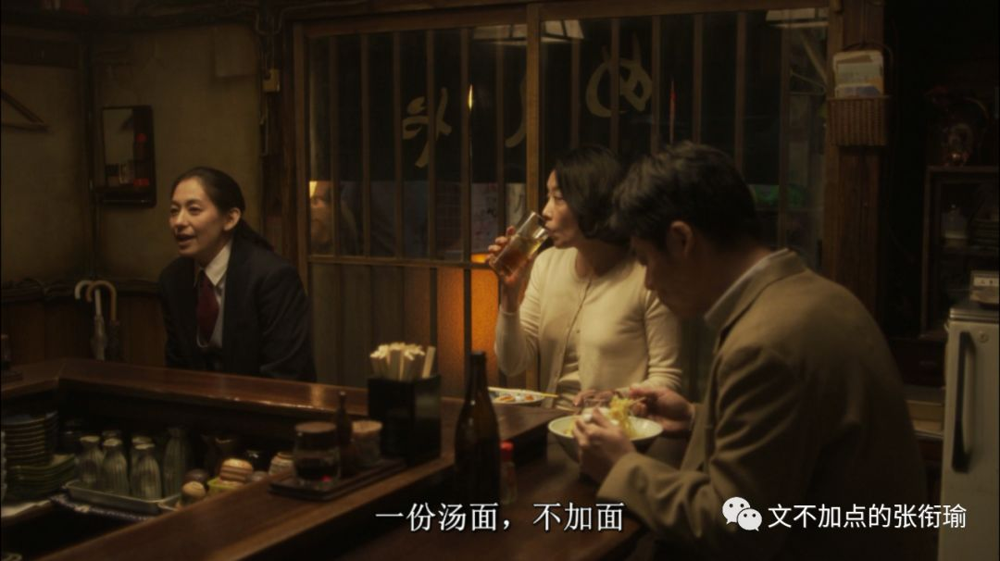

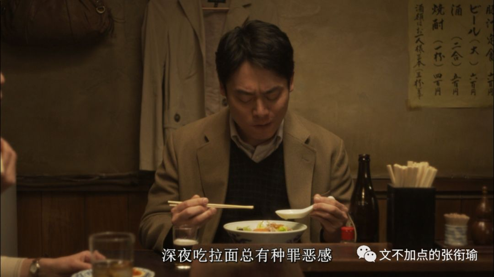

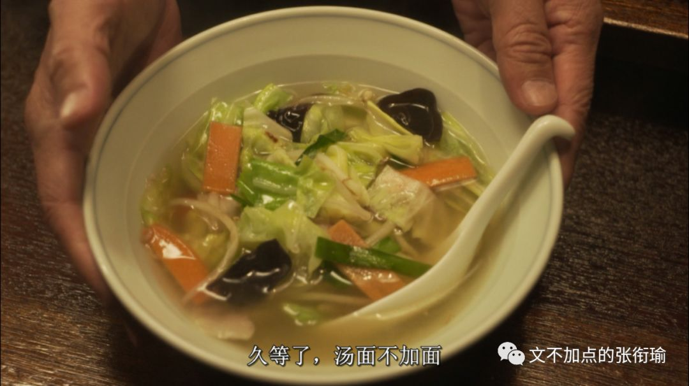

鞋子的鞋带松了

可我不大会绑鞋带

跟人的羁绊亦如此

你见过最老式的扎棉被的机器吗？

就像李某人绣花的 被服厂 一样。柔肠寸断

也是扎在棉被上那样的线

把生活和内心绞在一起。

也许能给湖面裹好，晚上冷。

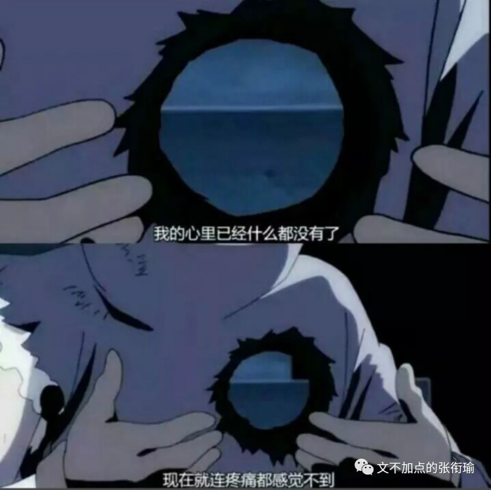

七天里每天都在加班。这两天每天都在上班。

十天之前去了一趟 木兰草原 ，带上帐篷和防潮垫，嘟嘟嘟地开着共享汽车去露营。我第一次觉得只有一直在室外，才能真的感觉到入夜。

虽然周围的步道上一直有轮廓灯，但是天色会逐渐暗下来。几个朋友一起做自热晚餐，打着手电蹦野迪。虽然还只到了晚上十点，平常我甚至不会觉得是个什么很重要的时间节点的时候，就已经感觉入夜很深。

把手机支在地上，长曝光看星空。二十分钟后慢慢划过夜空的样子，甚至只有在图上才能知道，原来真的有斗转星移。

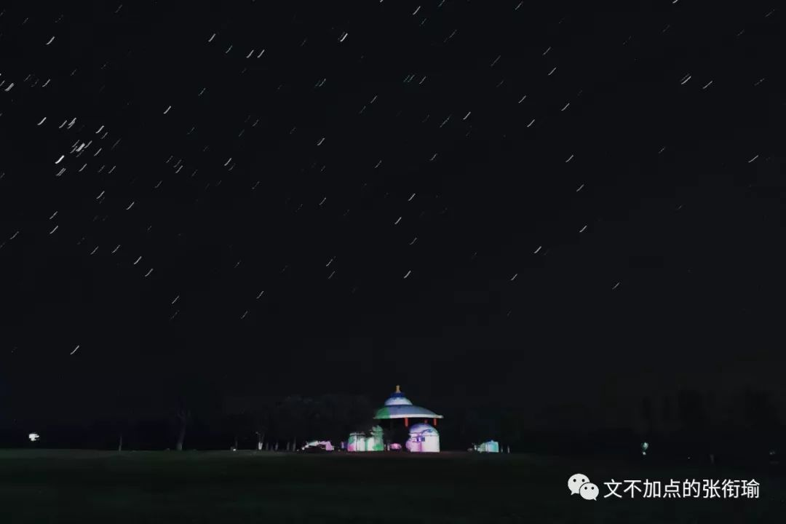

一颗流星划过 英仙座 ，五个躺在地上的人都不约而同地指着流星，然后坐起来开始许愿。如果可以的话，请为最近的烦心事划上一个句号。不要加分页符，因为句号之后就是关闭文档，不会再写。

又一颗流星从双鱼座划向白羊座的时候，我正好在和一位身在南半球的朋友打电话。我对着耳机说：“ 快！我看到流星了！快许愿！虽然不知道能不能代许愿，就假装我看见了之后，你听到声音了吧！ ”不过似乎即时通讯在这时候中断了一会儿。也许是许愿信号通道只能在北半球看到吧。

月亮只有一个，掉了很麻烦，容易被发现。

所以我们骗人说，给你摘星星。

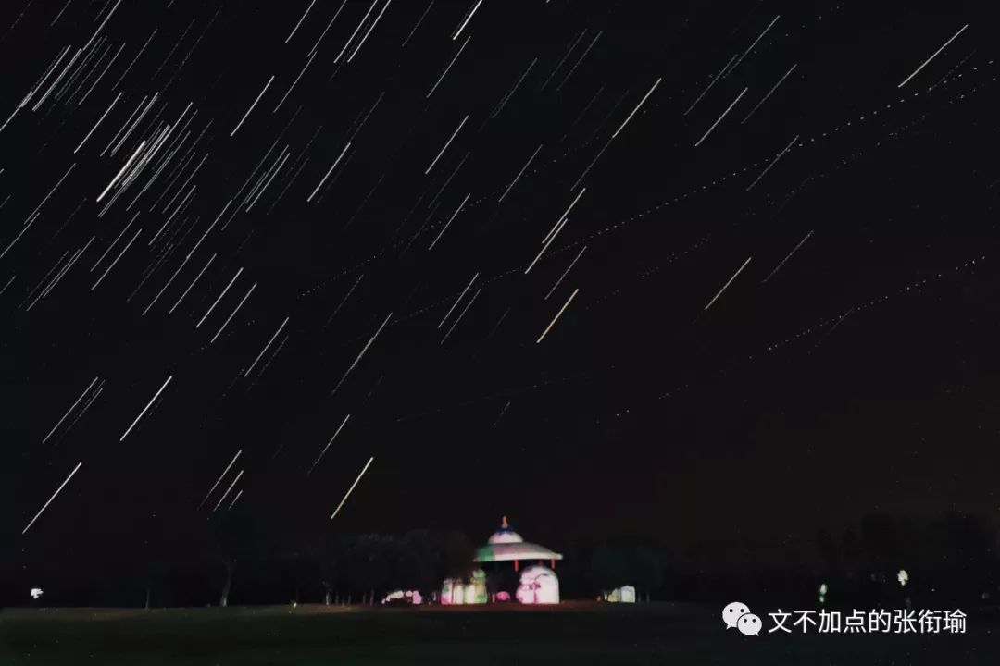

记性很差。睡多久都不够。但又没法睡着。

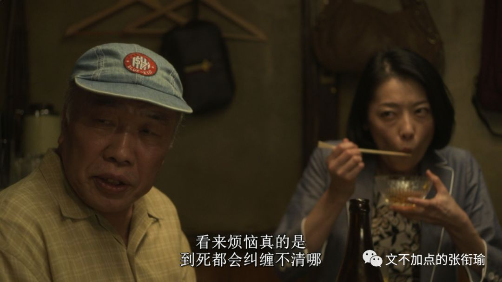

吃完碗里的溏心蛋，看着餐巾纸上的食物残渍回忆刚刚吃了什么。

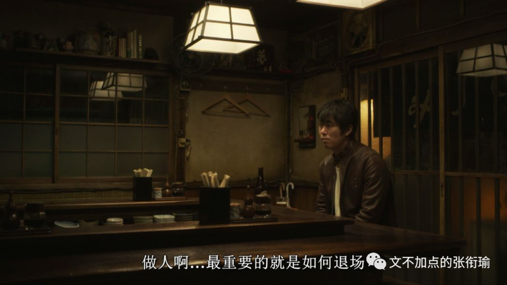

拿着新买的粗陶酒具出门去，提着盒子在寝室门口做单摆、圆锥摆。

因为在想是要送谁，想了很久。

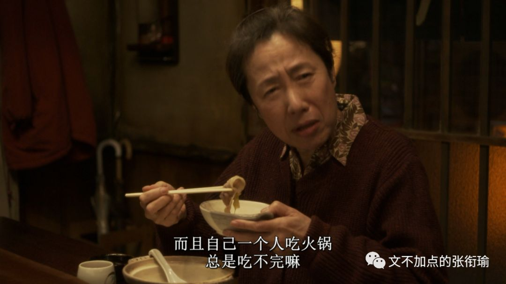

所以生气了。

既然这么会生气，不如走到幼儿园旁边去卖气球。

这样还可以和“气”生财。

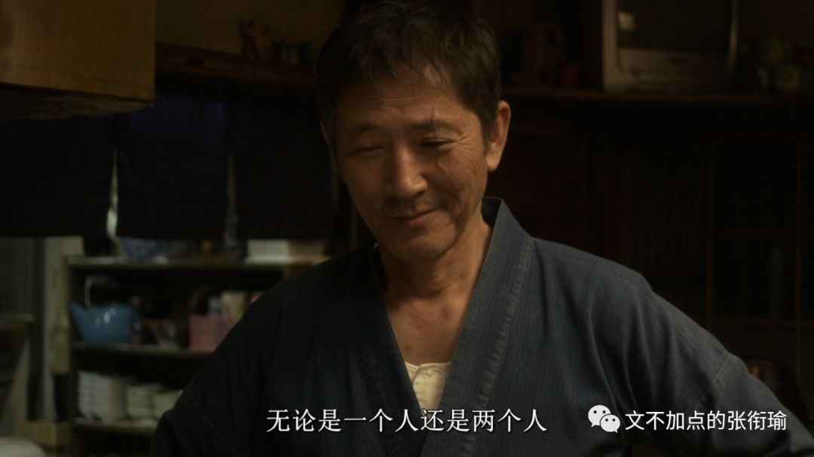

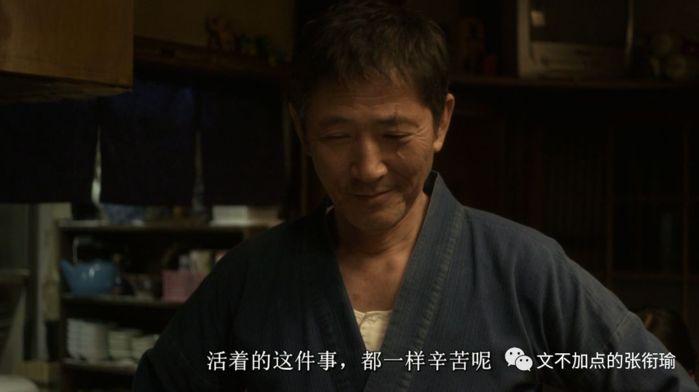

每天肝图的日子实在太难受了。

每天的解压乐趣，不过是九点之后开车出门去兜风。边连蓝牙边找歌单， 连这点时间都想要节省下来。 降了手刹，完全按照交通法规行使。只是并不知道要去哪。

兜风 ，这个词语明明就是两个名词，却拿来当动词用。兜，是衣兜裤兜；风，是夜风冷风。如果说是要拿口袋去把所有的风都袋进来，发现里面什么都没有，未免太过于残酷。也许只是享受被虚无充盈、像小朋友吃得腮帮子鼓鼓的样子。

大概这就是乐趣吧。

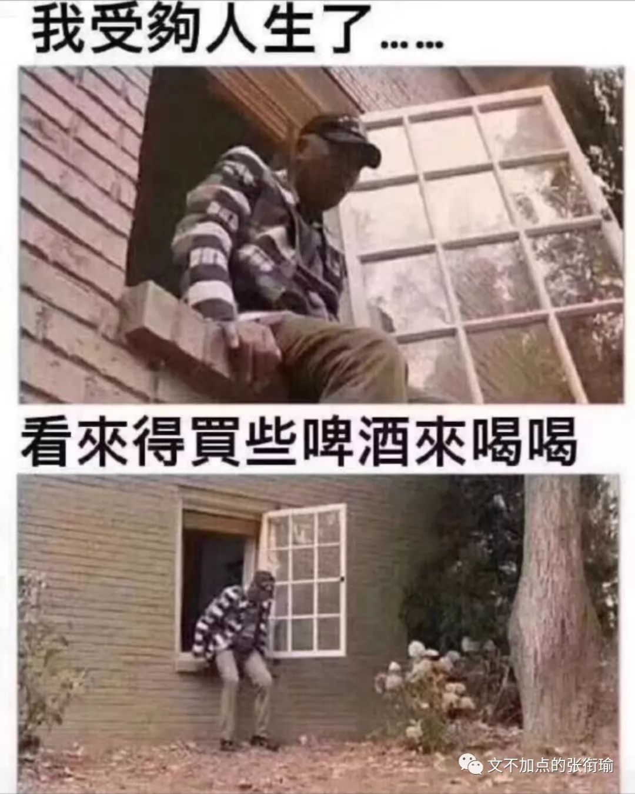

他努力的样子，就像顶着 红色 感叹号也要发很多消息的人。不是要去努力，而是想截图。

渣男渣女暧昧调情但从不说爱，就像那些马原狂热者们只去给马克思做各种吹捧和宣发，但是什么原理都不说。

写了一本没有开头、没有结尾、也没有中间任何部分的小说。因为原本就没有写。小说的残疾主人公踩着正常人走起来都很费力的盲道出门，还没几步，很快就放弃。老人骑着上世纪八十年代的单车，擦得锃亮，撇头看向不熟悉的建筑。湖面倒影着绿道上的灯光，婆娑摇曳，我可以拍出那种好看的照片，可是我拍不出。

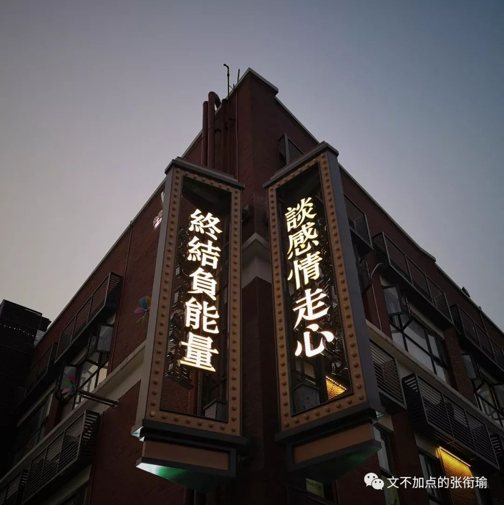

主人公只好继续往前走虽然往后也没什么不好。骤冷的不安分气温，和不适配时下心情的天气，一切都并不美好。尽管有衣穿不会冻着，尽管根本一天都出不得几次门全在房间里揪头发、骂骂咧咧、和键鼠死磕，可就是知道，那些不影响的没感觉到的，一切都并不美好。

读中学那会儿，无印良品有很多走俏的商品。要是灵魂和某一刹那的感受也可以转让贩卖的话，我大概可以开一个无用良品。

觉得自己心态老、觉得暴躁地想揭发事实，这两个感受常常一起到来。我因此而理解一些老年人的所作所为。这就是， 老了 。不得不服。

勺子触碰杯壁。

楼上的人走过，带出脚步和弹珠落地的声音。

奶黄从西多士里汩汩流出来。

不一定是，因为也很像唾沫的声音。

