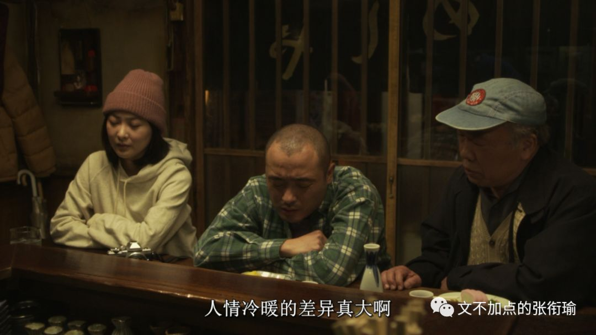
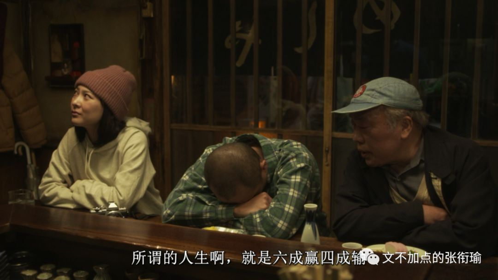
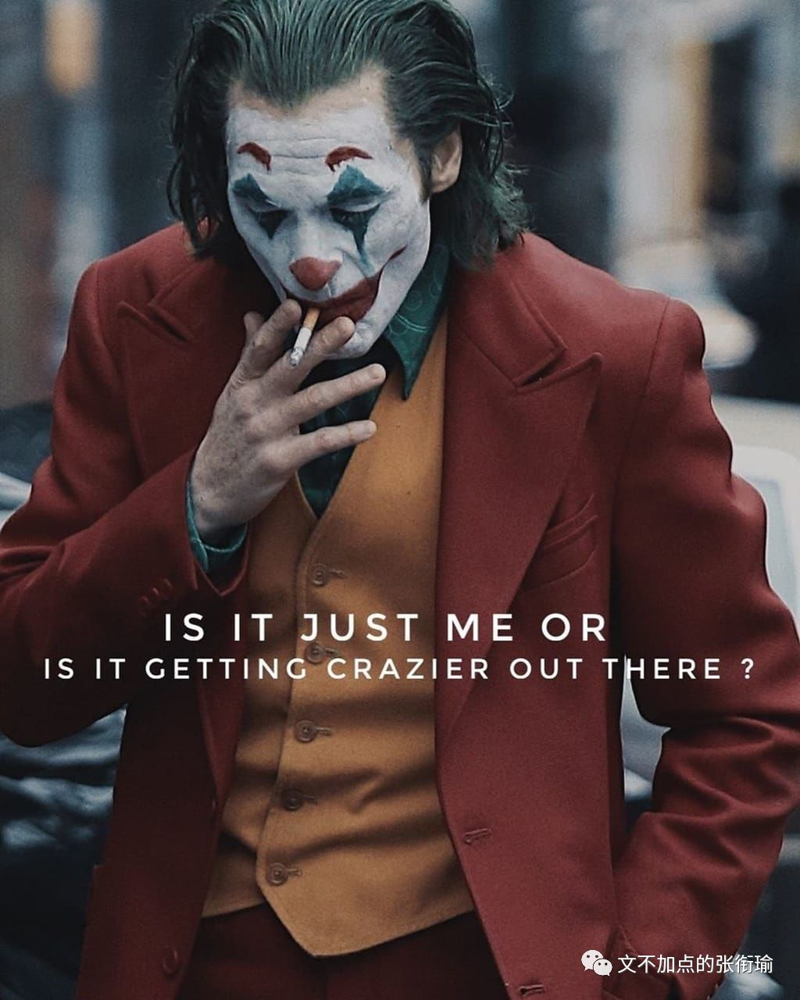
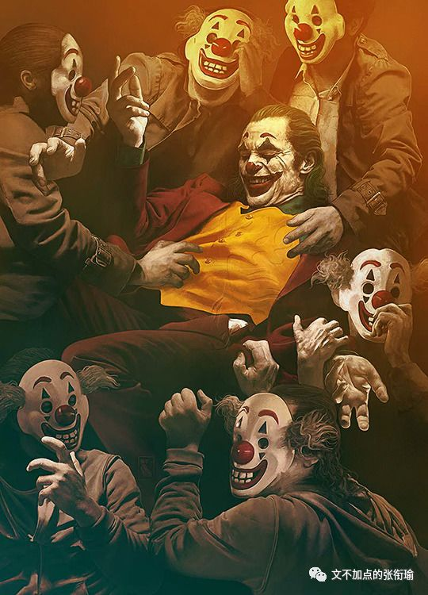
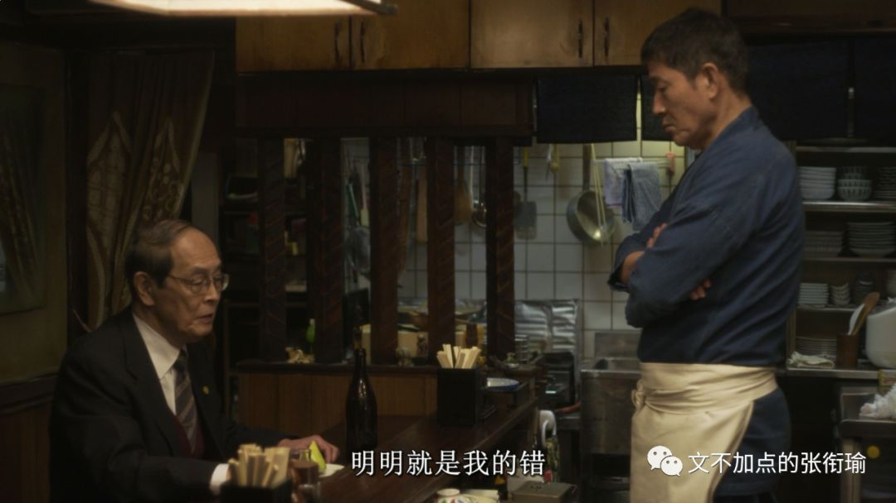
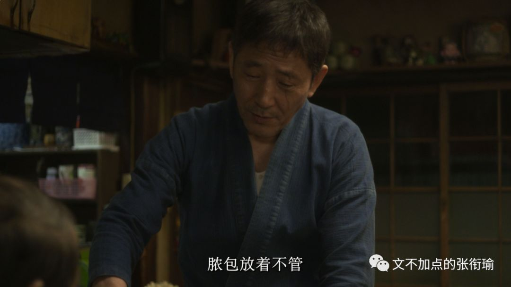
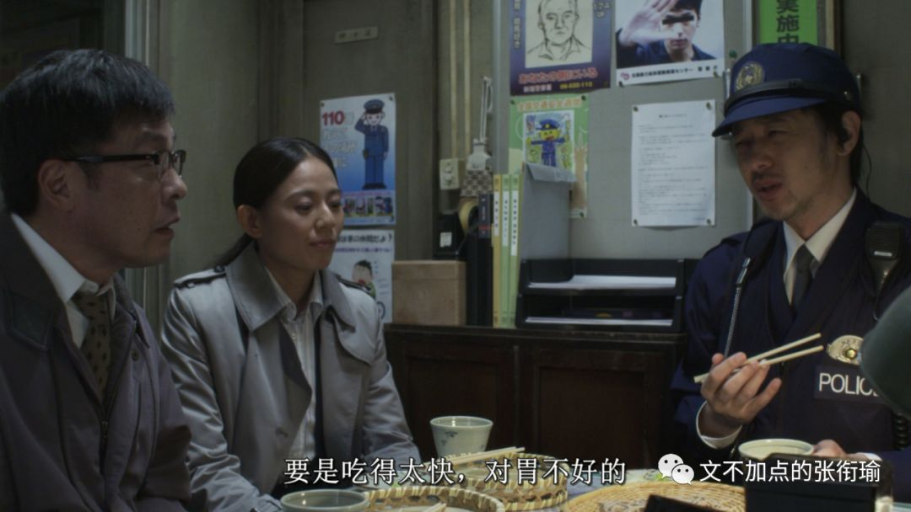
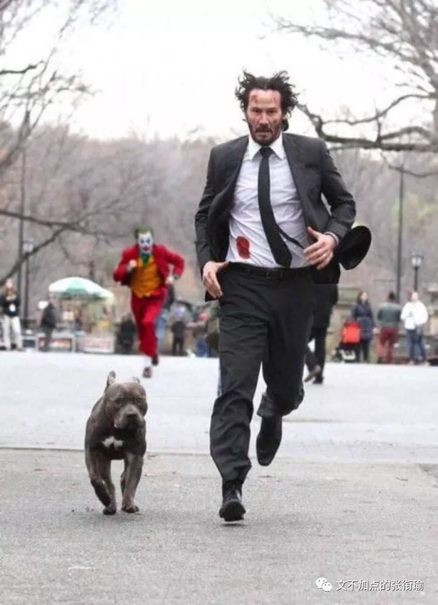

> 本文是张衔瑜第121篇推文 共计1919个字

本文是张衔瑜第121篇推文

共计1919个字

我吃饭的时候不饿。

换句话说，我睡觉的时候不困。

武汉这两天早上都是 暴雨 。 说早上有点牵强，我指的是五六点钟左右的时候。

秋分之后，太阳有它自己的想法。 六点二十分日出，在这之前一个小时，暴雨从听觉上唤醒一个人对周遭一切的执拗。

看到名字觉得有意思—— 《帕斯捷尔纳克致茨维塔耶娃》 ，有意思在我在粗略扫过获取信息的时候，只知道这是一封信。大概很长一串的名字也很好玩，因为除了“帕”和“娃”这两个字，剩下的在我眼里是留白、马赛克、纸上的瑕疵。

> 玛琳娜， 这是我最后一次呼唤你的名字。 大雪落在 我锈迹斑斑的气管和肺叶上， 说吧：今夜，我的嗓音是一列被截停的火车， 你的名字是俄罗斯漫长的国境线。

玛琳娜， 这是我最后一次呼唤你的名字。 大雪落在 我锈迹斑斑的气管和肺叶上， 说吧：今夜，我的嗓音是一列被截停的火车， 你的名字是俄罗斯漫长的国境线。

从网上找的一段版本，俄罗斯人民艺术家。

上一次看俄剧还是美剧出了之后考古的 切尔诺贝利 ，一直说还要找一找，也终究没有。再远则是高三暑假大量地读果戈里和屠格涅夫。

最近在读的一本书是梁实秋写的 《雅舍谈吃》 ，雅舍指的应当是北碚雅舍才对。“只因我连续吃了八十多年，没间断。”这是扉页上印着的一句话。想来是八十多岁了的一代富家子弟，除了译著《莎士比亚全集》之外又有了些从自己生活中挖出来的玩意。

梁实秋总在提北平的正阳楼、煤市街、先父从东单菜市场带回来活鱼，之类的觅食小记。以及提到自己吃过熊掌，并不好吃。细数八珍，龙肝凤髓之类的云云。除了经典注疏之外，似乎和我写的长沙武汉觅食攻略在行文策略上也没有很多区别。不一样的是我会写了推文之后配上自己拍的图。

需要解释的是，一般的随笔小札，我配图很少有自己拍的。

大抵是因为根本就没有出门，或者出门了但是什么也没看到于是全都是沙雕图；但凡出了门，那必定全是自己的图集。有想暗杀我的人据此判断我生活状态，到底什么时候在出门。

可惜我都把不准生活的脉络，鏖战二十年一直落败。

早上想去粮道街吃油饼包烧麦。至于循礼门的糯米包油条，并不太能和那个味道打成一片。但是油饼包烧麦和赵师傅的红油热干面却是可以。

暴雨拦住了我。

理想的出行方式是 共享汽车 ，来回二十的样子。

因为那边地铁不太好去，节约一半的时间，又比滴滴便宜一半多的价格。不过，雨天劝退。就像Long Vacation可以劝退LV，11杯茶颜悦色可以劝退肾11一样。雨天可以就近的地方，劝退了去三公里以外地方的想法。

成长是把笑调静音，把睡眠调成反相，把生活推向极端。

这是今早撑伞出门时候想的。

为了换心情，我像准备几套衣服一样，准备了三把伞：一把是黑底白字的报纸伞、一把是白底黑字的报纸伞、还有一把是一次性的透明伞被我循环利用。暴雨打在伞面上。人们还做不到像戴了AirPods就可以像没有戴耳机但是能听歌一样，伞必须得手持。暴雨打在伞面上，所有的做功和承受打击，都需要手这个部位和与之相应的人体功学。

鲁磨路远处光谷修好了的下沉隧道，一辆货车从地面以下的地方缓缓抬升。我站在路中间看过去，空气像果冻一样，随着雨幕在编织丝线时的呼吸频率，而被揉搓变形。六点半之后路灯熄灭，而雨天的阳光又一直躲在云山背后。于是，被冲刷得褪成赭色的车顶上，一簇黄绿色的亮光就显得有了些许生命的活力。像解冻冰河的光。

我在写下这一段的时候，想到了另一件事于是有些许 隐忧 。希望可以烂在我肚子里。

对面的小区我又忘记的ta的姓名。宿醉的酒吧和清晨的早餐店，都开在同一个下坡旁的再下半层地方。也许当时的设计师有走访学习很多墨西哥的建筑操作，开店的店家也互相之间想得很周到。

从屋内端了面出来，站在门口只需要把碗里的物什夹起，就完全可以自然风冷。卫生质量监督里，这家列为 C ，意思是最差的那一等。也难怪。我知道这家有一只小黑猫，每次去都似乎长大养肥了一些。我站在门口就着凉风吃面，这只小黑猫就蹲在我面前的台阶上看雨。真好，写江阔云低和一任阶前的蒋捷，也许少一只浑身上下没有一个直角的猫陪着。

巴普洛夫的狗，是说一摇铃铛就给饭吃，久而久之摇了铃铛就会分泌唾液。我想蒙昧时期的巫术是这样，最近武汉拂晓前的暴雨也是这样，催人饿还催人食。

“The worst part of having a mental illness is people expect you tobehave as if you don't.”

—Joker (2019)

我一直没找到小丑的资源。只是在科学上网的环境下，看到了很多很吸引人的定妆照和剧照。不知道哪天才能找到，不然只能看着各路影评然后兀自脑内。

还有很多《深夜食堂》的截图。

指日剧。

又指这里面冷火秋烟的那些日本料理和文化。

我在是非问题上一直站得很明确，也一直觉得给普通的只在追求美而且没有以妨碍和伤害他人为代价的个体强加宏大叙事有些过于暴戾。

人们尚且无法选择自己投胎出生的地方，又怎么能顶着地域的标签过活自己的全部人生。

还真是艰难。

于是 正文 开始！！敲黑板！！

要和我的迷惑朋友们说：少偷假照，试试用自己的脸活下去。

不过这也就像有人和抑郁焦虑的朋友说：自然点、放过自己、别再这样子了。

都没有用。

