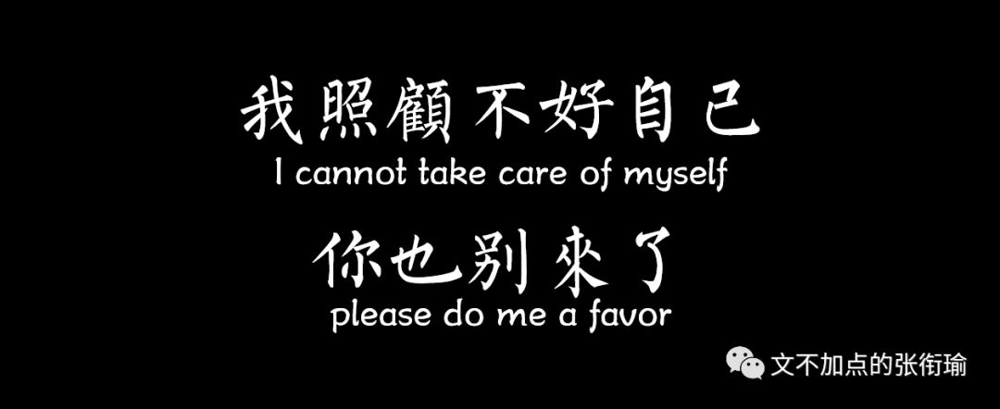
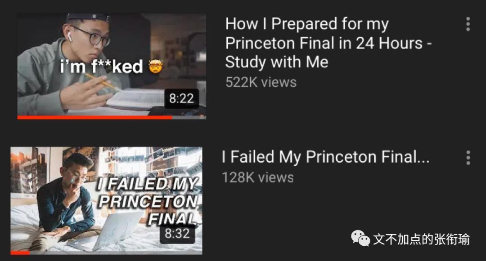
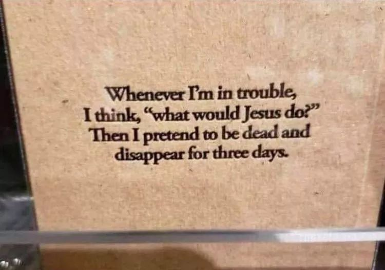
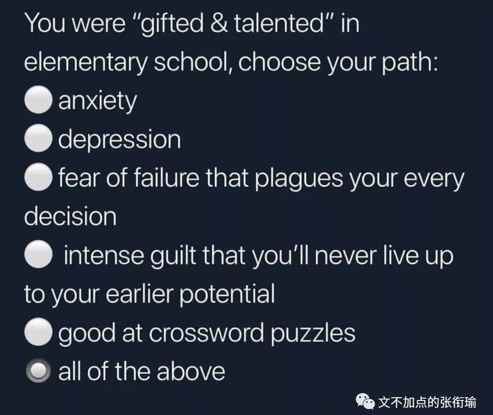

> 本文是张衔瑜第 122 篇推文 共计 1662 个字

本文是张衔瑜第 122 篇推文

共计 1662 个字

在默默里算着，八千多日子已经从我手中溜去，像针尖上一滴水滴在大海里，我的日子滴在时间的流里，没有声音，也没有影子。

大概是小学五年级背的这篇课文吧，“ 去的尽管去了，来的尽管来着 ”，想想这样神奇的表达，原来那么早就已经出现了。

谁用黑铁换黄金？

谁用乌云换垃圾？

标题是最近提出的一个问题，在其他的文章里面看到。据说是一个脍炙人口的笑话，尽管我并没有听过。倘使一个人在夜里找方向、找钥匙，徘徊在街道上彳亍，觉得路灯旁边是亮堂着的所以要在路灯旁边找钥匙。

钥匙会在那里吗？

是很基本的逻辑问题了。

路灯旁边亮堂，如果有钥匙的话自然就可以发现，而且可以很快地比在昏暗的街道上更容易找到。但同样是在灯下找钥匙，只在灯下找钥匙和先在灯下找钥匙，内涵着两个完全不同的出发点。

鸡汤文 垃圾 的一点是，视野只能看到钥匙也许隐藏在看不到的夜幕当中，却不会想到找钥匙的先后顺序以及灯下黑，甚至是否存在有钥匙。

我写到这里的时候越发觉得，这是一个很棒的命题、思想实验、剧情环境设定，不管你给这安排上怎么样的名字了。

先在灯下找钥匙，最快地进行信息检索。

如果有，自然最快地走上了发家致富的道路；如果没有，OK选区的一部分已经排除，搜寻技巧也完成了经验积累，可以进行黑暗环境的探索。

等到黑暗环境都检索完了，如果还没有的话，再来用最完整的策略排一遍灯下黑，也很自然甚至不耗什么时间。那感觉大抵和高中时候写数学卷子，写到最后都得匀出来五分钟给前三道选择题和第一道填空题一样。

上面一段的叙事逻辑，到这里就打止了。生活如果变成这个样子，那么就是一个在无穷的算计当中找到一条最速降线，沿着这个设计好的思路开始进行全盘搜索。那感觉一步一步走，怎么想怎么都稳稳当当。

这样好吗？

必须得声明的是，我 没有 更好的方案。

我们把思想实验落到一个具体，高考国考以及研究生入学考试，都是一项还算可以努力的公平技能测评。当我开始知道程序正义如何冷漠地对待每一个面对条例的个体时候，只能于心不忍地落下铡刀。

我越来越有一些不可知的论调出现。

正如我明确地知道逻辑推演应该遵循怎样的大前提小前提具体情境诸如此类的关系，同时我也知道我们进行的诸多实验都是基于我们有偏见地（不管自觉或者不自觉）有对一个实际问题进行抽象和扁平化。

人类一思考，上帝就发笑。我不相信有什么上帝，但我确信我们只能尽自己的努力去逼近和验一砸一这些设计漏洞。

你看见的我，是我吃过的食物、走过的路和睡过的觉。

每天好累啊。所有该做的事情都做不完，我已经把效率拉满了、日程表尽可能地排了，也没有办法。

打开图虫看别人拍的好照片，和同学调侃一下生活与我。可以说我每天打开大麦看一看话剧介绍的这种行为，就像是抽不到烟的人狂嚼口香糖。

抽烟吗？不抽烟；喝酒吗？不喝酒；熬夜吗？最近十一点前就睡了。

那你哪里累？身心俱疲。连说话也累。

一定要打完一行字然后再换行。我不想换行于是想就这么写下去。继续写下去也累。累是逐渐的。不是逐渐减缓，而是逐渐越来越累。

世上没有任何东西值得人们为它而舍弃自己之所爱。但我不知道为什么，我也抛弃了我之所爱。不懂就问， 加缪 写的这句话，是不是他自己。

路灯下找钥匙也分了几次才写完。在等高铁来的时间，在等医生叫诊的时间，在等我的早餐端给我的时间，在等能够保证一个比较不会间断的状态去完成申请材料的时间。

事情直接顶到你的面前，就像是在快餐店排队。

已经排到你这里了的时候，但是自己却还并没有在心里排练预演好自己应该点些什么东西。前面一个人已经走了，没有任何可以借鉴的模板；后面一车皮的人，好像都在催我快点点完。

服务生奇怪地打量着正在点餐的人为什么一脑门的汗，甚至移动到点餐面板上的手指还在不自主地震颤、以至于根本看不清手指停留在哪一个餐品之上。

太难了。

程序在自动更新之后提示：“请按任意键继续”

总是能选中最困难那条路的我，这时候按下了*电源*键来执行关机操作。

欢乐的时光总是到此为止。

要不是有人提醒我，又一周没更新是不是图少了？准备送点图给我。张衔瑜自带磁力，现在应该还可以自给自足。

