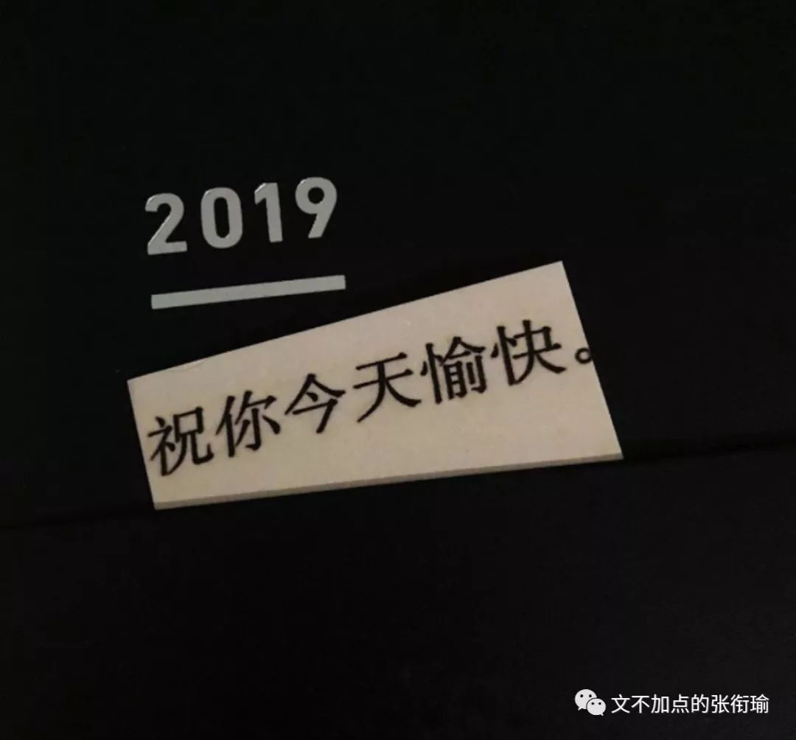

> 本文是张衔瑜第 123 篇推文 共计 1542 个字

本文是张衔瑜第 123 篇推文

共计 1542 个字

昨天在重新核对申请材料的时候，看到这一项，有点出神。写是这样写的：“ Please list interests that arenot related to your university degree (max. of 1000 characters). ”当然估计也不会是什么很重要的参考，约莫是那种只要看到你有就可以了的项目。

开始打草稿准备下笔，却在想实在地说，这个学期到底做到了哪一点。

一两个礼拜以前，去了一次大三同类型班级的班会。

班会上除了常规的关于科研、升学之外，竟然还有一个问题是：

“如何培养自己业余的兴趣爱好？”

虽然问题是一样的问题，但是因为对象不一样而变得不好回答了起来。

面对的如果是中学生、是大一的新生，我面前的这些人肯定也被问过同样的问题，当然也给出过他们有理有据有推进的答案。但是现在转过来，把自己当成一个问题推到我面前。虽然是一模一样的问题，但是回答者压力陡然增加了上来。

修改不是篡改，戏说不是胡说。

我能直接说，我的业余生活也逐渐变得惨淡了吗？

《汉典》上说，业余是 工作时间以外、本业以外 。

工作时间和本业，在这里就不定义了。我们只说这个以外。如果把人的时间和精力做成一个蛋糕的形式，“以外”这个词语以出现，就表示是前者先在这个蛋糕上肆意妄为地割下拿去自己想要的一块——也许是像西瓜挖去了最中心那一块，又也许是连烤箱一同带走了去。

这是社畜的工作时间、主业。

前几天接触到了一个观点：贫穷并不见得是因为贫穷者 不努力 。当然这里涉及到的是结构性差异，和一些只有朴素思辨能力的人都能想到的反馈调节与规律循环。按下不表。当工作时间延长，只要还有一线希望、就会失望而迫切地想用更多的时间来把失去的部分弥补起来。可是有一天发现之前的这些办法不行了。

推荐算法仍然在通过以往的浏览记录和多巴胺调节情况来分析一个人的口味偏好。可是，推荐算法终究敌不过生活。

生活像圈地运动一样，蚕食着每一个社畜的生命力。把标榜的所谓成果，用芦苇杆支在城楼的垛口上，颤颤巍巍。只需要常人多往那边瞟上几眼，就会自然倒下。

偏好可以模拟，但是人们连自己的偏好也掌握不了，又怎么能由算法去近似呢？

十月都快到月底了，我终于狠下心去看了本该在九月底、十月初也就是国庆档的电影。那时候没去，没去就是没去。《我和我的祖国》，第二个故事，原子弹爆炸的 《相遇》 。

“我甚至不知道他的名字”、“这两天街上也许会有什么响动”，一直到长长的镜头在六十年代的公交车上带着任素汐深重而又浅浅说出的回忆。

我看的当时就知道，受到核辐射的这个人一定命不久矣了；我也觉得，后来在公交车上的这一幕，不过是他自己的 幻想 ，由导演巧妙地和那段时间的新闻结合在一起，然后电影地倒在红旗下。

高度保密的工作环境，当然不可能随便就给人溜出医院。

只是他自己觉得，这时候应当再去一趟当初和重要的人一起有过美好经历的那些地方。

幻想里，如果在公共汽车上被认出来，自己也不能承认；

幻想里，觉得对方还在等、觉得还有在一天只说七句话地好好看书、觉得还记得当初在北海公园跳到湖里去救小孩子、觉得还记得蹬很远的路去抱反季的西瓜；

幻想里，觉得身后的庆祝游行人群会慢慢多起来，觉得自己还有一天可以摘下口罩承认自己、承认对方，觉得还能看到原子弹爆炸的新闻。

这就是一个再普通不过，的一点幻想而已。

演员真的很棒。只留眼神交流所有的情感波澜。被打动。

朋友以为自己的 焦虑 有变好。

洗了个澡，换了五六身衣服。

把只穿了一次的衣服扔进洗衣机，搓了毛巾，洗脸，又搓了次毛巾。

等衣服洗完，晒好。中间还把自己的桌面整理了一次。

觉得不行，又弄乱，然后再来了一次。

这么做之前本来是打算去吃饭的。但不知道去哪里。

于是，一样的没用，也没有好转。

闻说双溪春尚好，也拟泛轻舟。只恐双溪舴艋舟，载不动许多愁。

有一个夜晚我烧毁了所有的记忆，从此我的梦就透明了；有一个早晨我扔掉了所有的昨天，从此我的脚步就轻盈了。

句子实在太漂亮了。

