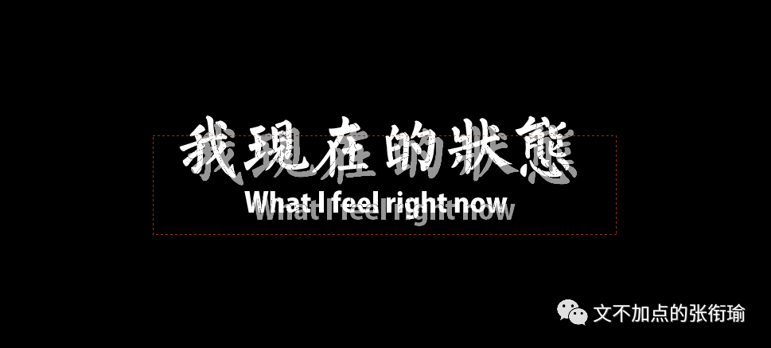
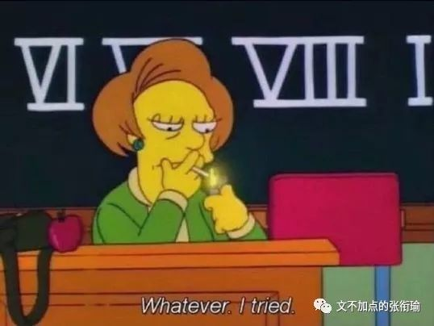
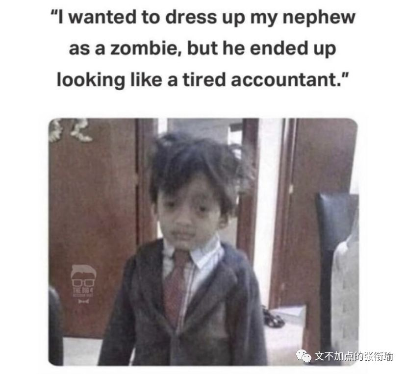
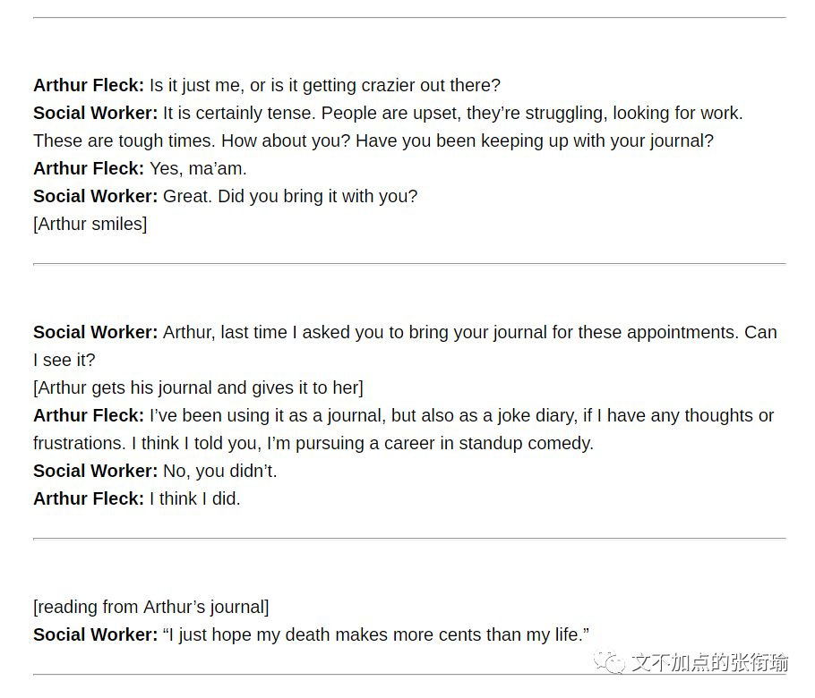
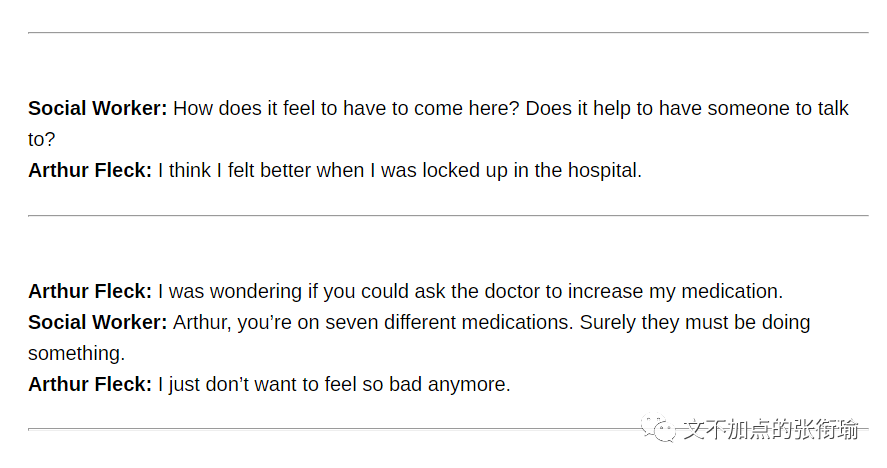
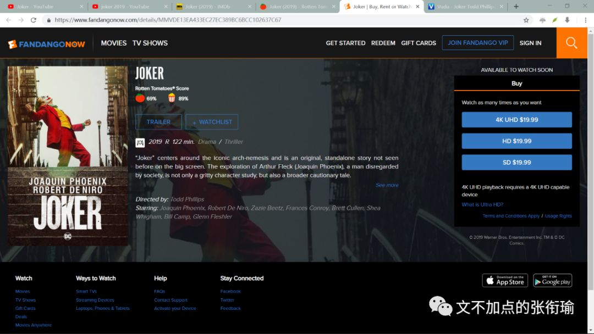
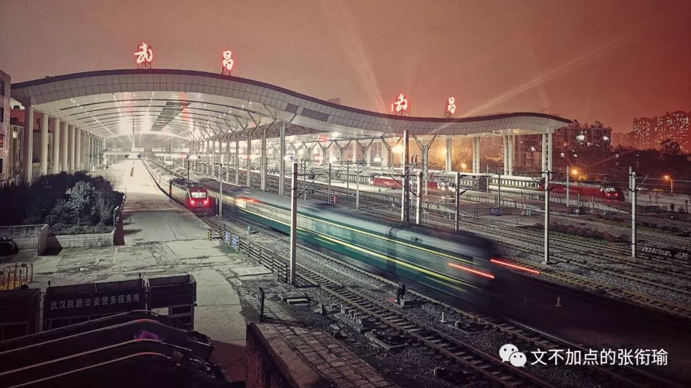
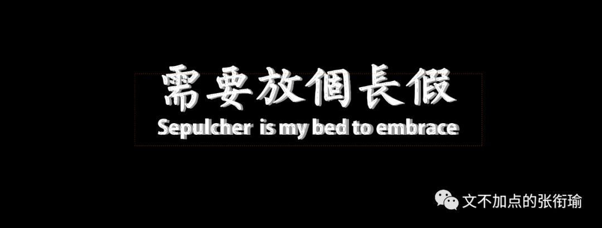
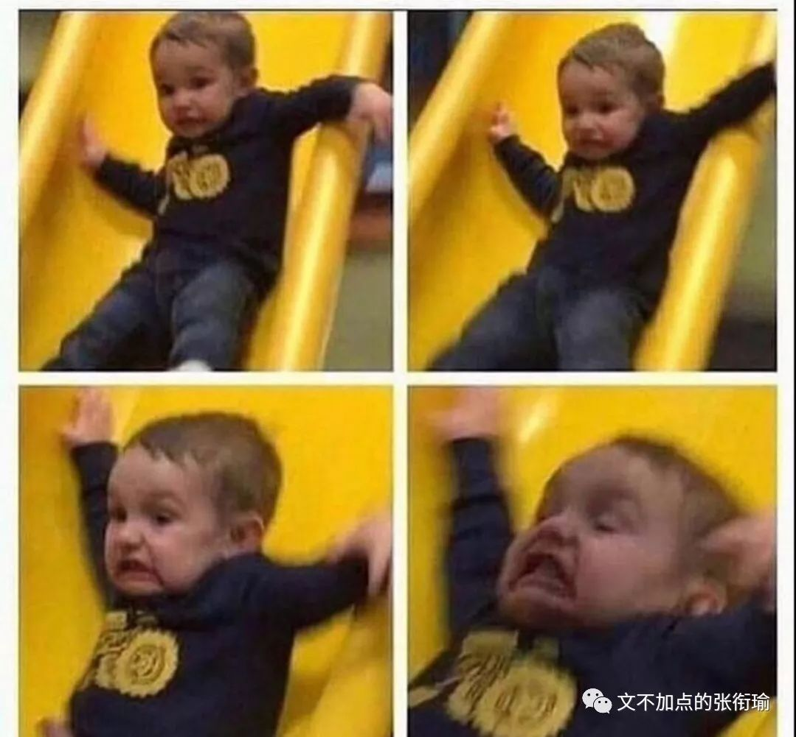

> 本文是张衔瑜第124篇推文 共计3218个字

本文是张衔瑜第124篇推文

共计3218个字

写的 信 ，可以扔进火堆里烧掉；

听的 歌 ，可以直接拉黑歌手、拉黑歌单再也不见；

就连 伴手 送的一两件小玩意，也不过是给人牵强附会脑内剧场的时候，有个东西作为念想罢了。当所有一切都已被移除的时候，记忆也仍然在十丈寒冰下问你暖不暖和。

如果你不知道这句话是谁说的。那可能是我说的，但也不一定。

如果一句话的力量，必须要借助与他人先验的知识才可以去理解，就像专家学者找些个词语来标榜自己作为圈内人士的高洁傲岸一般，这样的力量我是很少去使用的。

生活实在是太无聊了。 而且又不止一件事情：要么和还得跟自己很久的病死磕、要么在永远改不完的论文里调来调去、要么就是和意识不到自己还存在问题的人软硬兼施也无济于事。人们并不知道这里面的 增益 在哪里，并且都觉得除了自己以外的所有人都在和自己 作对 。

就像罹患精神疾病的患者，对他们而言最难过的事情，就是人们希望你至少表现得不像这样。The worst part about having a mental illness is people expect you tobehave as if you do not. 于是人们因为不能和他人共享任何实质观点性的内容，而形成小的圈子。并且在这样的小圈子当中，又因为更细节的冲突，而 进一步 把其他人排除在外。最后只剩下了一个人，并且在他的内部继续劣币逐良币、心肝脾脏一起吞食大脑。

有一种毛笔字，以乌黑、方正、光沼、等大为特点。明代称“台阁体”，清代改称 “馆阁体” 。

当书法艺术风貌在影响明清的科举取士时期，不是写馆阁体的人，即便满腹经纶也会名落孙山。于是寻求功名的人，将本来就错位在只学考试科目上的时间，继续走偏到了进行字体的研究之上。

我不想那么浅薄地认为这是本末倒置，因为这里面有更深层的原因。

昨天读到易中天《帝国的终结》：

> 在别无选择的前提下，农业民族宁要暴君，不要暴民；宁肯臣服于皇帝，也不愿依附于流寇。只有当他们被逼得走投无路的时候，才会揭竿而起。但在这时，他们是把起义领袖视为“真命天子”的，而且希望这些领袖一旦打下了江山，就立即放下屠刀，拿起权杖。也就是说，农业与民族的选择，是建立权力社会。

在别无选择的前提下，农业民族宁要暴君，不要暴民；宁肯臣服于皇帝，也不愿依附于流寇。只有当他们被逼得走投无路的时候，才会揭竿而起。但在这时，他们是把起义领袖视为“真命天子”的，而且希望这些领袖一旦打下了江山，就立即放下屠刀，拿起权杖。也就是说，农业与民族的选择，是建立权力社会。

而回到谈馆阁体之类毛笔字的深层原因，是用一种还算能过得去的擦边球形式，在寻求一种对上层权力的臣服与认可。 难道当权者就不知道，治国还是得需要那些能人将才吗？ 难道不知道只会馆阁体、四书五经倒背如流但一点生活经验也没有的人根本不能为我所用吗？ 精明的上位者在我的假定里，不可能意识不到这一些。

而反观国家并没有因此而被搞坏的总体结果，一批又一批的治国良才继续涌现，于是我以为，这不过是在私底下显示一种对于规则的 臣服 。

因为觉得对旁边人说的话感觉到 认同 ，于是自己这边一杯酒喝了下去；因为觉得自己的生活实在是 难顶 ，于是又一杯酒喝了下去。

酒的确好喝，但也就只有开始那几杯。

所以酒桌的干杯开始也开始异化成为了一种对于观点的臣服、示弱，而恰好酒精此时承担了类同“馆阁体”的这种功能——用类似于戕害而毫无意义的方式，从而表达对人对事的态度。

擦边的球儿到处打，时而居左、时而在右。

只有生活依旧糟糕。

天下熙熙皆为利来，天下攘攘皆为利往。

一批人在熙熙攘攘中，多少有些清醒过来。另一些人只是被裹挟着走，然后继续为着这洪流来吆喝喧天。清醒的人，多荒唐呢。一边清醒地知道自己做的事情变得越来越没有意义，一边因为自己 做不了什么 来让环境变化而继续在这里边苟活。所以他们才会变得越来越累吧。

I used to think that my life was a tragedy, but now I realize, it's acomedy.

这本是《Joker 2019》里边的一句台词，当人在跨过绝望边缘之后，就开始觉得一切变得越来越欢喜了起来。

不知道三毛所说的那种“在佛学当中看到了火红的日出”是不是如此，但被生活撕碎的小丑确乎如此。

You don't listen, do you? You just ask the same questions every week."How's you job?" "Are you having any negative thoughts?" AllI have are negative thoughts.

这是在和帮助自己的，大概是社工人员说话。社工人员因为市里削减了对于他们的经费，故而告知Arthur这将是最后一次见面。而此前Arthur已经在用七种药物，并在想寻求更多的药物时无果而反。

于是呼应之前他的手写笔记本上，出现的句子：

I hope my death makes more cents than my life.

存量绞杀不一定必须要是现在正在激烈当中的地方。

我们稍稍把目光放远一点点，却想到了 前年 武昌火车站 的一件事。

2017年2月18日中午，一行三人来到武昌火车站旁的一家面馆里用餐，其中一位四川宣汉的男子问 “牌子上写着四块钱一碗，你怎么要多收几块钱索？” ，老板回敬 “我说几块钱一碗就几块钱，你吃得起就吃， 吃不起 你莫(不要)吃，你给老子滚。”

随后的事情当天即开始传出，因为被多要了钱的顾客挥拳想象，用桌上的菜刀砍伤了店主的手脚之后，斩下了老板的头、扔进了垃圾桶，最后蹲坐在附近、并被当场逮捕。

这件事现在依旧可以在各大刊物找到当时的报道全文，围观群众如何反应、店老板如何盘下这间门面、为什么年后涨价没有更新牌子之类的细节，在那些报道里有详尽的描述。

意料之中 的是，一些鸡汤开始以此教育人们，要好好说话之类的；记得当时在空间和朋友圈里，也开始出现对武汉方言的吐槽，尔后被其他人（和地域无关）用“不要在这件事上开玩笑”给压下去了。

那片地方我自己全都用脚丈量过，并拍下了一列火车进站的流光。

我在记忆里依然有，还在新闻部门做业务的时候，讨论一手新闻资料时分享的若干细节：据街上的居民说，事情发生之后过去了半天时间，第一个来到 现场 采访的是一位大学生记者，此前所有的转载都是各媒体援引的网传消息；又据这位大学生记者的街采手记，当时这位拿着刀砍下店主头颅的人， 身上所有的钱在下车之后就发现都被偷走了，只剩下另一个口袋里的一点零钱。 而这一细节，在我刚刚又重新查过的报道里，都没有见到有提到。

我现在假定听到的消息属实，那么可以重新说一遍这件事：

一位从比较贫困的地方来到武汉的人，还不会使用智能支付，习惯随身携带现金以备不时之需。下车之后发现自己所有的大钱都被偷走了，到了面馆里吃饭，吃完之后付钱，一面发现自己身上仅存的零钱不够支付、一面被老板挤兑。

又，公开发布的消息里提到说，杀人者有二级精神伤残认定。也许是基于童年阴影或者生长环境的特质，面对这样的恶意，使用的行凶武器也是从案板上夺来的菜刀，对老板痛下杀手。最后，蹲坐在路边，等待警察到来、束手就擒。

转述给我的街采描述里，我 不确定 我是不是还记得他的手机也被偷了，我没有找到自己当时的笔记，现在也只是凭借 记忆 在回溯。主要携带的财产几乎被盗空是可以确定的，方式手段可能有偏离。

我不是为了要为行凶者进行分毫的开脱，杀人者自当有相应的法律去惩戒之。大量的专业法务人员，对各种量刑事项有自己的专业技能去判定，不在话下。而我想，在一些息事宁人讨论如何好好说话的帖子背后， 更深层的原因 也许才是触及到社会结构下出现的压抑个体。对于这两个同样在讨生活的人， 社会结构 ，这个用词想来也是不精确的，不过我的所学里并没有更多的词汇。

专业词汇有时候只是为了区分圈外人和圈内人而打上的标志，我尝试用我的话语来说。

同时，我认可公开循证过的资料，正同于认可我听的这位来讲新闻采写的人。

如果因口角纠纷的杀人，凶器还是在现场取得的、行凶人是坐火车来，没有蓄谋的可能，杀人的动机未免太大。但如果结合其出生环境、伤残证明，听说的现金被偷、和由此合理推测的不会用移动支付，这个逻辑链我以为是说得清楚的。

那么这样一来，我想我的用词就不能是 “真正导致事情发生的是blah blah” 。心底里种下的种子是仇恨，也许会发芽、也许不会，也许下一次还会再到一个新城市、被偷钱、被多要了钱，也许自己又赚了钱、平稳地度过一生。但我要指出的便是，我们不能因为无事发生就可以当做不将有事发生。正如从面向结果量刑和面向心理动机量刑，我想提出来的是这个讨生活的人，作为他所在 群体 的一个代表，发生了令人不愉快的事情。这背后不是无端的作恶，而应当是有某一群体的社会成因在。

几个常年网上喷人的朋友，在线下和我说：“我们在网上问候过他们的家里人，不是真正的他们家里人，在这时候只是一个代称、一个虚指。这个虚指用什么词都可以，不过大家习以为常就用对方的家里人。 虽然 骂得很起劲，但是如果线下见面的时候，还是会规规矩矩地说一声叔叔好、阿姨好、爷爷好、奶奶好。”

这篇又中断了几次才写完。

于是从自己和生活厮打，到了讲形式的生活正同于“馆阁体”，到《帝国的终结》、自我伤害背后的臣服意义、joker节选和最后迟到了两年半的谈武昌火车站砍头事件。

杂乱而又没有主线。

不过你们知道我说的是同一类事情，只不过有时候就在扯淡，有时候在讲正经事，对吧？

