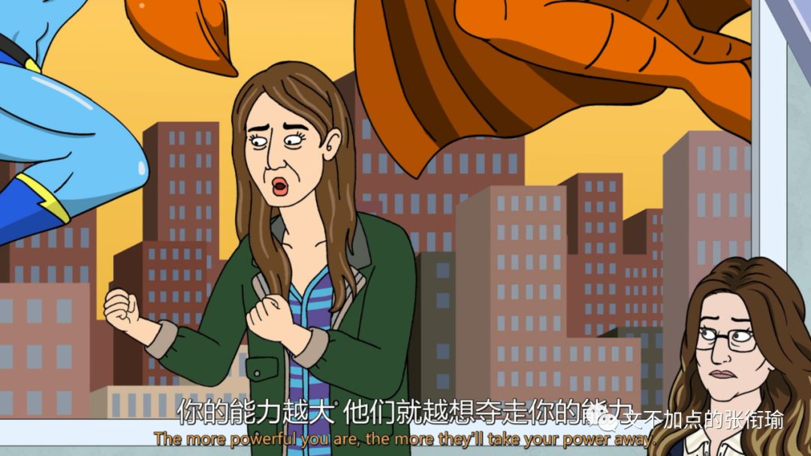
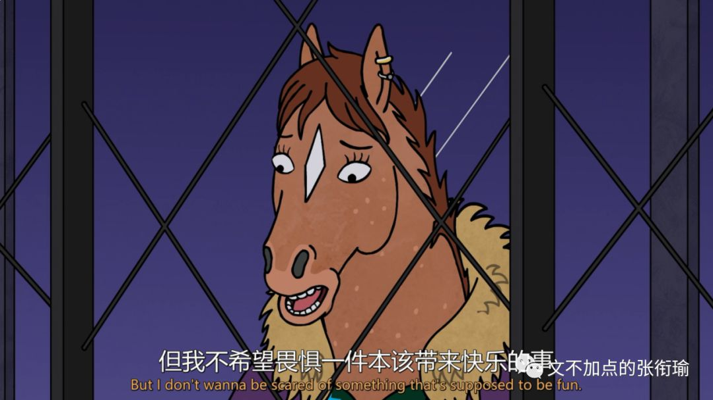

> 本文是张衔瑜第126篇推文 共计2902个字

> 人们自己创造自己的历史，但是他们并不是随心所欲地创造，并不是在他们自己选定的条件下创造，而是在直接碰到的、既定的、从过去承继下来的条件下创造。 一切已死的先辈们的传统，像梦魇一样纠缠着活人的头脑。 当人们好像刚好在忙于改造自己和周围的事物并创造前所未闻的事物时，恰好在这种革命危机时代，他们战战兢兢地请出亡灵来为他们效劳，借用它们的名字、战斗口号和衣服，以便穿着这种久受崇敬的服装，用这种借来的语言，演出世界历史的新的一幕。

> 对于这些“愤民”来说，需要的只是一个表白的机会，即一个表现自己政治可靠和道德无瑕的舞台。政治上的反面典型就是“乱臣贼子”，对他们的愤怒可以表白自己的 忠诚 ；生活上的反面典型则是“奸夫淫妇”，对他们的愤怒可以表白自己的 纯洁 。 崇尚礼让、热爱和平的民族，却又欣赏“凌迟”、“车裂”这样的暴力、容忍残酷，表面上看匪夷所思，实际上却是 伦理治国 的必然结果。因为帝国的“伦理治国”并非当真是要弘扬道德或培养道德，而是要维持等级秩序，维护集权制度，并为这种暴力统治披上一件温情脉脉的外衣。

