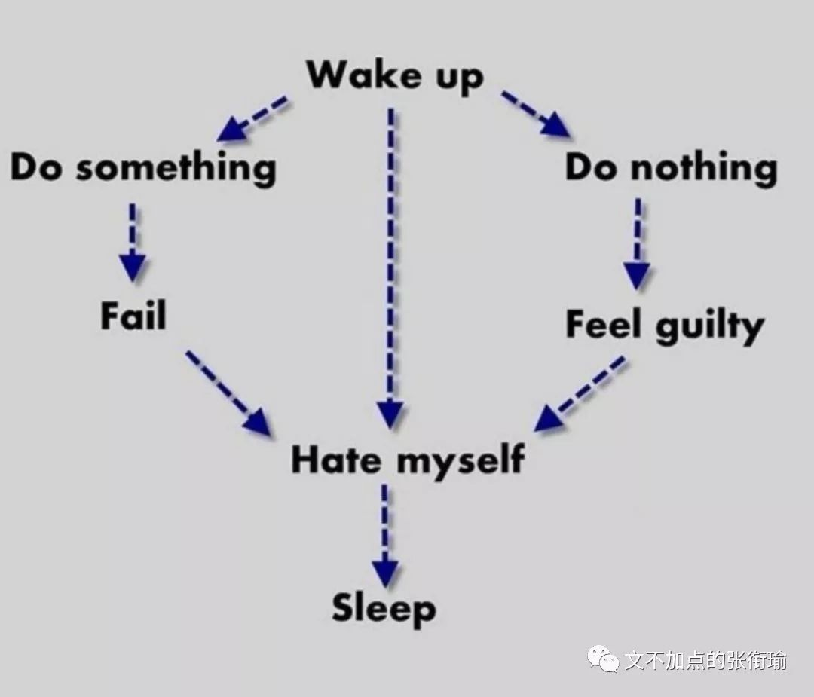
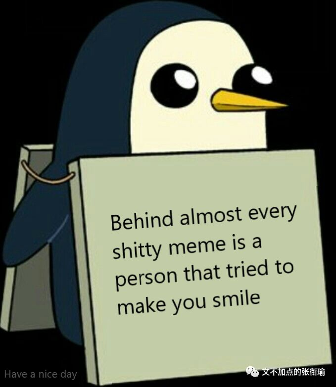
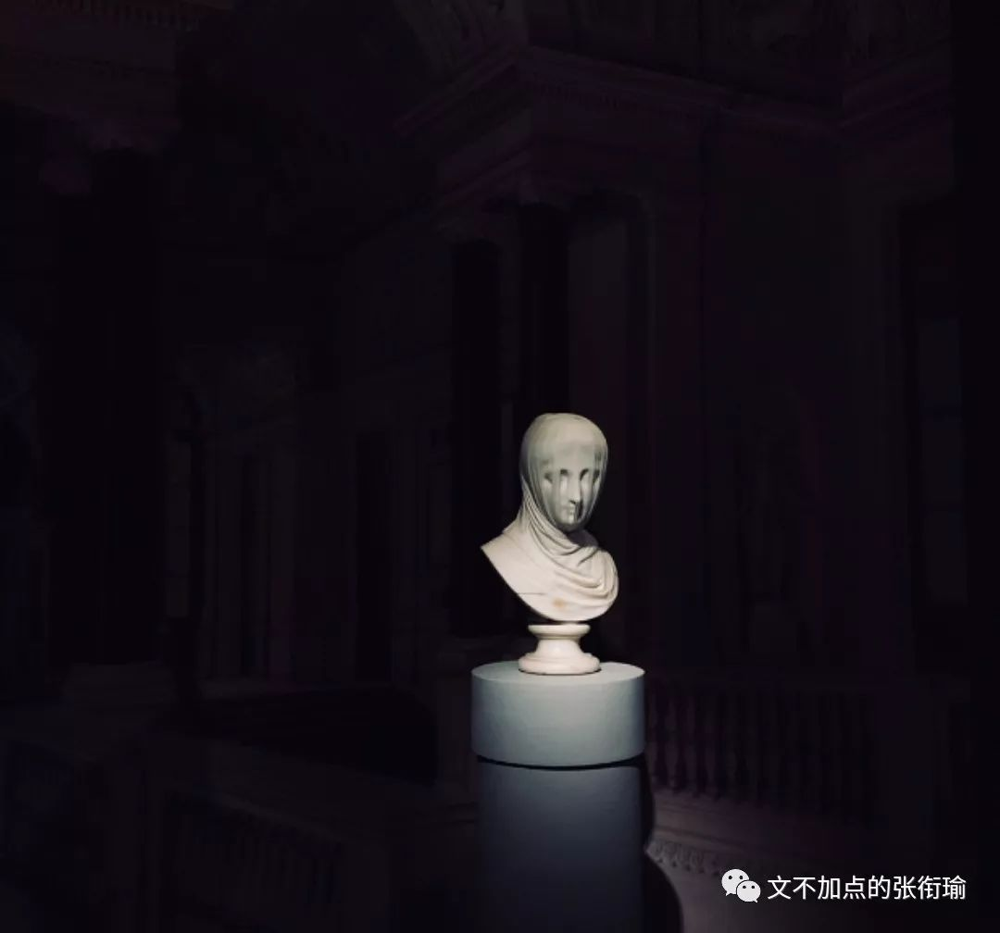
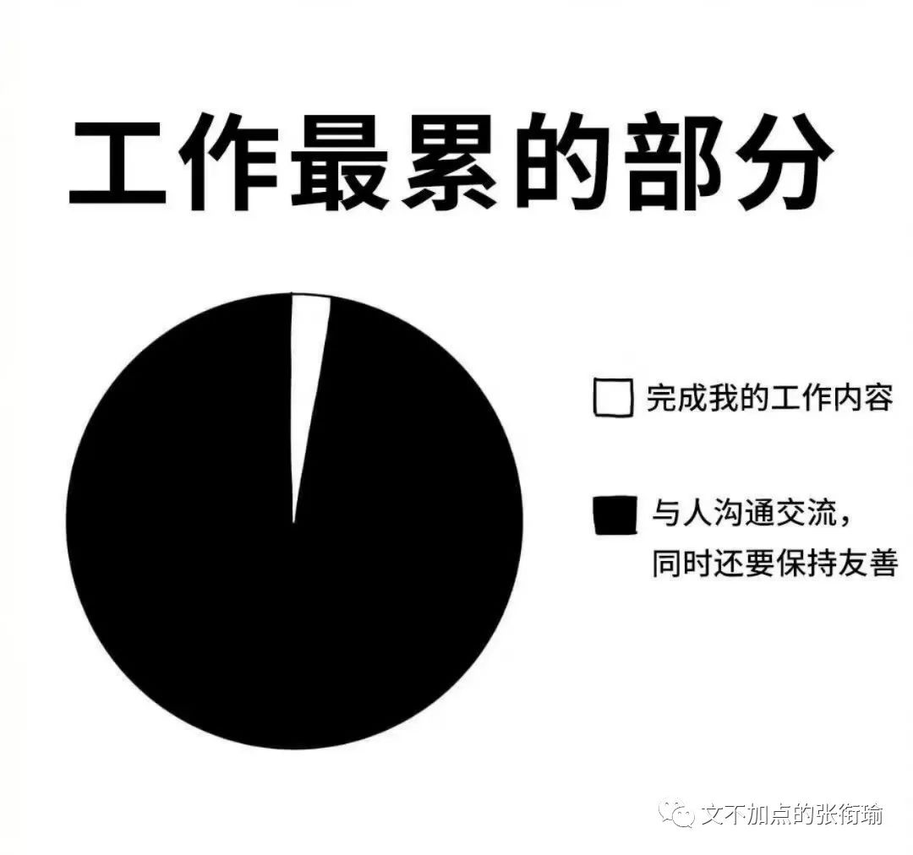
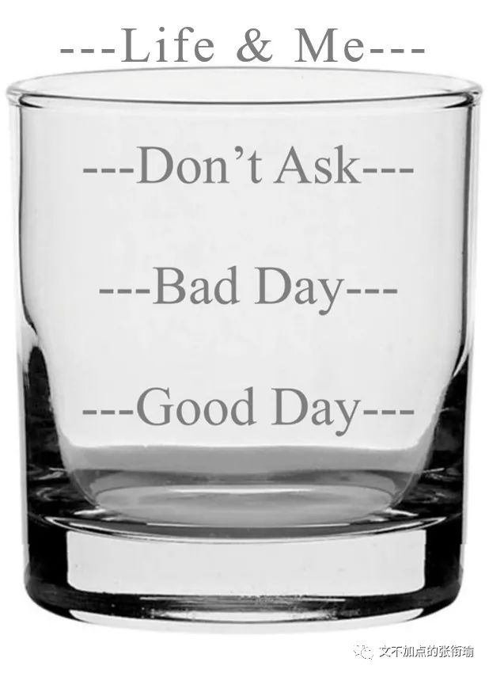

> 本文是张衔瑜第127篇推文 共计2376个字

> 人一旦遭遇顽疾，最需要小心的，是价值观的不断变化。 你努力思考自己到底看重些什么，答案也会接踵而至。 感觉就像信用卡被人拿走了，我不得不学会 讨价还价 。 我突然惊觉，自己已经经历了悲痛的五个阶段，就是老生常谈的“否认→愤怒→讨价还价→消沉→接受”。 但我完全是反着来的。

> 我常常把他分毫未动的午饭扔进垃圾堆，盖住之前分毫未动的早饭。几个小时后，又往上面倒了分毫未动的晚饭。 我拒绝了所有家人以外的探望，保罗的世界变小了，但他告诉我：“我希望大家都知道，就算我不见他们，也是爱着他们的。我珍惜与他们的友谊，少喝一杯酒也不会改变什么。” 保罗转头看着我，低语道：“也许这就是结束了。”

