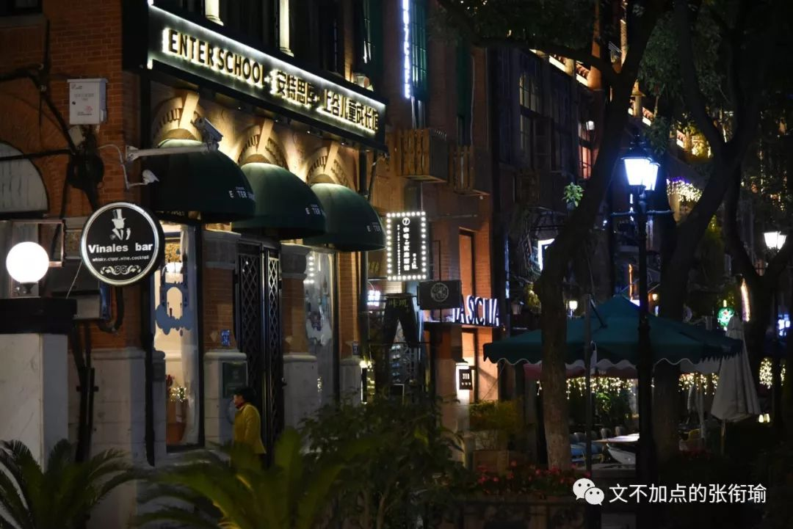
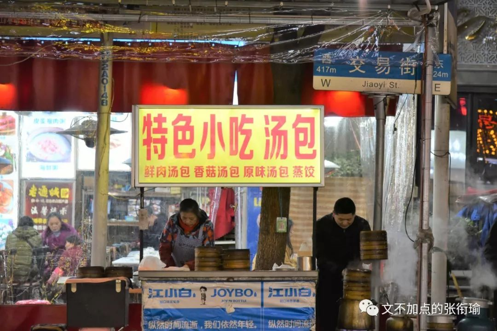
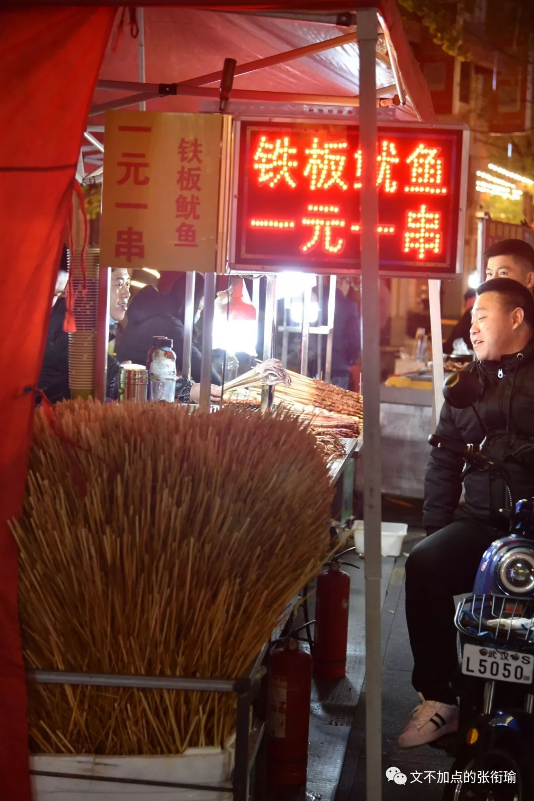
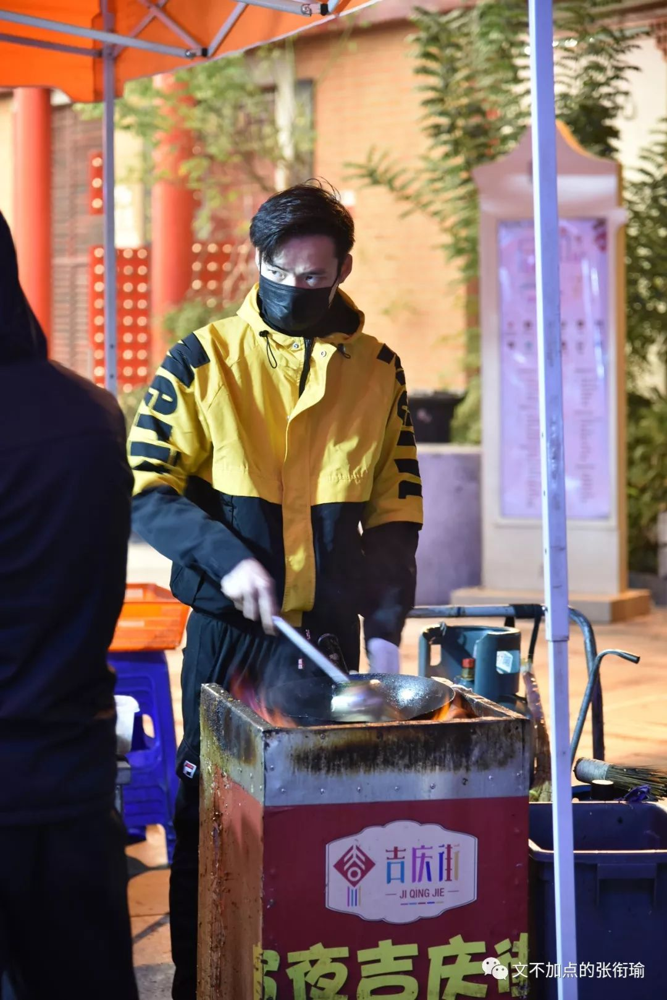
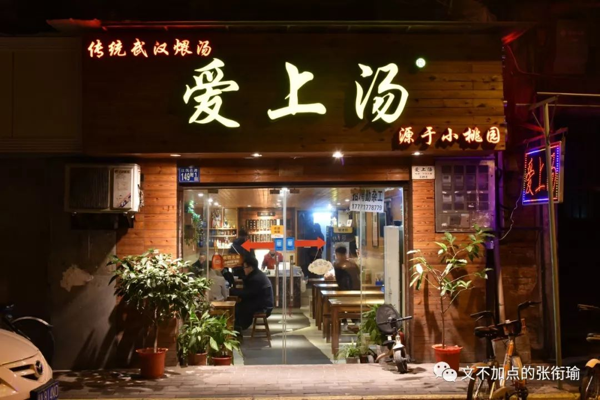
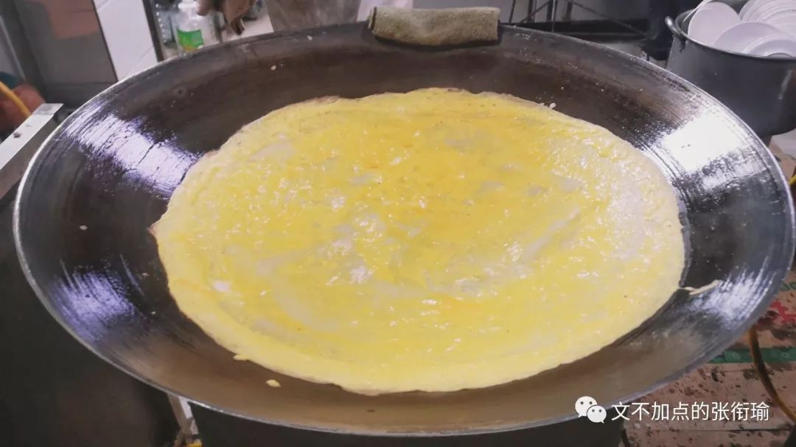
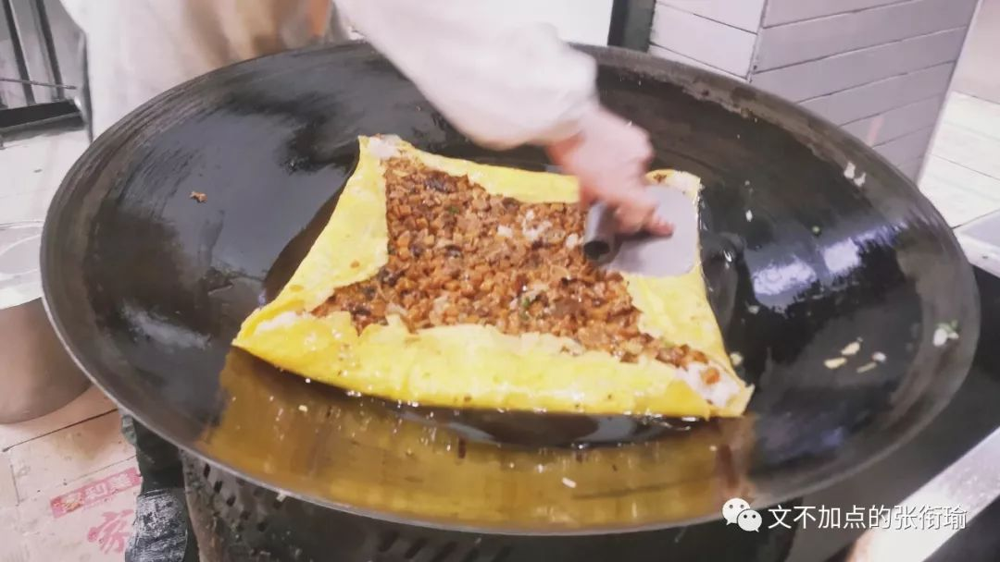
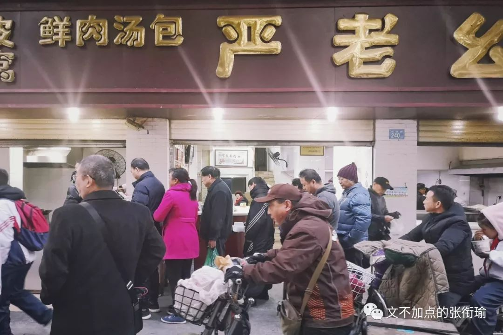
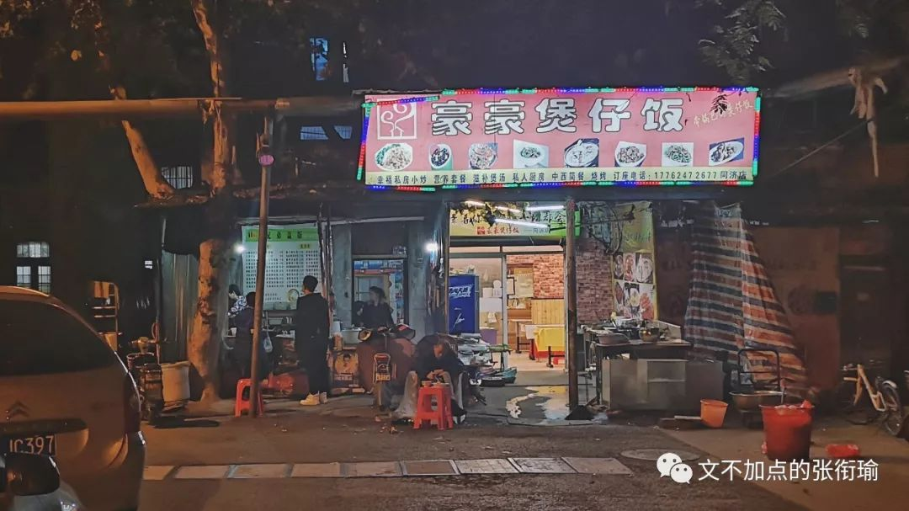

> 本文是张衔瑜第130篇推文 共计4050个字

> 小桃园是位于汉口胜利街兰陵路口的店铺。“小桃园”本为“筱陶袁”，最初是由陶、袁两姓的两个小贩在这里搭棚设摊，经营油条、豆浆之类的小吃，后来两家合作，经营煨汤。解放后，以谐音“小桃园”为名，是著名的“煨汤专家”。 该店主要品种有瓦罐鸡汤、排骨汤、八封汤、甲鱼汤、牛肉汤、鸭汤等。以瓦罐鸡汤最有名，其原料为黄陂孝感一带一斤半重以上的肥嫩母鸡，剁成鸡块，先入油锅爆炒，再倒入内有沸水的瓦罐内，用旺火煨熟，小火煨透，汤鲜肉烂，原汁原味，营养丰富，是滋补上品。

> 在又一次早醒的時候。 爬下床的瞬間，想起昨天早上在街對面停下車，開著窗子鑰匙還在車上就跑去對面買早餐的司機。 最近總是想起形形色色的人，動作或者說話。 我對這些人一點感覺也沒有，但能感覺到他們的生活狀態。 現在也很容易切換。

