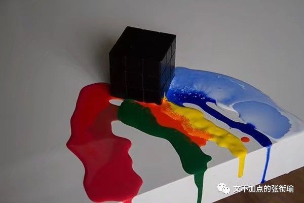

> 本文是张衔瑜第 133 篇推文 共计 2751 个字

> 可我觉得这并不是偶然的小概率事件，哪怕抛开我们的身份客观来看，发生在医院的恶劣的事格外多。医学精英们大多选择沉默，只有这些没有发言权的我们还在奔走呼号，卫健委只是例行公事一样地报道谴责，这么多年过去了，这样的事却只多不少。

> 韩国电影《蒙太奇》的主要内容，是绑架案受害者妈妈为了把15年前的真凶绳之以法，亲自模仿当年凶手的作案手法，并把当年凶手的电话录音剪接到这次模拟作案中，制造了一次和15年前一样的蒙太奇。 《蒙太奇》这部电影之所以强调15年，是因为韩国案件的追诉期是15年。一个案子过了追诉期，就算再有重大进展，公检法机构也无能为力。 所以，因绑架案失去孩子的妈妈决定自己调查真凶，并查出了真凶的身份。因为追诉期过了，公权无法再为她伸张正义，所以妈妈决定自己使用模仿作案，亲自惩罚真凶。

