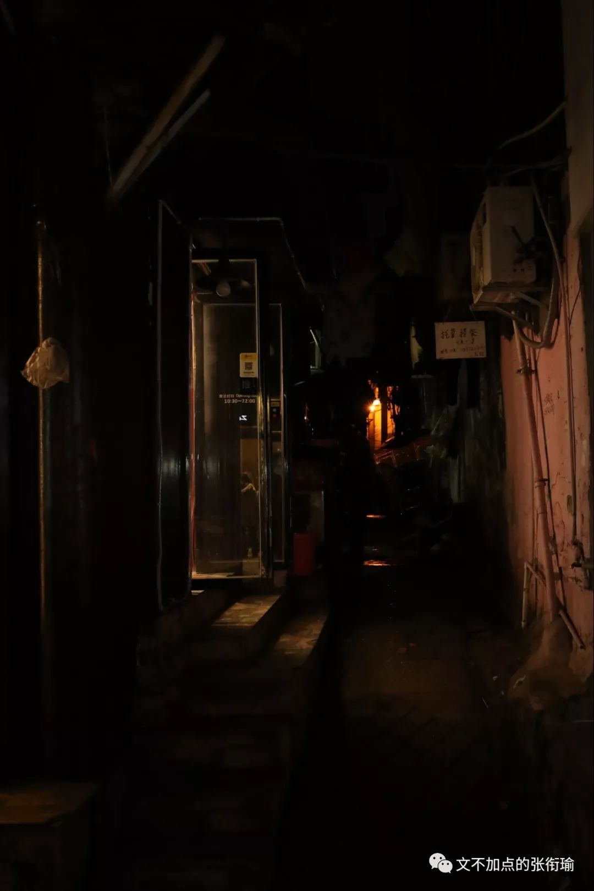
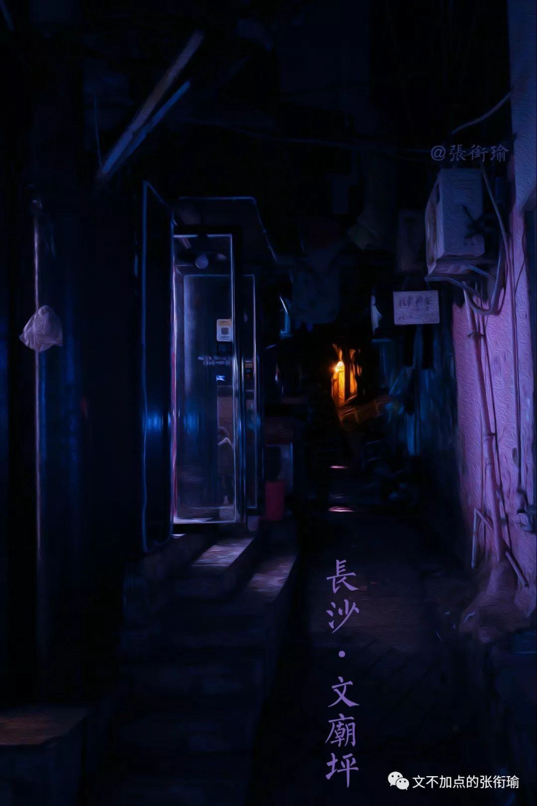
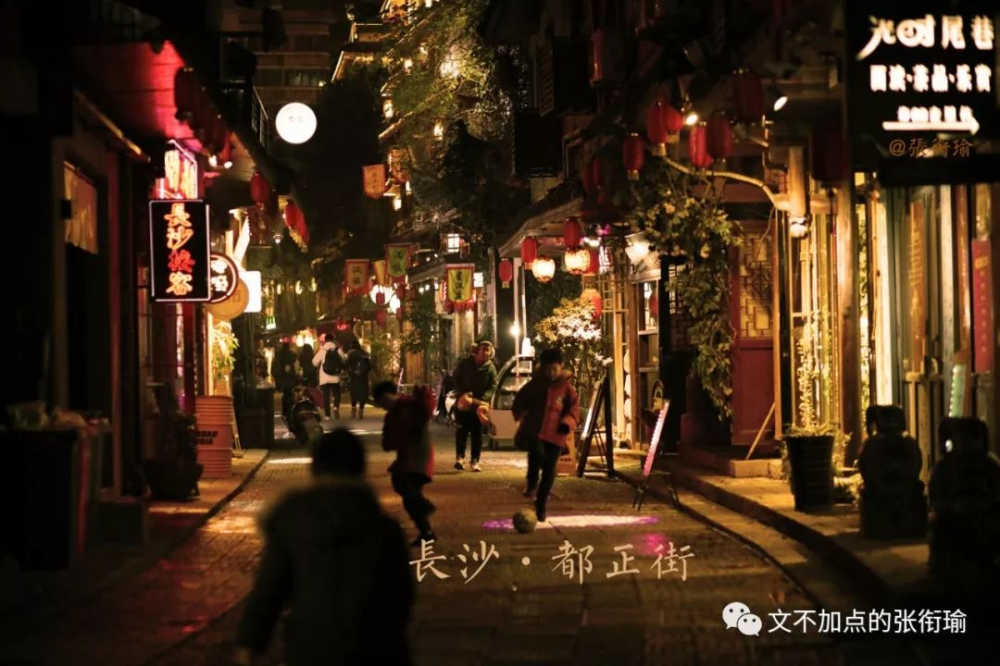
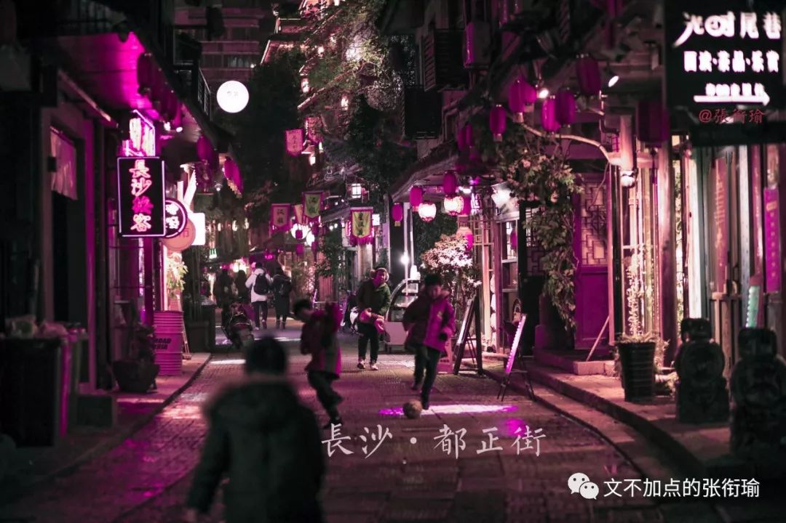
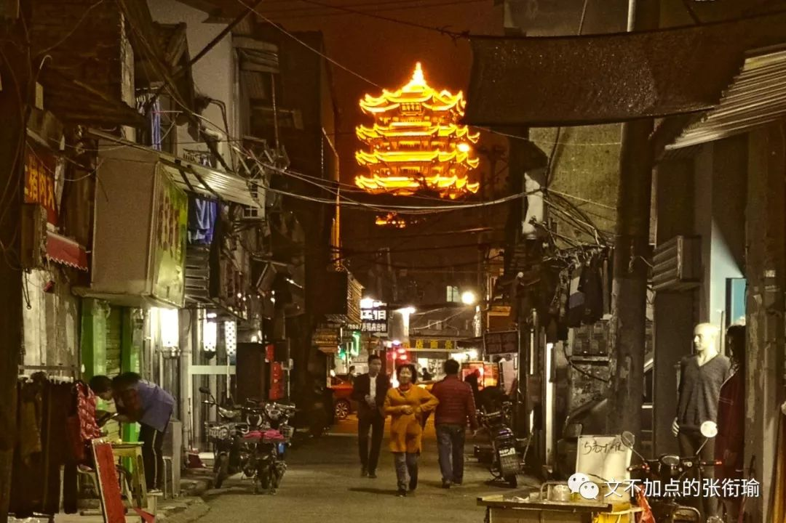
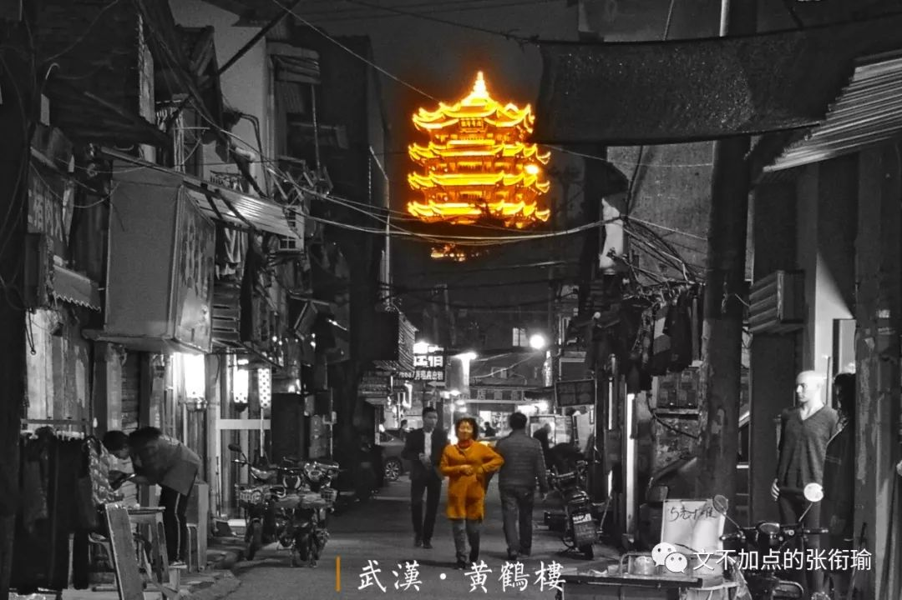
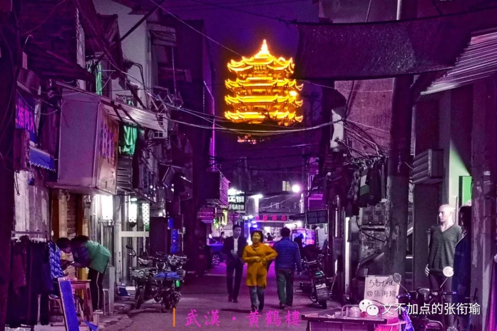
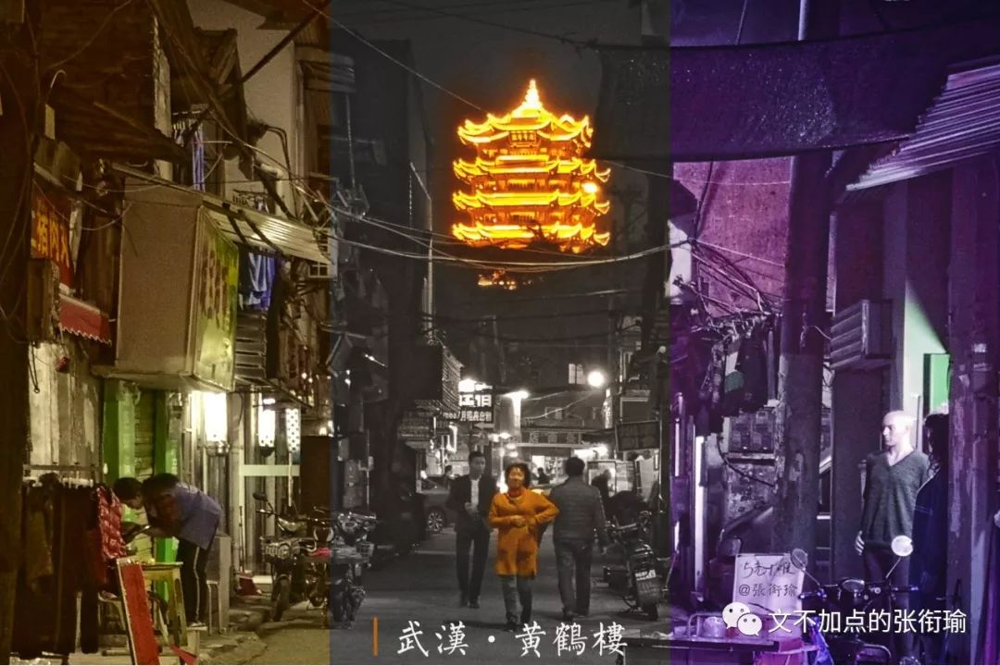
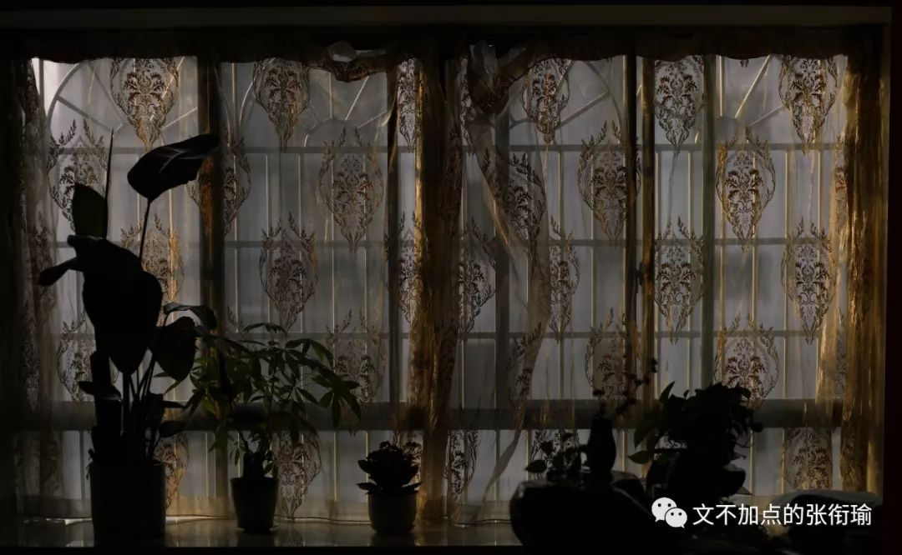

> 明明:外面下雨了吗？ 马路:好像还没有。 明明:还没有？ 马路:不过街上的人都带着雨伞。 明明:他们并不看天,他们只听降水概率 ——『恋爱的犀牛』

明明:外面下雨了吗？

马路:好像还没有。

明明:还没有？

马路:不过街上的人都带着雨伞。

明明:他们并不看天,他们只听降水概率

——『恋爱的犀牛』

> 本文是张衔瑜第 137 篇推文 共计 2371 个字

本文是张衔瑜第 137 篇推文

共计 2371 个字

最近在看南怀瑾写的《论语别裁》。别裁者，盖别出心裁也。南怀瑾在用真正贴合人内心、正常思维交流方式的认知在讲述《论语》。他在前言中写道：“今古学术知见，大概都是时代刺激的反映，社会病态的悲鸣。”倒有屈子的浪漫色彩在里边。

有在和朋友做一些纯粹逻辑思维辩论，具体地则是找几句话来进行正反论证思辨：

终于理解屈原为什么会披发行吟、投江汨罗，看看现在郢都的官场就知道了。

为什么总是天妒英才呢，因为没人关心笨蛋活了多久。

生命中曾经有过的所有灿烂，终究需要用寂寞来偿还。

虽然一般在讨论的时候，匿文可以更好地让我们把注意力关注在语句本身体现的逻辑内涵和精神内核，也就是隐去出处和作者。但也可以说，第一条是从票圈看到的段子，第二条来自沙雕圈，第三条出自马尔克斯的《百年孤独》。

并无意于在此详细说出，我看这些词句的时候，思考痕迹是怎样的。比如事实上的郢都时期偷换，与有可能的一方水土风物传承。人们擅长在所有和自己生活有关联的地方寻章摘句，在高强度的情绪劳动空间当中找寻自己的 特征向量 ，而这时候勾勒的完整思路痕迹，也就显得尤为可贵了。

危急时刻，转变方向是更容易的，但很多时候并非危急时刻。空洞而缥缈的词汇在解决实际问题的时候显得毫无意义。这只不过是使得论辩的双方，各自增添一点可悲的道德优越感罢了。纯粹理性批判与非理性坚持，我大概理解为什么有些事情能靠幻想解决的，他们就不会去付诸实践了。

把原来的图反复拿出来修的时候，才慢慢体会到为什么会有 original mix, xxx remix in 140 bpm, acoustic version, completeversion @, instrumental, DJ edit, extended version tribute to

比如这组文庙坪的CyberPunk

比如这组都正街的赛博朋克

比如为武汉点上的这一盏消毒紫外灯

原来的图只是一个具有很好延展性的素材，想想现在之所以还能在这里逼逼赖赖地拿老图来招摇撞骗，幸好之前没有把原片底稿删掉。

想起在南京的公交车上。公交车有在极尽可能地在车厢里用 强冷 配色，而在地铁里则用到极尽可能的 暖黄 配色。我到的时候，公交车上绝大多数都是老年人，司机的刹车是在去到的城市里最野。有听到旧式聊天室一般的公交车互相讨论，主题是让座，发言人也多是老年人： “只有上了我们这个年纪的人才会让座”、“出来走不动就不要出来”、“少说两句”

呼出的水汽在窗户上凝结，我只能凭报站的声音来知道自己到了哪里。一手抓着吊环，一手握住一个老爷爷的婴儿车。认知的差别在人和人的交谈中展现了出来，当自己经历过或者通过看书来同等地经历过那些阶段之后，只觉得在每个认知阶段中的人都被各自阶段的不幸和幸运所禁锢束缚。这些声音汇集到一起，则是 吵闹 和互不相通。

神奇宝贝不神奇了是什么？每天靠这样的句子过活，也不奇怪会出现 “铁马冰河入梦来，铁马是你，冰河也是你”

我说我要充实而精彩的生活，绝不仅仅只是几个词汇、几张图片、几首歌那么简单。今年所有的日子里都没有刻意祝大家健康快乐，但确实有希望所有人都能有直面生活的勇气。

历史堂而皇之地一页一页翻过篇章，任由各式的情绪和是非在上边涂写修改。

倒也不必一定把过去的生活又絮絮叨叨再说一遍。人们关心的是那些可以打发无聊的事情，可以满足心理癖好的内容。

对某一个年代的怀念，亦同怀念那时候的自己。我把生活杀死了鬼，从此梦里再也没有王冠。众神愤怒地对瓦台撒气，瓦台不动，自己碎裂了去。未来亦同。

听见一首古典，想知道是什么歌。听歌识曲不对，想搜索又不知道怎么搜起。音乐停止，仅存于记忆里的一点旋律也渐渐淡去。它似乎没有存在过，尽管在那个时刻好像那么爱它。

向来很反感“最XXX之一”和“最XXX没有之一”，摆明的情绪裹挟和赤裸裸的逻辑暴力。一点也不美。和自爆炸弹一样的“谢罪式”承担、赌气式的后果扬言没别。

最近朋友们转了各种的迷惑文字和音视频，稍微瞄了其中一部分。有的知道在做什么，就懒得继续看下去了。比如拿着大喇叭喊的鬼怪音频，只觉得 “噢，还整挺好” ，敷衍的程度正同于评价一句 “晓之以情动之以理” 。因为说的内容都知道，不需要用添油加醋的形式来为信息传递做任何的铺垫装饰。

时间在任何时候都是宝贵的，既然目标是信息传递，那就直接用最朴素的方式解释阐述就好。得一定要出动 形式 才能达成的，到底是什么的胜利呢？我丝毫不质疑最后的效果，但如果视野里并不是从基础认识来构建科学的考量方法，则形式只不过是小聪明罢了。当我写在这下这段话，就意味着这不是短期立竿见影的，而是长期地、不出名但得干大事。

所以在看到各种触目惊心的标语时，如果只是作用在我本人，一笑也就过去了。可背后我们所看到的，只有放狠话才能有效果，缺位的又是什么呢？熙熙攘攘的情绪潮流，在最近的时间里给身边很多人带来了从心理到生理的具有 真实外壳形状 的绑架。

若不是在前两年的诸般生活中已经过了这些关卡，我现在也是一样。可是当已经从这些关卡中抽离了之后，同样地也就不知道在里面的现世情况如何。

在手机的备忘录里写了不少随缘想到的一些话。有的转到了日记本上，有的挑挑选选又在公号的推文里增删来去。

一般有一次汇总，临时的备忘缓存就应该清空。下次就该开一篇新的。但不一定每次都清空了，虽然这也没什么关系。

只要生活还在继续，那么所有的这些想法也不会停止。

疾风知劲草，路遥知马力。我不经常用众所周知的格言警句，是因为在日常生活中已经把这些句子外延伸展到了太远太远的地方。像中学的作文，明明打不到一起的话也要鞍一个句子来显得自己很会。

落日飞车的主唱曾国宏说：“尴尬是最低成本的浪漫。”

按照没有什么就去呼唤和吆喝的原理，仍然祝愿大家能找到让自己无惧时间在平凡中流逝的勇气力量。

立春

贴一张今早醒来后拍的窗棂阳光

