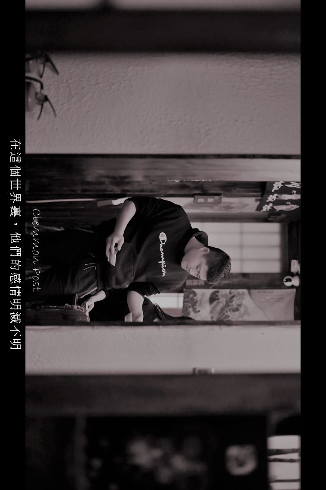
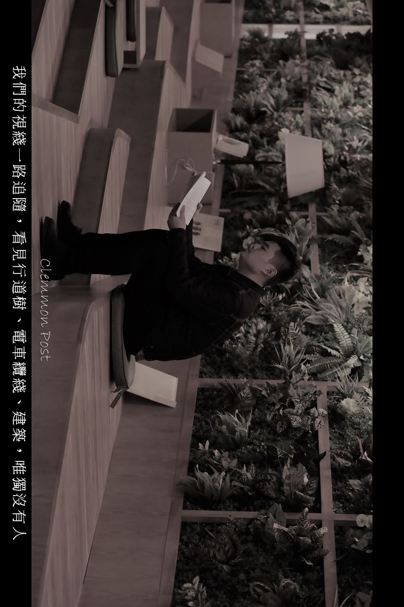

> 本文是张衔瑜第 139 篇推文 共计 1660 个字

> 跟交往3年的对象分手了 白天还好 一到夜晚情绪就控制不住 躲在被子里偷偷笑了起来

> 有句《圣经》上的话来到我嘴边，但我没有说出来，因为我知道神职人员认为俗人侵犯他们的领地是有点亵渎上帝的。我的叔叔亨利做过二十七年惠特斯布尔的教区牧师，要是遇到这种情况，他往往会说，魔鬼总是随心所欲的引用经文。 他记得从前一个先令就能买到十三只上等的牡蛎。

> 树身上有许多圆环，转一转便会温暖。

