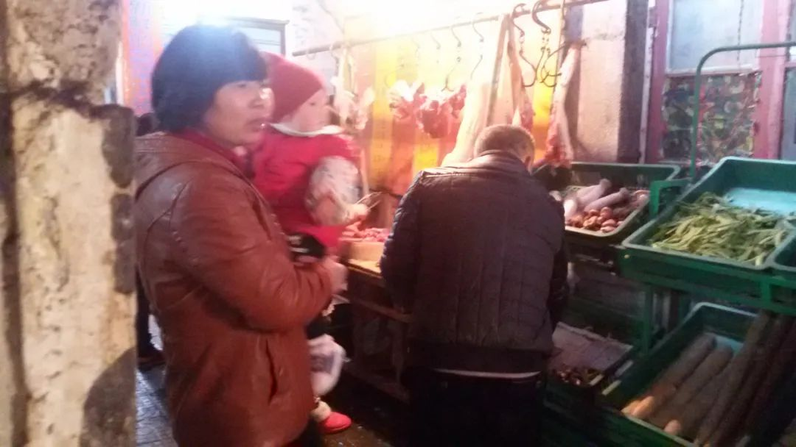
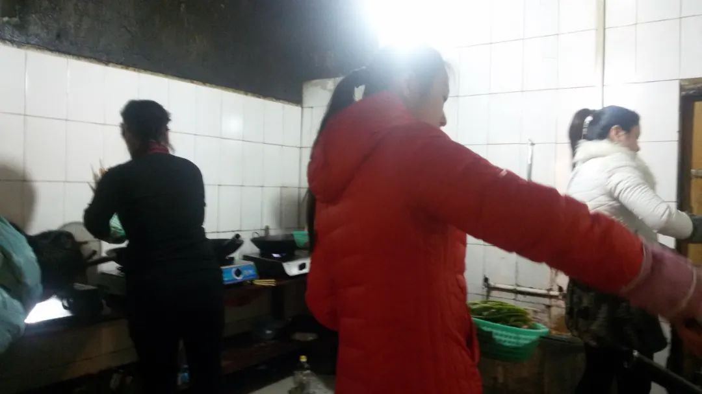
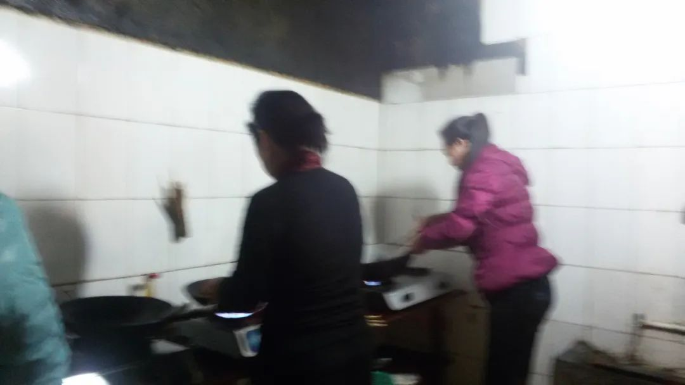
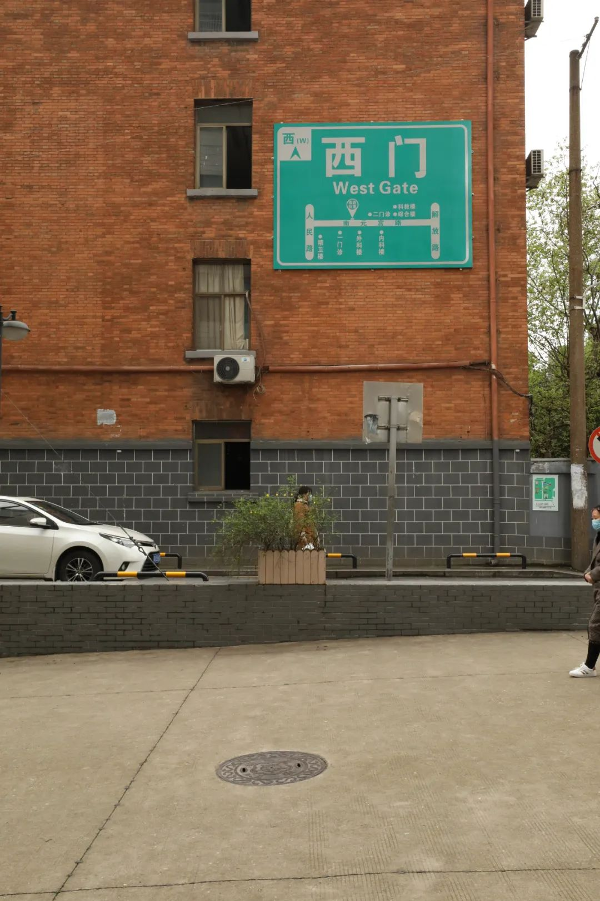
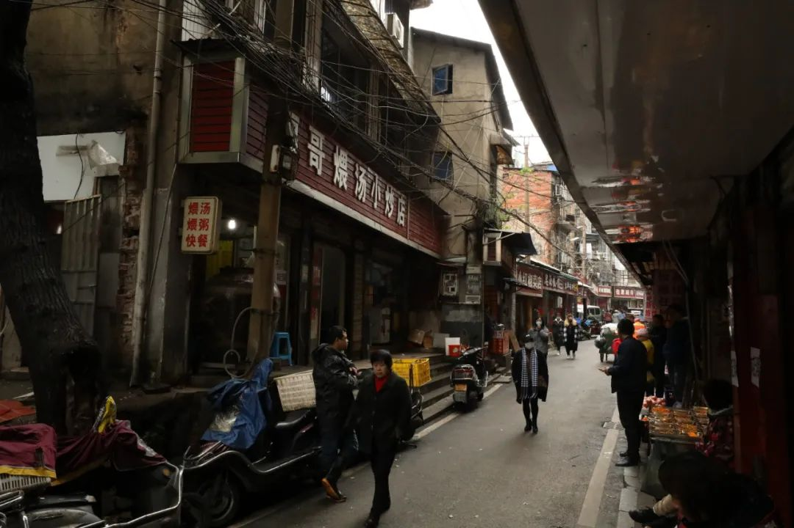
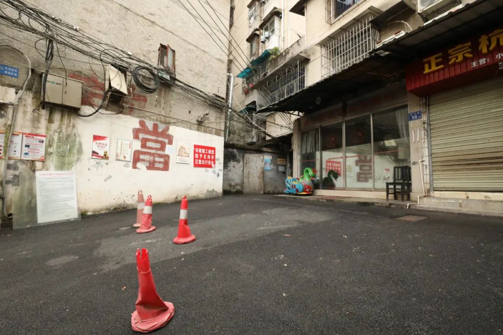
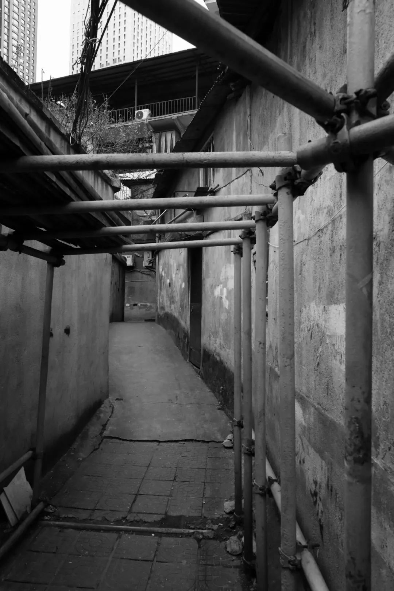

> 本文是张衔瑜第 147 篇推文 共计 2486 个字

> 初夏午后，一位水产店女老板正熟练地剖净黄鳝，装进小塑料袋，递给旁边等候的老汉。案板上的电风扇发出嗡鸣，轰走蚊蝇。 “让她吃好一点。”老汉接过黄鳝，眯着眼睛、蘸着唾沫数出几张一元、五元的票子。枯瘦的妻子站在他身后的背阴里，戴着一顶碎花白帽，露出光光的额头和后颈。 “我们也挣不了几个钱，全当做善事了。”女老板看着夫妇俩的背影说。隔壁摆摊的裁缝凑过来，补了一句：“只要住到这里来的，说明还想活！”

> 日复一日，病人们把嘉桐街当成“家”，也当成“战场”。他们在这里吃饱睡好，再迎向医院的仪器针头。 有的人最终没有走出医院，街道一头一尾，哀悼的鞭炮有时会在白天燃放。但更重要的则是嘉桐街的炊烟，它在一日三餐之时升腾，从不间断。

