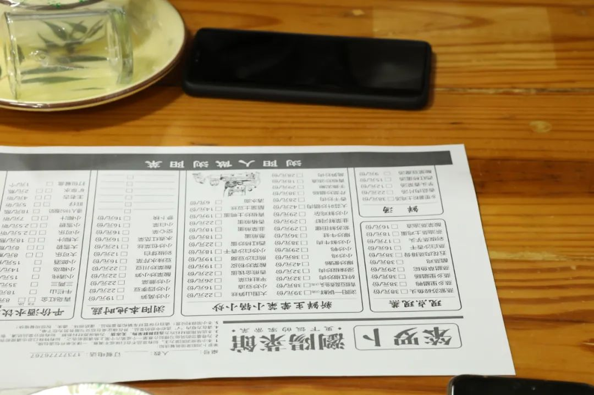

> 本文是张衔瑜第 150 篇推文 共计 692 个字， 122 张图

本文是张衔瑜第 150 篇推文

共计 692 个字， 122 张图

昨天我在备忘录上这样写：

我已经有五天，没有用手机拍过哪怕一张照片了。只有在拿起相机的时候，才会拍下身边的什么。但我明明以前就是喜欢，不管走到哪都会考虑考虑构图的人。所以，也许是有了相机之后，就把很多的观察推到了一个特定的时候，像人们因为爱好而学一个专业学了之后却越来越不爱好。刚刚发现这一点的时候，对人的厌恶又多了几分。终于还是逃不过认知心理的摆布吗

岳麓山去太多次了，从小到大、不熟悉的小路也能转到熟悉的大路。岳麓山还有三个伴随景区：桃花岭、寨子岭和象鼻窝。去宜家发现停车场没完备，又一万个人聚集，自然从西二环去 桃花岭 。

晚报大道公交车上

红旗药号

笨萝卜

浏阳蒸菜馆

下次我的学生/白领朋友来长沙

没必要推荐去吃炊烟时代和费大厨

（当然一盏灯还是可以）

笨萝卜就是真的平价市井湘菜

长沙人民艺术家改造废旧工厂

定王台。浏城桥。肇家坪

当当梅溪书院

听说五一这里会有脱口秀

解放西路，斌弟到江边

扫街扫不出好看的图

但也是一部分

屋里屋里

传说中长沙炸鸡排名第一

韩式专注开启

达美美立方1栋

楼顶

进门就被漏光和设计感震惊了

不规则结构和光影

在考掌镜人的基本功吗

连楼梯间都是回旋

再来亿次

梅溪湖地区无人驾驶车

你看，真的是自动地跑起来

人生体验

在长沙三珍虎园摸到人类天敌

东北虎的幼崽

劳动西路428号

万家丽楼顶：落日与弦月

散

长沙的古建筑里，如果只看到一个孤零零的牌楼，我几乎想都不用想，旁边的介绍词上都会有一句“ 原物已于1938年 毁 于文夕大火 ”。望麓园也是如此。

据说是原来的湘江宾馆，整个楼都搬过来了。也不知道怎么做到的。

楼顶理发，理发师剪一半，风剪另一半

顺便从路牌上新认识了一个字

完。
