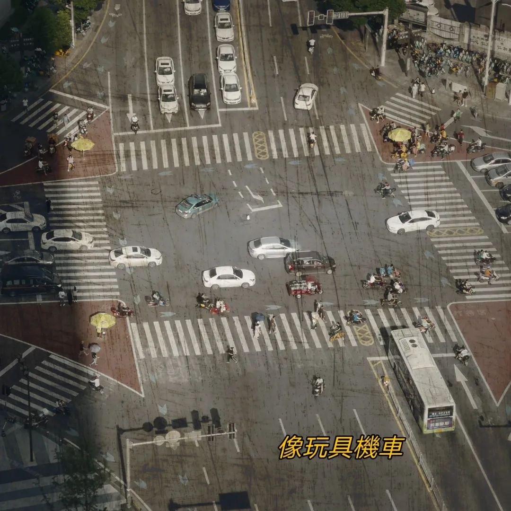
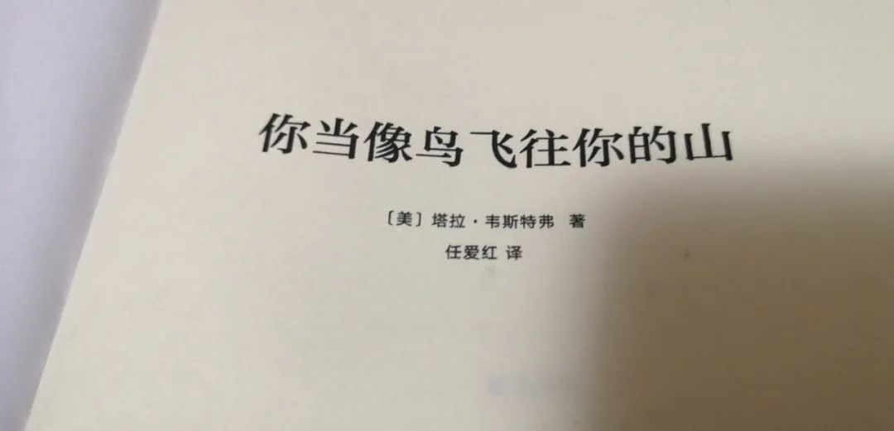

> 本文是张衔瑜第 157 篇推文 共计 4142 个字， 21 张图

> 新闻并不是一个每天都面对新奇之物的行业。相反，它会有不断的重复，热点的重复，问题的固化，框架的重复，程序的重复。这种重复常常带来周期性的职业疲倦。理想，可以让自己在这个行业走得稍远一些。

> 教育意味着获得不同的视角，理解不同的人、经历和历史。接受教育，但不要让你的教育僵化成傲慢。 教育应该是思想的拓展，同理心的深化，视野的开阔。 教育不应该使你的偏见变得更顽固。如果人们受过教育，他们应该变得不那么确定，而不是更确定。他们应该多听，少说，对差异满怀激情，热爱那些不同于他们的想法。

