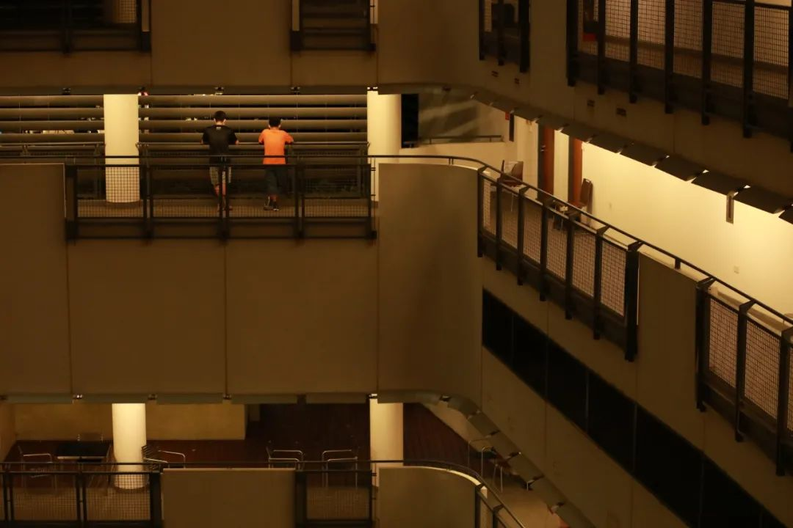
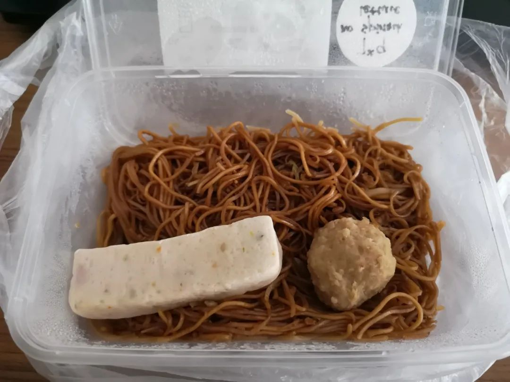

> 本文是张衔瑜第 159 篇推文 共计 4528 个字， 53 张图

本文是张衔瑜第 159 篇推文

共计 4528 个字， 53 张图

上了岸就不要再想海里的事了

最近把名字当成个签。

从南京离开到新加坡，已经有十来天了。算一算，也快出隔离期了。尽管这几天事情一多，每天过得几乎都没有什么实感。

睁眼，开始做事。吃饭继续做事、吃饭睡觉继续做事、吃饭洗澡继续做事。看看发出去最后一个文件的时间，十一点多了呀，得睡觉了。

新加坡和国内，在计算时间上没有时差，国内钟表指向子夜的时候，这边显示的也是十二点。初中地理习题上有一句话，我到现在还可以完整背诵：

“当我国东部乌苏里江上旭日东升的时候，西部帕米尔高原却还是繁星满天。”

这主要是由于我国跨经度广，造成东西部晨昏差异大。我国东西跨经度62°，共跨5个时区，都使用东八区北京时间。

以前长居的城市都在京广线上，六点日出、六点日落，在我看来是很正常的事情。新加坡晚一点，七点日出、七点日落。

抵达樟宜机场的那一天，经过程序繁琐但好在没有怎么刁难的海关检查，凌晨四点班终于坐上了开往国大的的士。原以为赶早班飞机的人快要让值机区域显得多少有些拥挤，后来才知道原本国际前列的樟宜机场由于没有国内航空体系的支持，现在起降已经减少90%了。

还是说说自己。有些奇怪，我是一个要去隔离点的人，但依然是自己从机场打的去隔离点。到隔离点办理入住，的士司机说了一声Good luck，办事人员拿了一个小苹果和一瓶水给我，让我戴上手套并把我送到房间里 关上房门。

隔离生活就这样开始了。

离开长沙之前，我写了一些在备忘录上：

这是一种什么累呢？

就是我自觉好像站在了什么不得了的关口。以往学过的历史说，这就是不一样的时期；往以后的路看看，什么也不明了。我就在这种时候做出了反常的冒进举动

我也不知道这时候出国Post Graduate是好是坏。不管从教育质量，还是从社会稳定层面，我都无法预料。当社会在洗牌的时候，那些原本在自己路子上走得平平淡淡的人会觉得这比以往累了太多太多。

我也是。事实上做一点微小的工作会很符合我自己，但许多年来享受的社会资源，配备的是众目睽睽下寄望走出不一样一步的人。我好累啊。小说里的家主，梦想去做海滩边抹防晒油的老板；我攻读着虚无缥缈的学位，仍然只想每天平平淡淡

郁期好容易疲劳。聚会里朋友迟到，我就会取消日程回去；拍图里需要调整，我直接让看客去想象；文字一遍写完，我也懒得去调整和校验。

我要走了。这是最近和朋友们说得最多的话。有人宽慰我，别把自己说得像要去世了一样。我说，差不多，从现在起试试没有我这个朋友的生活。癌症晚期的丈夫，为朋友介绍自己的妻子『这是我的遗孀』并宽慰说，尽情地哭吧现在还有肩膀可以依靠，很快你就要被迫坚强了。

每天都把自己写到头晕好多次

当我难过的时候，我便写日记；当我更难过的时候，我便撕掉几页日记。

这些日子里我不再写日记，从前的日记也快被我撕光了。

没有睡着。

看完了Rick and Morty第四季

原来我截图又翻出来好多

Dad, I'm out of excuse

for not being who I am

原来在这里得到了回答

真好

希望明天的生活

能高质量一点

刚到新加坡的几天真是离谱地热，虽然比长沙的体感温度稍微低一点，但毕竟住的地方没有空调。像是回到了初中教室里的那种吊扇，没有凉席或者空调扇之类的降温。每天的生活是：醒来、洗澡吃饭、做事洗澡吃饭、睡觉洗澡做事吃饭做事、洗澡睡觉。每天要洗四次冷水澡来降低体感温度纳凉。

以后可租一个移动小空调在寝室里边，毕竟我没有申请得到带空调的单间。一堆的房间都被征用了去做隔离病房，导致本来就不是按等额配备的寝室格外地紧张。只是现在隔离期也不被允许做其他的多少改动。

有时候和朋友吐槽，会有不同频的感觉。有些理解为什么之前出国的好朋友，慢慢地都会互相觉得我们的生活变得疏远。举个例子：

你发票圈说自己分手："四年的恋爱终于结束了"

底下出来一条评论："恭喜你们！！！终于结婚了"

地铁是城市的大肠。穿梭于其中的你，是这座城市的粪便。在地铁上按下快门，就像屎壳郎一样把拥挤的人潮堆卷成球，打包贮藏

光和光如何相见？

They say, see you in the dark.

今天因为改论文，又回蜗壳那边去参加网络组会。

开完组会，老师和其他同学离场，最后剩下来我们三个到海外读博的留学生。大概是出国了才会懂，原来以前看那些出国即失联的人、那些出国之后发的票圈我都没想法和ta聊下去，这些人现在也是我，是我们三个在海外的博士，是我们也都是这样的人。孤独吗？除了大海，都是寂寞。如果说租房、人文、工作这些林林总总都是导火索，那么根源就在恋群患者离群索居之后只能自说自话。还得把本科的题带到博士了来继续写吗？我不想夜长梦多。明天醒来这些事也不会消失，正如希望明天凉快一样完全不可能。

还好还好，南京市民在成都打起了麻将。至少他提出的问题洗心革面了。

到坡以来的第一次遇到下雨大概是到新加坡以来最凉快的一天。早上六点开始雨一直下到现在，要是能天天这么凉快就好了那真的可以不需要空调。在沙发上休息也太惬意

你是什么状态你向往什么状态

和朋友随口胡诌：我去了一个不会下雪的城市。热带，北纬一度海边，太阳直射，哪里来的雪。我住四楼，一条马路之隔的大树都长到了六七层楼高。

神盾局完结。看就好像过去的七年一下闪回：

回到十五岁的时候"那我们找点共同爱好吧你在看什么剧"然后进入神盾局宇宙；十六岁高三月考，布置考场的时候我们把书桌清出教室，和朋友坐在走廊上的书堆里，一人一只耳机拿着小手机追最新的剧；十七岁坐在光谷巨幕影城里，要看的电影还有好一会儿才开场，端着小饮料先来一集；十八岁的时候有人给我发了一段神盾局前五季片头的剪辑，试探地问我在里面看到了多少人的影子。

一切也都过去了。

今天早上，好基友提醒我要完结了。我会平衡课设科研和自己生活，也就意味着相互牺牲。今天一天追完了第七季，就像第六季也不过潦草地在一天内看完的时候一样。复盘并不那么容易，我们只在意识到荒诞的时候，人生才多了些悲壮的意义。

I am here pronouncing you 多美的句子。

谨此纪

尽管出土的小草都被清除，尽管煤炭和石油燃烧的浓烟四处弥漫，尽管树木被滥伐，鸟兽被驱逐，即使在这样的城市里，春天仍然是春天。——列夫·托尔斯泰《复活》

不抽烟不喝酒不蹦迪。难过的时候你该干什么

偶然间又读到一篇写杨德昌的，这位主业精神解剖师的台湾导演。

《牯岭街少年杀人事件》 向我们展现出的一个基本的背反便是，当你试图从当时的社会历史入手去顺畅地解读这个悲情故事，在一座清晰的意义参照系或因果坐标轴上定位人物和事件，那么你终将错失这个故事背后的生活世界；反之，如果你用一种「直面事物本身」的现象学态度 （请原谅我在这里用了一个晦涩的哲学术语） 悬置了历史、直面其生活，那么你反而获得了进入这个世界的权利。

人们可能根本不会把「恶」这个字眼和如此琐碎的日常生活相提并论，然而灾祸的接力，就发生在诸众的不自知中。定时炸弹最终在一个少年的手中爆炸：他杀了人。「世界并不荒谬，也没有意义，它存在着，仅此而已。」法国小说家阿兰-罗伯·格里耶如是说。

大晴天，你和家人一起收拾房间。你把一床床被子随意搭在庭院的晾衣绳上，让阳光驱走棉花发霉的味道。蹦蹦跳跳的小女儿不小心踢翻了偶尔罢工的收音机。「哎！收音机好了！」丈夫的声音里夹杂着一丝惊喜。

你听到大学录取学生的名单。你渐渐被远方的声音所吸引，忘记了手头上的旗袍。你想起自己有个本该在中学里读书的小儿子，现在却因为杀人身陷囹圄，他没有被判死刑，但人生最好的时光只能在阴冷潮湿的小房间里慢慢耗尽。你皱起眉头，鼻子开始泛酸，但又哭不出来。

你自问：「生活为什么会到这一步？」

这一刻，你是绝望的。

不愧是最大承载的杨德昌。

课程多了之后，和这边朋友的交流也多了起来。比较神奇的是一些文化上的差异。

之前和一位去法语区的朋友聊天时，ta说“当一位法语母语者夸你法语说得好，这时候别有虚妄的自信。当ta夸你法语说得好的时候，还是在把你当做外国人在对待。我们平常在路上也很少夸别人：你的中文说得好、你的长沙话说得地道。除非真的有很精妙的表达，但那几乎不可能由一位还在学习语言中的人说出来。”

和同样从国内过来的朋友，当然也很多，交流起来就和平常在国内的交流没有什么区别。

马来西亚是新加坡的第一大移民来源国。新马之间，也就只隔了一条长堤。无差别信息轰炸下，我都知道过马来西亚海关之后便是柔佛州的新山。

最开始接触，开始知道马来西亚有英文学校也有华文学校。华文学校就是在用中文授课，似乎课业压力比英文学校要大不少。

当你碰到一个中文说得很好，但名字明显是韦氏拼音的人。我通常会猜测这个人是不是新加坡人、马来人、香港人或者台湾人、要么就是另外哪里的华侨。但有一天我把这个疑问和朋友说了之后，ta回说：我不是新加坡人也不是马来人，我是马来西亚华人。因为在语境里，马来人不指代马来西亚国籍，而指代马来族裔；所以他们会很刻意地区分，自己是 华侨 ，华文很好但并不是马来人。

有时候文化差异只能一点点磨合，或者说意识到有个麻烦在这里然后记在合适的时候说。比如他们看到我用繁体打字的时候会问我是中国人还是台湾人。这放在大陆互联网语境就很容易炸锅，被列为严重的过失像国科大那个就被退学了。只能说，我知道对方没有恶意。你问他们台湾人该算华侨还是华裔，他们会一下子懵住。

尤其在大陆以外的人想用微信和你交流的时候，你发现对方冷不丁地给你发个微笑表情，然后自己心里咯噔一下。曾经带新生开第一次年级大会，讲校园礼节的时候微笑表情被视作和 “你好”、“谢谢” 同级别的社交礼仪。

营销号只知道把所有的黑话都列出来，但所有黑话的秘密都来自于 （有没有精准的名词来说这种使社会定向移动的力量） 驱动者我们的语言和舒适区一步步创新和更替。

GQ在这方面，我一直觉得是网感很好地引领着语言和生活方式的风尚。但更深层地来想一下语言的实质，什么叫做流利地/和母语者同级别地掌握语言。普通的语言是在交流信息，你的快递到了菜鸟驿站、按照这个合成步骤你可以得到想要的结果、右转之后你会看到目的地。这些都是很基础的信息传递，我今天得订一辆车来接我，十点不行十二点不行，得十一点。这也是最开始朋友和我分享的那个“你法语说得好啊”

开始玩转语言的时候，人们开始用自己的思维来斟酌语句。很多次参加中文方向的研讨会时，大家都会对某一个具体词语的使用条件、情感强度做出区分。我想不管哪种语言，都一样地会有这些区别。

把一个语言对象提档上次，其实还是看适用人群。毕导把 火锅 描述为3X3网格差分二维非稳态温度场的红黄双色可视化模型，至少我知道他在化工里也研究的膜分离技术，并且这一段离谱的话也make sense

前段时间还有在能源热传导里，研究已经片好的羊肉到底是涮着熟得快、还是一窝蜂投下去煮来得快。还有深刻剖析，撒尿牛丸的热力学过程，外面的一块什么时候会熟、里面的牛肉多久才会热。这些东西其实联想一下，高分子成型与铸造顺理成章也是这个模型下可以拿出来实际给轻工业食品日化以启发的物理模型。不一而足

还有比较有趣的，胡子这么软、剃须刀那么硬，但是胡子这么软是怎么使得剃须刀变钝的呢？这个问题的意义不就可以大量地用在加工成型与控制，增材等材减材。

隔离确实让生活变得钝感了很多，留下的空间就都给了各种灵感的交杂和耐下性子来执行一篇又一篇调研、一个又一个课设。卡着时间写完这篇疫中小记。出门做核酸检测，又是自己打车去医院，一时间不知道怎么迈腿。司机感慨： “隔离点是新加坡最安全的地方了” well我一下子不知道说什么来接这句话只能希望人没事

看看我每天在吃什么。就知道到底人有没有事了

碰巧看到在手机相册里，有天在长沙早上不是抱着探店目的 随便走进家旁边的一个粉店里。

粉店很小但是用工很精巧，没有别的菜码只问你要不要加蛋。用的碗也是这种最复古的宽口立碗。

被湘菜惯坏了的味觉里早就不知道比隔离餐好吃到哪里去了

