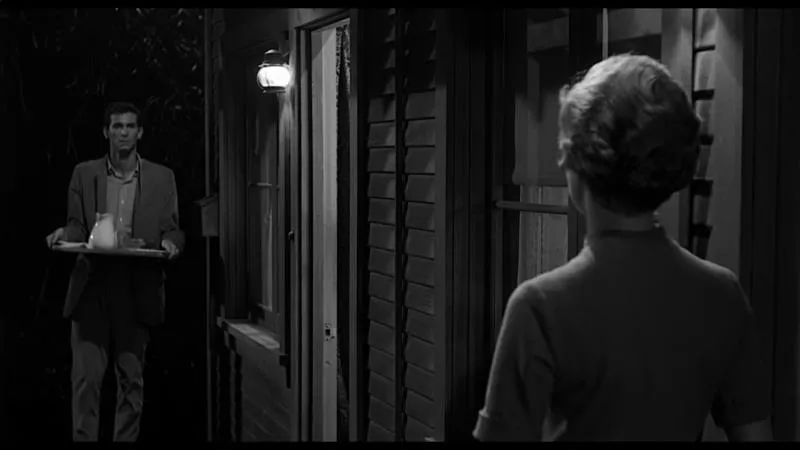

> 本文是张衔瑜第 160 篇推文 共计 4507 个字， 79 张图

本文是张衔瑜第 160 篇推文

共计 4507 个字， 79 张图

警惕成文的时间跨度。这篇大概分了一万次写完毕竟

早上醒来出门看，一直壁虎灵巧地从厨房隔板上钻进了鞋柜后边看不见。我在旁边拿着塑料袋鼓捣了一会，想着要不要把鞋柜移开看看里边到底有些什么东西让壁虎很喜欢。终于也没有打开。

认真的 Catherine 大夫翻了翻《纲目》：守宫，善捕蝎蝇，故得虎名。处处人家墙壁有之，状如蛇医而灰黑色，扁首长颈，纲鳞四足，长者六、七寸，亦不闻噬人。

出隔离到今天也有一周了。

没想到把相机困在寝室把我困在学校的，倒也不是疫情。而是再三啰嗦的各种课设材料。

过载的时候就逛逛淘宝，计算一下从国内运东西到这边来会要多久。最近出的中新集运特惠价，我也开始想是不是来走一波自己搭配物流内容。

凉席 ¥130 7.6kg 眼贴 ¥70 0.9kg

百分之七的关税加上运费一共 ¥80.6

每天也在算一些细小的账面。

像以前也会算一下怡宝矿泉水在不把瓶子收集起来丢到回收站去卖的情况下，怎么买才能买到最多的水。薯片单位价格净含量我算过，可乐的我算过。

好像还有几种也算过，只不过年代久远大多只记得一个结论，具体比较了多少和有没有变价，那些已经忘记的也都只是给人一种赚到了的感觉。希望不非得是错觉。

在国内的时候谈到高招，选择的目的也就是给人一种 “我赚到了” 的错觉即可。我说的就是本硕博贯通培养的实验班，像是一种抄底。这些班能录到的人，从本科开始如果我们普遍认同分数越高能力越被肯定这个逻辑的话，那么这种起底事实上是给自己留住优质生源：首先招到了原本自己这里招不到的学生、其次这些学生还可以在本校留得更久一些。

这是一点没有被指出的内容：本校post graduate最好的生源大多来自于本校的本科生。而当本校的本科生质量顺次提升的时候，如果认为高校招入分数即代表录取内容，那么能用更高的分招到更好的学生、还在校内待更久。岂不是太美好的事情。

学生虽然长远地说，如果没有贯通培养的话，可以自由选择去更好的地方。这其实是又一次的人才分流，继续学习的和不继续学习的。用一次的好成绩来逃避之后的分流，我不认为这对学生而言是一次有眼光的选择。不过这也无妨，人们不过是喜欢某种确定性，正如在所有时候折磨我的一样。

刚刚想到post graduate的事，没想到上一次没写完的也接着在这。以前听实验室的师兄师姐说，自己硕士博士毕业的时候 和本科毕业一起谈天说地吃散伙饭的感觉完全不一样。可能越到后边，知识上know more and more about less and less，本身也越来越走向自说自话的境况里边去了。

生活越来越趋于平淡了。

所有的人都在向前走。只有我想停下来

初中的好朋友 Attraversiamo 住在离学校四五站地铁远的地方。图是我在 Bouna Vista 附近拍的。商场只留了一个正门给大家出入，进门不是拿着类似国内健康码去出示、而是扫码确认什么时候进入的商场。

消防疏散上来说，把其他的小门都堵住并不是什么明智的做法。就像三山夹两盆那边一些断断续续流传出来的消息一样。

穿着工服的人蹲坐在外边抽烟。虽新加坡据说禁烟措施严格，我不清楚具体的要求，但是明显比长沙抽得还要凶。湖南这边槟榔加烟，新加坡这边倒是从来没见过有槟榔出现，也很少见到明显增大咀嚼肌的人。

Laksa，中文名叻沙 （反正只看这两个字也知道没有什么中文蕴含像搞电影的希区柯克一样就是个拟声名字） 大约是一种鱼味椰浆虾米面食 （有酸味）

当时想侧写一下这部分的人，但是因为他们说的既不像中文、又不是在美剧英剧里听到的那种英文。

就是感觉，你知道他在说一种语言，但是并不能很直接地反应我该切换哪条线路。有一天我和一位安徽的朋友、一位陕西的朋友一起做公交出门，我们都明显地听到了司机在说中文，而且是很清晰地知道。但是互相转过头去问 “你听懂他刚才说的是什么了吗” 面面相觑。

侧写会觉得这边人生活得有些低欲望，没有多少情怀的感召力。你很难直白地断定说，到底这是好事还是坏事，我的词句倾向并不代表社会科学上的效力。

所以我说这边人生活起来没有形成一种具有特质的风尚。

我们说东南亚如何，比如仅从餐食上来看：说用椰浆、各种瓜果，但并不能说这就像八大菜系一样作为一种人文风尚出来。换个维度来说，湖湘文化在浪漫幻想上的成就，即使不会那么直白但也会浸润到每一个受过教育人的心里；

而新加坡这边不会，我现在感受到这边人们很多样的生活方式慢跑、KTV、逛商城吃饭、远足、建博物馆和房产中介，更像是一种会被带着走或者说沿着既定路线向前走的这种顺应，而非自己的能动性需求。所以我总结说没有形成很有特质的风尚。

当然如果一定要把比如娘惹Nyonya文化这些做区分归类。至少我现在不会首先这么想。

也难怪，这边五百三十万人口，有四分之一上下是外国人。族裔上四分之三是华裔，然后是马来族裔、印度裔以及一些混血族裔。

说说我自己在寝室

好朋友 一叶小舟 的二十四岁生日

吵就吵喏。寝室在二十层，窗棂看下去是UTown的大草坪和游泳池。高速公路一直延伸到海边，船坞塔吊各种远洋辎重。仅有的地理知识说："这就是亚洲大陆最南端了"想想又觉得噪音还可以忍受既然每天都能这么广的角度一点点看落日坠入大海

久远的地理知识，一时间变成了自己能看到的真实。

地图上说，我视线最远处看不到的海平面下方，是印度尼西亚。视角又一块，从大陆端延伸出去的部分，在四五十年前并没有这块土地。那边是新加坡建国以后，轰轰烈烈填海造陆给建出来的。

每天做不下事情的时候就这么看着。看近处的车流、远处的房屋。那些两个月以前在租房软件上找到的模样。

偶尔也会和自己说，去海边吹吹风吧。能清醒的话，感冒也没关系

想法刚出现的时候就被打消了。感冒当然是有关系的

出门有时间懒惰了的原因，一方面是module（真够烦人的），另一方面是还没有适应。适应既有指价格上的，也有指人文风物上的。

价格上来说，和中部城市 （长沙武汉） 对比的话，汇率统一了之后：

食堂食阁价格比路边餐食略高 （大概高20%~40%） ，例如各种套餐盖码饭面食，例外是麦当劳几乎差不多；

普通商场内take-away外带，比如会装进打包盒的甜品，价格差不多 （而且支持支付宝的相对会多一点） ；

需要交纳服务税印花税的餐厅，比如海底捞南京大牌档 （这边也有分店） 差不多是国内三倍 （不低于两倍） ；

小商品比如文具和各种手办明信片小礼品，三倍到五倍不等，因为也说不定是从义乌运过来的。

曾经在武汉长年累月在外面跑的时候，武汉地铁突然涨价了一波搞得当月的月消费一下子蹭蹭蹭往上涨。现在依然是每天逛淘宝看单品然后和这边的价格做一下计算。汇率和运费各种的预估，总之也要转算那么几道的样子。

比较惊奇的和高中好朋友 Angel 在 Vivo City 的时候还找到了PS4 XBOX这种爱好很专一的店。

虽然说是肥宅天堂，但是里边的人看起来也不会和其他店里边人的体型有多少差异。贴在这类爱好里的人如果真的有的话，反而没有那么在意到底价值怎么样。

买到了就都是最大化的快乐，而不会像其他爱好人群一样会区分大小。

这个群体里每一份都在拓宽快乐边缘。

海南鸡饭和把青柑片得很好看的鲈鱼

再谈人文风物。新加坡算一下的话，建树自己的一套价值内核也差不多从上世纪六十年代开始。自然地会觉得有些剥离感，在国内各省市首府随手一指，三公里内随便就是几百年作为单位来上溯历史。而这边，好些没有填海的地方可能五十年前还有人说这是马六甲海峡然后架船去渔业。

扫街令人不适应的原因也很明显，这边行车和国内恰好反过来。国内驾驶在左、行车靠右；这边驾驶在右，行车靠左。我也许哪天去申领换一个国际驾照，但是在国内开了三四千公里，有些别扭估计也要好久才想得通。散步上街，有人从对面过来也还是不自觉会往右。但是靠左的话又觉得不是那么回事。总之还得想一阵子才行。

算过一下，能在国内买到又能运的东西，如果能等的话，只要乘1.4还比这边便宜，那就可以一波下单给到广州集运中心去海运转到我手上来。多的百分之四十来自运费、保险和海运关税7%。支持国内消费建设，又在运力上贡献一带一路。只是待在资本主义国家，但是却在供应链卡顿得头疼。

三天时间，快递在大陆能从山东淄博发到广州。但是大概不能从到新加坡的码头清关然后运到我手上。总之就是我买了什么然后在淘宝拼多多下单，如果走最省钱海运拼团的话，得预留差不多20~25天的时间，东西才会到我手上来。希望下周凉席能来救我命。竹，以你命换我命。

现在坐在窗台。降下椅子高度，电脑上一排排中英文交杂的内容；升起椅子，远近交替。好的视线真的可以给人的生活体验以极大丰富。下次提起身份，陌生感和疏离感可以稍微变得少一些，多一点认同和稍微扮演得像一点。手上矛盾密布。

坡总是冷不丁地开始下雨。一会儿又停，或者不停。

原本想的是，来了之后还能像在武汉一样，没事的时候地铁公交就出门去了。好像也有租车的但是是长租而不像在国内一样分时。

最难受的还是这边校园网没有分配IPV6的地址，甚至没法接入我在国内中度依赖的教育网PT站。只能连到普通网络去公网访问南洋和葡萄。但是这两个站里边的人又不来联络我，也就是说其他人在要下载的时候不来找我下，可能是因为我这个网络邻居的Ping延迟实在是太高所以都选择离自己家地址近的。

于是导致了很麻烦的结果，在于只能吃以前的老本，靠一些当时攒下来的上传量维持生计这样。也不知道还要多久才能接入到国内的教育网，那也必然是要到了高校之后才能使用。各种P2P下载客户端在寻找用户的真实IP上非常具有天赋，只觉得这句话是在随便说说的时候已经过去了，现在是比较麻烦的时候。

不过还好。现在也不会一碰到下大雨的天气，就想着穿短裤拖鞋打把伞去淋雨听万青。至少，也应该挺小老虎和空匪。

人们说坡这边不会有台风。虽然也在热带，但是台风热带气旋不会到北纬一度的地方，因为地转偏向力是台风成因之一。有理有据。

坐在二十层的地方，门窗大开看大雨倾颓。别说海岸线的辎重，隔路相望的楼房如果不够高，那就是看不清。寝室的窗户只能开一个特定的角度，但难不倒。细碎的雨从窗户开口处偷偷摸摸扫进来，飞到电脑屏幕上，有小水珠的五颜六色。

随便把网易云打开到日推随便跑。如果这是热带的雨，那也还说得过去。

风突然把门重重地带上。这得怪挡门的脏衣袋没有做好本职工作。原因是昨天把衣裤都洗了所以今天不够稳重对吧。可这问我也得不到答案。

我问过新加坡的本地人，既然工作语言是英文，那么什么时候才会中文呢。他们说：“用中文一般是在家里，或者出门吃饭点菜的时候。”事实上我在食堂里吃饭，除了极个别听不懂中文的点餐师傅之外，直接用中文没有遇到过什么阻力。

虽然才两周，但是楼下这个食堂我已经不太想去吃了。

食堂里华夫饼还可以。但每次那个华夫饼大叔都一拍出餐的铃铛然后和我说“小弟，你的原味waffle好了，谢谢”我也回一句谢谢。其实不太想回谢谢来着，那个窗口的人好像都喜欢小弟小妹地叫别人，敢情我突然出现了一个大哥吗？

“小弟，这是你的早饭套餐”

“小弟，你需要酱油吗”

“小弟，今天怎么不试试巧克力味的也不错噢”

快登上每日人生怀疑榜单第一名。

出隔离的半个月以来，我用过的现金可能是过去四年以来用过现金的总和。下的APP大概也比任何一个开学季下的APP都多。以前觉得关注公众号或者打开小程序什么的好麻烦啊，现在才发现下个APP还得转平台真的再头疼不过。

学业再一次占据了清醒时间的70%以上。 希望下周有时间看一看黑泽明的几部电影，上一次还是在隔离期内看的希区柯克。

好在也安定下来了。

做一个明天出去扫街的梦，不管能不能出去扫街，做梦总可以吧。
